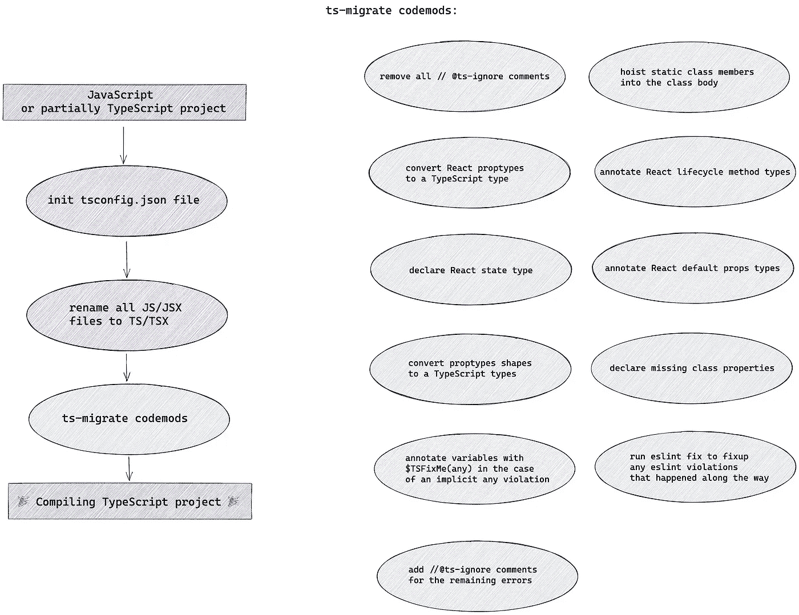
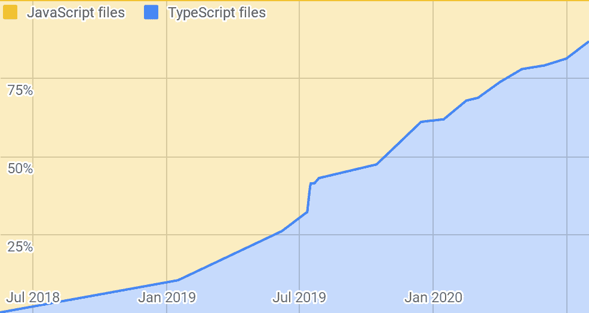

# ts-migrate:大规模迁移到 TypeScript 的工具

> 原文：<https://medium.com/airbnb-engineering/ts-migrate-a-tool-for-migrating-to-typescript-at-scale-cd23bfeb5cc?source=collection_archive---------0----------------------->

TypeScript 是 Airbnb 前端 web 开发的官方语言。然而，采用 TypeScript 和迁移包含数千个 JavaScript 文件的成熟代码库的过程并不是一天就能完成的。TypeScript 的采用经历了最初的提议、多个团队的采用、测试阶段以及最终作为 Airbnb 前端开发的官方语言的过程。在 Brie Bunge 的这个[演讲中，你可以了解更多关于我们如何大规模采用 TypeScript 的信息。](https://www.youtube.com/watch?v=P-J9Eg7hJwE)

# 迁移策略

大规模迁移是一项复杂的任务，我们探索了从 JavaScript 迁移到 TypeScript 的几种选择:

**1)混合迁移策略。**逐个文件地部分迁移，修复类型错误，并重复直到整个项目被迁移。 [*allowJS*](https://www.typescriptlang.org/docs/handbook/release-notes/typescript-3-7.html#--declaration-and---allowjs) config 选项允许我们让 TypeScript 和 JavaScript 文件在项目中并存，这使得这种方法成为可能！

在混合迁移策略中，我们不必暂停开发，可以一个文件一个文件地逐步迁移。虽然，在大范围内，这个过程可能需要很长时间。此外，还需要对来自组织不同部门的工程师进行培训。

**2)全进迁移！**取一个 JavaScript 或部分 TypeScript 项目，完全转换。我们需要添加一些`any`类型和`@ts-ignore`注释，这样项目编译时不会出错，但是随着时间的推移，我们可以用更具描述性的类型来替换它们。

选择全方位迁移策略有几大优势:

*   **跨项目的一致性:**完全迁移将保证每个文件的状态都是相同的，工程师不需要记住他们可以在哪里使用 TypeScript 特性，以及编译器将在哪里防止基本错误。
*   **只修复一种类型比修复文件容易得多:**修复整个文件可能非常复杂，因为文件可能有多个依赖项。对于混合迁移，更难跟踪迁移的实际进度和文件的状态。

看起来全包迁移是这里的明显赢家！但是执行大型成熟代码库的整体迁移的过程是一个沉重而复杂的问题。为了解决这个问题，我们决定使用代码修改脚本— [codemods](/@cpojer/effective-javascript-codemods-5a6686bb46fb) ！通过我们最初的手动迁移到 TypeScript 的过程，我们认识到可以自动化的重复操作。我们为这些步骤中的每一步制作了 codemods，并将它们合并到总体迁移管道中。

根据我们的经验，不能 100%保证自动迁移会产生一个完全没有错误的项目，但是我们发现下面列出的步骤组合在最终迁移到一个没有错误的 TypeScript 项目时给了我们最好的结果。通过使用 codemods，我们能够在一天之内将包含 50，000 多行代码和 1，000 多个文件的项目从 JavaScript 转换为 TypeScript！

基于这个管道，我们创建了一个名为“ts-migrate”的工具:

在 Airbnb，我们使用 [React](https://reactjs.org/) 作为我们前端代码库的重要部分。这就是为什么 codemods 的某些部分与基于 React 的概念相关。ts-migrate 可以通过额外的配置和测试与其他框架或库一起使用。

# 迁移过程的步骤

让我们浏览一下将项目从 JavaScript 迁移到 TypeScript 所需的主要步骤，以及这些步骤是如何实现的:

1)每个 TypeScript 项目的第一部分是创建一个`[tsconfig.json](https://www.typescriptlang.org/docs/handbook/tsconfig-json.html)`文件，如果需要的话，ts-migrate 可以完成这项工作。有一个默认的配置文件模板和一个验证检查，帮助我们确保所有项目的配置是一致的。下面是一个基本配置的示例:

2)一旦`tsconfig.json`文件就绪，下一步就是将源代码文件的文件扩展名从`.js/.jsx`更改为`.ts/.tsx`。这一步的自动化非常容易，并且也消除了大量的手工工作。

3)下一步是运行 codemods！我们称之为“插件”。ts-migrate 的插件是可以通过 TypeScript 语言服务器访问附加信息的 codemods。插件接受一个字符串作为输入，并产生一个更新的字符串作为输出。jscodeshift、TypeScript API、字符串替换或其他 AST 修改工具可用于增强代码转换。

在每一步之后，我们检查 Git 历史中是否有任何未决的更改，并提交它们。这有助于将迁移请求拆分成更容易理解的提交，还可以跟踪文件重命名。

# ts-migrate 包概述

我们将 ts-migrate 分成 3 个包:

*   [ts-migrate](https://github.com/airbnb/ts-migrate/tree/master/packages/ts-migrate)
*   [ts-migrate-server](https://github.com/airbnb/ts-migrate/tree/master/packages/ts-migrate-server)
*   [ts-迁移-插件](https://github.com/airbnb/ts-migrate/tree/master/packages/ts-migrate-plugins)

通过这样做，我们能够将转换逻辑从核心流道中分离出来，并为不同的目的创建多个配置。目前，我们有两种主要的配置:[迁移](https://github.com/airbnb/ts-migrate/blob/e163ea39a8bd62105773625236f9b4098883c4f3/packages/ts-migrate/cli.ts#L99)和[重燃](https://github.com/airbnb/ts-migrate/blob/e163ea39a8bd62105773625236f9b4098883c4f3/packages/ts-migrate/cli.ts#L174)。

虽然迁移配置的目标是从 JavaScript 迁移到 TypeScript，但 reignore 的目的是通过简单地忽略所有错误来使项目可编译。当一个人有一个大的代码库并且正在执行如下任务时，Reignore 是有用的:

*   升级 TypeScript 版本
*   对代码库进行重大更改或重构
*   改进一些常用库的类型

这样，即使有一些我们不想立即处理的错误，我们也可以迁移项目。它使得类型脚本或库的更新容易得多。

两种配置都在 ts-migrate-server 上运行，该服务器由两部分组成:

*   [TSServer](https://github.com/airbnb/ts-migrate/blob/e163ea39a8bd62105773625236f9b4098883c4f3/packages/ts-migrate-server/src/forkTSServer.ts) :这部分非常类似于 VSCode 编辑器[为编辑器和语言服务器之间的通信所做的](https://github.com/Microsoft/vscode/blob/dfafad3a00f02469b644c76613d08716b8b31d8d/extensions/typescript-language-features/src/tsServer/server.ts#L139)。TypeScript 语言服务器的一个新实例作为一个单独的进程运行，开发工具使用[语言协议](https://microsoft.github.io/language-server-protocol/)与服务器通信。
*   [迁移运行器](https://github.com/airbnb/ts-migrate/blob/e163ea39a8bd62105773625236f9b4098883c4f3/packages/ts-migrate-server/src/migrate/index.ts#L16):运行并协调迁移过程。它需要以下参数:

它执行以下操作:

1.  [解析 tsconfig.json](https://github.com/airbnb/ts-migrate/blob/e163ea39a8bd62105773625236f9b4098883c4f3/packages/ts-migrate-server/src/migrate/index.ts#L19) 。
2.  [创造。ts 源文件](https://github.com/airbnb/ts-migrate/blob/e163ea39a8bd62105773625236f9b4098883c4f3/packages/ts-migrate-server/src/migrate/index.ts#L54)。
3.  [将每个文件](https://github.com/airbnb/ts-migrate/blob/e163ea39a8bd62105773625236f9b4098883c4f3/packages/ts-migrate-server/src/migrate/index.ts#L103)发送到 TypeScript 语言服务器进行诊断。编译器为我们提供了三种类型的诊断:`semanticDiagnostics`、`syntacticDiagnostics`和`suggestionDiagnostics`。我们使用这些诊断来寻找源代码中有问题的地方。根据唯一的诊断代码和行号，我们可以确定问题的潜在类型，并进行必要的代码修改。
4.  [运行](https://github.com/airbnb/ts-migrate/blob/e163ea39a8bd62105773625236f9b4098883c4f3/packages/ts-migrate-server/src/migrate/index.ts#L135)每个文件上的所有插件。如果文本由于插件执行而改变，我们[更新原始文件](https://github.com/airbnb/ts-migrate/blob/e163ea39a8bd62105773625236f9b4098883c4f3/packages/ts-migrate-server/src/migrate/index.ts#L147)的内容，并通知 TypeScript 语言服务器文件已经改变。

您可以在[示例包](https://github.com/airbnb/ts-migrate/blob/e163ea39a8bd62105773625236f9b4098883c4f3/packages/ts-migrate-example/src/index.ts#L19)或[主包](https://github.com/airbnb/ts-migrate/blob/e163ea39a8bd62105773625236f9b4098883c4f3/packages/ts-migrate/cli.ts#L96)中找到 ts-migrate-server 用法的示例。ts-migrate-example 还包含插件的基本[示例。它们分为三大类:](https://github.com/airbnb/ts-migrate/tree/e163ea39a8bd62105773625236f9b4098883c4f3/packages/ts-migrate-example/src)

*   [基于 jscodeshift 的](https://github.com/airbnb/ts-migrate/blob/e163ea39a8bd62105773625236f9b4098883c4f3/packages/ts-migrate-example/src/example-plugin-jscodeshift.ts)
*   [基于类型脚本抽象语法树(AST)的](https://github.com/airbnb/ts-migrate/blob/e163ea39a8bd62105773625236f9b4098883c4f3/packages/ts-migrate-example/src/example-plugin-ts.ts)
*   [基于文本的](https://github.com/airbnb/ts-migrate/blob/e163ea39a8bd62105773625236f9b4098883c4f3/packages/ts-migrate-example/src/example-plugin-text.ts)

存储库中有一组示例来演示如何构建各种简单的插件，以及如何将它们与 ts-migrate-server 结合使用。下面是一个示例[迁移管道](https://github.com/airbnb/ts-migrate/blob/e163ea39a8bd62105773625236f9b4098883c4f3/packages/ts-migrate-example/src/index.ts#L18)，它转换以下代码:

变成:

在上面的例子中，ts-migrate 进行了 3 次转换:

1.  反转所有标识符`first -> tsrif`
2.  在函数声明中增加了类型`function tlum(tsrif, dnoces) -> function tlum(tsrif: number, dnoces: number): number`
3.  插入`console.log(‘args:${arguments}’);`

# 通用插件

真实世界的插件位于一个单独的包中— [ts-migrate-plugins](https://github.com/airbnb/ts-migrate/tree/master/packages/ts-migrate-plugins) 。让我们来看看其中的一些。我们有两个基于 jscodeshift 的插件: *explicitAnyPlugin* 和*declareMissingClassPropertiesPlugin*。jscodeshift 是一个使用[重铸](https://github.com/benjamn/recast)包将 AST 转换回字符串的工具。通过使用`toSource()`函数，我们可以直接更新我们文件的源代码。

[*explicitAnyPlugin*](https://github.com/airbnb/ts-migrate/blob/e163ea39a8bd62105773625236f9b4098883c4f3/packages/ts-migrate-plugins/src/plugins/explicit-any.ts)背后的主要思想在于从 TypeScript 语言服务器中提取所有语义诊断错误以及行号。然后，我们需要在诊断中指定的行上添加`any`类型。这种方法允许我们解决错误，因为添加一个`any`类型可以修复编译错误。

之前:

之后:

[*declareMissingClassPropertiesPlugin*](https://github.com/airbnb/ts-migrate/blob/e163ea39a8bd62105773625236f9b4098883c4f3/packages/ts-migrate-plugins/src/plugins/declare-missing-class-properties.ts)用代码`2339` ( [你能猜出这个代码是什么意思吗？](https://github.com/microsoft/TypeScript/blob/20ecbb0f46105ccaead2970f6ef23188955e023e/src/compiler/diagnosticMessages.json#L1348-L1351))并且如果它可以找到缺少标识符的类声明，插件将使用`any`类型注释将它们添加到类体中。从名字就可以看出，这个 codemod 只适用于 [ES6 类](https://developer.mozilla.org/en-US/docs/Web/JavaScript/Reference/Classes)。

下一类插件是基于 TypeScript AST 的插件。通过解析 AST，我们可以在源文件中生成以下类型的更新数组:

生成更新后，剩下的唯一事情就是以相反的顺序应用更改。如果通过这些操作的结果，我们收到新的文本，我们更新源文件。让我们来看几个基于 AST 的插件:*striptsignorplugin*和*hoistClassStaticsPlugin*。

[*stripTSIgnorePlugin*](https://github.com/airbnb/ts-migrate/blob/e163ea39a8bd62105773625236f9b4098883c4f3/packages/ts-migrate-plugins/src/plugins/strip-ts-ignore.ts)*是迁移管道中的第一个插件。它从文件中删除所有的`@ts-ignore`实例。如果我们将一个 JavaScript 项目转换成 TypeScript，这个插件不会做任何事情。然而，如果是部分 TypeScript 项目(在 Airbnb，我们有几个项目处于这种状态)，这是必不可少的第一步。只有在删除了`@ts-ignore`注释之后，TypeScript 编译器才会发出所有需要解决的诊断错误。*

*转化为:*

*移除`@ts-ignore`注释后，我们运行[*hoistClassStaticsPlugin*](https://github.com/airbnb/ts-migrate/blob/e163ea39a8bd62105773625236f9b4098883c4f3/packages/ts-migrate-plugins/src/plugins/hoist-class-statics.ts)。这个插件检查文件中所有的类声明。它决定我们是否可以提升标识符或表达式，并决定一个赋值是否已经被提升到一个类。*

*为了能够快速迭代并防止回归，我们为每个插件和 [ts-migrate](https://github.com/airbnb/ts-migrate/tree/master/packages/ts-migrate-server/tests/commands/migrate) 添加了一系列单元测试[。](https://github.com/airbnb/ts-migrate/tree/master/packages/ts-migrate-plugins/tests/src)*

# *React 相关插件*

*[*reactpropslugin*](https://github.com/airbnb/ts-migrate/blob/e163ea39a8bd62105773625236f9b4098883c4f3/packages/ts-migrate-plugins/src/plugins/react-props.ts)将类型信息从 PropTypes 转换为 TypeScript props 类型定义。基于[穆赫森·阿兹米](https://twitter.com/mohsen____)写的牛逼[工具](https://github.com/lyft/react-javascript-to-typescript-transform)。我们只需要在包含至少一个 React 组件的`.tsx`文件上运行这个插件。 *reactPropsPlugin* 寻找所有的`PropTypes`声明，并试图通过使用 AST 和简单的正则表达式(如`/number/`)或更复杂的情况(如`[/objectOf$/](https://github.com/airbnb/ts-migrate/blob/e163ea39a8bd62105773625236f9b4098883c4f3/packages/ts-migrate-plugins/src/plugins/utils/react-props.ts#L237)`)来解析它们。当一个 React 组件(无论是函数还是类)被检测到时，它会被转换成一个具有新的 props 类型的组件:`type Props = {…};`。*

*[*reactDefaultPropsPlugin*](https://github.com/airbnb/ts-migrate/blob/e163ea39a8bd62105773625236f9b4098883c4f3/packages/ts-migrate-plugins/src/plugins/react-default-props.ts)覆盖了 React 组件的 [defaultProps](https://reactjs.org/docs/typechecking-with-proptypes.html) 模式。我们使用一种特殊的类型来表示带有默认值的属性:*

*我们试图找到默认的 props 声明，并将它们与上一步生成的组件 props 类型合并。*

*[状态和生命周期](https://reactjs.org/docs/state-and-lifecycle.html)的概念在 React 生态系统中相当常见。我们在两个插件中解决了它们。如果一个组件是有状态的，[*reactClassStatePlugin*](https://github.com/airbnb/ts-migrate/blob/e163ea39a8bd62105773625236f9b4098883c4f3/packages/ts-migrate-plugins/src/plugins/react-class-state.ts)生成一个新的`type State = any;`，[*reactClassLifecycleMethodsPlugin*](https://github.com/airbnb/ts-migrate/blob/e163ea39a8bd62105773625236f9b4098883c4f3/packages/ts-migrate-plugins/src/plugins/react-class-lifecycle-methods.ts)用适当的类型标注组件生命周期方法。这些插件的功能可以扩展，包括用更具描述性的类型替换`any`的能力。*

*对于状态和道具，还有更多改进和更好的类型支持的空间。然而，作为一个起点，这个功能被证明是足够的。我们也不包括[钩子](https://reactjs.org/docs/hooks-intro.html)，因为在移植的开始，我们的代码库使用了 React 的旧版本。*

# *确保成功的项目编译*

*我们的目标是获得一个具有基本类型覆盖的编译 TypeScript 项目，它不会导致应用程序运行时行为的改变。*

*在所有转换和代码修改之后，我们的代码可能会有不一致的格式，一些 lint 检查可能会失败。我们的前端代码库依赖于更漂亮的 eslint 设置— [更漂亮的](https://prettier.io/)用于自动格式化代码，而 [ESLint](https://eslint.org/) 确保代码遵循最佳实践。因此，我们可以通过从我们的[插件](https://github.com/airbnb/ts-migrate/blob/fe1b6021783b1ef5c4b8fa310b96a44779cc77bd/packages/ts-migrate-plugins/src/plugins/eslint-fix.ts)运行 eslint-appearlier 来快速修复前面步骤可能引入的任何格式问题。*

*迁移管道的最后一部分确保解决所有的 TypeScript 编译冲突。为了检测和修复潜在的错误，[*tsIgnorePlugin*](https://github.com/airbnb/ts-migrate/blob/e163ea39a8bd62105773625236f9b4098883c4f3/packages/ts-migrate-plugins/src/plugins/ts-ignore.ts)使用行号进行语义诊断，并插入`@ts-ignore`注释和有用的解释，例如:*

*我们还增加了对 JSX 语法的支持:*

*在注释中包含有意义的错误消息可以更容易地修复问题和重新访问需要注意的代码。这些注释，结合`$TSFixMe`，允许我们收集关于代码质量的有用数据，并识别潜在的有问题的代码区域。*

*最后但同样重要的是，我们需要运行 eslint-fix 插件两次。一旦在 *tsIgnorePlugin* 之前给定的格式可能会影响我们将在哪里得到编译器错误。并且再次在 *tsIgnorePlugin、*之后，因为插入`@ts-ignore`注释可能会引入新的格式错误。*

# *摘要*

*我们的迁移故事是一个正在进行的工作:我们有一些仍然在 JavaScript 中的遗留项目，我们的代码库中仍然有大量的`$TSFixMe`和`@ts-ignore`注释。*

**

*然而，使用 ts-migrate 大大加快了我们的迁移过程和生产效率。工程师能够专注于打字改进，而不是手动逐个文件地迁移。目前，我们 600 万行前端 monorepo 的大约 86%已经转换为 TypeScript，我们有望在今年年底实现 95%的转换。*

*您可以查看 ts-migrate，并在 [Github 库](https://github.com/airbnb/ts-migrate)的主包中找到关于如何安装和运行 ts-migrate 的说明。如果您发现任何[问题](https://github.com/airbnb/ts-migrate/issues)或有改进的想法，我们欢迎您的[贡献](https://github.com/airbnb/ts-migrate/blob/master/CONTRIBUTING.md)！*

*非常感谢 Brie Bunge，他是 Airbnb TypeScript 的幕后推手和 ts-migrate 的创始人。感谢 [Joe Lencioni](https://twitter.com/lencioni) 帮助我们在 Airbnb 采用 TypeScript，并改进了我们的 TypeScript 基础设施和工具。特别感谢[埃利奥特·萨克斯](https://twitter.com/sachselliot)和[约翰·海特科](https://github.com/jjjjhhhhhh)为 ts-migrate 做出的贡献。感谢一路上提供反馈和帮助的所有人！*

# *脚注*

*我们想记下我们在迁移过程中发现的一些可能有用的事情:*

*   *TypeScript 的 3.7 版本引入了`[@ts-nocheck](https://devblogs.microsoft.com/typescript/announcing-typescript-3-7/#ts-nocheck-in-typescript-files)`注释，可以在 TypeScript 文件的顶部添加这些注释来禁用语义检查。我们没有使用这个注释，因为它不支持前面的`.ts/.tsx`文件，但是它也是迁移过程中一个很好的中间阶段助手。*
*   *TypeScript 的 3.9 版本引入了`[@ts-expect-error](https://www.typescriptlang.org/docs/handbook/release-notes/typescript-3-9.html#-ts-expect-error-comments)`注释。当一行以`@ts-expect-error`注释为前缀时，TypeScript 将禁止报告该错误。如果没有错误，TypeScript 会报告说`@ts-expect-error`不是必需的。在 Airbnb 代码库中，我们改用了`@ts-expect-error`注释，而不是`@ts-ignore`。*

*[1]: `@ts-ignore`注释允许我们告诉编译器忽略下一行的错误。*

*[2]:我们为`any`类型— `$TSFixMe`和函数类型— `$TSFixMeFunction = (…args: any[]) => any;`引入了自定义别名。尽管最佳实践是避免使用`any`类型，但是使用它帮助我们简化了迁移过程，并且明确了哪些类型应该被重新访问。*