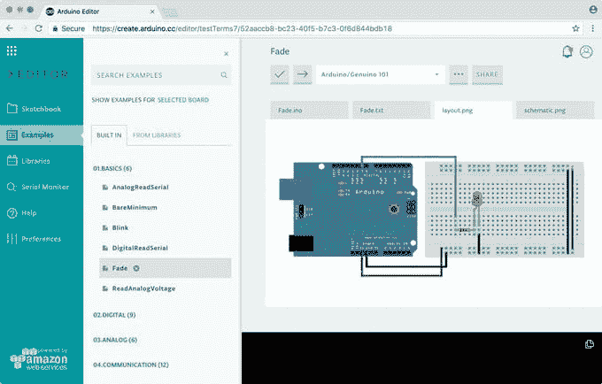

# Tulis Program dan Upload Sketch Arduino Lewat Website? Bisa Banget!

> 原文：<https://medium.easyread.co/tulis-program-dan-upload-sketch-arduino-lewat-website-bisa-banget-78f2515a7069?source=collection_archive---------0----------------------->

## Arduino Web Editor dari Arduino Cloud, Pengganti Arduino IDE

Source: [https://create.arduino.cc/projecthub/Arduino_Genuino/getting-started-with-arduino-web-editor-on-various-platforms-4b3e4a](https://create.arduino.cc/projecthub/Arduino_Genuino/getting-started-with-arduino-web-editor-on-various-platforms-4b3e4a)

Teruntuk para mahasiswa Teknik Informatika atau Teknik Elektro yang sedang belajar mengenai *microcontroler* dan IoT tetapi merasa malas untuk mendownload Arduino IDE berukuran ratusan MB untuk pemakaiannya yang hanya beberapa kali saja seperti saya, Arduino Web Editor bisa menjadi solusinya *loh* !

Mungkin sebelumnya teman-teman juga tidak asing lagi dengan Arduino IDE. IDE yang digunakan untuk memprogram *board* Arduino. Tetapi disini kita tidak akan membahas Arduino IDE, kita akan bahas layanan baru dari Arduino yaitu ***Arduino Web Editor*** . 🎉🎉

Arduino IDE | Source: [https://www.arduino.cc/en/Guide/Environment](https://www.arduino.cc/en/Guide/Environment)

Tidak perlu panjang lebar, mari kita kupas tuntas apa itu Arduino Web Editor.

# Arduino Web Editor

Secara singkat, Arduino Web Editor adalah ***Integrated Development Tools*** (IDE) yang bisa digunakan secara online/dalam jaringan. Web editor ini adalah salah satu bagian dari [**Arduino Cloud**](https://store.arduino.cc/digital/create#) yang memungkinkan para pengembang untuk dapat menulis kode, mengakses tutorial, mengkonfigurasi *board* dan berbagi project.

Tampilan Arduino Web Editor | Source: [https://create.arduino.cc/projecthub/Arduino_Genuino/getting-started-with-arduino-web-editor-on-various-platforms-4b3e4a](https://create.arduino.cc/projecthub/Arduino_Genuino/getting-started-with-arduino-web-editor-on-various-platforms-4b3e4a)

Arduino Web Editor bisa berjalan di banyak platform. Windows, Linux, Mac dan ChromeOS dapat menjalankan Web Editor ini. Kita hanya perlu membuka *browser* untuk dapat mengakses Arduino Web Editor. Browser yang didukung untuk web editor ini ialah Chrome, Firefox, Safari dan Edge. Namun lebih disarankan untuk menggunakan *browser* Chrome ya!

# Cara Menggunakan Arduino Web Editor

Diperlukan akun Arduino terlebih dahulu untuk bisa menggunakan Web Editor Arduino. Gunakan [link](https://auth.arduino.cc/register) ini untuk mendaftar atau login ke Arduino.

Agar bisa mengupload *sketch* (program Arduino) dari Web Editor ke *board* Arduino (untuk OS Windows, Linux dan Mac), kamu perlu menginstall Arduino Web Editor Plugin (Arduino Create Agent), link download installer bisa melalui [halaman](https://create.arduino.cc/getting-started/plugin/welcome) ini atau melalui [Github](https://github.com/arduino/arduino-create-agent/releases) . Sedangkan untuk Chrome OS, wajib menginstall Create App untuk mengupload sketch dari Arduino Web Editor ke Board Arduino. Berikut [link install Create App dari Chrome Web Store](https://chrome.google.com/webstore/detail/arduino-create-for-educat/elmgohdonjdampbcgefphnlchgocpaij) .

Setelah plugin diinstall, Web Editor akan mendeteksi port *board* Arduino secara otomatis ketika port USB sudah dihubungkan ke perangkat komputer.

# Bagian-Bagian Arduino Web Editor

Arduino Web Editor memiliki tiga kolom (lihat gambar di bawah). Kolom pertama adalah navigasi, kolom kedua adalah side panel dan yang ketiga adalah area pemrograman.

Bagian-Bagian Arduino Web Editor | Source: [https://create.arduino.cc/projecthub/Arduino_Genuino/getting-started-with-arduino-web-editor-on-various-platforms-4b3e4a](https://create.arduino.cc/projecthub/Arduino_Genuino/getting-started-with-arduino-web-editor-on-various-platforms-4b3e4a)

Kolom Navigasi memiliki 6 komponen, komponen tersebut saya rincikan dalam tabel dibawah ini.

Navigasi Arduino Web Editor

Kolom Side Panel akan menampilkan item menu dari komponen navigasi. Sedangkan pada kolom Area Pemrograman kita dapat menulis kode, memverifikasi kode dan mengunggahnya ke Board Arduino. Kita juga bisa menyimpan sketch (kode program) di cloud, dan membagikannya dengan siapa pun yang diinginkan. Di kolom tersebut juga kita harus memilih port dan jenis Board Arduino yang akan diprogram nantinya.

# Board Arduino yang didukung oleh Web Editor

Karena baru lunch, saat ini *board* yang didukung hanya *board* dari Arduino/Genuino Resmi, beberapa *board* bersertifikat dan AtHeart Boards. NodeMCU dan Wemos termasuk yang didukung oleh Arduino Web Editor.

# **Perbedaan Arduino Web Editor dan Arduino IDE**

Secara garis besar, perbedaannya jelas terletak pada Web Editor yang dijalankan di web (berjalan secara online) dan Arduino IDE yang dijalankan lewat desktop software (berjalan secara offline). Namun ada banyak perbedaan lain yang mungkin bisa memperlihatkan ke teman-teman semua mengenai kelebihan dan kekurangan dari Arduino Web Editor ini.

## Serial Monitor

Serial Monitor tampil pada side bar antarmuka Arduino Web Editor, sehingga saat ingin mengirimkan data/melihat respons data dari Board Arduino langsung tampak tanpa harus switch tab seperti dalam penggunaan serial monitor Arduino IDE.

Serial Monitor Arduino Web Editor

## Mendokumentasikan Project

Di Arduino Web Editor kita bisa mendokumentasikan project kita langsung dalam satu interface halaman website dan menyimpannya pada *sketch* .

## Berbagi Sketch Melalui URL

Dalam penggunaan Arduino IDE biasanya kita akan mengcopy-paste folder sketch dan memberikannya kepada seseorang menggunakan Flashdisk atau menguploadnya ke internet dan terkadang perlu mengekstrak folder tersebut menjadi rar/zip. Dengan Arduino Web Editor, kita dipermudah untuk sharing melalui URL Sketch karena masing-masing sketch yang kita buat di Arduino Web Editor memiliki URL yang unik. Untuk bisa berbagi kamu bisa klik tombol **Share** yang ada di kolom area pemrograman, setelah itu copy link tersebut dan berikan kepada seseorang yang kamu tuju.

[Berbagi Sketch Arduino Web Editor](https://create.arduino.cc/projecthub/Arduino_Genuino/getting-started-with-arduino-web-editor-on-various-platforms-4b3e4a)

URL yang diberikan kepada seseorang akan memungkinkan seseorang bisa melihat kode sketch yang kamu buat. Kode sketch tersebut bisa mereka buat copy-annya ke sketchbook mereka atau mereka juga bisa men-download jika mereka ingin.

[Code Shared Arduino Web Editor](https://create.arduino.cc/projecthub/Arduino_Genuino/getting-started-with-arduino-web-editor-on-various-platforms-4b3e4a)

## Memilih Port dan Board Arduino yang Aktif Secara Otomatis

[Arduino Web Editor Board Option](https://create.arduino.cc/projecthub/Arduino_Genuino/getting-started-with-arduino-web-editor-on-various-platforms-4b3e4a)

Kalau dalam penggunaan Arduino IDE biasanya sebelum melakukan upload sketch terlebih dahulu kita harus memilih Port dan Board Arduino secara manual. Untuk yang suka kerja instan mungkin hal ini menimbulkan sedikit rasa jengkel dan mau tak mau kita harus melihat dan memilih Board yang ada pada list Arduino Board. Dengan hadirnya Arduino Web Editor, kita tidak perlu lagi memilih Board dan Port Arduino yang sedang kita gunakan secara manual. Arduino Create Agent akan secara otomatis mengidentifikasi Board Arduino yang sedang kita pakai.

# Penutup

Oiya.. karena Arduino Web Editor merupakan bagian dari Arduino Cloud, kita tidak bisa menggunakannya cuma-cuma tanpa batas yah! Kalau hanya penggunaan untuk belajar secara free mungkin masih bisa digunakan, penggunaan secara free dibatasi dengan ketentuan yang ada di dalam tabel di bawah. Penggunaan untuk hobi atau pekerjaan bisa memilih Entry Plan atau Maker Plan dan mungkin perlu merogoh kocek lebih dalam, hehe..

[Arduino Cloud Plan](https://store.arduino.cc/digital/create)

Mungkin itu saja yang bisa saya bagikan ke teman-teman, saya harap sharing ini bisa bermanfaat untuk teman-teman yang membaca. Mohon maaf apabila terdapat kesalahan baik dalam penyampaian ataupun isi dari konten ini karena saya juga pelajar dan akan terus belajar kapanpun dan dimanapun. 😀

Jika ada yang mengganjal dan ingin bertanya silahkan langsung bertanya di story ini atau boleh melalui DM Instagram [@nmauludina](https://www.instagram.com/nmauludina/) .

Terima Kasih!