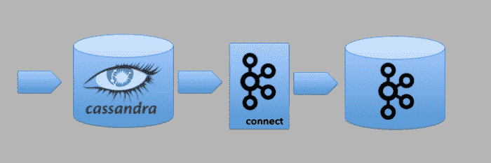
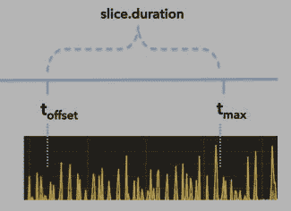
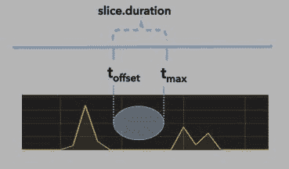
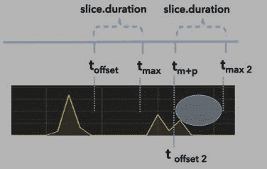
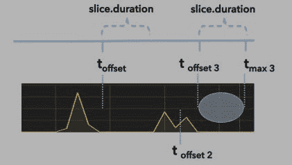
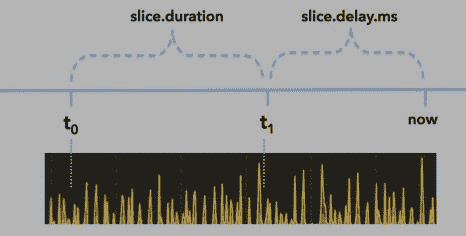

# 调整 Kafka Connect Cassandra 源代码(第 2 部分)

> 原文：<https://medium.com/walmartglobaltech/tuning-the-kafka-connect-cassandra-source-part-2-53f98ae163ea?source=collection_archive---------3----------------------->

在本系列的第一部分(参见[*Kafka Connect Cassandra Source*](/walmartlabs/getting-started-with-the-kafka-connect-cassandra-source-e6e06ec72e97))中，我们了解了如何从 [Landoop](http://www.landoop.com/) 中使用[Cassandra Source connector](http://lenses.stream/connectors/source/cassandra.html)进行 Kafka Connect 设置。我们还看了一下 Cassandra 表的一些设计考虑。在本帖中，我们将检查一些用于调整 Cassandra 源连接器的选项。

all logos are trademark of Apache Foundation

# 配置何时开始查找数据

Cassandra 源连接器基于日期/时间列从 Cassandra 表中提取数据。我们要配置的第一个属性将告诉连接器何时应该开始在 Cassandra 表中查找数据。这是用`connect.cassandra.initial.offset`属性设置的。在此日期/时间之前存在的任何数据都不会发布到 Kafka 主题。

如果未设置此属性，则连接器将使用默认值 1900 年 1 月 1 日。这不是你想要的，因为它会导致 Kafka 主题发布数据的长时间延迟。这种延迟是连接器在到达您的数据之前必须经过一个多世纪的时间片的结果。它的速度将取决于其他一些属性的配置。

`"connect.cassandra.initial.offset": "2018-01-22 00:00:00.0000000Z",`

一旦连接器从表中提取了数据并成功地向 Kafka 发布了消息，它就会将最后一次发布的行的日期/时间作为偏移量存储在 Kafka 主题`connect-offsets`中。一旦一个值被发布到主题，连接器将总是使用它而不是由`initial-offset`提供的值。

# 配置检查表中数据的频率

连接器的工作方式是轮询表，查找自上次检查数据以来插入的新行。数据轮询的频率由`connect.cassandra.import.poll.interval`属性管理。下面显示的配置将每十秒钟查找一次新数据。

`"connect.cassandra.import.poll.interval": 10000,`

如果连接器仍在处理前一个轮询周期中结果集中的行，它将不会查询表以获取更多数据。这个轮询周期将被跳过，至少在查询 Cassandra 集群方面是如此。轮询周期仍然很重要，因为这也决定了数据发布到 Kafka 主题的频率。

# 每个轮询周期要处理多少数据

我们最初遇到的 Cassandra Source 连接器的一个问题是，在一个轮询周期中，它试图处理多少数据。在原始版本(0.2.5 和 0.2.6)中，连接器将检索*自上一个轮询周期以来插入的所有数据*。对于接收大量数据的系统来说，这可能会带来挑战。

我们的日志显示，检索和发布 680 万行数据需要 6 个小时。

`2017-06-05 15:51:36,891 ... Processing results **for**` `blog.pack_events`

`...`

`2017-06-05 21:57:52,480 ... Processed 6818008 rows **for**` `table blog.pack_events`

这种缓慢的接收速度带来的问题(或其中之一)是，当连接器处理检索到的数据时，表中会不断地插入新数据。由于数据添加到表中的速度比数据发布的速度快，连接器落后了。更糟糕的是，在接收新数据出现停顿之前，它根本没有机会赶上。

为了解决这个问题，较新版本的连接器(0.4.0 及更高版本)要求将检索的数据量限制在一个定义的时间段内。不是从上一个轮询周期开始拉取*所有* *可用的数据*，而是生成`WHERE`子句以仅检索落入小的预定义时间范围内的数据。使用`slice.duration`属性配置时间范围的长度。该值确定时间片将跨越的最大毫秒数。

`"connect.cassandra.slice.duration": 120000,`

时间片的起始值是偏移量，即表中发布的最后一行的日期/时间。时间片的结束值是起始值加上在`slice.duration`属性中指定的毫秒数。

illustration 1: *limiting data to a defined range of time*

即使表中有更多的数据可用，也只会检索和发布那些在时间片内的行。

# 如果在一个轮询周期内没有可用的数据，该怎么办

根据向表中插入数据的频率，可能会出现一种有趣的情况。当连接器在下一个轮询周期执行查询时，可能没有任何新数据可用。下图对此进行了描述。

*illustration 2: no data available*

这可能会导致问题。因为没有新的数据行发布到 Kafka，所以决定时间片起点的偏移量没有改变。这将导致连接器在每个轮询周期查询相同的时间范围。

为了解决这个问题，当在当前轮询周期中没有行返回时，连接器将增加时间片。为了控制如何实现这一点，连接器将按照在`connect.cassandra.import.poll.interval`属性中指定的毫秒数增加时间片中的最大值。它将一直这样做，直到检索数据并将其发布到 Kafka 主题。

该图显示了在图 2 所示的轮询周期之后将会出现的下一个轮询周期。请注意，查询尝试检索数据的时间范围增加了。

*illustration 3: a larger time slice allows the connector to avoid looping over the same time range*

一旦连接器检索到数据，偏移量中的值就会更新。插图#4 表示在插图#3 中描述的循环之后发生的轮询循环。请注意，有一个新的偏移(由`t offset 2`表示)。这允许时间片恢复到由`slice.duration` 属性指定的正常时间范围。该时间片的上限由图中的`t max 2`表示。

*illustration 4: resetting the time slice*

在运行图 4 所示的轮询周期后，我们有一个场景，其中没有数据运行到时间片的末尾。这在插图#5 中有所描述。请注意，下一个轮询周期中的偏移量(`t offset 3`)将标记最后一行被检索和发布的时间。它不标记连接器查询的最新时间。

*illustration 5: the stating time is always based on the value in the offset*

# 管理内部缓冲区

连接器使用一个`LinkedBlockingQueue`作为内部缓冲器。当连接器处理结果集中的行时，它将每一行转换成一个`SourceRecord`并将它放在内部队列中。`connect.cassandra.task.buffer.size`属性用于限制存储在内部队列中的数据行数。一旦达到此限制，连接器将不再向队列中添加任何数据，直到它轮询并删除一些数据。

每个轮询周期，连接器将消耗来自内部队列的数据，并将这些消息发布到 Kafka 主题。使用`connect.cassandra.batch.size`属性配置在一个轮询周期中发布的`SourceRecord`的最大数量。

我们最初遇到的另一个问题是这些值配置不当。连接器不断地填充队列，但是在一个轮询周期中只消耗了少量的数据(更多细节见[本期](https://github.com/Landoop/stream-reactor/issues/300))。

`"connect.cassandra.task.buffer.size": 10000,`

`"connect.cassandra.batch.size": 5000,`

使用上面的配置设置，包含 200，000 行的结果集需要 40 个轮询周期才能将所有数据发布到 Kafka。如果`connect.cassandra.import.poll.interval`属性设置为 10 秒，那么发布所有数据至少需要 400 秒。这还不包括检索数据所需的时间。正如我们所看到的，缓冲区大小、批处理大小和轮询间隔属性共同影响连接器的性能。

# 确保一个时间段内的所有数据都已发布

还有一个更重要的属性会影响连接器运行的好坏。就是`connect.cassandra.slice.delay.ms`属性。该设置用于定义时间范围内的最大值与当前日期/时间的接近程度。

*illustration 6: creating a delay between the current date/time and the end of the time range*

以下示例将确保当前日期/时间与时间片的最大值之间始终有 30 秒的差距。

`"connect.cassandra.slice.delay.ms": 30000,`

这个属性很重要，因为如果没有延迟，或者延迟设置得太低，会导致 Cassandra 表中持久化的数据不会发布到 Kafka 主题。对于依赖于发布到 Kafka 主题的事件的消费者来说，他们会抱怨“丢失”数据。这种行为有几个原因。负责将数据插入表中的应用程序都运行在不同的服务器上。这些服务器和运行 Kafka Connect 的服务器可能不会完全同步。如果这些关闭，那么一些服务器可能会将数据插入 Kafka Connect 已经查询过的时间片。

Cassandra 通过运行在两个数据中心的集群传播数据时可能会有一些延迟。这也可能导致 Kafka Connect 查询在无法访问所有可用数据的情况下运行。

然而，通过在时间段结束和当前时间之间提供一段时间，我们能够运行许多负载测试，其中表中的所有数据都发布到 Kafka。

# 调整和测试

有许多配置设置可用于调整连接器，使其性能良好。正确处理这些问题非常重要，因为当前的方法将从 Cassandra 到 Kafka 主题的数据流限制为每个表一个线程。希望这篇文章提供了一些关于如何使用它们以及它们如何相互影响的见解。然而，只有通过大量的功能和负载测试，才能确定最适合其应用和业务需求的设置。

调音愉快！

这最初出现在 gileJedi 的博客上