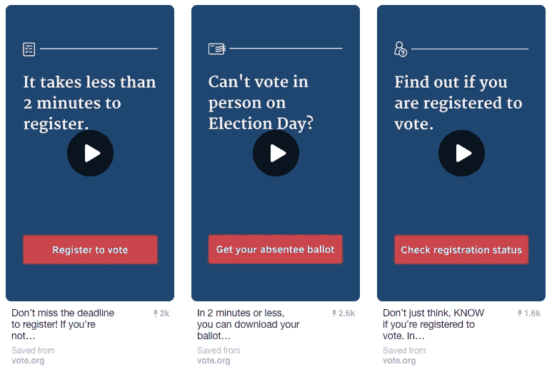

# 把品酒人变成选民

> 原文：<https://medium.com/pinterest-engineering/turning-pinners-into-voters-4d72a74d0122?source=collection_archive---------3----------------------->

Kent Brewster | Pinterest 产品工程师

不久前，我和一些朋友在吃午饭，谈论即将到来的选举。就像围绕天气或政治的讨论一样，它以通常的方式结束:我们所有人都耸耸肩，说“嗯，除了记得投票，我们还能做什么？”

事实证明，很多。我们在 Pinterest 工作。我们只有一项工作:帮助人们将他们的想法付诸行动。所以我们环顾四周，意识到我们还可以做些别的事情:帮助投票。工具已经在那里了，感谢 VOTE.org。我们所要做的就是给它们装上电线，让它们出现在人们面前。

我们想起了狂野的西部时代，那时任何任意的 iframe 都可以嵌入到大头针的特写视图中。一起，[我们黑了三个 pin](https://www.pinterest.com/pin/424605071104031917/)并嵌入了 VOTE.org 的电动工具。我们将它们推广到全国范围，并最终帮助成千上万的选民检查他们的状态，进行登记，并请求缺席投票。



## 我们是如何做到的

首先，我们看看 VOTE.org，确保他们的 iframes 与 pin 兼容。至少 iframes 必须通过 SSL 端到端发送；令人高兴的是，每个都包括一个到 ExpeditedSSL 的[简单 SSL 扫描器](https://www.expeditedssl.com/simple-ssl-scanner/scan?target_domain=absentee.vote.org)的链接，这给了他们一个 A+ 6 的评级。我们还确保它们在 237 像素的宽度下都能很好地呈现，因为大头针可以嵌入到小部件中，并且可能出现在 Web 上的任何地方。

然后，我们为每个引脚制作了一个高分辨率的缩略图，以便在移动设备的网格中显示一些内容，这些内容不显示 iframes。我们不得不考虑的另一件事是:制作手机友好的图像。媒体大头针在网格上显示一个大的播放按钮，我们必须绕过它。

我们把这三张图片作为新的图钉上传到一个秘密板上，记下它们的图钉 id，然后有趣的事情就开始了。

自从 Pinterest 上属性化内容的早期[时期](https://blog.pinterest.com/en/announcing-attribution-and-easy-sharing-flickr)，我们就有了一个额外的对象来处理 Pin 模型，叫做 attribution。对于大多数引脚，这是一个空对象，但有些引脚是特殊的。这里有一个，Flickr 的属性:

```
{'url': 'http://www.flickr.com/photos/kentbrew/6851755809/', 'provider': 'flickr', 'author_url': 'http://www.flickr.com/photos/kentbrew/', 'author_name': 'kentbrew', 'title': 'Next stop: Pinterest!'}
```

归属允许我们显示一个小的 Flickr 图标，加上一个到照片和作者页面的链接，带有正确的标题和名字。当我们第一次发布带有属性的 pin 时，一些包含可播放媒体(如 YouTube)的 pin 在它们的属性对象中有一个 embed 对象，指定它们嵌入的 iframes 的大小和来源。为了让 iframes 在 VOTE.org 的 Pins 内部运行，我们向它们的属性对象添加了一个嵌入成员，如下所示:

```
{'embed': {'src': 'https://verify.vote.org/?campaign=pinterest', 'width': 550, 'height': 1000}}
```

这使得 iframe 宽 550 像素，高 100 像素，包含 VOTE.org 的“你注册投票了吗？”形式。我们还在 URL 中发送了一个活动参数，以帮助我们了解结果。破解 pin 是通过一个交互式 Python 控制台完成的，该控制台运行在可以访问生产数据的开发服务器上。

你可以想象，我们在这个过程中非常非常小心，没有破坏 Pinterest。

一旦我们有了好看又好用的别针，我们就向老板要一些预算来推广这些别针，帮助拯救地球。

我们的老板同意了！10 月 3 日，星期一，也就是这个想法第一次出现的三天后，我们的投票卡在 [Pinterest 的官方新闻栏](https://www.pinterest.com/pinterest/official-news/)上线，我们开始了为期一周的推广活动。

## 怎么样了？

我们认为很好。我们开展了一场宣传活动，但它转变成了一场表演活动，这是那种通常会让读者花钱的活动。

我们最突出的 Pin 码是[的那个](https://www.pinterest.com/pin/424605071104031913/)，它可以让 Pinners 检查他们的选民登记状态；它有 0.43%的点击率和非常令人信服的 0.8%的点击率。根据 VOTE.org 的说法，我们是我们班上最好的推荐人，带来了几乎所有社交网络总流量的一半。

“在社交媒体驱动的流量方面，Pinterest 无疑是赢家，即使在贾斯汀比伯和杰克·多西都在推特上发布了 VOTE.org 之后，”VOTE.org 的创始人黛布拉·克里弗说。

VOTE.org 的 iframed 工具的平均完成率是 31 %,所以我们相信成千上万的 Pinners 检查了他们的注册，请求缺席投票，并注册投票，这一切都是因为三个小 pin。

## 记住…

选举日每年都来，有时不止一次。如果你在美国，但你不确定你是否准备好让别人听到你的声音，请访问[VOTE.org](https://vote.org)并找出答案！如果你足够幸运地在一家科技公司工作，[尽你的一份力量](http://www.techthevote.org/),打造一些功能来帮助你的社区投票！