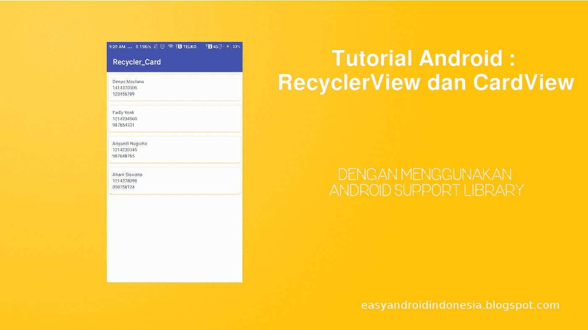
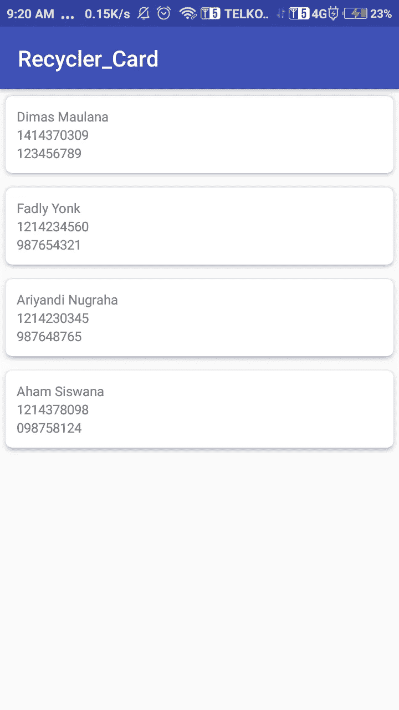

# Tutorial Android : RecyclerView dan CardView

> 原文：<https://medium.easyread.co/tutorial-android-recyclerview-dan-cardview-9a62aaa6cc0c?source=collection_archive---------0----------------------->

## Cara Menggunakan RecyclerView Serta CardView dengan Android Support Library

Image taken from [easyandroidindonesia.blogspot.com](http://easyandroidindonesia.blogspot.com)

Bismillaah,,

Hai guys, kali ini kita akan coba mengimplementasi RecyclerView dan CardView dalam project kita.

# **Konsep :**

Sebelum kita mulai membuatnya, mari kita pahami dahulu apa itu sebenarnya **RecyclerView** dan **CardView** .

## RecyclerView :

Terkadang dalam sebuah aplikasi kita ingin menampilkan sebuah set data yang berjumlah besar (ratusan — atau mungkin sampai jutaan). Nah disini kita tentu perlu sebuah view yang mampu menghandle itu. Adapun sebelum RecyclerView ada namanya ListView. Namun ada beberapa kekurangan yang ada pada ListView. Disini muncullah RecyclerView dengan kemampuan yang lebih baik dari ListView (lebih cepat dan lebih efisien — terutama dalam menangani data berjumlah besar). Adapun contoh penggunaan RecyclerView ada pada GMail.

Untuk penejelasan lebih lengkap bisa dilihat di : [https://developer.android.com/training/material/lists-cards.html](https://developer.android.com/training/material/lists-cards.html)

## CardView :

CardView merupakan view paketan dari Material Design — diperkenalkan pada Android Versi Lolipop. Bentuk view ini biasa digunakan untuk pembungkusan data (sepaket data — beberapa view) yang ditandai dengan tampilan view nya yang memiliki drop shadow (elevation) dan corner radius. Adapun CardView ini merupakan subclass dari FrameLayout.

Baik, demikianlah konsep dari RecyclerView dan CardView, sekarang mari kita kombinasikan keduanya dengan menggunakan custom adapter dalam contoh project praktikan berikut :

# Praktik :

## Menambah Dependencies

Pertama kita tambahkan dependencies dalam gradle, lalu lakukan **Sync Now** .

> Diatas saya memakai support library version 28.0.0, jika terjadi error di sini, maka samakan support library version anda dengan compileSdkVersion anda. Lihat [supportLibraryVersion](https://developer.android.com/topic/libraries/support-library/revisions) .

## Tambahkan RecyclerView pada layout

Kemudian kita tambahkan RecyclerView pada activity_main.xml kita :

## Buat Model Class

Langkah selanjutnya membuat *model* *class* . Disini saya contohkan kelas mahasiswa yang berisi nama, npm, dan no hp.

## Buat layout list_itemnya

Setelah itu mari kita buat layout untuk *view item* -nya. Ini untuk mendeskripsikan apa saja element dalam baris list. Disinilah kita letakkan CardView-nya. Dalam contoh ini kita ingin menampilkan nama, npm dan nohp dalam TextView :

## Buat Adapter

Setelah itu, kita perlu membuat adapternya untuk si RecyclerView :

## Set Adapter ke RecyclerView dalam MainActivity

Langkah terakhir adalah kita mengeset adapter ke *recyclerview* . Disini saya masukkan 4 dummy data object Mahasiswa, yang saya masukkan kedalam ArrayList, yang kemudian kita passing ke adapternya :

Jika tidak ada error , maka akan terlihat hasilnya seperti berikut :

Jika ada yang ingin source code nya langsung, silahkan kunjungin repo nya :

 [## dimasvm/RecyclerViewExample

### Tutorial Android : RecyclerView dan CardView. Contribute to dimasvm/RecyclerViewExample development by creating an…

github.com](https://github.com/dimasvm/RecyclerViewExample) 

Sekian tutorialnya, jika ada yang mau bertanya, silahkan berkomentar.

Happy Coding.!

> **Original Posted :**
> 
> [https://easyandroidindonesia.blogspot.co.id/2018/01/tutorial-android-recyclerview-dan.html](https://easyandroidindonesia.blogspot.co.id/2018/01/tutorial-android-recyclerview-dan.html)

*Artikel ini di tulis oleh* [*Dimas Maulana*](https://medium.com/u/148ea15187d5?source=post_page-----9a62aaa6cc0c--------------------------------) *beliau sering menulis artikel mengenai Software Engineering dan Programming. Ikuti profilnya untuk mendapatkan update-an terbaru artikel-artikel beliau*

*Jika anda merasa artikel ini menarik dan bermanfaat, bagikan ke lingkaran pertemanan anda, agar mereka dapat membaca artikel ini.
Atau jika anda tertarik untuk membagikan cerita anda pada publikasi ini, anda boleh mengirimkan cerita anda ataupun mengikuti langkah-langkah yang ada* [***disini***](https://medium.com/easyread/about-easyread-74b20960e180) *.*