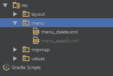

# Tutorial Android Search data MySQL dengan Retrofit (CRUD Online Bagian 5)

> 原文：<https://medium.easyread.co/tutorial-android-search-data-mysql-dengan-retrofit-crud-online-bagian-5-85bdd8e9db10?source=collection_archive---------0----------------------->

Sebelumnya telah di buat tutorial Insert, read dan update data Android dengan MySQL, berikut adalah link dari tutorial sebelumnya :

 [## Tutorial Android Insert data MySQL dengan Retrofit (CRUD Online Bagian 1)

### Retrofit adalah library Android yang dibuat oleh Squre yang digunakan sebagai REST Client pada Android, yang pasti akan…

medium.com](https://medium.com/@sulistiyanto/tutorial-android-insert-data-ke-mysql-dan-php-dengan-retrofit-crud-online-bagian-i-3b3c48adff39)  [## Tutorial Android Read data MySQL dengan Retrofit (CRUD Online Bagian 2)

### Sebelumnya saya telah membuat tutorial insert data ke MySQL bisa dilihat disini :

medium.com](https://medium.com/@sulistiyanto/tutorial-android-read-data-dari-mysql-dengan-retrofit-crud-online-bagian-ii-6358c7131352)  [## Tutorial Android Update data MySQL dengan Retrofit (CRUD Online Bagian 3)

### Sebelumnya telah di buat tutorial Insert dan read data Android dengan MySQL, berikut adalah link dari tutorial…

medium.com](https://medium.com/@sulistiyanto/tutorial-android-update-data-mysql-dengan-retrofit-crud-online-bagian-3-a2b9913c7c71)  [## Tutorial Android Delete data MySQL dengan Retrofit (CRUD Online Bagian 4)

### Sebelumnya telah di buat tutorial Insert, read dan update data Android dengan MySQL, berikut adalah link dari tutorial…

medium.com](https://medium.com/@sulistiyanto/tutorial-android-delete-data-mysql-dengan-retrofit-crud-online-bagian-4-83466fe6f67b) 

# Step 1) Membuat Fungsi Search dengan PHP

Ikuti *source code* berikut dan simpan dengan nama **search.php** .

# Step 2) Menambahkan menu _search.xml dalam direktori menu

Kemudian edit menu _search.xml seperti berikut :

# Step 3) Menambahkan implement SearchView.OnQeuryTextListener dalam ViewActivity.java

berikut contoh source codenya :

# Step 4) Menambahkan menu _search dalam ViewActivity.java

# Step 5) Memberikan event menu _search dalam ViewActivity.java

Sebelumnya tambahkan kode berikut dalam RegisterAPI.java :

Ubah kode onQueryTextChange(String newText) seperti berikut :

# Source Code lengkap ViewActivity.java

# Step 6) Demo

Untuk lebih jelasnya silahkan download project saya di Github.

