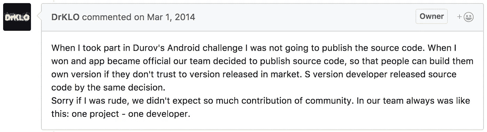
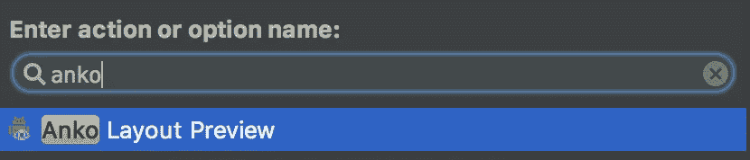
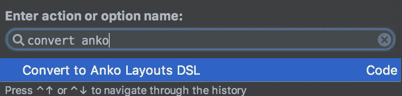

# Tutorial Anko

> 原文：<https://medium.easyread.co/tutorial-anko-20f61992f965?source=collection_archive---------0----------------------->


Bagi kamu yang pernah menggunakan aplikasi Telegram pasti merasakan kelebihan dibandingkan beberapa aplikasi lainnya, yaitu performance sangat cepat. Kenapa bisa cepat? Salah satu faktor yang membuat Telegram bisa cepat adalah dalam mengkonstruksi layout tidak menggunakan XML namun dibangun secara programmatically. Kamu bisa lihat sendiri source code nya disini.

[](https://github.com/DrKLO/Telegram) [## DrKLO/Telegram

### Telegram for Android source

github.com](https://github.com/DrKLO/Telegram) 

Diatas itu adalah source code Telegram Android, sangat menarik untuk dipelajari. Akan tetapi akan sangat sangat tidak cocok apabila kita menerapkan gaya kodingan tersebut ke dalam project tim. Karena banyak sekali magic number, banyak sekali hardcode, if-else yang panjang dll. Kenapa sih Telegram melakukan itu? kamu bisa kunjungi thread [ini](https://github.com/DrKLO/Telegram/pull/76) untuk mengetahuinya. Disitu ada sebuah statement menarik yang dikatakan oleh developernya:



Oke, sekarang kita masuk ke pembahasan kita mengenai Anko. Anko singkatan dari Android Kotlin adalah sebuah library yang berisi shortcut yang berguna untuk mempercepat proses development dan menghasilkan kode readable. Tidak hanya itu, Anko juga dapat meningkatkan performance aplikasi. Library Anko terdiri dari beberapa parts yaitu:

*   Anko Commons, isi nya helper untuk melakukan intents, dialog, toast, logging, dll
*   Anko Layouts, isi nya helper untuk mengkonstruksi layout secara programmatically
*   Anko SQLite, isi nya helper dalam menggunakan SQLite
*   Anko Coroutines, isi nya helper untuk menerapkan asynchronous

# Tutorial Anko

Pertama buat sebuah project baru Android, jangan lupa centang include kotlin. Kemudian tambahkan dependency Anko kita ke dalam project

```
// Anko Layouts
implementation "org.jetbrains.anko:anko-sdk15:0.10.4"
implementation "org.jetbrains.anko:anko-appcompat-v7:0.10.4"// Anko Commons
implementation "org.jetbrains.anko:anko-commons:0.10.4"// Coroutine listeners for Anko Layouts
implementation "org.jetbrains.anko:anko-sdk15-coroutines:0.10.4"
implementation "org.jetbrains.anko:anko-appcompat-v7-coroutines:0.10.4"
```

Ketika menggunakan coroutine, kita akan mendapatkan peringatan yang memberitahukan coroutine masih dalam tahap experimental. Bukan berarti belum stabil, maksudnya penggunaan nya dapat berubah sewaktu-waktu. Untuk meng ignore hal tersebut tambahkan ini diluar dependencies.

```
kotlin {
    experimental {
        coroutines "enable"
    }
}
```

Kemudian kita buat sebuah layout via XML.

Sekarang kita coba buat XML diatas via Anko.

Didalam `linearlayout` ada `editText` dan `button` dengan atribut yang telah kita tetapkan, kemudian kita memanggil `lparams` yang bisa gunakan untuk menerapkan seperti berapa besar ukuran `margin` . Mudah bukan, sekarang kita coba buat skenario ketika button di klik akan muncul Toast berdasarkan text dari edit text.

Nah dalam kode tersebut kita ada menggunakan salah satu fitur dari Coroutines yaitu `UI` yang maksudnya kode yang ada didalam `UI` akan dieksekusi di mainthread.

Apabila kamu memiliki Custom View, `MyCustomTextView` misalnya, kamu tidak bisa menggunakan shortcut `textView { }` atau nama lainnya DSL. Kamu harus membuat shortcut/DSL kamu sendiri. Caranya mudah, seprti dibawah ini:

Salah satu kendala dalam membangun layout secara programmatically adalah sulit ketika ada nya perubahan UI yang besar. Karena kita tidak bisa melihat hasilnya secara realtime tidak seperti halnya kita membangun layout via XML.

Tapi tenang, Anko sudah menyiapkan plugin, nama pluginnya Anko Support. Dengan plugin ini kamu dapat melihat hasil layout kamu yang dibangun menggunakan Anko. Caranya tekan `Cmd+Shift+A` terus cari `Anko Layout Preview`



Kamu juga bisa mengkonvert XML kamu ke dalam kode program caranya, buka XML kamu kemudian `Cmd+Shift+A` terus cari `Convert to Anko Layouts DSL` . Kemudian hasilnya tinggal kamu copy saja ke kelas yang kamu inginkan.



Namun masih ada beberapa bugs, seperti tidak bisa mengkonvert layout yang isi nya ada memanggil resources dari luar XML seperti `@dimens/default_dimen` . Solusinya kita ubah dulu dimens tsb ke hardcode baru bisa kita konvert.

## Kesimpulan

Anko library merupakan library yang sangat membantu bagi developer android. Namun karena masih banyaknya issue yang ada maka sangat disarankan untuk tidak menggunakannya di production.

Sumber: [https://github.com/Kotlin/anko/wiki/Anko-Layouts](https://github.com/Kotlin/anko/wiki/Anko-Layouts)

*Artikel ini di tulis oleh* [*Wisnu Kurniawan*](https://medium.com/u/bf894addbcbc?source=post_page-----20f61992f965--------------------------------) *, beliau sering menulis artikel mengenai Software Engineering dan Programming. Follow profilnya untuk mendapatkan update-an terbaru artikel-artikel beliau.*

*Jika anda merasa artikel ini menarik dan bermanfaat, bagikan ke lingkaran pertemanan anda, agar mereka dapat membaca artikel ini.*