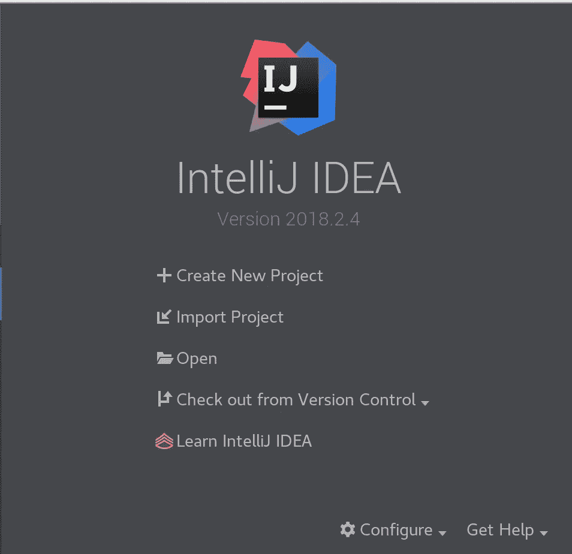
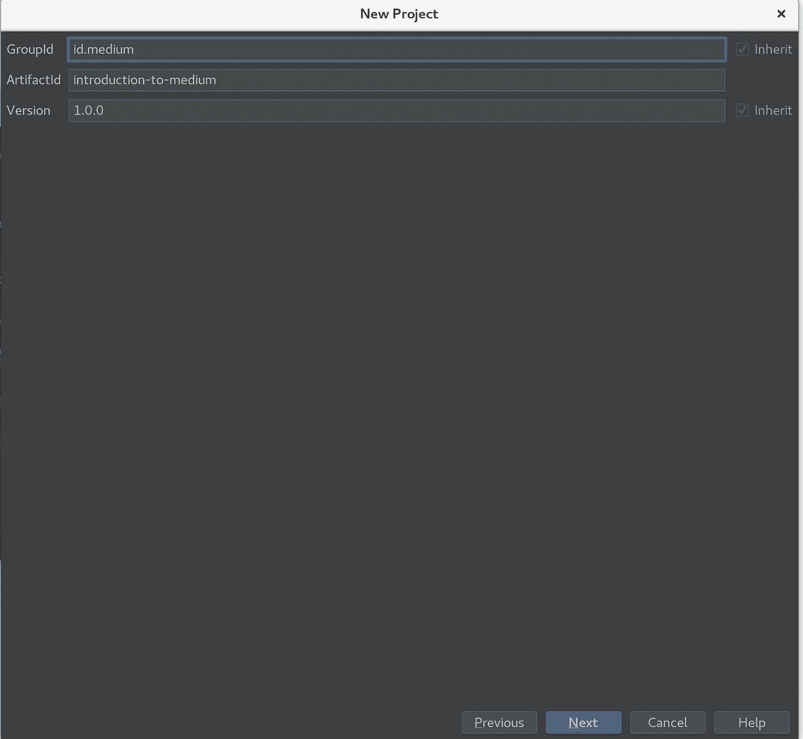

# Tutorial : Apache Maven “Hello World”

> 原文：<https://medium.easyread.co/tutorial-apache-maven-hello-world-7629b24f075a?source=collection_archive---------7----------------------->

## Bagaimana menggunakan maven?


Haloo, pada tulisan kali ini, saya akan membahas mengenai *project* *management* dan *comprehension tool* dengan menggunakan maven. Salah satu manfaat dari penggunaan maven yaitu dapat memberikan manfaat untuk *build process* dengan menerapkan konvensi dan praktik standar untuk mempercepat siklus *development* . Sebagai pembelajaran awal, dibawah ini ada tutorial membuat hello world dengan pemograman java + maven.

# Maven’s Objectives

Tujuan utama dari maven adalah untuk memahami tahap *development* dalam waktu yang singkat. Untuk mencapai tujuan ini, ada beberapa bidang yang perlu diperhatikan pada maven, yaitu

*   Membuat proses *build* menjadi lebih mudah.
*   Menyediakan sistem *build* yang seragam.
*   Memberikan informasi proyek yang berkualitas.
*   Memberikan pedoman untuk pengembangan praktik terbaik.
*   Mengizinkan migrasi transparan ke fitur baru.

# Working With Maven in IntelliJ IDEA

Untuk mempermudah dalam memahami penggunaan maven, maka dibawah ini akan ada contoh penggunaan maven dengan menggunakan IntelliJ IDEA.



*   **Klik Create New Project**


*   **Pilih Project SDK. Untuk contoh ini akan menggunakan maven-archetype-quickstart**
*   **Klik Next**



GroupId adalah namespace atau nama package dari aplikasi. ArtifactId adalah nama direktori dari aplikasi. Version adalah versi dari aplikasi

*   **Isi GroupId , ArtifactId dan Version**


*   **Klik next**


*   **Isi nama project dan directory project**
*   **Klik finish**


Setelah semua langkah dilakukan maka akan ada struktur folder sebagai berikut


Run perintah berikut di dalam folder introduction-to-medium

```
$ mvn exec:java -Dexec.mainClass=”id.medium.App”
```

Maka akan muncul hello world sebagai berikut


Semoga tutorial ini dapat membantu untuk belajar maven. ***Good Luck*** !!

# **Referensi**

[](https://maven.apache.org/) [## Maven - Welcome to Apache Maven

### Apache Maven is a software project management and comprehension tool. Based on the concept of a project object model…

maven.apache.org](https://maven.apache.org/)