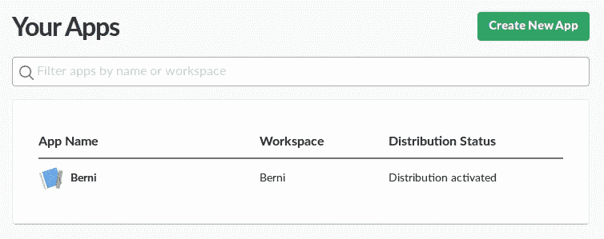
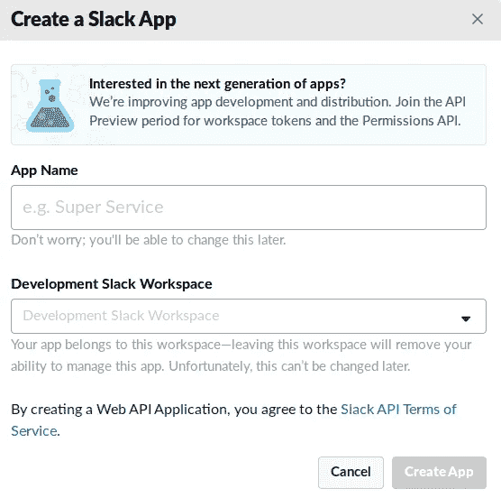
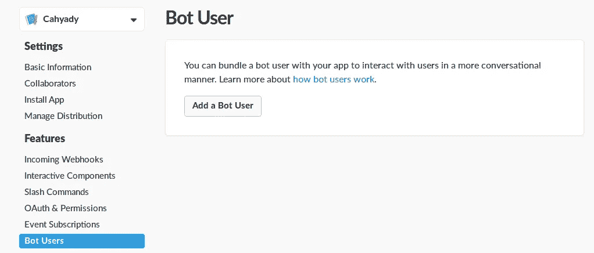
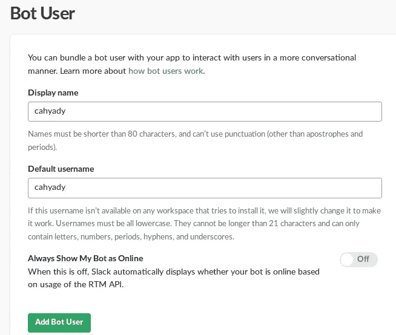
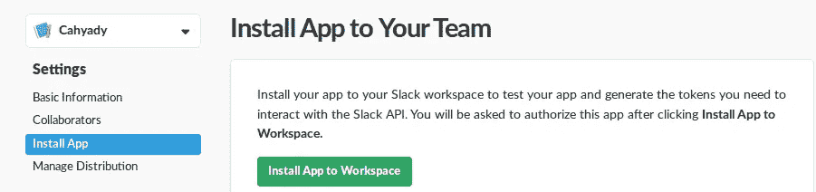
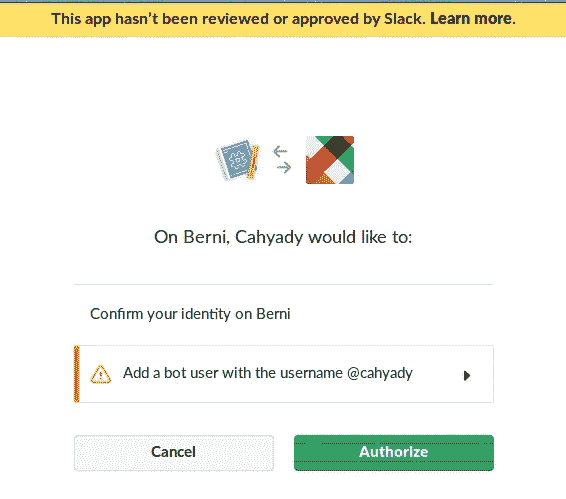
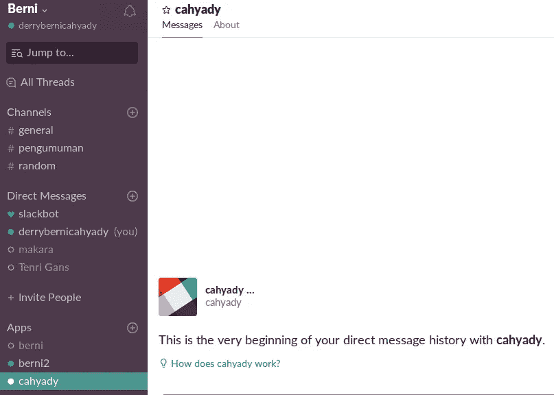

# Tutorial Membuat Bot Slack Bagian 1

> 原文：<https://medium.easyread.co/tutorial-membuat-bot-slack-bagian-1-d5e43f067cd9?source=collection_archive---------6----------------------->

Bismillah Kali ini saya mau berbagi tutorial cara membuat bot di slack. Pastikan teman2 sudah buat **workspace** ya dislack.

# Create Apps

Buat apps dislack [https://api.slack.com/apps](https://api.slack.com/apps)

klik **Create New Apps**

Lalu muncul tampilan seperti dibawah

Lalu masukan App Name & Pilih Development Slack Workspace.

# **Create Bot**

lalu click create App. Lalu klik menu **bot.**

Lalu klik **Add a Bot User**

Isi **Display Name** & **Default username** Klik **Add Bot User.**

# **Add Apps To Workspace**

Untuk menambahkan Apps Ke Workspace klik di menu kiri klik **Install App** lalu klik **Install App to Workspace**

Lalu muncul seperti gambar berikut klik **Authorize**

Lalu tunggu beberapa saat taraaa, bot sudah berhasil ditambahkan ke workspace. Anda Bisa lihat seperti tampilan dibawah

Setelah ini masih banyak yang harus dibahas, oleh karena itu saya bagi kebeberapa bagian. Bagian 2 membahas **slash command** yang mana akan digunakan untuk…..(to be continued)

Terimakasih.