# Twilio OTP 认证

> 原文：<https://medium.com/globant/twilio-otp-authentication-12002a139e38?source=collection_archive---------0----------------------->

## NodeJS 系列

## 使用 NodeJS 的 Twilio OTP 认证指南

作为本文的一部分，我们将介绍如何通过短信向用户发送验证码，并使用 Twilio 服务验证相同的验证码。

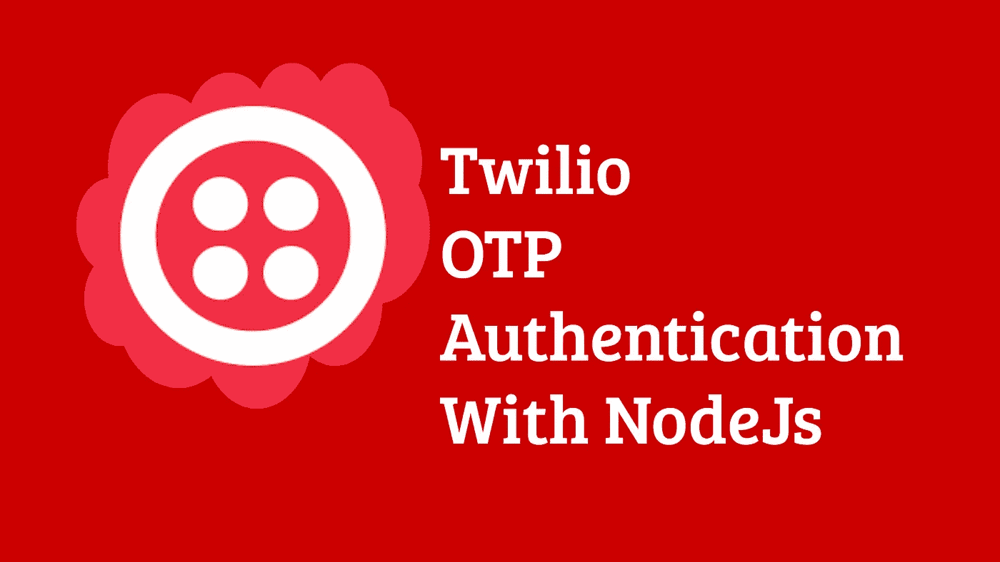

**Twilio** 是一个云通信平台。通过 Twilio 服务，我们可以通过 SMS、Whatsapp 和电子邮件发送文本，发送语音消息，接通电话，并从我们的应用程序开始聊天。所有这些都可以通过几行代码来完成。

我们可以只为我们正在使用的服务付费。Twilio 还提供了一个免费的试用帐户，开发者可以轻松地使用它进行开发和测试。

# Twilio OTP 认证工作流程

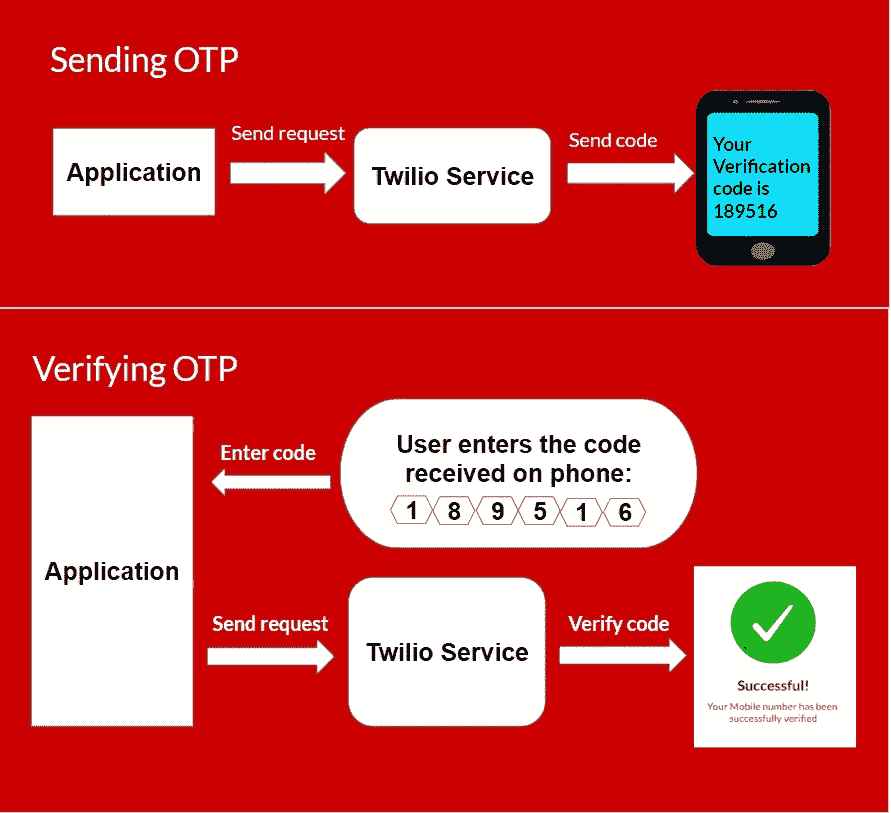

Credit: Author

我们的应用程序发送一个 API 请求，使 Twilio 能够通过 SMS 向用户发送验证码。一旦用户在我们的应用程序中输入了代码，它就会再次发送一个 API 请求，让 Twilio 验证输入的代码是否正确。

# Twilio 帐户和验证服务设置

## 第一步:在 [Twilio](https://www.twilio.com/try-twilio) 上创建一个账户


Credit: Author

## 第二步:选择“**SMS”**作为 Twilio 产品，选择“**身份和验证”**作为计划

也给出如下所示的其他细节:


Credit: Author

## 第三步:选择账户

默认情况下，您将拥有一个名为“**我的第一个 Twilio 账户**”的账户。如果需要，您也可以创建新帐户。

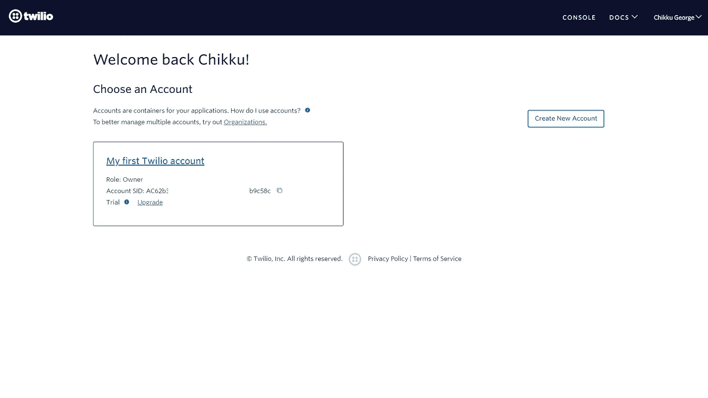

Credit: Author

每个账户可以用一个**“账户 SID”**和**“认证令牌”**来标识。

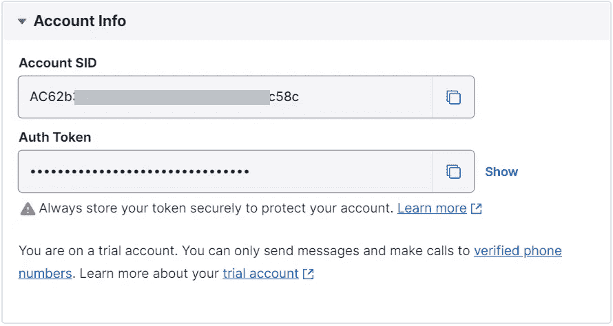

Credit: Author

## 步骤 4:将“验证”产品添加到“开发”部分

默认情况下，**【验证】**产品可以在**【开发】**部分下找到。如果没有，添加**“探索产品”**部分的产品。


Credit: Author

## 步骤 5:创建验证服务

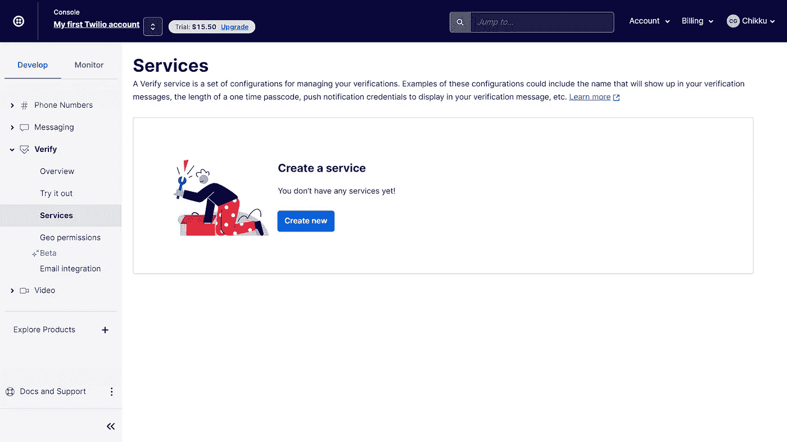

Credit: Author

提供一个自定义服务名，选择**“SMS”**作为验证通道。

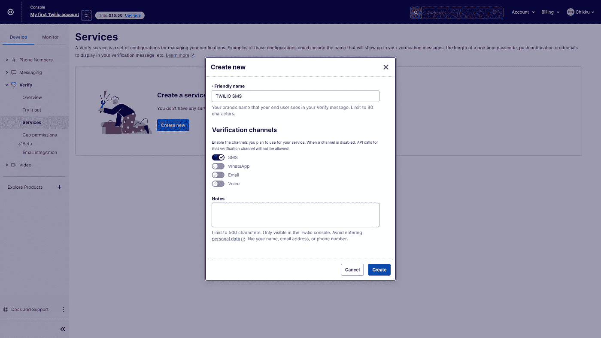

Credit: Author

每个服务将有一个**“服务 SID”**。我们还可以设置验证码的长度。Twilio 建议代码长度至少为 **6 位数**以获得更好的安全性。

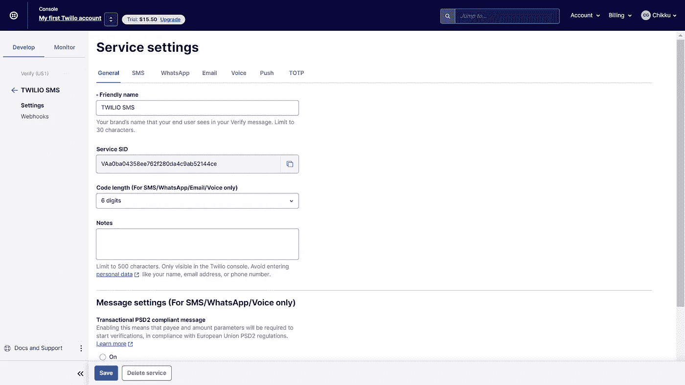

Credit: Author

# 发送和验证代码的节点 API

## 步骤 1:创建 package.json 文件

```
npm init -y
```

## 步骤 2:安装“twilio”依赖项

```
npm install twilio
```

## 步骤 3:安装 NodeJs 应用程序所需的依赖项

```
npm install express body-parser dotenv
```

您的 package.json 如下所示，您可以相应地进行更改。

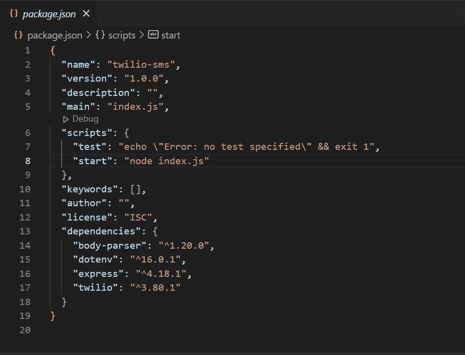

Credit: Author

## 步骤 4:创建一个. env 文件并复制 Twilio 凭证

```
PORT = "Your Port"
TWILIO_ACCOUNT_SID = "Your Twilio Account SID"
TWILIO_AUTH_TOKEN = "Your Twilio AUTH Token"
TWILIO_SERVICE_SID = "Your Twilio Service SID"
```

## 第五步:创建一个条目文件“ *index.js*


Credit: Author

## 步骤 6:在“src/routes/”中创建一个路由器文件来路由 Twilio OTP 操作

我们有两条路线:

1.  发送 OTP ->向用户的电话号码发送验证码
2.  验证 OTP ->验证已发送给用户的代码

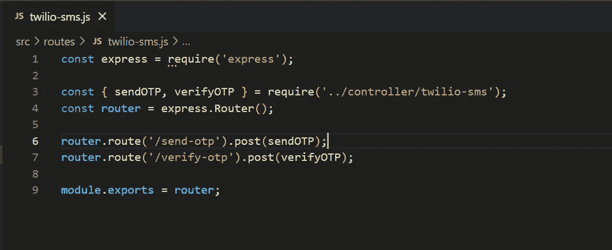

Credit: Author

## 步骤 7:在“src/controller”中创建一个控制器文件来处理 OTP 操作

使用凭据导入 Twilio。

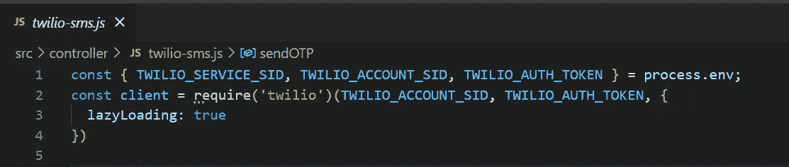

Credit: Author

**sendOTP()** 方法接受两个参数:**国家代码**和**电话号码**，并将使用 Twilio 的**验证**服务向给定的电话号码发送一个 OTP。

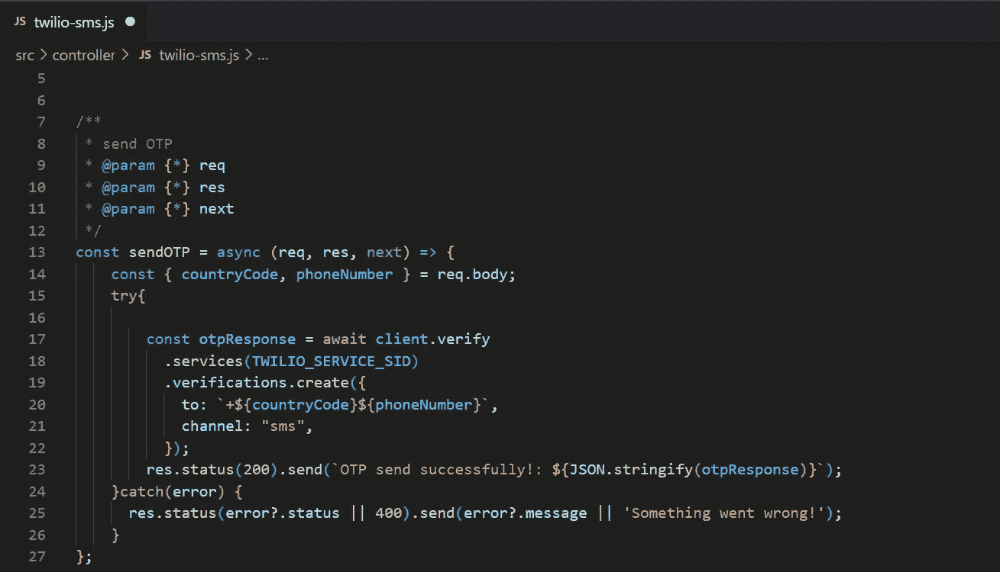

Credit: Author

**verifyOTP()** 接受 **countryCode** 、 **phoneNumber** 和 **OTP** ，并使用 Twilio 的 **verificationChecks** 服务验证 OTP。

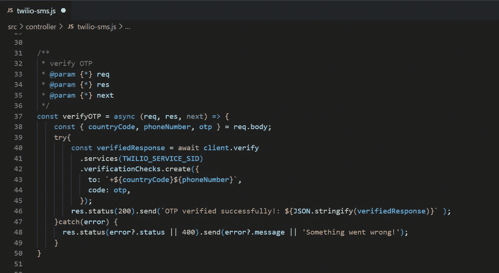

Credit: Author

# 使用 Postman 的 API 测试结果

## **1。发送 OTP API**

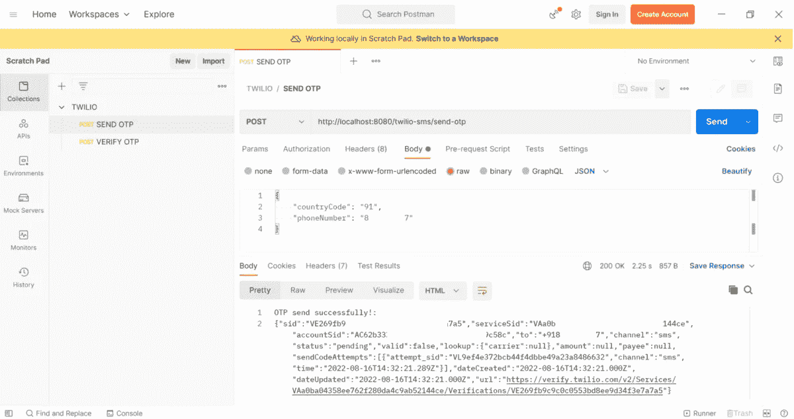

Credit: Author

您将在您的电话号码中获得动态口令，如下所示:


Credit: Author

## 2.**验证 OTP API**


Credit: Author

有了 Twilio 服务，我们不需要从头开始编写来验证用户的电话号码。Twilio 确保短信到达目标用户。

# 参考

1.  [https://www.twilio.com/](https://www.twilio.com/)
2.  [https://github.com/twilio](https://github.com/twilio)
3.  [https://www.youtube.com/watch?v=ekv6Xh_Im5c](https://www.youtube.com/watch?v=ekv6Xh_Im5c)

## 用 Twilio 快乐编码:)