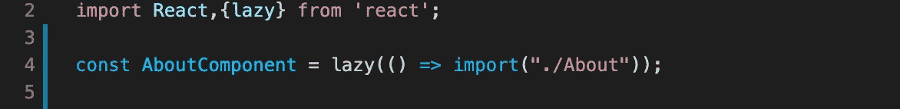
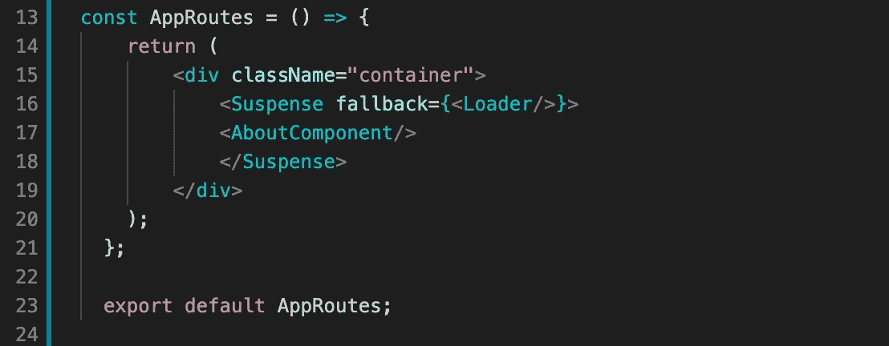
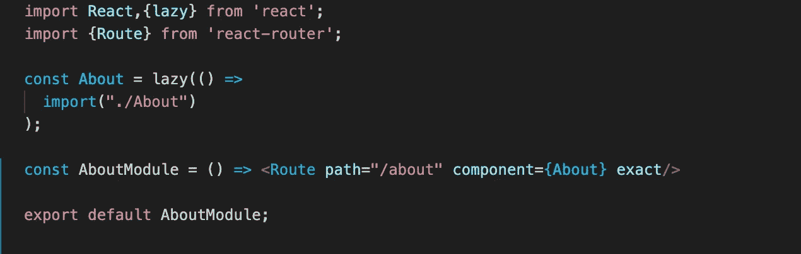
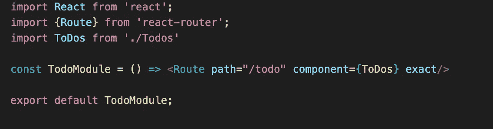
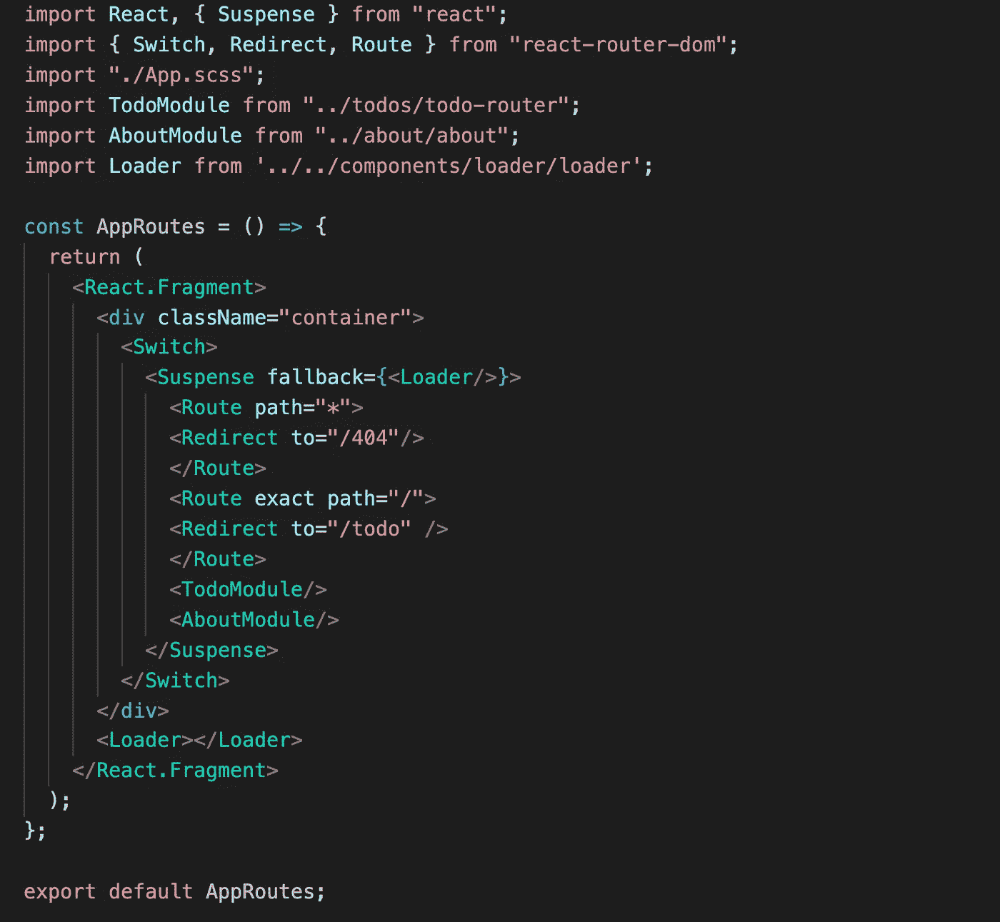

# 延迟加载的旋转模块

> 原文：<https://medium.com/globant/twirl-modularity-with-lazy-loading-c6b93dc87ab3?source=collection_archive---------2----------------------->

## 了解 Reactjs 的惰性加载，并使用它来实现模块化级别的路由

代码可重用性和**代码分离**是任何应用程序最重要的方面。考虑到这一点，我们可以通过多种方式来分离和编写可重用的代码，

1.  **分离组件**

2.**分离模块**

有了**可重用性**和**分离**，还有一个更重要的方面我们在编写程序时应该牢记在心。就是应用的**性能**。任何应用程序的性能都可以很容易地通过其初始加载时间来定义，或者直接与应用程序启动时加载的代码块成比例。对于每个组件和模块，都有一大块代码被加载。

Photo by [Michael Fenton](https://unsplash.com/@michaelfenton?utm_source=medium&utm_medium=referral) on [Unsplash](https://unsplash.com?utm_source=medium&utm_medium=referral)

同样，对于每个组件或模块的路由，特定的代码块**被加载到浏览器中。我们可以通过开发者工具中的**网络**标签看到这些块的**大小**以及它们加载到我们的应用程序中所花费的时间。最初加载的这些代码块应该很小，加载时间应该尽可能短。为了实现这一点，我们只需要在加载应用程序**的**时间加载那些绝对**必需的**组件/模块**。****

## Reactjs 中如何实现惰性加载？

Photo by [Martina Misar-Tummeltshammer](https://unsplash.com/@tiniiiii?utm_source=medium&utm_medium=referral) on [Unsplash](https://unsplash.com?utm_source=medium&utm_medium=referral)

**React.lazy** 函数允许我们在应用程序中动态呈现 **import** 语句。

在下面的代码示例中，我们使用 lazy 方法导入 About Component。当该组件第一次被**渲染**时，**将加载**由 about 组件包含的**包**。

**lazy()** 方法采用一个必须动态调用 **import()** 方法的函数。这个方法的**返回**类型是**承诺**，它将被**解析**为一个**模块**，带有一个**导出默认**，包含**反应**组件。

惰性加载的 about 组件需要在悬念方法中呈现，这将允许在等待组件加载时加载一些后备内容或 UI。和上面的例子一样，我们使用 fallback UI 作为加载器组件。

# 具有惰性加载路由的基于模块的代码分离

应用中可以有**多个** **模块**。在每个**模块**中，可以有**多条** **路线**。我们可以让那些**路线**到**在**申请** **启动**时不需要的****。让我们通过一个例子来理解这一点。**

****

**Lazy Loaded AboutModule**

**在上面的代码片段中，我们为将被**延迟**加载的 about 组件定义了路由，然后我们使用那个**路由**并通过**about 模块**导出它。**

****

**Todo Component Routing**

**在上面的代码片段中，我们定义了 **todo** 路线，然后**通过 **TodoModule** 导出**路线。**

****

**App Routing with Todo and About module**

**在上面的代码片段中，我们使用了**默认的**路径作为**//***，这将加载******todo****组件作为**默认。每当我们转到 **/about 时，About 组件将被延迟加载。**当我们进入任何模块中未涉及的任何路线时，我们将**重定向**到**/404**-页面**组件**。*******

# *****结论*****

*****使用上述技术，我们可以提高应用程序的性能，并实现最佳的编码实践。*****

> *****“编写易于删除而不易于扩展的代码”*****
> 
> *****— Tef，编程太可怕了*****

*******感谢阅读**！做**拍手**👏如果你觉得**有用**😉*****

***** [## 模块::雄辩的 JavaScript

### 写容易删除，不容易扩展的代码。Tef，编程是可怕的理想的程序有一个…

eloquentjavascript.net](https://eloquentjavascript.net/10_modules.html)  [## 开始行动-做出反应

### 用于构建用户界面的 JavaScript 库

reactjs.org](https://reactjs.org/docs)*****