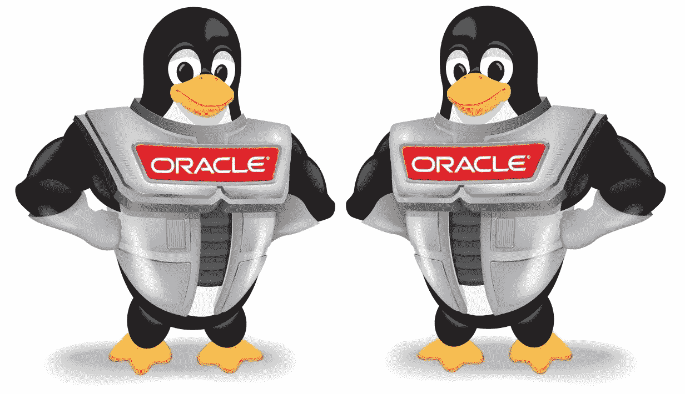
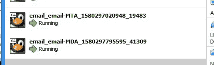
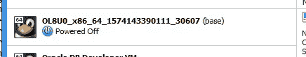

# 一家两鸟——克隆流浪多机！

> 原文：<https://medium.com/oracledevs/two-birds-with-one-home-cloned-vagrant-multi-machines-2ee5ba75fad8?source=collection_archive---------3----------------------->



vagger 使创建单个虚拟机变得很容易。这很好，但是如果您想要多个虚拟机呢？

幸运的是，多个虚拟机使用 travel 很容易，只需编辑一下 travel 文件。

此外，vagger 可以创建多个虚拟机，每个虚拟机都是单个主虚拟机的克隆。

vagger 与各种虚拟机管理程序兼容，但出于我们的目的，我将使用 Oracle VirtualBox 创建 2 个虚拟机克隆。

OEL8 流浪盒最近已经在 Github 的 Oracle 库中发布了。下载整个存储库，包括 OEL8 组件，如下所示:

```
> git clone [https://github.com/oracle/vagrant-boxes](https://github.com/oracle/vagrant-boxes)
```

开箱即用，位于\OracleLinux\8 目录中的流浪者文件将使用最新的 OEL8 配置单个虚拟主机。

然而，要获得多台机器，需要编辑流浪者文件。所以所有的代码块都将放在主块中。

```
Vagrant.configure(VAGRANTFILE_API_VERSION) do |config|
..
<put_virtual_machine_configurations_in_here>
..
end
```

对于第一个代码块，您可能希望为每个虚拟机创建一个资源限制。让我们从每个虚拟机接收最大 1GB 内存和 1 个 CPU 核心开始。

```
 # hardware bound
  config.vm.provider "virtualbox" do |vb|
    vb.memory = 1024
    vb.cpus = 1 # create a master VM before creating the linked clones
    vb.linked_clone = true
  end
```

在第一个代码块的末尾，我配置了“linked_clone = true”。

```
 # create a master VM before creating the linked clones
    vb.linked_clone = true
```

从流浪者文档中,“链接 _ 克隆=真”执行以下操作:

> 默认情况下，通过导入基本框来创建新机器。对于大的机器，这在时间(导入操作)和空间(新机器包含基本机器映像的副本)方面产生了很大的开销。使用链接克隆可以大大减少这种开销。
> 
> 链接克隆基于主虚拟机，该虚拟机是通过在第一次需要时只导入一次基本虚拟机来生成的。对于链接克隆，仅创建差异磁盘映像，其中父磁盘映像属于主虚拟机。

现在，让我们配置第一个虚拟机的属性。我们将分配一个主机名和静态 IP 地址。

```
 # create a linked clone of the master VM
  config.vm.define "email-MTA" do |mta|
    mta.vm.box_check_update = false
    mta.vm.box = "ol8-latest"
    mta.vm.box_url = "[https://yum.oracle.com/boxes/oraclelinux/latest/ol8-latest.box](https://yum.oracle.com/boxes/oraclelinux/latest/ol8-latest.box)" mta.vm.define "ol8-smtp-mta" # name of the virtual machine instance
    mta.vm.hostname = "smtp-mta.host.com" # assign a static IP
    mta.vm.network "private_network", ip: "192.168.1.9"
  end
```

现在配置第二个虚拟机。

```
# create a linked clone of the master VM
  config.vm.define "email-MDA" do |mda|
    mda.vm.box_check_update = false
    mda.vm.box = "ol8-latest"
    mda.vm.box_url = "[https://yum.oracle.com/boxes/oraclelinux/latest/ol8-latest.box](https://yum.oracle.com/boxes/oraclelinux/latest/ol8-latest.box)" mda.vm.define "ol8-smtp-mda" # name of the virtual machine instance
    mda.vm.hostname = "smtp-mda.host.com" # assign a static IP
    mda.vm.network "private_network", ip: "192.168.1.10"
  end
```

现在，我们可以开始了，所以用 travel 启动虚拟机。

```
> vagrant up
```

OEL8 最新的流浪汉盒子会被下载，流浪汉可以告诉我们目前为止下载了哪些流浪汉盒子。

```
> cd "C:\Program Files\Oracle\VirtualBox"> vagrant box list
ol7-latest (virtualbox, 0)
ol8-latest (virtualbox, 0)>
```

启动后，要确定所有与 After 相关的虚拟机的状态，只需使用“global-status”子句。

```
> vagrant global-status
id       name               provider   state    directory
------------------------------------------------------------------------------------------------------
ece1d42  email-MTA          virtualbox running  C:/Users/oracle/vagrant-boxes/OracleLinux/8
28e35ce  email-MDA          virtualbox running  C:/Users/oracle/vagrant-boxes/OracleLinux/8The above shows information about all known Vagrant environments
on this machine. This data is cached and may not be completely
up-to-date (use "vagrant global-status --prune" to prune invalid
entries). To interact with any of the machines, you can go to that
directory and run Vagrant, or you can use the ID directly with
Vagrant commands from any directory. For example:
"vagrant destroy 1a2b3c4d">
```

Oracle VirtualBox CLI 还会告诉我们哪些虚拟机正在运行。

```
> VBoxManage list runningvms
"email_email-MTA_1580297020948_19483" {d65d7083-fc34-4d1b-9c75-31b9a0de35c3}
"email_email-MDA_1580297795595_41309" {5dac821c-69fd-4638-986a-98a21bef643b}>
```

Oracle VirtualBox GUI 还显示有 2 个虚拟机正在运行。



但是，克隆这两个正在运行的虚拟机的基础虚拟机已按预期关闭。



现在，我们可以在单个虚拟机中确认登录。

```
> vagrant ssh email-MTAWelcome to Oracle Linux Server release 8.0 (GNU/Linux package kernel-uek is not installed)The Oracle Linux End-User License Agreement can be viewed here:* /usr/share/eula/eula.en_USFor additional packages, updates, documentation and community help, see:* [http://yum.oracle.com/](http://yum.oracle.com/)[vagrant@smtp-mta ~]$
```

现在登录到另一个虚拟机。

```
> vagrant ssh email-MDAWelcome to Oracle Linux Server release 8.0 (GNU/Linux package kernel-uek is not installed)The Oracle Linux End-User License Agreement can be viewed here:* /usr/share/eula/eula.en_USFor additional packages, updates, documentation and community help, see:* [http://yum.oracle.com/](http://yum.oracle.com/)[vagrant@smtp-mda ~]$
```

两个虚拟机的关闭与单个游离虚拟机的关闭相同。

```
> vagrant halt
==> email-MDA: Attempting graceful shutdown of VM...
==> email-MTA: Attempting graceful shutdown of VM...>
```

请记住，我们在浮动文件中使用了特殊的“linked_clone = true”配置。

```
 # create a master VM before creating the linked clones
    vb.linked_clone = true
```

我们现在可以看到使用基本虚拟机和克隆虚拟机组合对存储要求的影响。基本虚拟机的大小为:

```
> dir "OL8U0_x86_64_1574143390111_30607"|find "File"4 File(s)  1,689,990,382 bytes>
```

因此，克隆的基本虚拟机大约为 1.5 GB。

2 个克隆虚拟机的大小在此处确定:

```
> dir "email_email-MDA_1580297795595_41309"|find "File"2 File(s)         11,430 bytes> dir "email_email-MTA_1580297020948_19483"|find "File"2 File(s)         11,430 bytes>
```

因此，我们实际上有 3 台虚拟机:

*   1.6 GB 的单基础虚拟机。
*   2 个总共只有 KB 的克隆虚拟机。

如果没有“linked_clone = true”配置，我们将有 2 个各 1.6 GB 的虚拟机，总共 3.2 GB。

相反，我们有一个 1.6 GB 的基本虚拟机和两个小得多的克隆，总容量远低于 3.2 GB。

Paul Guerin 是一名专注于 Oracle 数据库的国际顾问。Paul 在东南亚的全球交付中心工作，但他的客户来自澳大利亚、欧洲、亚洲和北美。此外，他还出席了一些世界领先的甲骨文会议，包括甲骨文 2013 年世界开放大会。自 2015 年以来，他的工作一直是 IOUG 最佳实践技巧小册子以及 AUSOUG、Oracle Technology Network 和 Oracle Developers (Medium)出版物的主题。2019 年，他被授予 My Oracle 支持社区最有价值贡献者。他是一名 DBA OCP，并将继续参与 Oracle ACE 计划。