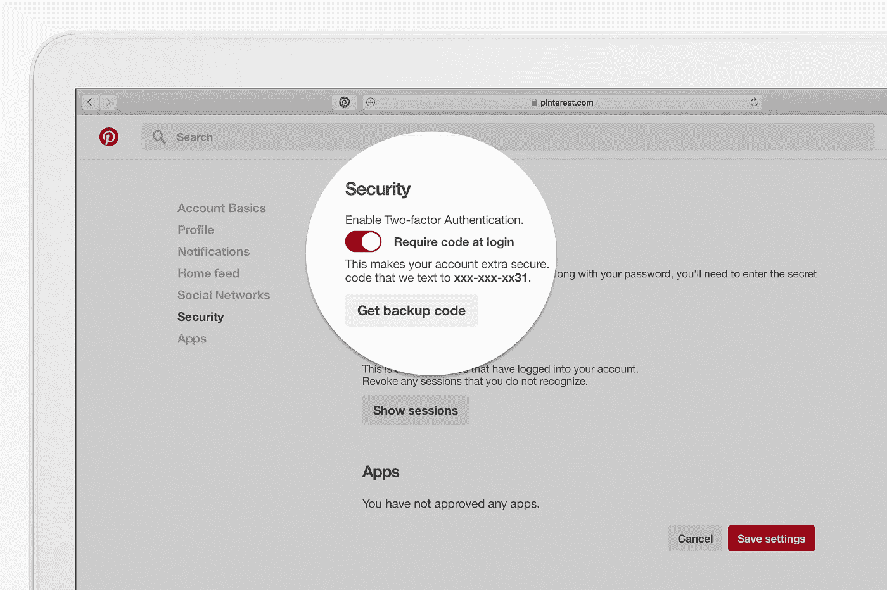
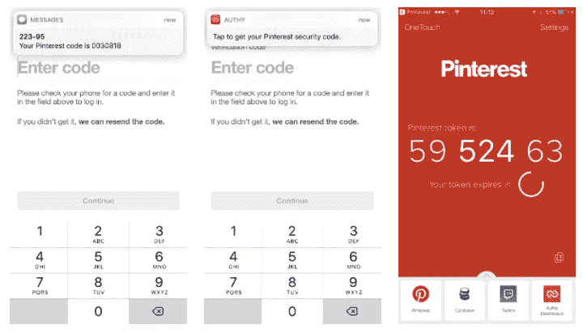
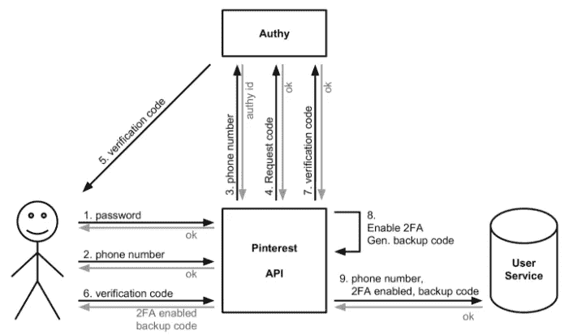

# Pinterest 上的双因素认证

> 原文：<https://medium.com/pinterest-engineering/two-factor-authentication-on-pinterest-238aa3dc92d1?source=collection_archive---------6----------------------->

伊曼纽·切塞纳和阿明·卡梅尔| Pinterest 安全工程师

Pinterest 致力于保护全球 Pinners 的账户。随着超过 1.75 亿用户群的不断增长，今天我们宣布双因素身份认证(2FA)将在未来几周内推出，作为额外的安全层。这里我们将分享我们是如何在 Pinterest 上实现双因素认证的。

## 2FA 如何工作

启用双因素身份验证意味着您每次登录时都要使用两个因素的组合来确认您的身份。一般来说，第一个因素是密码，第二个因素是通过智能手机这样的可信设备。我们利用 Twilio 的 [Authy](https://authy.com/) 来提供不同的验证方法，包括推送通知和 SMS 消息。

## 认证选项

Pinterest 支持使用电子邮件地址、脸书或谷歌跨 Android、iOS 和 web 登录。如果您启用 2FA，您每次登录时都会收到一个七位数的验证码。

默认情况下，我们将通过短信发送验证码。如果你是 Authy 用户，我们将通过 Authy 而不是短信向你发送推送通知。此外，Authy 移动应用程序是一个离线的基于时间的代码，所以即使没有网络连接，你也可以使用它。

## 体系结构

让我们更深入地探究这个架构，看看幕后发生了什么。

有三个主要的架构组件:

1.  Pinterest API，它是网络和移动应用的连接点。
2.  用户服务，存储数据。
3.  Authy，我们用来生成、发送和验证 2FA 代码的第三方提供商。

以下是启用流程的工作方式:

1.  用户验证他们的密码
2.  用户输入他们的电话号码
3.  API 将电话号码发送给 Authy，接收 Authy ID 以备将来参考
4.  API 向 Authy 请求 SMS(或推送通知，Authy 透明地处理)
5.  Authy 向用户手机发送验证码。或者，用户可以请求另一个代码(这一次，我们需要发送短信)
6.  用户发送验证码
7.  API 将验证码转发给 Authy
8.  如果验证码正确，API 启用 2FA 并生成备份代码
9.  API 将电话号码、2FA 启用和备份代码存储在用户服务中，并返回给用户

请注意，用户的电话号码只有在经过验证后才会被保存。

当启用 2FA 时，登录流程会稍作修改，以向用户发送一个验证码，方式与上面的启用流程类似。

此更新将在未来几周内开始向 Pinners 推出。若要在可用时选择加入，请访问您在 web 上的帐户设置的安全部分，然后单击按钮以启用双因素身份验证。

鸣谢:2FA 是一个跨团队的努力。非常感谢 Devin Lundberg、Flavius Popescu、Juan Vasconez、Joseph Zingarelli、Jean Aurambault 以及设计、核心体验、android、iOS 和 web 团队的所有帮助和指导。