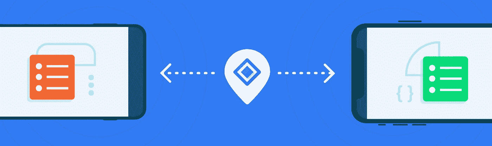

# 没有互联网的双向通信:邻近连接(第 2 部分，共 3 部分)

> 原文：<https://medium.com/androiddevelopers/two-way-communication-without-internet-nearby-connections-b118530cb84d?source=collection_archive---------4----------------------->

[nearly Connections API](https://developers.google.com/nearby/connections/overview)允许您的用户即使在没有互联网可用的情况下也能相互连接。该 API 使用蓝牙和其他技术，允许近距离对等通信，通常在 100 米内。

这为用户可以做什么或分享什么开辟了许多可能性。例如，用户可以在一个大的组内协作，或者共享视频、文件和文本消息。

当然，团队的规模是有限制的。蓝牙一次只能维持大约 4 个连接；WiFi 一次最多可以连接 10 到 100 个连接，这取决于墙上供电的路由器是否可以作为网桥。

虽然[nearly Messages API](https://developers.google.com/nearby/messages/overview)可以在 Android 和 iOS 上运行，但 Nearby Connections API 只能在 Android 设备上运行。邻近连接 API 相对于消息的两个主要优势是:

1.  它允许通过蓝牙和点对点 WiFi 传输无限量的数据，而“信息”只能传输小数据包(最大 4kb)
2.  它允许用户在没有互联网连接的情况下相互交流，而“信息”需要互联网连接

要允许您的应用程序为用户启用附近连接 API，您必须首先在您的应用程序模块中添加以下 Gradle 依赖项的[最新版本](https://developers.google.com/nearby/messages/android/get-started#step_4_configure_your_project)。

同样重要的是，Android 目前会提示用户代表你向你的应用授予`ACCESS_FINE_LOCATION` 权限。

即使没有提示用户授予权限，也需要将以下附加权限添加到清单中:

*   `BLUETOOTH`
*   `BLUETOOTH_ADMIN`
*   `ACCESS_WIFI_STATE`
*   `CHANGE_WIFI_STATE`
*   `ACCESS_FINE_LOCATION`

在 Android 10 (API 等级 29)之前，你的应用只需要请求`ACCESS_COARSE_LOCATION`权限。但是运行 Android 10 及更高版本的设备需要`ACCESS_FINE_LOCATION`。因为在 Android 框架中精细的位置许可意味着粗略的位置许可——反之则不然——你的应用可以简单地请求所有 API 级别的`ACCESS_FINE_LOCATION`。

重要的是要记住，如果用户没有授予你的应用程序所需的权限，该功能将不会工作，你的应用程序应该[优雅地处理拒绝](https://developer.android.com/training/permissions/requesting)。用户可以随时转到[设置](https://support.google.com/android/answer/3118621?hl=en)来撤销授予的权限，此时该功能将停止工作。

要让应用程序的两个用户(设备 X 和设备 Y)使用附近的连接 API 连接和共享内容，必须满足以下条件:

**两个用户必须选择相同的策略。**

Nearby Connections API 要求您指定您的应用程序用于通信的对等[策略](https://developers.google.com/android/reference/com/google/android/gms/nearby/connection/Strategy)。

有三种策略选项:

1.  `P2P_CLUSTER`
2.  `P2P_STAR`
3.  `P2P_POINT_TO_POINT.`

虽然带宽限制可能不是您最终选择哪种策略的决定性因素，但是知道`P2P_CLUSTER`往往会导致比`P2P_STAR`更低的带宽连接，并且`P2P_POINT_TO_POINT`往往是三者中吞吐量最高的。

一旦你决定了一个`Strategy`，广告商必须用它来做广告:

发现者必须在发现过程中使用相同的`Strategy`:

**两台设备上的应用程序必须使用相同的服务 Id**

`serviceId`只是你的应用程序发送给 API 的一个标识符，因此 API 可以将你的应用程序与其他应用程序区分开来。

通信只发生在相同的 serviceId 之间:例如，`serviceId=”YouTube”`永远不会发现一个设备广告`serviceId=”Gmail”`。标识符应该是唯一的。因此，最佳实践是使用应用程序的包名作为所有需要它的 API 调用的唯一标识符。

**呼叫和响应**

当你在设备 X 上的应用程序调用`startAdvertising()`时，会传输一个蓝牙信号。

当信号到达设备 Y 时，附近的连接 API 调用设备 Y 上的应用程序中的`[EndpointDiscoveryCallback](https://developers.google.com/android/reference/com/google/android/gms/nearby/connection/EndpointDiscoveryCallback)`回调。

响应于检测到来自设备 X 的广告，设备 Y 可以选择向设备 X 发送连接请求

**注意**:在发现模式下，设备 Y 可能会从附近的 100 个设备中发现端点，在这种情况下，onEndpointFound()方法将被触发 100 次。因此，用户通常必须选择向哪个设备发送连接请求。在我们的例子中，用户选择设备 x。

**建立连接**

尽管响应于来自设备 X 的广告，连接请求源自设备 Y，但是设备 X 和设备 Y 都必须接受该连接，以便在两个设备之间建立实际的连接。

实际的接受发生在回调`[ConnectionLifecycleCallback](https://developers.google.com/android/reference/com/google/android/gms/nearby/connection/ConnectionLifecycleCallback)`中。如前面的代码片段所示，广告客户通过 `startAdvertising()`方法调用将回调传递给 API，而发现者通过`requestConnection()` 方法调用传递回调。

尽管如此，连接请求还是被发送到`[ConnectionLifecycleCallback#onConnectionInitiated()](https://developers.google.com/android/reference/com/google/android/gms/nearby/connection/ConnectionLifecycleCallback#onConnectionInitiated(java.lang.String,%20com.google.android.gms.nearby.connection.ConnectionInfo))`。

前面代码片段中显示的连接会被自动接受，但是在共享敏感数据时，您应该采取进一步的预防措施。

API 通过`onConnectionInitiated(String endpointId`的`[ConnectionInfo](https://developers.google.com/android/reference/com/google/android/gms/nearby/connection/ConnectionInfo)`对象为每个连接提供一个唯一的令牌

，`ConnectionInfo info)`。您可以从`[info.getAuthenticationDigits()](https://developers.google.com/android/reference/com/google/android/gms/nearby/connection/ConnectionInfo#getAuthenticationDigits()).`获得令牌

我们建议向两个用户显示令牌，这样他们可以直观地确认它们是否相等。如果因为用户看不到彼此的屏幕而无法进行视觉确认，您可以让一台设备加密[原始令牌](https://developers.google.com/android/reference/com/google/android/gms/nearby/connection/ConnectionInfo#public-byte[]-getrawauthenticationtoken)，在开始共享敏感内容之前将其发送到另一台设备进行解密和比较(更多关于 Android 加密的信息[)。](/androiddevelopers/improve-your-apps-cryptography-from-message-authentication-to-user-presence-869277f50d34)

**通讯**

当两个设备连接时，它们可以通过`[sendPayload()](https://developers.google.com/android/reference/com/google/android/gms/nearby/connection/ConnectionsClient#sendPayload(java.lang.String,%20com.google.android.gms.nearby.connection.Payload))` 方法调用和`[onPayloadReceived()](https://developers.google.com/android/reference/com/google/android/gms/nearby/connection/PayloadCallback)`回调向对方发送内容。

一个`[Payload](https://developers.google.com/android/reference/com/google/android/gms/nearby/connection/Payload)` 可以是你的用户想要分享的任何东西:流、文件、音乐、视频、照片、文本等等。

每个设备通过`Nearby.getConnectionsClient(context).acceptConnection(endpointId, payloadCallback)`注册他们的`onPayloadReceived()`回调。然后，任何时候他们想要分享内容，他们只需打电话:

**总结**

附近的连接 API 非常适合 Android 用户之间的双向通信，特别是如果他们想在不需要蜂窝数据或互联网连接的情况下共享内容。

有关如何使用邻近连接 API 的更多信息，请参见我们的[邻近连接 API 文档](https://developers.google.com/nearby/connections/overview) [页面](https://developers.google.com/nearby/connections/overview)。请继续关注本系列的第 3 部分，我们将讨论快速配对服务。

查看本博客系列的第 3 部分，点击[查看更多内容。](/androiddevelopers/connect-your-android-users-with-a-tap-fast-pair-ce31d486baff?source=user_profile---------0----------------------------)