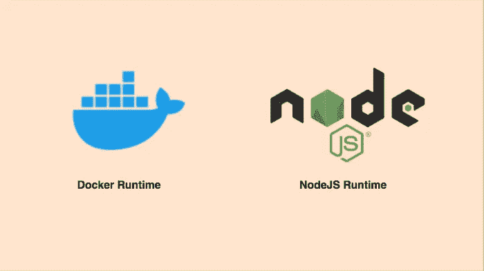

# 在 Azure 应用服务上使用 NodeJS 后端部署 Vue.js 的两种方法

> 原文：<https://medium.com/bb-tutorials-and-thoughts/two-ways-to-deploy-vue-js-with-nodejs-backend-on-azure-app-services-a0d3d6503b76?source=collection_archive---------0----------------------->

## 具有 Docker 运行时和 NodeJS 运行时的示例项目

如果您希望通过选择运行时在托管平台上部署应用程序，应用程序服务是正确的选择。可以在 Azure app Services 下创建功能 app、web app、逻辑 App 等。说到带有 NodeJS 后端的 Vue