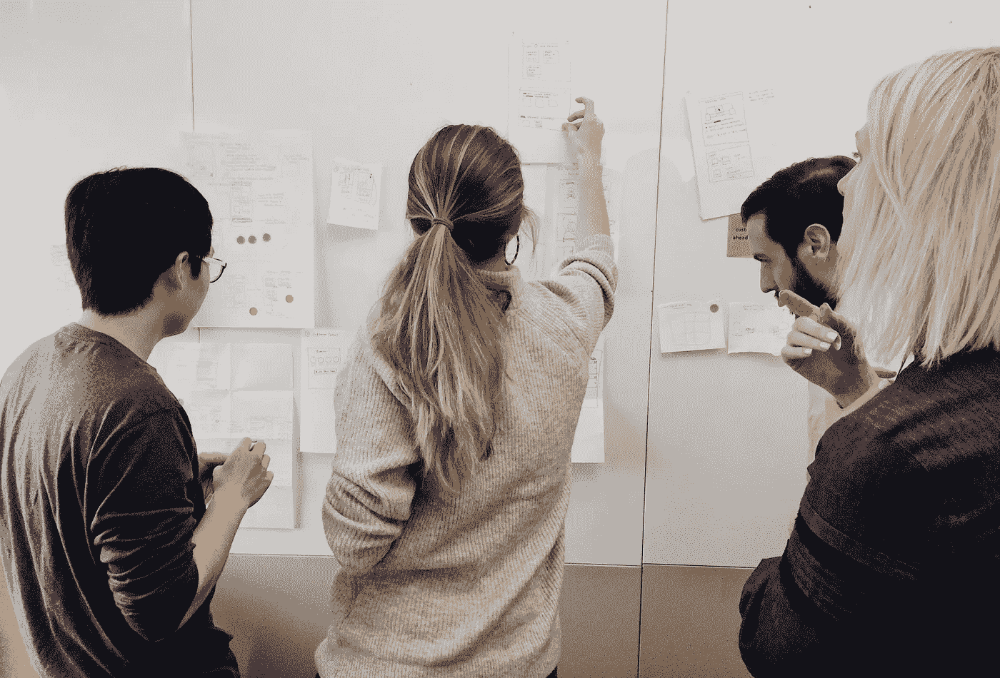
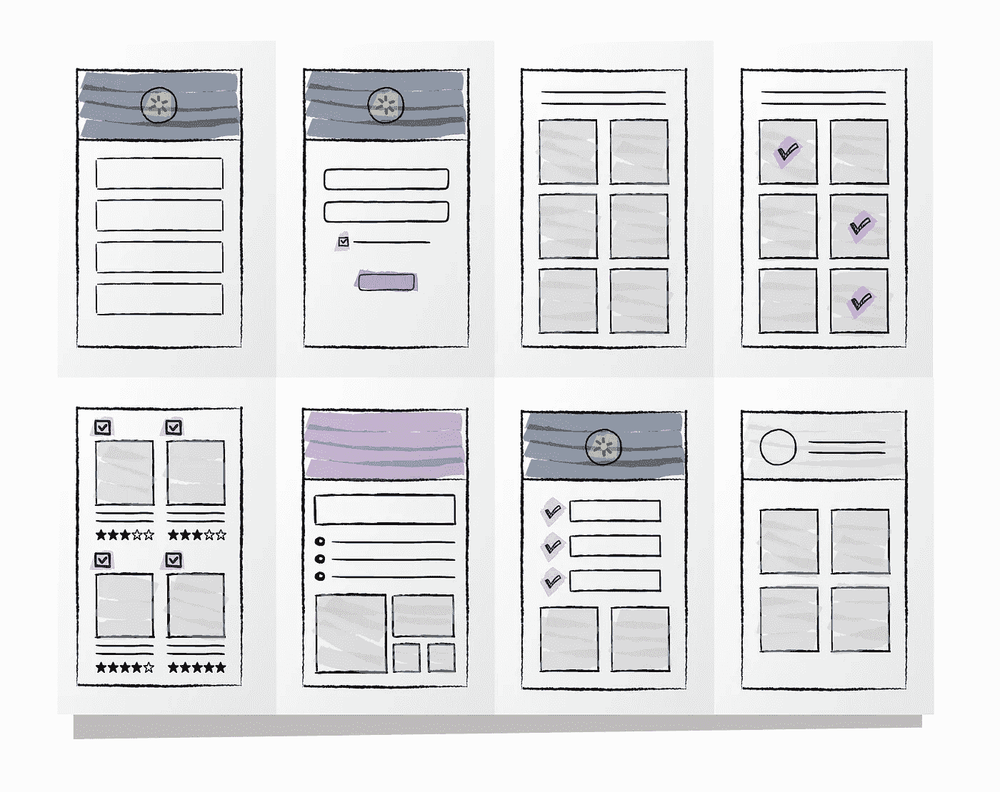
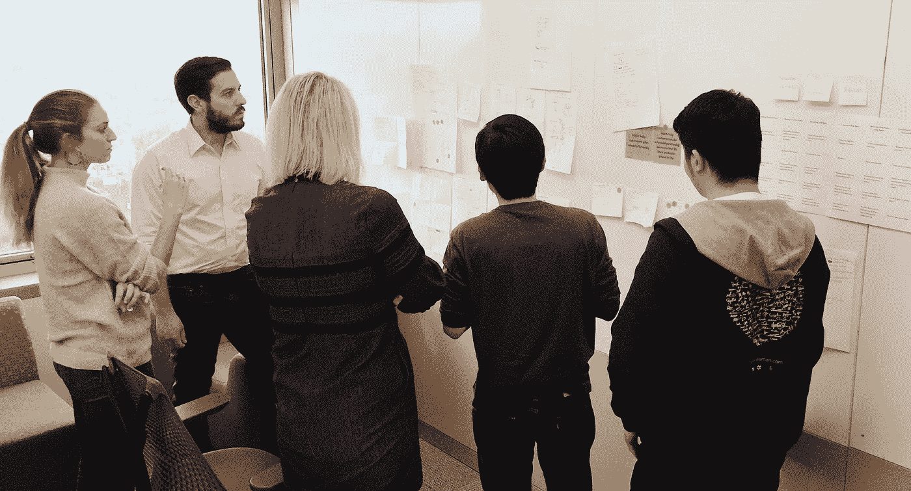
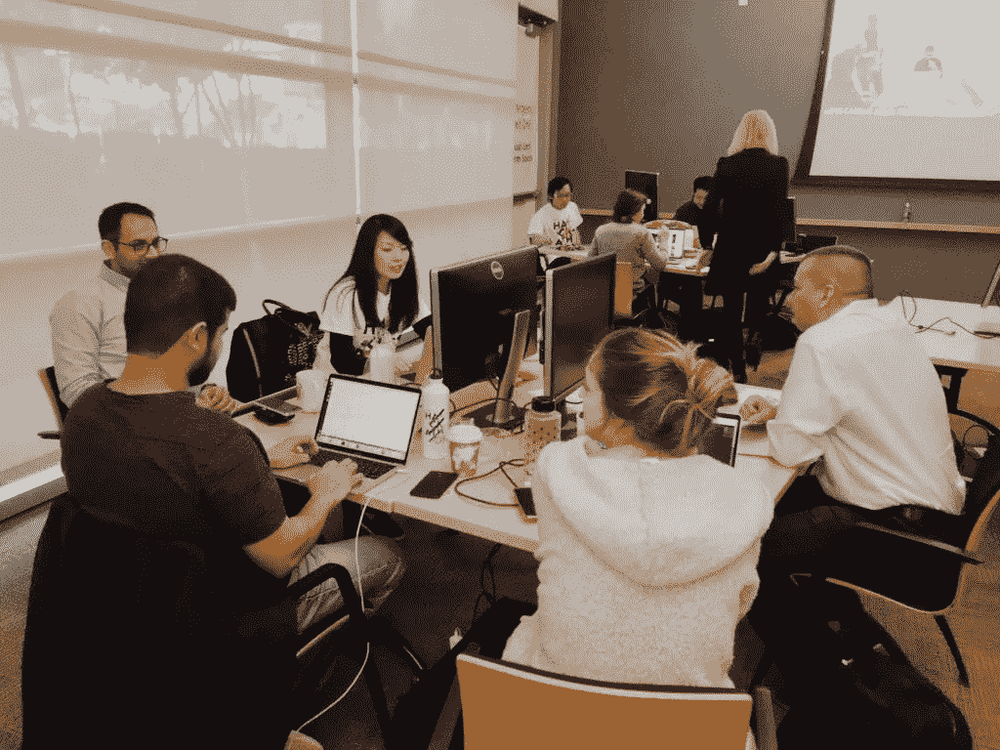
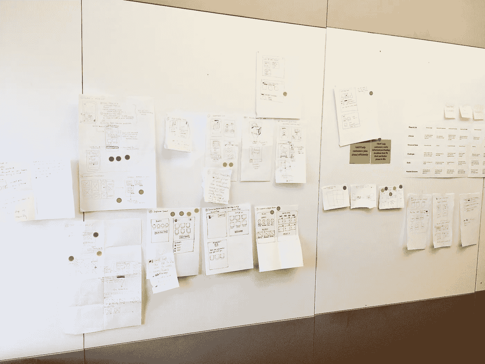

# 相距不远的两个世界——UX 和工程如何在沃尔玛实验室携手并进

> 原文：<https://medium.com/walmartglobaltech/two-worlds-not-so-far-apart-how-ux-and-engineering-go-hand-in-hand-at-walmart-labs-da19897dbbff?source=collection_archive---------4----------------------->

## 作者:Aleisha Nelson，家庭垂直软件工程师| 2019 年 4 月

毫无疑问，专业软件工程和用户体验(UX)设计角色需要两种截然不同的技能和思维方式。通常，这两个学科在工作场所是截然不同的。然而，在沃尔玛实验室的本土垂直团队中，我们认为情况不应该是这样的。我们的团队认为，让工程师尽早参与设计过程，并在设计思维讨论期间征求他们的意见，是创造最佳用户体验的最有效和高效的方式。

自从去年作为软件工程师加入 Home Vertical 团队后，我意识到我们以一种独特的方式与 UX 设计团队紧密合作。作为一名工作之外的艺术家和设计师，我一直对我最终实现的东西实际上是如何设计的很感兴趣。因此，当我看到一份日历邀请我参加 UX 专题头脑风暴会议时，我欣喜若狂。不仅因为我喜欢将我对技术的热情与我对设计的热情结合起来，还因为我也相信创造和设计产品的最佳方式是尽早获得工程和 UX 团队的投入。通过这样做，UX 团队消除了浪费在设计功能上的时间，这些功能对于工程师构建*和*来说是不可行的，工程师们觉得他们的输入是有价值的——因此让他们更兴奋地工作在正在讨论的功能上。每个团队也将带着新鲜和独特的想法离开，仅仅因为涉及到不同的视角，就将这些想法融入到新的功能中。

Home Vertical: Where Software Engineers and UX Designers brainstorm new feature ideas together. Photo by Kathryn Han, UX Team Member

在沃尔玛实验室这样规模的公司的垂直团队中工作，已经为团队成员提供了如此多的非凡体验。我们有创业公司的敏捷和大公司的财力，这打开了很多大门。沃尔玛实验室是一个非常具有前瞻性的组织，最近也收购了许多新公司，这使我们能够与精英中的精英竞争。最重要的是，我们有一个非常热情和非常积极的领导团队，他们真正激励周围的人达到更高的目标和尝试新事物。由于这种独特的办公室文化，我们实际上被鼓励提出新的想法——无论是我们如何改进特定流程的想法，如何将新技术融入设计思维的想法，还是让工程师参与设计过程，甚至在功能想法开始其生命周期之前的*。*

> 我们有创业公司的敏捷和大公司的财力，这打开了很多大门。

最近，我们的 UX 团队一直在尝试采用谷歌在设计冲刺中使用的一些相同的设计思维方法。例如，我们最近开始使用一个名为“[疯狂 8 的](https://designsprintkit.withgoogle.com/methodology/phase3-sketch/crazy-eights)”的设计练习。“我的工程团队中的三名设计师和四名成员聚集在一个会议室，讨论了消费者在不同人生阶段的特点，然后我们每个人花了八分钟时间提出了八个关于网站功能的当场想法，我们希望在这些人生阶段拥有这些想法。我们将纸折成八份，如下图所示，然后我们勾画出脑海中出现的第一个想法。无论你是即将上大学的青少年，搬进你第一个家的新婚夫妇，还是怀孕的母亲，每个人都希望能够轻松地在网上购物。因此，有什么比让了解用户体验的设计师*和知道具体能做什么的工程师*参与进来更好的方式来开发新功能呢？虽然这两个学科需要不同的技能，但它们都需要创造力和对产品的理解。每个人都对新功能有很好的想法，我们已经在努力实现其中的一些。

Crazy 8s Exercise Worksheet. Illustrated by Ashley Bonnard, UX Team Member

我们让工程师尽早参与设计流程的另一种方式是邀请他们参加每周例会，UX 团队在会上向我们的产品经理(pm)、副总裁和我的工程师团队展示新的功能设计。我们每周都会抽出一个小时来检查新的功能设计并对其进行评论，这给了我的团队一个从工程角度给出反馈的机会。我们可以让设计和产品团队知道构建一个特定的功能有多困难，需要多长时间来实现，是否会很好地利用时间，或者是否根本不可行。作为沃尔玛实验室的工程师，我们也花了很多时间来确保我们的功能符合[ADA](/@umanglohia/5ada0a7ac048)，所以这些会议也让我们讨论一个功能是否能够满足这些要求。我喜欢这些会议，因为项目的每个方面都参与其中——真正了解产品及其发展方向的项目经理，非常了解用户在我们网站上习惯和寻找的体验的设计师，以及最终将实施它的工程师。我们都在那里，在同一个房间里，能够在设计展示后立即发表我们的意见。这是对时间的有效利用，也是一种建设性的方式，让每个人都能参与到对话中来。

Home Vertical’s Software Engineers and UX Designers during a “Crazy 8's” Design Sprint Exercise. Photo by Kathryn Han, UX Team Member

这附近并不总是单行道。当然，我们会被邀请参加很多关于设计思维的讨论，但是我们也会邀请 UX 团队参加一些更重代码的讨论。最近，我和我的软件工程师团队邀请 UX 的设计师参加我们称之为“Bug Bashes”的会议当我们接近完成一个新特性的实现时，这种会议就会发生；当我们盯着代码看了这么久，需要第二双眼睛的时候。两个团队聚集在一个房间里，每个人被分配到不同的设备或浏览器来测试该功能。一个人拿 Chrome 做桌面，一个人拿 Firefox 做安卓，一个人拿 Safari 做 iPad。我们试着使用这个功能，尝试点击不同的按钮，缩小和扩大浏览器窗口，等等，然后我们写下我们的想法和一些笔记，如果我们发现任何错误。这不仅有助于我们调试我们可能忽略的功能的某些方面，而且它还为 UX 团队成员提供了一个机会，在我们将功能提交给 QA 团队进行正式审查之前，对功能的外观和感觉进行评论*和*,它让他们了解他们的设计的哪些部分可以(和不可以)实现。

> “Home Vertical 的独特之处在于，我们有提前思考的空间，而不仅仅是实现对等——我们有时间制定一个清晰的路线图，但它并不总是一成不变的。我们清楚地知道我们可以在哪些方面突破界限。”
> 
> — Kathryn Han，UX 团队成员

除了所有这些会议之外，我们最近还举办了一次家庭黑客马拉松活动，在那里我们组建了由三个核心团队成员组成的小组。一名产品经理帮助领导团队和产品创意，一名设计师帮助我们准确理解要构建什么，三名工程师编写功能代码。这是一个为期一天的活动，我们都聚集在一个大会议室里工作，并最终提交给一个评委小组的想法。在活动开始前，我们参加了一些会议，讨论设计、功能和想法，并确定在如此短的时间内实施什么是可行的。我的团队一起讨论、设计和实现的功能实际上最终排名第二。我们目前有工程师正在开发一个更强大的版本，最终将在不久的将来用于 Walmart.com，这非常令人兴奋。

My team at Walmart Labs’ 2019 HOME Hack-a-thon event. Photo by Maylyne Mamonong.

通过定期将产品经理、UX 设计师和软件工程师安排在同一个房间，我们相信我们能够对我们正在设计的整体产品和我们将实现的新功能有更一致的理解。在设计过程中，我们让工程师*提前*参与，让工程师*频繁*参与，这样我们就可以避免不可预见的技术障碍，并在实现新功能时考虑到站点速度性能和 ADA 合规性。当我团队中的任何工程师开始实现阶段时，他们已经参与了关于如何实现、为什么实现以及实现什么功能的讨论。有时候，他们甚至是第一个想到这个功能的人。从不同的角度考虑，我们能够为*所有*Walmart.com 客户创造更好的用户体验。

Aftermath of a design-thinking meeting with the Engineering and UX teams. Photo by Kathryn Han, UX Team Member