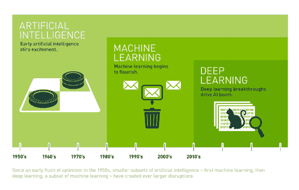
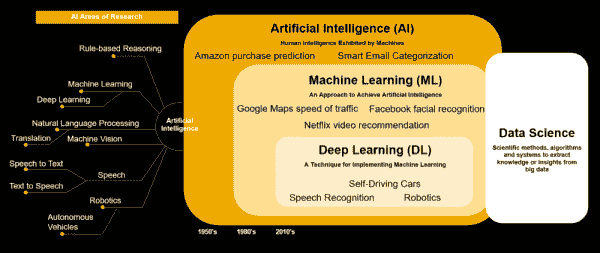
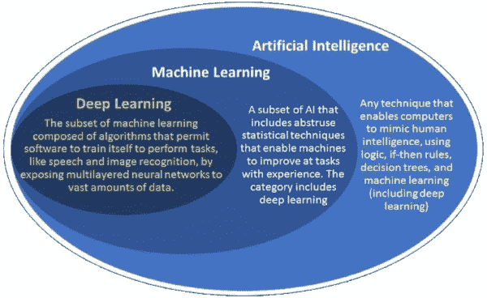

# AI、ML、DL、Java 的生命中的两年

> 原文：<https://medium.com/oracledevs/two-years-in-the-life-of-ai-ml-dl-and-java-6bfe6eb8182a?source=collection_archive---------0----------------------->

# 引用

帖子中的所有图片归各自的所有者/创作者/作者所有。*本帖是本人*[*@ JavaAdventCalendar*](https://www.javaadvent.com/)*帖子转自*[*https://www . javaadvent . com/2018/12/two-years-in-the-life-of-ai-ml-dl-and-Java . html*](https://www.javaadvent.com/2018/12/two-years-in-the-life-of-ai-ml-dl-and-java.html)*。*

# 介绍

AI、ML、DL 是[人工智能](https://en.wikipedia.org/wiki/Artificial_intelligence)、[机器学习](https://en.wikipedia.org/wiki/Machine_learning)和[深度学习的缩写。](https://en.wikipedia.org/wiki/Deep_learning)

现在回到我要写的内容。如果你问我，我会承认我甚至没有触及这些话题的表面。我在这里分享的是外面的一瞥，你们每个人可能已经发现了这些主题的更多方面，作为你们日常职业和个人追求的一部分。

我把这篇文章和下面的链接放在一起的动机之一来自我们在 2018 年 11 月举行的 [LJC 会议期间的讨论，在那里](http://unconf.londonjavacommunity.co.uk/) [Jeremie](https://twitter.com/jeremiecharlet?lang=en) 、 [Michael Bateman](https://www.meetup.com/Meet-a-Mentor-Community-London/members/3863286/) 和我以及一些 LJC JUG 成员聚集在一起讨论类似的主题。一些人提出的问题是关于 Java 在 AI-ML-DL 世界中的位置。我如何在 Java 中做这些事情？使用哪些库和框架？

# AI-ML-DL 和 Java 及其拓展

另一个坦白，我没有花太多时间去收集和分类这些话题，感谢 Twitter 和互联网帮助我找到并使用它们。我希望这里的内容不仅仅是对上述问题的回答。如果您觉得内容、分类和布局还可以进一步改进，请随时投稿，您可以通过访问 [git repo 并创建拉取请求](http://github.com/neomatrix369/awesome-ai-ml-dl)开始。请观看，分叉，开始回购，以获得即将到来的变化的更新。

以下是过去两年(大约)分享的一些资源，尽我所能分类如下:

**商业/普通/半技术**

*   [从 DS](https://www.forbes.com/sites/oracle/2018/12/05/how-to-extract-business-value-from-data-science-its-all-about-the-teamwork/#6ad2f23a651c) ( [推文](https://twitter.com/java/status/1070610044926930944))中提取商业价值
*   [为什么 Java 和 JVM 将主宰机器学习、人工智能和大数据的未来](https://www.youtube.com/watch?v=Ytja2JuVMlw&feature=youtu.be)
*   [在企业的学习曲线中，机器学习变得更加容易获得](https://partners.wsj.com/oracle/machine-learning-made-more-accessible-during-businesses-learning-curve/) ( [推特](https://twitter.com/java/status/1075314544162074624))
*   — [(更多链接)](https://github.com/neomatrix369/awesome-ai-ml-dl#business--general--semi-technical)

**分类器/决策树**

*   [带有 ApacheSpark 的垃圾邮件检测器 java 应用](http://ramok.tech/2017/09/26/email-spam-classifier-java-application-with-spark/) ( [Tweet](https://twitter.com/Klevis_Ramo/status/913067204094103552)
*   [人工智能指南:自动化决策](https://dzone.com/guides/artificial-intelligence-automating-decision-making) ( [推特](https://twitter.com/java/status/1029592519967830016))

**相关交叉出现**

*   [多域预测 AI 或者说如何让一个东西预测另一个](https://developer.ibm.com/dwblog/2017/mahout-spark-correlated-cross-occurences/) ( [推文](https://twitter.com/java/status/882222473886011393))

**深度学习**

*   [用 java 深度学习](https://www.jfokus.se/jfokus17/preso/Deep-Learning-on-Java-tutorial.pdf) ( [推文](https://twitter.com/juanantoniobm/status/832000819918733312))
*   [免费的人工智能训练——基于 Java 的深度学习工具来分析和训练数据，然后将产生的变化发送回服务器](https://www.youtube.com/watch?v=MXH_nn1dmsE) ( [推文](https://twitter.com/java/status/1071422649501409280)

**遗传算法**

*   [Jenetics 是一种高级遗传算法，分别是一种进化算法，用 java 编写的库](https://github.com/neomatrix369/awesome-ai-ml-dl/blob/master/jenetics.io) ( [Tweet](https://twitter.com/juanantoniobm/status/863871263118381056) )

**Java 项目/技术**

*   [巴拿马项目和快速机器学习计算](https://www.youtube.com/watch?v=cfxBrYud9KM&feature=youtu.be&t=231) ( [推特](https://twitter.com/java/status/1065266082557026304))
*   [GraalVM +机器学习](https://www.youtube.com/watch?v=6Q2TP-QO4SU) ( [Tweet](https://twitter.com/DevoxxUA/status/1074680378357616640) )
*   [由米米纳尔](https://blogs.oracle.com/startup/deploying-bespoke-ai-using-fn-project-kadlytics-by-miminal)使用 fnproj-KADlytics 部署定制人工智能([推特](https://twitter.com/java/status/1034474482751221761))

**自然语言处理**

*   [自然语言处理介绍和使用开源库的演示](https://www.ibm.com/developerworks/library/cc-cognitive-natural-language-processing/index.html?social_post=963789367&fst=Discover) ( [Tweet](https://twitter.com/java/status/883174486459248646) )
*   [用 deep learning 4j](https://www.meetup.com/AI-for-Enterprise-Virtual-User-Group/events/255622367/)([Tweet](https://twitter.com/java/status/1058405126988161024))实现 NLP 注意力机制
*   流行的 Java 自然语言工具如何帮助你执行自然语言处理任务 ( [推特](https://twitter.com/java/status/945689918289924096)
*   [免费人工智能演讲使用 Java 和 deep learning 4j](https://www.youtube.com/watch?v=XrZ_Y4koV5A&feature=youtu.be)([Tweet](https://twitter.com/java/status/1062035545394532352))

**神经网络**

*   [神经网络架构介绍](https://towardsdatascience.com/neural-network-architectures-156e5bad51ba) ( [推文](https://twitter.com/java/status/953492326877356032))
*   [麻省理工学院解释的神经网络](https://www.csail.mit.edu/news/explained-neural-networks) ( [推特](https://twitter.com/java/status/929216367361798144))
*   [用纯 Java 实现人工神经网络(无外部依赖性)](/coinmonks/implementing-an-artificial-neural-network-in-pure-java-no-external-dependencies-975749a38114) ( [推特](https://twitter.com/java/status/1031031249794609152))
*   [(](https://github.com/neomatrix369/awesome-ai-ml-dl#business--general--semi-technical) [更多链接](https://github.com/neomatrix369/awesome-ai-ml-dl#neural-networks) [)](https://github.com/neomatrix369/awesome-ai-ml-dl#business--general--semi-technical)

**推荐系统/协同过滤(CF)**

*   [Java 协同过滤(CF)教程——推荐系统使用的机器学习技术](https://www.baeldung.com/java-collaborative-filtering-recommendations) ( [Tweet](https://twitter.com/java/status/985150431549632513) )

**工具&库、备忘单、资源**

*   [最佳人工智能工具和库](https://skymind.ai/wiki/automl-automated-machine-learning-ai) ( [推文](https://twitter.com/java/status/1069459966740836352))
*   [人工智能、神经网络、机器学习、深度学习的备忘单&大数据](https://becominghuman.ai/cheat-sheets-for-ai-neural-networks-machine-learning-deep-learning-big-data-678c51b4b463) ( [推特](https://twitter.com/java/status/1040928213466198016)
*   [Java 中 AI 库概述](https://www.baeldung.com/java-ai) ( [Tweet](https://twitter.com/java/status/931070584896741377) )
*   [(](https://github.com/neomatrix369/awesome-ai-ml-dl#business--general--semi-technical) [更多链接](https://github.com/neomatrix369/awesome-ai-ml-dl#tools--libraries-cheatsheets-resources) [)](https://github.com/neomatrix369/awesome-ai-ml-dl#business--general--semi-technical)

**操作方法/部署/开发操作系统/无服务器**

*   [了解如何部署和管理机器学习模型](https://www.meetup.com/AI-for-Enterprise-Virtual-User-Group/events/254240417/) ( [推文](https://t.co/4lcwns0lgo))
*   [如何为商业智能和数据分析人工智能以及机器学习准备非结构化数据](https://www.infoq.com/presentations/ai-data-extraction) ( [推特](https://twitter.com/java/status/869572617023488001))
*   机器学习模型部署变得简单:[1](https://oracle.github.io/graphpipe/#/)2([Tweet](https://twitter.com/java/status/1038062329794052098))
*   [(更多链接)](https://github.com/neomatrix369/awesome-ai-ml-dl#how-to--deploy--devops--serverless)

**杂项**

*   [交互式数据湖查询简介](https://blogs.oracle.com/bigdata/interactive-data-lake-queries-at-scale) ( [Tweet](https://twitter.com/java/status/989047609259151360) )
*   [数据结构简单介绍](https://towardsdatascience.com/a-simple-introduction-to-data-structures-part-one-linked-lists-efbb13e9ad33) ( [推文](https://twitter.com/java/status/883093461842382849))

由于收集了大量的链接，并不是所有的都可以在这里显示，所以我创建了[git repo 并把它们放在 GitHub](http://github.com/neomatrix369/awesome-ai-ml-dl) 上，在那里你可以找到其余的链接。再次强调，拉取请求非常受欢迎。

从我几个星期到几个月的紧张经历来看，我建议如果你想接触人工智能，并且它是 off-springs[[2](https://en.wikipedia.org/wiki/Machine_learning)][[3](https://en.wikipedia.org/wiki/Deep_learning)]，不要回避它，仅仅因为它不是基于 Java / JVM 的。最好从你所拥有的高级语言开始，当你对这个主题有了足够的理解后，试着用你熟悉的语言来应用它们，不管是 Java 还是你可能知道的任何其他 JVM 语言。我并不声称我了解他们，只是分享我的里程。

我们在讨论中提到的一件事是，AI、ML 和 DL 有来自学术界的强大贡献，他们使用他们最熟悉的工具和语言，有时最适合手头的任务。

跟随推动创新和灵感的社区和工具，在选择的主题上变得更好。在这种情况下，它适用于[人工智能](https://en.wikipedia.org/wiki/Artificial_intelligence)及其变种[2](https://en.wikipedia.org/wiki/Machine_learning)】[3](https://en.wikipedia.org/wiki/Deep_learning)。

# 快速推销

首先，感谢 [@java](http://twitter.com/java) 与更广泛的社区分享许多 AI、ML、DL 相关资源。也要感谢像 https://skymind.ai/这样的组织，他们在弥合 Java/JVM 和 AI/ML/DL 世界之间的鸿沟方面做得非常出色。

此外，我要感谢伦敦 ML 学习小组背后的好心人([海伦](https://twitter.com/hlrecworks)和团队)，他们得到了[@ rwmeetimentor](http://twitter.com/RWmeetamentor)的支持，一直在努力让大家一起学习 ML 和相关主题。他们甚至间接影响了我写这篇文章。*眨眼，眨眼*

# 摘要

所以总结一下，我们在 [LJC Unconference 2018](http://unconf.londonjavacommunity.co.uk/) 上的讨论，我们提到了其他语言像 ***Python，R，Julia，Matlab*** 之类的，对 AI，ML，DL 的贡献比另一种编程语言更大。

我知道这样说不会让我受欢迎，但我对所有开发人员的谦卑请求是，不要认为或期望单一编程语言可以实现所有可能。任何语言，在这篇文章的上下文中，Java 和其他 JVM 语言都是为一个目的而写的，毫无疑问，我们可以在 Java/JVM 语言中复制其他语言所做的努力。但归根结底，它们都应该被视为工具，用在适当的地方。

我希望这篇文章中分享的一点点仍将有助于激励 Java / JVM 社区，尤其是那些对人工智能、机器学习和深度学习感兴趣的人。

*请关注这个空间，并分享您的评论、反馈或任何有助于我们学习和成长到*[*@ theneomatrix 369*](http://twitter.com/@theNeomatrix369)，*您可以通过* [*关于我的页面*](http://neomatrix369.worpress.com/aboutme) *了解更多关于我的信息。*