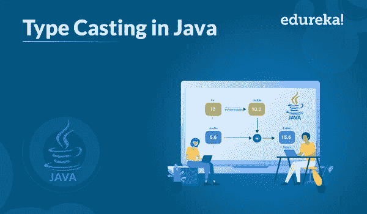

# 什么是 Java 中的类型转换，它是如何工作的？

> 原文：<https://medium.com/edureka/type-casting-in-java-ac4cd7e0bbe1?source=collection_archive---------0----------------------->



编程就是摆弄数据。在 Java 中，有许多数据类型。大多数时候，在编码时，有必要改变数据的类型来理解变量的处理，这被称为类型转换。在本文中，我将讨论 Java 中类型转换的基础知识。

本文涵盖了以下主题:

*   什么是类型转换？
*   加宽铸件
*   狭窄铸件

我们开始吧！

# 什么是类型转换？

类型转换只不过是将一种原始数据类型的值赋给另一种原始数据类型。将一种数据类型的值赋给另一种数据类型时，应该注意数据类型的兼容性。如果它们兼容，那么 Java 将自动执行转换，称为*自动类型转换，*，如果不兼容，那么它们需要被强制转换或显式转换。

Java 中有两种类型的转换，如下所示:

*   **加宽转换(自动)** —这包括将较小的数据类型转换为较大的类型大小。
*   `byte -> short -> char -> int -> long -> float -> double`
*   **收缩转换(手动)** —这涉及到将较大的数据类型转换成较小的类型。
*   `double -> float -> long -> int -> char -> short -> byte`

现在让我们进入类型转换类型的细节。

# 加宽铸件

当两种数据类型自动转换时，会发生这种类型的转换。它也被称为隐式转换。当两种数据类型兼容时，以及当我们将较小数据类型的值赋给较大数据类型时，就会发生这种情况。

**例如，**数字数据类型相互兼容，但不支持从数字类型到 char 或 boolean 的自动转换。此外，char 和 boolean 是不兼容的。现在让我们编写隐式类型转换的逻辑来理解它是如何工作的。

```
**public** **class** Conversion{
**public** **static** **void** main(String[] args)
{
**int** i = 200;
//automatic type conversion
**long** l = i;
//automatic type conversion
**float** f = l;
System.out.println("Int value "+i);
System.out.println("Long value "+l);
System.out.println("Float value "+f);
}
}
```

**输出:**

```
Int value 200
Long value 200
Float value 200.0
```

现在让我们进一步了解显式类型转换是如何工作的。

# 狭窄铸件

在这种情况下，如果您想要将较大数据类型的值赋给较小的数据类型，您可以执行*显式类型转换*或缩小。这对于无法进行自动转换的不兼容数据类型非常有用。

让我们借助一个例子来理解这一点。

```
//Java program to illustrate explicit type conversion
**public** **class** Narrowing
{
**public** **static** **void** main(String[] args)
{
**double** d = 200.06;
//explicit type casting
**long** l = (**long**)d;
//explicit type casting
**int** i = (**int**)l;
System.out.println("Double Data type value "+d);
//fractional part lost
System.out.println("Long Data type value "+l);
//fractional part lost
System.out.println("Int Data type value "+i);
}
}
```

**输出:**

```
Double Data type value 200.06
Long Data type value 200
Int Data type value 200
```

现在您已经知道了如何执行显式类型转换，让我们进一步了解如何在 Java 表达式上执行显式类型转换。

## 表达式中的显式类型转换

计算表达式时，输出会自动更新为操作数的较大数据类型。但是如果将结果存储在任何更小的数据类型中，就会产生编译时错误，因此我们需要对输出进行类型转换。

**例如:**

```
//Java program to illustrate type casting int to byte
**public** **class** ExplicitTest {
**public** **static** **void** main(String args[])
{
**byte** b = 70;
//type casting int to byte
b = (**byte**)(b * 2);
System.out.println(b);
}
}
```

**输出:**

***140***

***注意:*** *在单个操作数的情况下，结果被转换为 int，然后进行相应的类型转换。*

这就是 Java 中显式类型转换的全部内容。就这样，我们到了这篇文章的结尾。我希望你发现它信息丰富。如果您希望了解更多信息，也可以查看我们的。

到此，我们结束了这个博客。如果你想查看更多关于人工智能、DevOps、道德黑客等市场最热门技术的文章，你可以参考 Edureka 的官方网站。

请留意本系列中的其他文章，它们将解释 Java 的各个方面。

> *1。* [*面向对象编程*](/edureka/object-oriented-programming-b29cfd50eca0)
> 
> *2。* [*继承 Java 中的*](/edureka/inheritance-in-java-f638d3ed559e)
> 
> *3。*[*Java 中的多态性*](/edureka/polymorphism-in-java-9559e3641b9b)
> 
> *4。*[*Java 中的抽象*](/edureka/java-abstraction-d2d790c09037)
> 
> *5。* [*Java 教程*](/edureka/java-tutorial-bbdd28a2acd7)
> 
> *6。* [*Java 数组*](/edureka/java-array-tutorial-50299ef85e5)
> 
> *7。* [*Java 集合*](/edureka/java-collections-6d50b013aef8)
> 
> *8。* [*Java 线程*](/edureka/java-thread-bfb08e4eb691)
> 
> *9。*[*Java servlet 简介*](/edureka/java-servlets-62f583d69c7e)
> 
> *10。* [*Servlet 和 JSP 教程*](/edureka/servlet-and-jsp-tutorial-ef2e2ab9ee2a)
> 
> *11。*[*Java 中的异常处理*](/edureka/java-exception-handling-7bd07435508c)
> 
> *12。* [*高级 Java 教程*](/edureka/advanced-java-tutorial-f6ebac5175ec)
> 
> *13。* [*Java 面试题*](/edureka/java-interview-questions-1d59b9c53973)
> 
> *14。* [*Java 程序*](/edureka/java-programs-1e3220df2e76)
> 
> *15。*[*Kotlin vs Java*](/edureka/kotlin-vs-java-4f8653f38c04)
> 
> 16。 [*依赖注入使用*](/edureka/what-is-dependency-injection-5006b53af782)
> 
> 17。 [*堪比 Java 中的*](/edureka/comparable-in-java-e9cfa7be7ff7)
> 
> 18。 [*十大 Java 框架*](/edureka/java-frameworks-5d52f3211f39)
> 
> *19。* [*Java 反射 API*](/edureka/java-reflection-api-d38f3f5513fc)
> 
> 20。[*Java 中的 30 大模式*](/edureka/pattern-programs-in-java-f33186c711c8)
> 
> *21。* [*核心 Java 备忘单*](/edureka/java-cheat-sheet-3ad4d174012c)
> 
> *二十二。*[*Java 中的套接字编程*](/edureka/socket-programming-in-java-f09b82facd0)
> 
> *23。* [*Java OOP 备忘单*](/edureka/java-oop-cheat-sheet-9c6ebb5e1175)
> 
> *24。*[*Java 中的注释*](/edureka/annotations-in-java-9847d531d2bb)
> 
> *25。*[*Java 中的库管理系统项目*](/edureka/library-management-system-project-in-java-b003acba7f17)
> 
> *26。*[*Java 中的树*](/edureka/java-binary-tree-caede8dfada5)
> 
> *27。*[*Java 中的机器学习*](/edureka/machine-learning-in-java-db872998f368)
> 
> *28。*[*Java 中的顶级数据结构&算法*](/edureka/data-structures-algorithms-in-java-d27e915db1c5)
> 
> *29。* [*Java 开发者技能*](/edureka/java-developer-skills-83983e3d3b92)
> 
> 三十。 [*前 55 名 Servlet 面试问题*](/edureka/servlet-interview-questions-266b8fbb4b2d)
> 
> *31。*[](/edureka/java-exception-handling-7bd07435508c)*[*顶级 Java 项目*](/edureka/java-projects-db51097281e3)*
> 
> **32。* [*Java 字符串备忘单*](/edureka/java-string-cheat-sheet-9a91a6b46540)*
> 
> **33。*[*Java 中的嵌套类*](/edureka/nested-classes-java-f1987805e7e3)*
> 
> *34。 [*Java 合集面试问答*](/edureka/java-collections-interview-questions-162c5d7ef078)*
> 
> *35。[*Java 中如何处理死锁？*](/edureka/deadlock-in-java-5d1e4f0338d5)*
> 
> *36。 [*你需要知道的 50 大 Java 集合面试问题*](/edureka/java-collections-interview-questions-6d20f552773e)*
> 
> **37。*[*Java 中的字符串池是什么概念？*](/edureka/java-string-pool-5b5b3b327bdf)*
> 
> *38。[*C、C++和 Java 有什么区别？*](/edureka/difference-between-c-cpp-and-java-625c4e91fb95)*
> 
> *39。[*Java 中的回文——如何检查一个数字或字符串？*](/edureka/palindrome-in-java-5d116eb8755a)*
> 
> *40。 [*你需要知道的顶级 MVC 面试问答*](/edureka/mvc-interview-questions-cd568f6d7c2e)*
> 
> **41。*[*Java 编程语言的十大应用*](/edureka/applications-of-java-11e64f9588b0)*
> 
> **42。*[*Java 中的死锁*](/edureka/deadlock-in-java-5d1e4f0338d5)*
> 
> **43。*[*Java 中的平方和平方根*](/edureka/java-sqrt-method-59354a700571)*
> 
> **44。*[*Java 中的类型转换*](/edureka/type-casting-in-java-ac4cd7e0bbe1)*
> 
> **45。*[*Java 中的运算符及其类型*](/edureka/operators-in-java-fd05a7445c0a)*
> 
> **46。*[*Java 中的析构函数*](/edureka/destructor-in-java-21cc46ed48fc)*
> 
> **47。*[*Java 中的二分搜索法*](/edureka/binary-search-in-java-cf40e927a8d3)*
> 
> **48。*[*Java 中的 MVC 架构*](/edureka/mvc-architecture-in-java-a85952ae2684)*
> 
> **49。* [*冬眠面试问答*](/edureka/hibernate-interview-questions-78b45ec5cce8)*

**原载于 2019 年 7 月 25 日*[*https://www.edureka.co*](https://www.edureka.co/blog/type-casting-in-java/)*。**