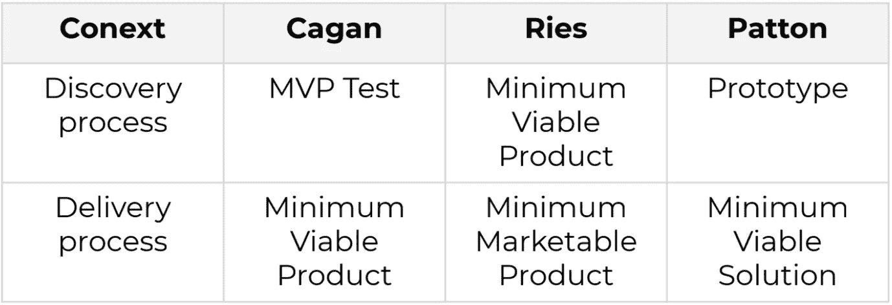
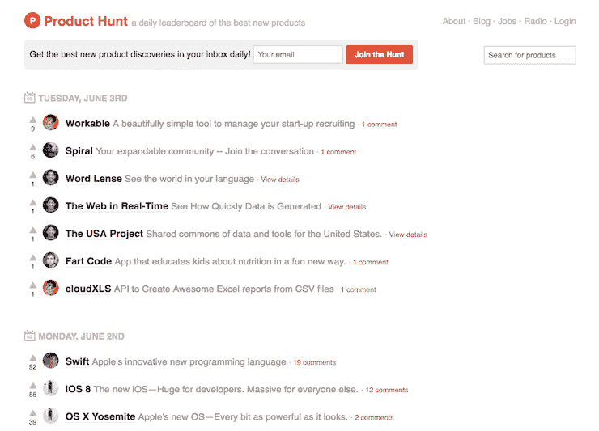
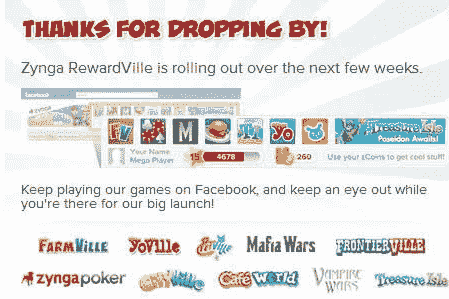
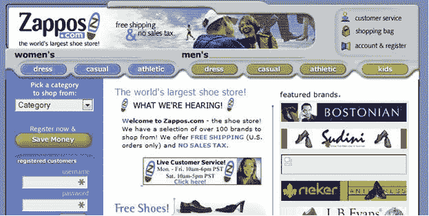

# MVP 的类型

> 原文：<https://medium.com/globant/types-of-mvps-b8579d68eb0b?source=collection_archive---------0----------------------->

Photo by [Marvin Meyer](https://unsplash.com/@marvelous?utm_source=medium&utm_medium=referral) on [Unsplash](https://unsplash.com?utm_source=medium&utm_medium=referral)

根据 Marty Cagan 的说法，关于产品管理的一个不方便的事实是，我们超过一半的产品想法不会工作，第二个是，那些工作的想法，在达到预期的商业价值之前，将需要几次迭代。产品经理解决这个问题的关键工具是基于使用 MVP 的假设验证迭代循环的实验。

# 什么是 MVP？

敏捷和精益方法(更具体地说是产品发现)在当今的商业环境中至关重要，因为它们帮助产品团队和组织拥有管理不确定性和风险的工具。最小可行产品是实现这个目标的主要工具之一，但是当谈到什么是 MVP 时，会产生混淆。

正如最初设想的那样，Eric Ries 定义的 MVP 的概念“……是一个新产品的版本，它允许一个团队以最少的努力收集关于客户的最大量的经验证的知识”。但是，如果没有必要的背景，对这是什么会有不同的解释。

实际上，这个术语已经发生了变化，被用来定义你可以投入生产的东西的最小表达式，也可以用来定义你为了做实验而放在一起的东西。这就是困惑产生的地方。

This table shows how some important authors on product-related practices use the different terms to address the same ideas.

我们不会试图在这里解决这个问题，而是声明本文关注的是 Eric Ries 所说的作为发现工具的 MVP，以及不同的原型。

# MVP，有效学习的工具

MVP 的目的是验证某个假设，这样团队就可以了解他们正在创建的产品的某些方面。这意味着团队需要想出一种方法来构建一个 MVP，这将有助于他们用真实用户在尽可能接近期望用例的环境中进行实验。否则，团队从实验中获得的见解可能对团队在现实生活中的应用没有用处。

例如，如果我们想看看我们的产品是否会引起我的客户群的兴趣，我必须构建一个产品版本，在尽可能真实的环境中帮助验证假设。

因此，人们可以得出结论，MVP 的创建和应用高度依赖于特定的产品和正在测试的假设，这反过来意味着 MVP 可以彼此非常不同。

以下是一些最常见的 MVP 原型:

# 解说视频

就像电影预告片一样，一个好的解释者视频可以帮助你解释你对一个产品的意图，并衡量有多少人对它感兴趣。两个很好的例子:

***Kickstarter*** :截至 2019 年 5 月， [Kickstarter](https://www.kickstarter.com/) 已从 1630 万支持者那里获得超过 40 亿美元的认捐，资助 44.5 万个项目，如电影、音乐、舞台剧、漫画、新闻、视频游戏、科技、出版和食品项目。这个平台基本上是一个解释者视频 MVP 的市场。

***Dropbox*** :在 Dropbox 的初期， [3 分钟的视频](https://www.youtube.com/watch?v=w4eTR7tci6A)展示了该产品的预期功能，并导致注册人数一夜之间从 5000 人增加到 75000 人

# 零碎的

这种类型的 MVP 利用现有的解决方案来交付新产品或服务。这是另一种无需花费太多时间和金钱就能向最终用户交付价值的方式。

Groupon:从一个定制的 WordPress 网站开始，Groupon 团队创建了一个非常基本的交易提供网站。这使他们能够测试他们的需求，并收集他们需要的洞察力，以建立他们今天拥有的公司。有一篇非常好的[中型文章](/rocket-startup/how-groupon-built-an-mvp-without-tech-and-validated-an-idea-in-a-month-53ed8845affd)作者是 [Alex Ponomarev](/@alexponomarev?source=post_page-----53ed8845affd--------------------------------) 给出了更多的见解，我强烈推荐。

***产品搜寻*** :瑞安·胡佛利用一项名为 [Linkydink](https://www.producthunt.com/posts/linkydink) 的服务邀请人们加入他的团队。一旦他有了超过 150 个订户，他就开始收集产品推荐，然后他知道他有东西了。今天，产品搜索是世界上最受欢迎的产品社区之一。

A screenshot of Product Hunt’s MVP using a linkydink

# 登录页面和广告词

就像 explainer 视频一样，登录页面和 AdWords 可以帮助你进行快速而廉价的实验，从而验证你对产品的兴趣。使用这种技术的公司的一些例子:

Zynga :在他们的游戏开发过程中，该公司遵循登陆页面和 adword MVP 测试的组合，以衡量人们对计划中的游戏或游戏特定方面的兴趣。

An example of the screen you would be presented when clicking into one of the Zynga’s MVPs.

*:当他们推出单一登陆页面时，他们专注于最重要的单一功能:作为订阅的音乐流媒体体验。允许他们验证对其产品的需求。*

# *看门人*

*团队为用户手动解决问题，以交付预期的价值。这用于在创建自动化解决方案或帮助了解问题之前验证是否有需求。*

****Zappos:****第一个版本是由团队将当地商店的鞋子照片上传到网站，然后将鞋子邮寄给用户，以测试人们是否会在网上购买鞋子。后来，卖鞋的人不得不上传自己的照片。**

****

**A screenshot of Zappos first MVP**

# **创建轻量级 MVP 的推荐工具包:**

*****MVP 推荐工具列表*****

**简单的网页工具:**

*   **[*Wix*](https://www.wix.com/)**
*   **[launch rock](https://builder.launchrock.com/discover)**
*   **[*视觉*](https://www.invisionapp.com/)**
*   **[*解绑*](https://unbounce.com/)**
*   **[*Instapage*](https://instapage.com/lp/allgeos-google-search-brand/instapage_alpha?utm_medium=ppc&utm_source=adwords&utm_term=instapage&device=c&network=g&matchtype=e&utm_campaign=allgeos-google-search-brand&utm_agn=instapage_alpha&gclid=EAIaIQobChMIrtD25b3o5AIVSQyRCh2woAU3EAAYASAAEgIAHfD_BwE)**
*   **[*按*](https://wordpress.com/create/?sgmt=gb&utm_source=google&utm_campaign=google_wpcom_search_brand_desktop_cl_en&utm_medium=paid_search&keyword=wordpress&creative=352928968962&campaignid=654740831&adgroupid=52622698695&matchtype=e&device=c&network=g&cpn=654740831&device=c&pl=&targetid=kwd-313411415&locationid=1003317&gclid=EAIaIQobChMIq5i72MTo5AIVhA-RCh0jEgI7EAAYAiAAEgLWSPD_BwE&gclsrc=aw.ds)**

***对自动化有用的工具:***

*   **[聊天燃料 ](https://chatfuel.com/)**
*   **[*自动驾驶*](https://www.autopilothq.com/)**
*   **[*MailChimp*](https://mailchimp.com/)**
*   **[*调查猴子*](https://www.surveymonkey.com/welcome/sem/?program=7013A000000mweBQAQ&utm_bu=CR&utm_campaign=71700000059186490&utm_adgroup=58700005408390198&utm_content=43700049188951718&utm_medium=cpc&utm_source=adwords&utm_term=p49188951718&utm_kxconfid=s4bvpi0ju&language=&gclid=CjwKCAjw_o-HBhAsEiwANqYhpxIC_8qNWnKVtVi3gmJCFWSrEl36BtRDSPd7bcp383uhtubD8oZ-zxoCrcMQAvD_BwE&gclsrc=aw.ds)**

***必备:***

*   **[*谷歌分析*](https://analytics.google.com/analytics/web/provision/?authuser=0#/provision)**
*   **[*谷歌表单*](https://www.google.com/forms/about/)**

## **一些很酷的文章可以深入挖掘:**

**罗斯·科劳兹克的这篇文章有很多有趣的 MVP 的例子，我在这里分享了其中一些。**

**[这篇文章](https://svpg.com/the-inconvenient-truth-about-product/)作者 Marty Cagan，在我看来，他是产品相关活动方面最重要的作者之一，他深入探讨了这篇文章的原因。**