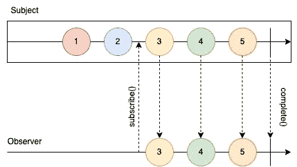
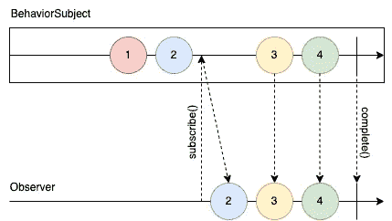
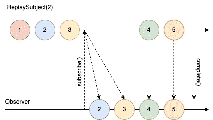
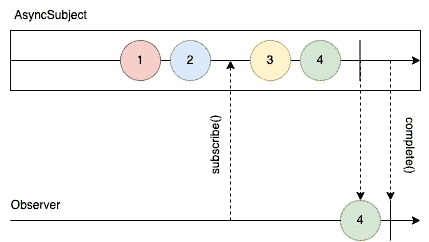

# RxJS 中的主题类型

> 原文：<https://medium.com/version-1/types-of-subjects-in-rxjs-124b6e2cf511?source=collection_archive---------0----------------------->

Photo by [Tracy Adams](https://unsplash.com/@tracycodes?utm_source=unsplash&utm_medium=referral&utm_content=creditCopyText) on [Unsplash](https://unsplash.com/s/photos/java?utm_source=unsplash&utm_medium=referral&utm_content=creditCopyText)

如果你正在阅读这篇文章，你可能已经接触过 RxJS 提供的不同类型的主题。但是，你知道你为什么专门使用每一个吗？或者更重要的是，你用的是你真正需要的那个吗？让我们仔细看看 RxJS 中的四种不同类型:

`Subject`

`BehaviorSubject`

`ReplaySubject`

`AsyncSubject`

# 科目

一个`Subject`是一种特殊类型的可观察值，它允许将值多播给许多观察者。

*   **每个** `**Subject**` **都是一个** `**Observable**` **。**给定一个`Subject`，你可以`subscribe`给它，提供一个`Observer`，它将开始正常接收值。
*   **每一个** `**Subject**` **都是一个** `**Observer**` **。**要向`Subject`发送新值，只需调用`next(value)`，它将被组播给注册监听`Subject`的观察者。

当您订阅一个`Subject`时，`Observer`将接收订阅后发出的每个值**。**订阅前发出的任何值都不会被`Observer`接收到。

Subject Marble Diagram

Subject Coding Example

# 行为主体

`BehaviorSubject`的行为类似于`Subject`，但是`Observer`也接收**在订阅**之前发出的最后一个值。

BehaviorSubject Marble Diagram

BehaviorSubject Coding Example

# 重播主题

一个`ReplaySubject`的行为类似于一个`BehaviorSubject`，但是你可以记录多个值并向新的订阅者回放，而不是只发送最后一个值。例如，您可以缓冲最后两个值:

ReplaySubject(2) Marble Diagram

ReplaySubject(2) Coding Example

# async 主语

`AsyncSubject`有不同的行为。这是一个变体，其中只有执行的最后一个值被发送给它的观察者，并且只有当执行完成时。

希望这篇文章对你有用。现在检查您的代码，看看您是否使用了最适合您需求的代码！

# 关于作者:

米格尔·穆尼奥斯是 Version 1 的首席软件工程师。