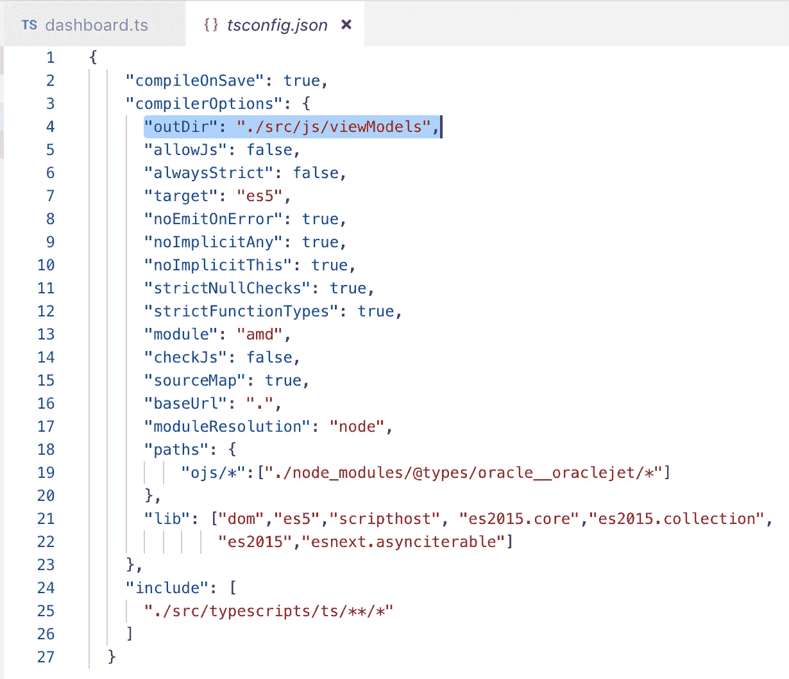
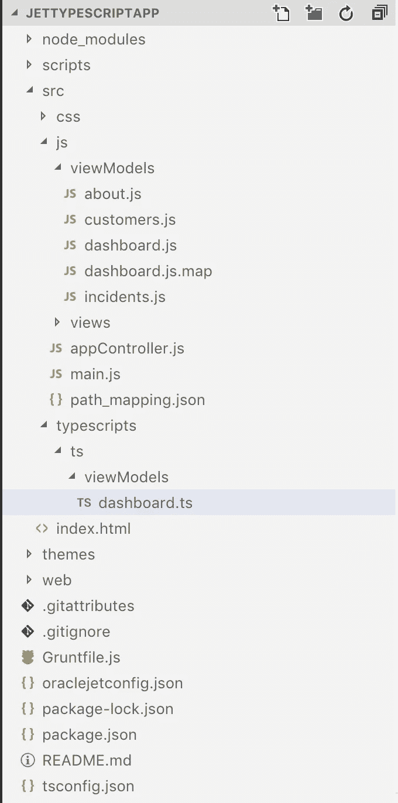
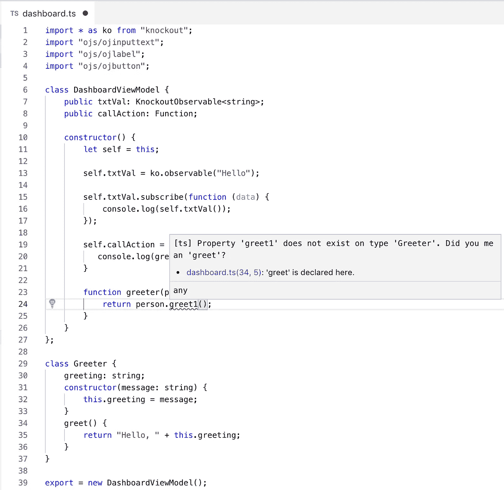
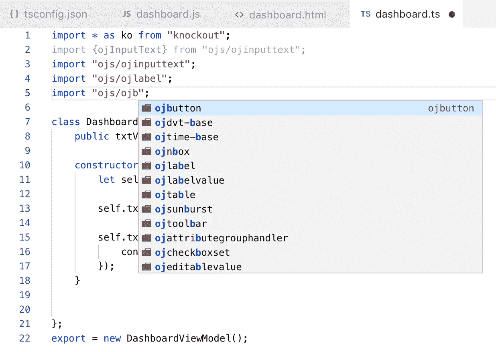
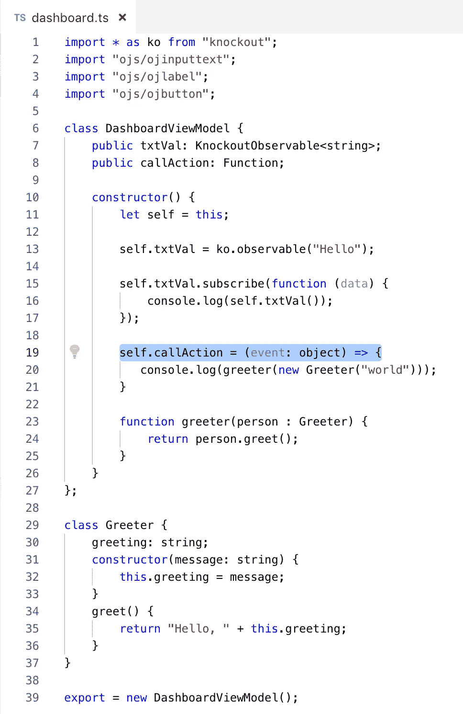
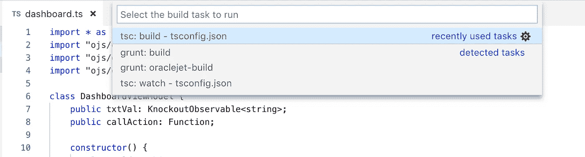
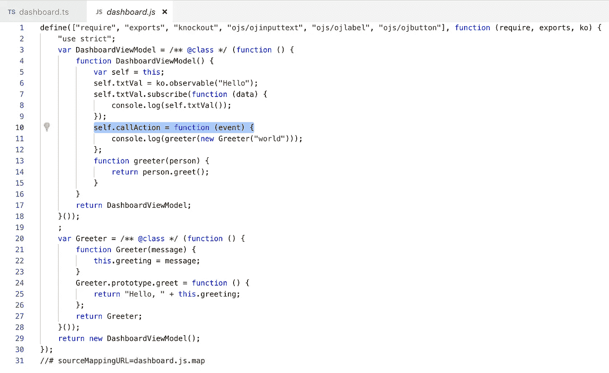
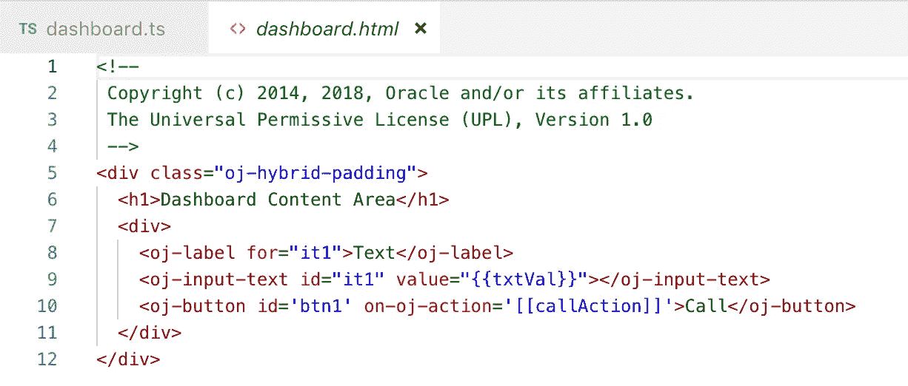
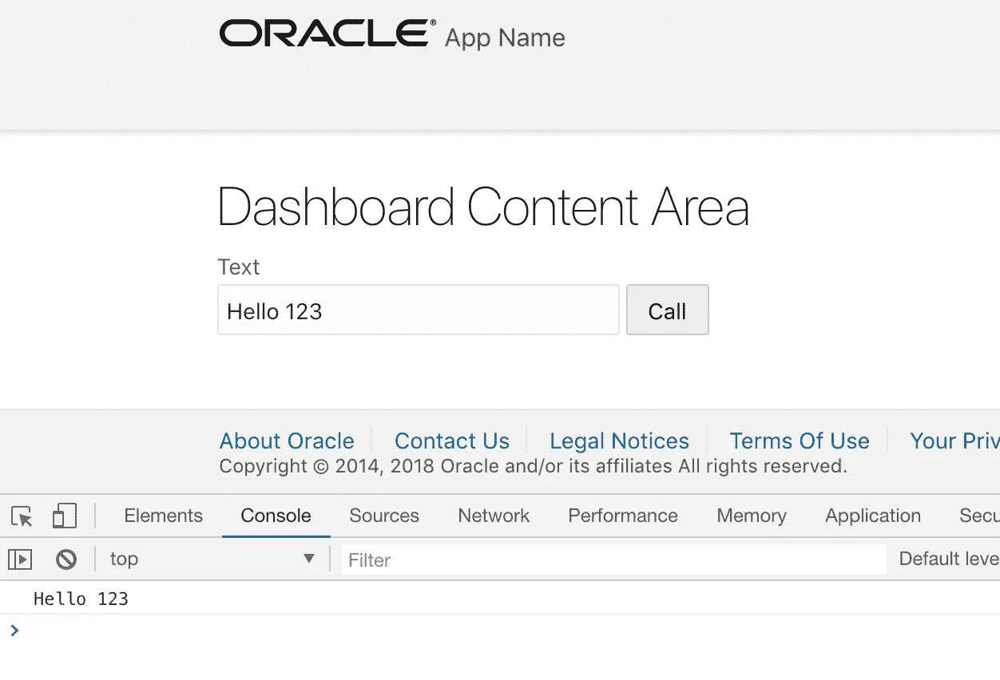
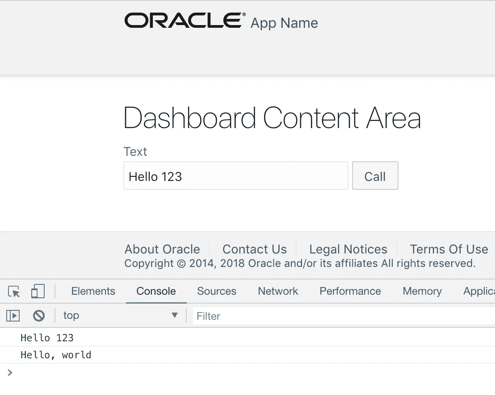

# Oracle JET 6.0.0 中的 TypeScript 示例

> 原文：<https://medium.com/oracledevs/typescript-example-in-oracle-jet-6-0-0-1a7a673c806d?source=collection_archive---------0----------------------->

JET 6.0.0 正式支持 TypeScript，哇，好消息。如果您正在使用 JET 构建大型 JavaScript 应用程序，那么使用 TypeScript 管理代码会容易得多——它会在构建时进行类型检查并报告代码错误。逻辑可以通过继承封装到类中。在 [TypeScript](https://www.typescriptlang.org/docs/handbook/classes.html) 中阅读更多关于类支持的内容。

在这篇文章中，我将分享一个简单的支持 TypeScript 的 JET 应用程序。示例应用程序可以从 [GitHub](https://github.com/abaranovskis-redsamurai/jettypescriptapp) repo 下载。在使用 *ojet serve* 运行之前，请确保执行 *ojet restore* 来安装所有相关模块。

如果您想为新的 JET 应用程序添加类型脚本支持，可以使用在应用程序根中执行的 *npm* 命令来实现:

*npm 安装@types/oracle__oraclejet*

我建议使用 Microsoft Visual Studio 代码通过 TypeScript 进行 Oracle JET 开发。IDE 对 TypeScript 提供了很好的支持，它支持自动完成、调试——我确信它会使 JET 开发更快。

为了能够使用 TypeScript，使用以下命令全局安装它(阅读更多关于各种选项的信息— TypeScript [setup](https://code.visualstudio.com/docs/languages/typescript) ):

*npm install -g 类型脚本*

第一步是将 *tsconfig.json* 添加到 JET app 的根文件夹中。此配置文件启用 JET 应用程序中的 TypeScript 支持。您可以从 TypeScript 指南中的 [JET 复制 tsconfig.json。我已经将 *outDir* 更新到我的应用程序文件夹结构，这允许将翻译后的 JS 文件从 TypeScript 直接写入带有 JS 文件的标准 JET 文件夹，并覆盖 JS 模块:](https://docs.oracle.com/en/middleware/jet/6/reference-typescript/TypescriptOverview.html)

接下来，我们应该在 typescripts 文件夹下创建新的 TypeScript 文件(扩展名 ts)。文件名应该与现有的 JS 模块文件名匹配，以便在 TypeScript 生成过程中重写该 JS 目标文件:

TypeScript 在生成时报告代码错误，例如，找不到函数名:

可视代码为 JET 代码提供自动完成功能，例如，它有助于导入模块:

在 TypeScript 中，我们可以定义类。变量可以创建为某个类的对象，这有助于定义输入参数类型，并在将这些变量传递给函数时进行严格的类型检查。研究这个用 TypeScript 编写的简单代码示例，看看可观察变量是如何定义的:

可视代码提供构建命令来将类型脚本代码翻译成 JS:

一旦构建完成，我们将获得与 JET 模块相关联的已翻译的 JS 代码。看看 class 是怎么翻译的。查看 callAction 函数如何通过事件输入参数进行转换:

JET 模块的 HTML 部分保持不变，没有 TypeScript:

可观察的变量变化在 TypeScript 中处理:

调用操作监听器，并调用带有类类型参数的函数:

*原载于 2018 年 10 月 31 日*[*【andrejusb.blogspot.com】*](https://andrejusb.blogspot.com/2018/10/typescript-example-in-oracle-jet-600.html)*。*