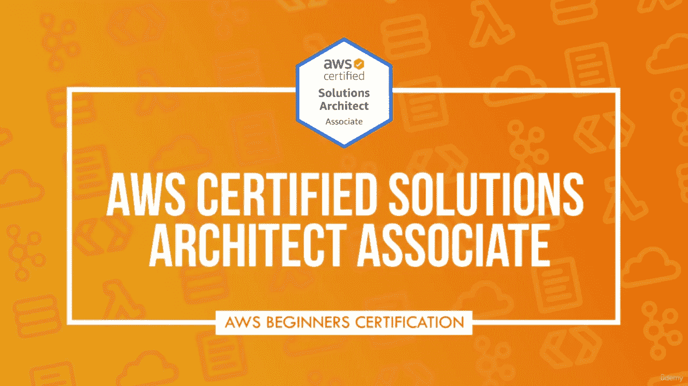
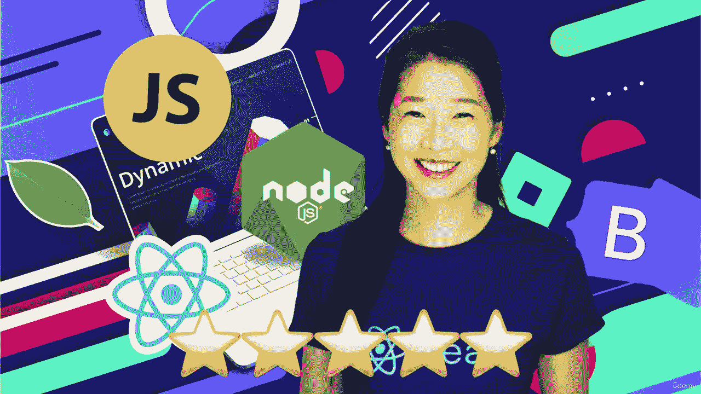
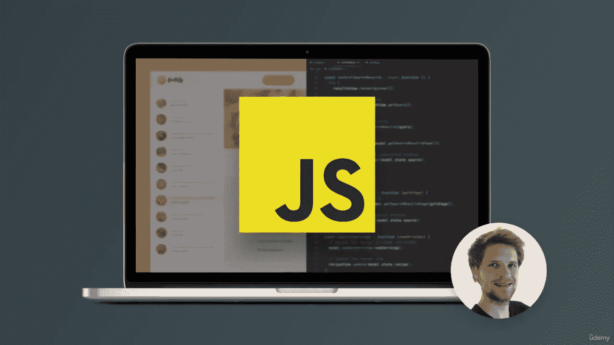
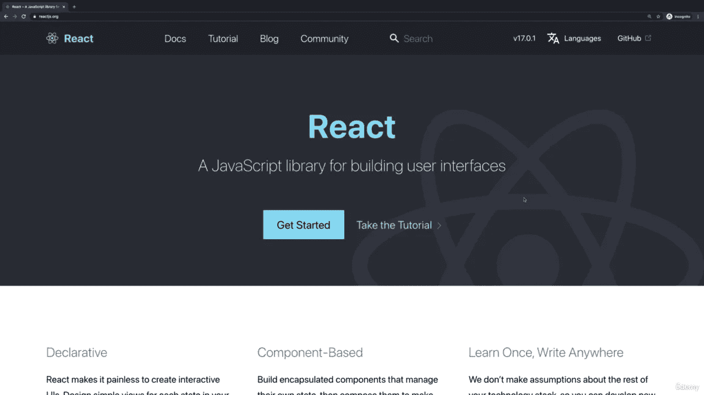
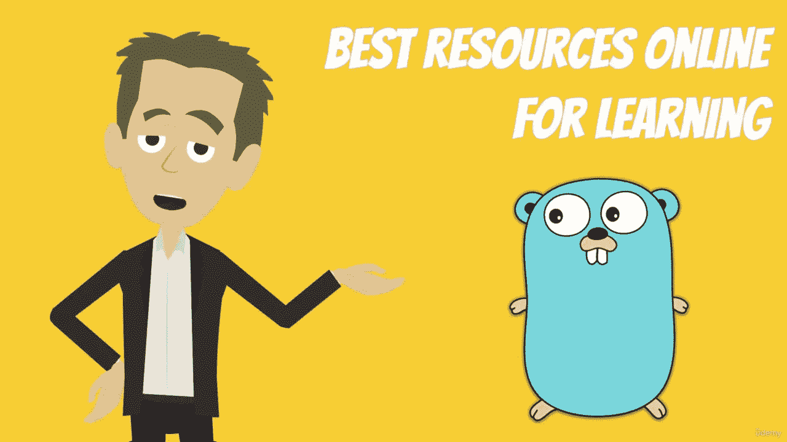
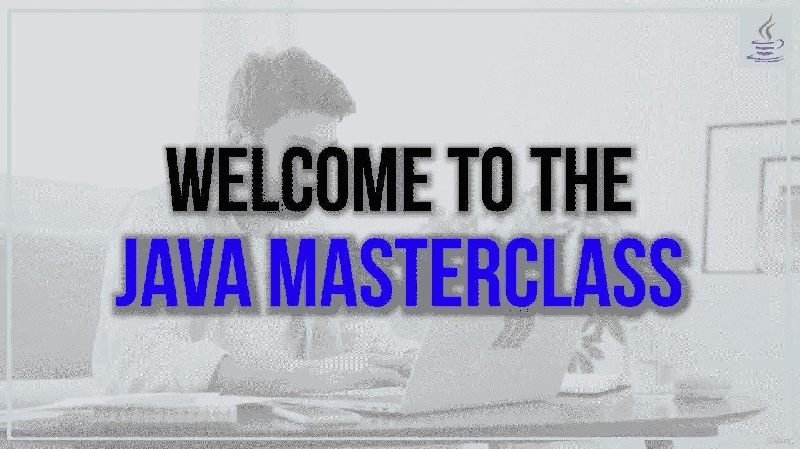
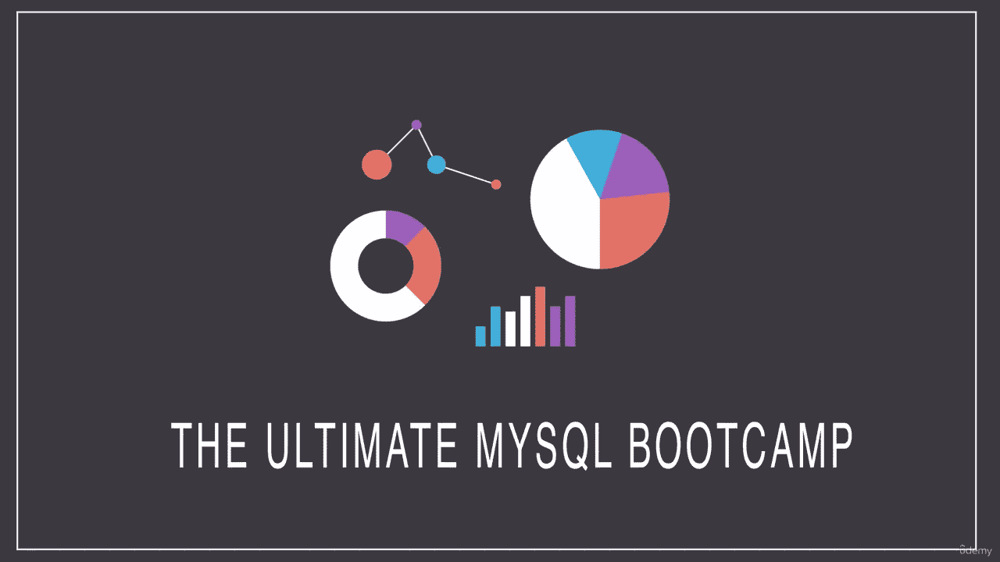
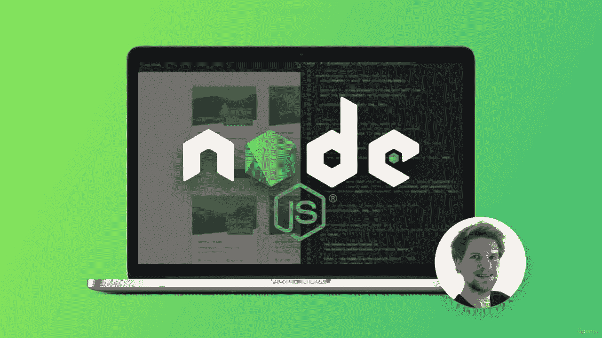
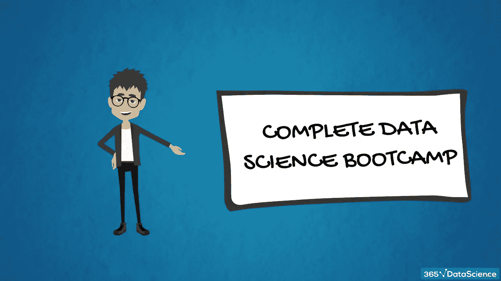

# 每个开发商都应该投资这 10 个课程:黑色星期五销售

> 原文：<https://medium.com/quick-code/udemy-black-friday-sale-10-must-invest-courses-58095d031906?source=collection_archive---------1----------------------->

## 黑色星期五是投资开发者课程的好时机。我在下面列出了我最喜欢的 10 门课程。

各位开发者好！假日购物季节即将来临。黑色星期五和网络星期一，一年中最大的购物日，已经到来。虽然距离网络星期一(11 月 28 日)还有几天时间，但黑色星期五大减价已经开始。许多电子学习平台提供打折课程，许多购物网站举办大优惠，折扣巨大。你可以以更低的价格获得同样的课程、证书和培训。

我把所有的信息都集中在一个地方，这样对你更方便。所以，在这篇文章里，我就来说说你在这个黑色星期五特卖中可以投资的 10 个最好的 Udemy 课程。所以，事不宜迟，我们开始吧。

## 1. [100 天代码:2023 年完整的 Python Pro 训练营](https://click.linksynergy.com/deeplink?id=0F1O0otUXQc&mid=47901&u1=csMedium&murl=https%3A%2F%2Fwww.udemy.com%2Fcourse%2F100-days-of-code%2F%23instructor-1)

这个训练营是由**安吉拉·于**博士举办的，她是伦敦 App Brewery 的首席讲师，这是伦敦领先的编程训练营。对于那些想从头开始学习 Python 的人来说，这是一门完美的课程。在 100 天的时间里，你将通过构建 100 个项目来学习如何掌握 Python。此外，您将创建网站、游戏和应用程序，并学习数据科学和自动化。

Python Bootcamp

## 2.[终极 AWS 认证解决方案架构师助理 SAA-C03](https://click.linksynergy.com/deeplink?id=0F1O0otUXQc&mid=47901&u1=csMedium&murl=https%3A%2F%2Fwww.udemy.com%2Fcourse%2Faws-certified-solutions-architect-associate-saa-c03%2F)

这是最受欢迎的 AWS 认证课程，由 AWS 英雄、AWS 认证解决方案架构师专家**夏羽·马瑞克**主讲& AWS 认证 DevOps 专家。如果你想学习 AWS，这是适合你的课程。在本课程中，您将学习云计算并通过 AWS 认证解决方案架构师助理认证 SAA-C03。

AWS Certifications

这是初学者掌握自动气象站基础知识的极好课程。你也可以查看他的其他 AWS 认证[这里](/quick-code/6-best-aws-certifications-for-beginners-experts-32231028f38f)。

## 3.[完整的 2023 年网络开发训练营](https://click.linksynergy.com/deeplink?id=0F1O0otUXQc&mid=47901&u1=csMedium&murl=https%3A%2F%2Fwww.udemy.com%2Fcourse%2Fthe-complete-web-development-bootcamp%2F)

对于刚接触 Web 开发的人来说，这是一门完美的课程。Angela Yu 博士的又一门优秀的网络开发课程。该课程教授 HTML、CSS、Javascript、Node、React、MongoDB、Web3 和 DApps，帮助您成为全栈 Web 开发人员。

Best Web Development Bootcamp

此外，您将学习最新的技术，包括 Javascript、React、Node，甚至 Web3 开发。完成后，你将足够专业，可以建立任何你想要的网站。

## 4.【2023 年 JavaScript 全教程:从零到专家

通过由 Udemy 顶级讲师之一 **Jonas Schmedtmann** 教授的这门课程，从零开始成为一名自信的现代 JavaScript 开发人员。此外，您将学习如何像开发人员一样思考和工作，包括解决问题、研究和工作流。

Learn JavaScript

Udemy 上没有其他类似这样的 JavaScript 课程。这个包包含了从 JavaScript 的基础开始构建复杂的现代应用程序所需的一切。

## 5. [React —完整指南(包括挂钩、React 路由器、Redux)](https://click.linksynergy.com/deeplink?id=0F1O0otUXQc&mid=47901&u1=csMedium&murl=https%3A%2F%2Fwww.udemy.com%2Fcourse%2Freact-the-complete-guide-incl-redux%2F)

Udemy 上最受欢迎的导师之一 Maximilian Schwarzüller，教你如何从零开始构建 React。该课程将实际教你 React.js，使用最新的模式和最佳实践。在本课程中，您将学习所有的基础知识和高级概念，使您能够成为一名合格的 React.js 开发人员。所以，如果你真的想学习 React，那就去上这门课吧。

Best React Course

本课程不需要任何先验知识！唯一的先决条件是基本的 web 开发和 JavaScript 知识(尽管该课程包括一个简短的 JavaScript 复习，以确保每个人都在同一页面上)。

## 6. [Go:完全开发者指南(Golang)](https://click.linksynergy.com/deeplink?id=0F1O0otUXQc&mid=47901&u1=csMedium&murl=https%3A%2F%2Fwww.udemy.com%2Fcourse%2Fgo-the-complete-developers-guide%2F)

作为程序员，学习 Golang 是最重要的事情之一。因此，Stephen Grider**的这门课程将帮助你掌握 Go 编程语言(Golang)的基础和高级特性。这个 Udemy 课程将教你如何充分利用 Go 的并发模型和接口。如果你想了解围棋的基本原理，就投资这门课程吧。**

Learn Golang

## 7. [Java 编程大师班覆盖 Java 11 & Java 17](https://click.linksynergy.com/deeplink?id=0F1O0otUXQc&mid=47901&u1=csMedium&murl=https%3A%2F%2Fwww.udemy.com%2Fcourse%2Fjava-the-complete-java-developer-course%2F)

通过这个深入、全面的课程成为一名 Java 程序员。大多数跟踪语言流行度的官方网站都将 Java 排在第一或第三位。因此，作为一名开发人员，您将从学习 Java 中受益。

Learn Java

**蒂姆·布查尔卡**，一位专业的软件开发人员会帮你解决这个问题。在本课程中，Tim 将帮助您学习 Java 技能，这些技能对于找到一份 Java 开发人员的工作至关重要。他会把 Java 教得很好，这样你就可以构建 Java 应用程序，并很快成为一名高效的软件开发人员。

## 8.[终极 MySQL 训练营:从 SQL 初学者到专家](https://click.linksynergy.com/deeplink?id=0F1O0otUXQc&mid=47901&u1=csMedium&murl=https%3A%2F%2Fwww.udemy.com%2Fcourse%2Fthe-ultimate-mysql-bootcamp-go-from-sql-beginner-to-expert%2F)

掌握 MySQL 来使用数据洞察力解决复杂的业务问题是至关重要的，无论你是从事销售或营销工作，还是经营自己的企业。因此，Udemy 的顶级讲师**柯尔特·斯蒂尔**教授的这门课程将帮助你从零开始学习 MySQL。

The Ultimate MySQL Bootcamp

本课程温和地介绍了 MySQL，全面介绍了一项在商业领域非常受欢迎的技能。本课程面向那些被数据库吓到而无法开始数据分析，但希望从中获得洞察力的人。通过最终的 MySQL Bootcamp，您将以引人入胜、信息丰富的方式获得对数据库的深入了解。

## 9. [**Node.js，Express，MongoDB &更多:完整 Bootcamp 2023**](https://click.linksynergy.com/deeplink?id=0F1O0otUXQc&mid=47901&u1=csMedium&murl=https%3A%2F%2Fwww.udemy.com%2Fcourse%2Fnodejs-express-mongodb-bootcamp%2F)

本 Udemy 课程由 Udemy 顶级讲师 Jonas Schmedtmann**主讲，将教你通过构建 REST API 和 web 应用程序来掌握 Node(包括认证、Node.js 安全、支付&等)。是初学者作为高级开发者掌握 Node.js 的理想一体机包。**

Learn Node.js

它将通过构建一个巨大的项目，带领您使用 Node.js 和相关技术规划、构建和部署一个现代后端应用程序。如果你想学习 Node.js 和现代后端开发，这个课程是一个很好的选择！

## 10.【2022 年数据科学课程:完整的数据科学训练营

21 世纪最好的职业之一是数据科学。该领域涉及数字技术、编程和分析。毫不奇怪，就业市场对数据科学家的需求激增。因此， **365 careers** 开发了数据科学课程 2022，作为在线提供的最有效、最省时、最结构化的数据科学培训。

Data Science Bootcamp

作为一名数据科学家，您可以访问整个工具包。了解如何用 Python 编码，并将其用于统计分析。如果你有兴趣成为一名数据科学家或者学习更多关于这个领域的知识，那么你应该参加这个课程。

这一次到此为止！我希望你喜欢阅读这个最佳 Udemy 课程列表。鉴于目前的黑色星期五销售，我会很快回来，带一份你应该考虑投资的课程的完整清单。在此之前，你可能会发现这些帖子很有用:

 [## 作为开发人员应该避免的 7 个坏习惯

### 避免这五个坏习惯，成长为一名优秀的开发者。

medium.com](/quick-code/7-bad-habits-you-should-avoid-as-a-developer-2832c5aadbf1)  [## 在线学习 7 门最佳 TensorFlow 课程[2022 年 11 月]

### 以下是我列出的从最好的在线平台学习 Tensorflow 的顶级课程。

medium.com](/quick-code/7-best-tensorflow-courses-to-learn-online-8917c92db86d)  [## 10 个最佳道德黑客在线课程[2022 年 11 月]

### 众所周知，黑客有各种各样的肤色:白色、灰色、黑色，当涉及到…

medium.com](/quick-code/10-best-ethical-hacking-courses-online-a638f14817ab)