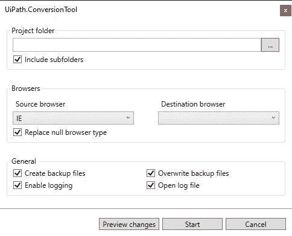

# 解决浏览器兼容性问题的 UiPath 转换工具。

> 原文：<https://medium.com/globant/uipath-conversion-tool-to-resolve-browser-compatibility-issues-c9f156da6c22?source=collection_archive---------4----------------------->

微软最近宣布从 2022 年 6 月 15 日起淘汰其老式浏览器，即 Internet explorer，以促进其新产品，即 Microsoft Edge 在市场上的使用。

作为一名 RPA 或智能自动化开发人员，我无法阻止自己想象 COE 和 RPA 开发人员的痛苦，他们花费了数周和数月的时间来设计选择 Internet Explorer 作为浏览平台的机器人。

正好，我在属于各种 RPA 工具和专业社交媒体平台(如 LinkedIn)的各种论坛上看到了许多关于同一问题的大惊小怪。许多用户写道，他们需要使用微软 Edge、Chrome、Firefox 等其他浏览器重新设计他们现有的机器人。另一个被广泛讨论的因素是对他们从现有和正在开发的 RPA 流程中预期的估计 ROI 的影响。

既然，我们已经讨论了很多关于这个问题，让我们来看看到底能做些什么来解决这个问题。

解决方案是由 UiPath 开发的**“ui path 浏览器转换工具”**，以满足用户对其长期竞争对手(如 BluePrism)开发的类似工具的期望。

***“ui path 浏览器转换工具”的观感&如何？***

UiPath Browser Conversion Tool

UiPath 浏览器转换工具是拯救生命的工具，它可以改变代码的兼容性，从传统的浏览器如 Internet Explorer 到新的浏览器如 Microsoft Edge、Chrome 等。

***怎么用？***

可以通过两种方式使用浏览器转换工具，一种是编辑安装文件夹中 Settings.json 文件中的参数，另一种是使用启动可执行文件时提供的用户界面字段和选项。该工具与兼容。使用 UiPath Studio 生成的 xaml 文件。

***最简单的方法是什么？***

显然是用户界面超级好用。你所需要做的就是给下面的字段和复选框输入一些值。

**字段:**

1.  项目文件夹:放置所有。xaml 文件。
2.  源代码浏览器:用于开发代码的当前浏览器。
3.  目标浏览器:您希望代码与之兼容的浏览器。

**复选框:**

1.  包括子文件夹:如果选中，将修改父文件夹以及相应文件路径的子文件夹中的文件。
2.  替换空浏览器类型:如果选中，并且在工作流中发现浏览器类型为空，则该工具会将其更改为目标浏览器类型。
3.  创建备份文件:如果选中，将在更新原始文件之前创建备份文件。备份文件可以在源文件夹下的*“转换 _ 备份文件夹”*中找到。
4.  启用日志记录:如果选中，将创建包含已更改选择器的日志文件。
5.  打开日志文件:如果选中，将打开包含已更改选择器的日志文件。

**按钮:**

1.  预览更改:如果单击，将扫描所有。xaml 文件并输出将在 *UiPath 中应用的更改。在目标文件夹中生成的 ConversionTool_log.json* 日志文件。不会对实际工作流应用任何更改，也不会创建任何备份文件。
2.  开始:如果单击，将在指定的工作流上执行迁移，使其与您选择的浏览器兼容。

***使用该工具的最佳做法是什么？***

1.  我建议使用*“创建备份文件”*选项来备份您的原始代码，以防您的迁移代码出现问题。
2.  我建议使用*“Include sub Folder”*选项，以防你对你的代码使用 RE-Framework，或者你把你的代码放在主文件夹的多个子文件夹中。

***汇总***

*   ***可靠性&准确性*** :据观察，该工具在更改涉及源代码浏览器元素的选择器时相当可靠和准确。根据我的观察，我认为它的可靠性和准确性是 99%。
*   ***转换百分比*** :据我观察，我会说选择器 99%可转换，可靠。可能有一些元素具有特定于浏览器的性质，您可能需要单独对其进行探测。