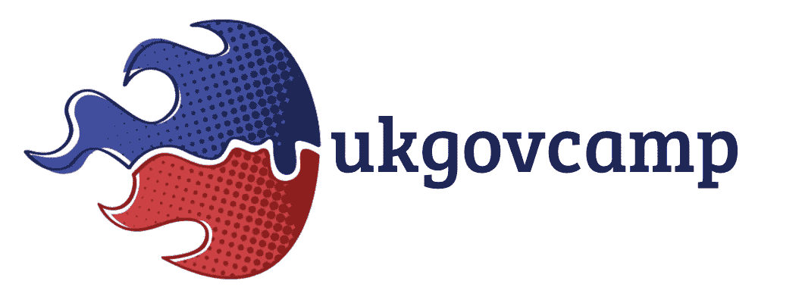
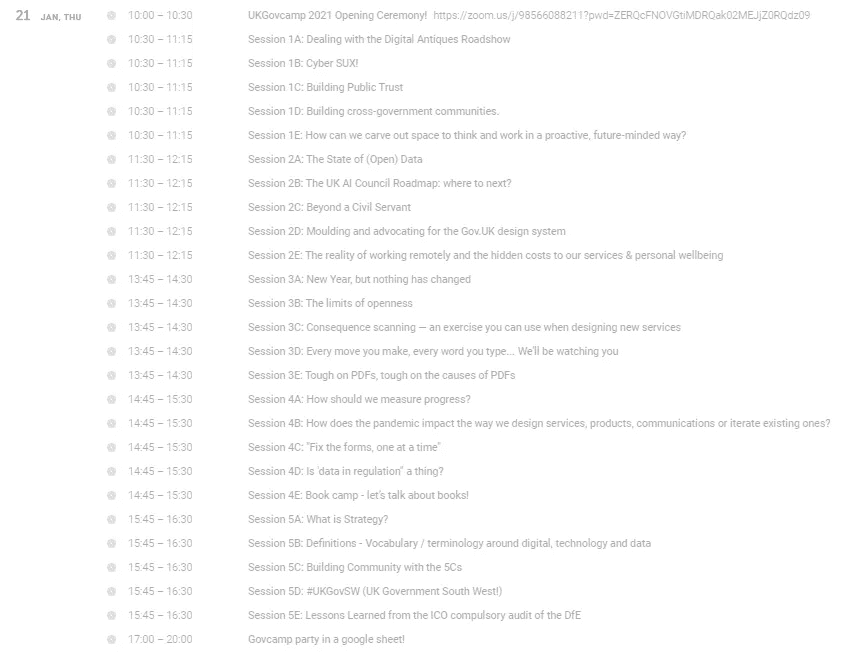

# UKGovCamp 2021:我的第一次公共部门会议！

> 原文：<https://medium.com/version-1/ukgovcamp-2021-my-first-public-sector-unconference-3ce7869c82d7?source=collection_archive---------6----------------------->

我最近有机会去参加为期 3 天的# UKGovCamp 2021 un conference(1 月 21 日至 1 月 23 日)，我真的很想去，因为我以前从未参加过 **unconference** (查看维基百科的定义[这里](https://en.wikipedia.org/wiki/Unconference) ) —本质上，这是一个人们可以与同行进行双向对话的会议，没有赞助演示或强行推销，有大量关于公共部门重要主题的会议，无论是关于流程、新立法、技术、安全，还是更多。

#UKGovCamp 2021

通常情况下，会议是面对面的活动，但在疫情，这是组织者第一次将它变成虚拟活动，我必须说，我对虚拟会议的组织效果印象深刻，并从中获得了很多知识，我将对此进行详细阐述。

在活动期间，我从超过 75 个会议中进行了选择，这些会议分布在为期三天的活动中，涵盖了各种主题讨论(参见下面第一天日程安排列表的摘录)。

会议本身是通过 Zoom 电话进行的，但为了缓解 [Zoom 疲劳](https://www.psychiatrictimes.com/view/psychological-exploration-zoom-fatigue)，一些会议引入了一些有趣的协作工具，如 [Miro](http://miro.com) ，这是一个内置白板和虚拟便利贴的协作平台，以及 [Remo](https://remo.co/) ，它使与会者能够在虚拟分组讨论区闲逛，使我们能够轻松地与其他与会者虚拟聊天，这有点混淆了。

回想起来，在会议期间，我觉得自己是在不同级别的政府、NHS 和地方议会工作的不同人群中的一员，他们希望通过质疑自己的工作来改进工作，并询问他们的同事“有更好的方法吗？”

Photo by [Eva Dang](https://unsplash.com/@evantdang?utm_source=medium&utm_medium=referral) on [Unsplash](https://unsplash.com?utm_source=medium&utm_medium=referral)

正是这种使会议中的每个人都参与进来以更好地理解和解决挑战的能力体现了无会议的思想。

作为一名技术人员，我从我参加的一些会议中挑选了一些至今仍萦绕在我脑海中的重要知识和想法:

*   似乎有一种共识，即由于监管限制，地方议会过度构建新的 IT 系统并与其他议会共享这些系统——IT 公司可以做更多工作来帮助地方议会提供更有效的跨境共享服务吗？
*   帮助英国政府人工智能战略方向的政府人工智能路线图刚刚发布——IT 公司可以做些什么来帮助实现他们的战略？
*   当后代回顾过去时，国家档案馆将如何记录我们 2020/2021 年的数字高峰和低谷以及其间的一切——区块链能在这方面有所帮助吗？
*   有些人觉得管理疫情的计划本身就是一场灾难——技术如何帮助我们更好地计划管理下一场灾难？

以上每一个想法可能会在未来一段时间内折磨我的大脑，因为对它们的回答并不容易，但我会在 2022 年 UKGovCamp 之前开始讨论其中的一个！

最后，我想祝贺 UKGovCamp 的组织者举办了这样一场盛会:)

**关于作者**

*肯是版本 1 的系统集成顾问，目前在版本 1 的英国数字、数据&云实践部门工作。*