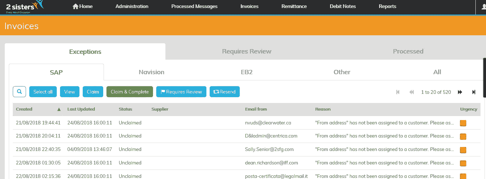

# 英国最大的家禽供应商利用 RPA 和低代码实现自动化

> 原文：<https://medium.com/mendix/uks-largest-poultry-supplier-automates-with-rpa-and-low-code-1bce2167922?source=collection_archive---------5----------------------->

# 一家公司的成功往往取决于其效率和生产率，即增值工作和非增值工作之间微妙的平衡。为了减少后者，英国最大的家禽供应商 2 姐妹食品集团(2SFG)的共享服务中心开始了自动化流程之旅。

这是一个不小的壮举:2SFG 是一个通过多次收购而成长起来的组织，拥有 23，000 名员工，分布在英国的 42 个地点。

如今，自动化之旅已经进行了两年，2SFG 认为自己走在了时代的前面，是数字化共享服务中心的思想领袖。这部分是由于 RPA 和[低代码开发](https://www.mendix.com/low-code-guide/)的结合。

## 认识到数字化和自动化的需求

2SFG 的共享服务中心为该组织 42 个地点中的近 80%进行财务交易处理。在开始他们的自动化之旅之前，这些流程中的大多数都是手动的、由纸张或 Excel 驱动的，需要大量的时间和资源来完成。如果他们想发展成为他们渴望成为的更关注数字的群体，他们需要将这些过程数字化和自动化。2SFG 的自动化项目经理 Jon Heeley 评估了他的部门监管的许多交易，发现需要改进的一个方面是他们如何将数据输入 ERP 系统。

为了解决这个问题，2SFG 实施了机器人流程自动化(RPA)平台。RPA 是使用软件机器人来处理大量可重复的任务。2SFG 实施了 RPA 软件来处理数据的键入，并开始减少非增值工作。

[https://www.mendix.com/pricing/basic-package/](https://www.mendix.com/pricing/basic-package/)

然而，这仅仅是解决方案的开始，因为 RPA 存在局限性。首先，您需要结构良好的数据和高质量的信息；否则，不值得投资。除了数据一致性，还有实施的成本和速度，所以如果做得不好，你会看到一个漫长而昂贵的时间表。

Heeley 和他的团队只关注了他们试图自动化的过程的中间部分。Heeley 明白，要充分实现 RPA 的价值，需要清理和结构化入站数据。应收账款部门的员工花了太多时间(每天 2.5 小时)将信息输入 Excel 表格，让机器人输入。

Heeley 联系了 AuraQ，这是一家专注于帮助客户优化商业实践的专业服务提供商。AuraQ 与 Mendix 合作，帮助他们的客户开发增强业务流程的应用程序。AuraQ 使用 Mendix 平台，帮助 Heeley 和他的团队构建了一个解决方案，为软件机器人结构化入站数据。这个方案就是 [TrajeQt](https://trajeqt.com/) 。

Mendix 充当应用层(业务流程和用户界面),并通过 API 与遗留系统一起清理和结构化数据。

虽然 AuraQ 设计并开发了 [TrajeQt](https://trajeqt.com/) 应用程序，但他们收到了来自共享服务组成员的意见，他们也在发布前测试了开发。该应用程序在不到四周的时间内开发完成，其价值立即显现出来。

## 价值随着自动化而飙升

该应用的成功发布使共享服务中心能够继续使用 RPA 和 low-code 来自动化其他应付账款和应收账款交易流程。通过使用 RPA 和低代码，Heeley 和他的团队已经自动化了 11 个事务流程。在六周内，他们已经从 100%人工操作提高到 97%自动化。自动化产生了积极的结果，包括节约成本、提高效率和改善流程质量。2SFG 估计每年可节省 250，000 英镑。其中三个过程依赖于他们用 Mendix 平台构建的数据结构化应用程序提取、解析和清理数据以提供给机器人。

在一个这样的例子中，Heeley 和他的团队使用 Mendix 创建客户汇款通知模板。这些模板由客户填写，然后提交给 2SFG。每个客户都有一个独特的模板来满足他们不同的需求。然后，客户在模板中提供的数据点将被提供给 RPA 机器人。在三个月的时间里，2SFG digital 团队使用 Mendix 的平台构建了 300 个发票模板。迄今为止，共享服务中心已经创建了 3100 个模板。

在改变之前，65%的发票由于验证过程而变慢，在该过程中，员工必须验证数据的准确性，以便将其输入 ERP 系统。有了这些新的自动化流程，Heeley 和 digital 团队能够将停下来进行验证的发票数量降至 8%。

虽然家禽仍然是 2 Sisters Food Group 的主要产品，但共享服务中心现在准备提供另一种商品:数据。自动化不仅加快了他们的发票流程，还改变了 2SFG 共享服务员工的工作方式。

虽然起初不愿意自动化取代他们的工作，但 2SFG 的员工已经接受了 2 Sisters 经历的转型，现在在数字化转型计划中做了更多有影响力的工作。随着花费在数据捕获、结构化和键入上的时间被释放出来，他们现在可以将更多时间用于分析成本和支出。这是真正的增值工作。

要了解有关该应用的更多信息，请下载我们的[案例研究](https://www.auraq.com/work/2-sisters-food-group)。要了解更多关于机器人前解决方案 TrajeQt 的信息，请联系 enquiries@auraq.com。

*来自发布者-*

*如果你喜欢这篇文章，你可以在我们的* [*媒体页面*](https://medium.com/mendix) *或我们自己的* [*社区博客网站*](https://developers.mendix.com/community-blog/) *找到更多类似的文章。*

*希望入门的创客，可以注册一个* [*免费账号*](https://signup.mendix.com/link/signup/?source=direct) *，通过我们的* [*学苑*](https://academy.mendix.com/link/home) *即时获取学习。*

有兴趣更多地参与我们的社区吗？你可以加入我们的 [*Slack 社区频道*](https://join.slack.com/t/mendixcommunity/shared_invite/zt-hwhwkcxu-~59ywyjqHlUHXmrw5heqpQ) *或者想更多参与的人，看看加入我们的* [*遇见 ups*](https://developers.mendix.com/meetups/#meetupsNearYou) *。*