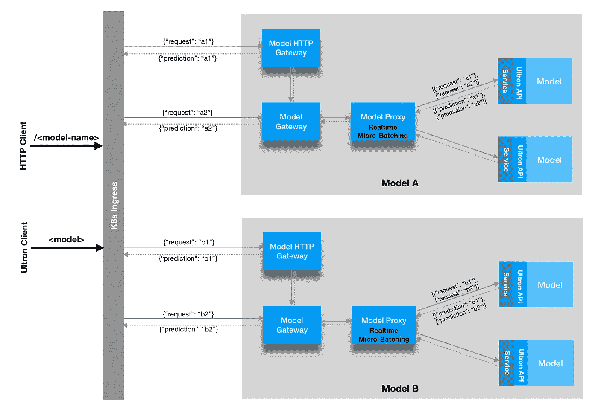

# 奥创:ML 推理平台@沃尔玛实验室

> 原文：<https://medium.com/walmartglobaltech/ultron-ml-inferencing-platform-walmart-labs-7e01c5be9da2?source=collection_archive---------1----------------------->

*作者* [*拉维查图维迪*](https://medium.com/u/80374e5fed84?source=post_page-----7e01c5be9da2--------------------------------) *&* [*克利须那*](https://medium.com/u/43161a4794b3?source=post_page-----7e01c5be9da2--------------------------------)*—2020 年 1 月。*

# **简介**

沃尔玛电子商务在很大程度上依赖机器学习来支持业务的各个方面，从目录管理和商品属性的自动化到通过个性化和搜索发现商品来增强最终用户体验。沃尔玛数据科学家每周在各业务部门建立和部署数百个 ML 模型，并接受目录、卖家和用户数据方面的培训。这些模型是使用 Scikit、Pytorch 和 TensorFlow 等框架构建的，并包含自定义依赖项。

在生产环境中，ML 模型必须以实时和批处理模式提供预测，并根据业务环境采用不同的 SLA。因此，有必要设计并实现一个 ML 推理平台，它可以让数据科学家轻松地定制部署他们训练过的 ML 模型并创建服务端点。此外，部署的定制必须包括计算目标和其他设置的规范，以实现其使用情形所需的 SLA。

# **平台要求**

从工程角度来看，推理平台需要满足以下功能/非功能标准，以支持沃尔玛实验室用例的多样性:

*   *简单:*轻松搭载新模型并将其部署到生产中，同时支持各种 ML 模型配置，包括使用 Scikit、Pytorch 和 Tensorflow 以及任何其他未来框架构建的模型。
*   *可扩展性:*扩展单个模型的实例，并支持越来越多的新模型部署。
*   *可用性:*可在 HA 配置中部署，以容错方式支持实时流量。
*   *预测延迟:*在可预测的响应时间内提供模型预测。
*   *资源优化:*为实时/批处理/流用例运行优化的模型执行。

# 探测

我们探索了现有的开源/云平台，以了解它们是否能够满足我们的需求。

我们从 Tensorflow-serving 开始，它可以加载通过 Tensorflow 训练的模型二进制文件，并在规模上提供服务。然而，这将限制数据科学家使用 TF 来训练和部署模型。

虽然 Google Cloud、Azure 和 AWS Sagemaker 提供了推理解决方案，但它们没有提供足够的定制能力来处理不同的 SLA 和部署场景。

因此，我们想出了内部推理平台*奥创*，沃尔玛内部的许多团队现在都用它来托管他们的模型。奥创推理平台整合了集群容器化和容器编排的最佳实践，并通过后端优化来减少延迟和提高吞吐量。

# **平台设计**

机器学习模型可以被认为是**无状态计算密集型幂等工作负载**，它基于一组学习到的参数接受输入并输出响应。

这种抽象表示允许我们通过适当的重试来构建弹性基础设施，因为它不会通过在先前的后端不可用的情况下将请求分派到不同的后端来影响结果。

所有现有的 ML 服务运行时都要处理一个有趣的权衡，因为它们要么支持**实时**预测的模型实现，要么支持**批处理**预测的模型实现，这需要数据科学家为每个用例编写两个不同的实现。因此，我们希望通过单个实施支持实时和批量预测用例，这将大大简化新模型的实施工作，并可以统一两种用例的基础架构。

为了解决统一性的挑战，我们的想法是让模型适配器实现一个单一的方法 API，它具有以下概要和特征:

> def predict_all(self，inputs: List[str]) -> List[str]

要装载的模型需要实现用于预测的单个方法适配器，获取输入字符串列表并返回输出字符串列表，通过模型适配器实现提供对输入/输出格式的完全控制。输入中的每一项都是对该模型序列化为字符串的请求，类似地，输出中的每一项都是序列化为字符串的预测响应。输出列表预测的顺序应该与输入列表一致。因为模型输入/输出只需要可序列化为一个字符串，允许基础设施完全不知道单独的模型输入/输出格式。

由于我们为模型提供了一组输入字符串，这为模型适配器实现提供了一个优化执行的机会，即通过单个线性代数计算在单个调用中计算所有输入的预测，与循环所有输入进行预测的方法相比，这将确保优化执行。

这种抽象还提供了适当的灵活性，通过适当调整实时微批处理，将延迟/吞吐量优化的选择委托给基础架构级别，实时微批处理整理一堆并发到达的同步实时请求，并将其分派到单个后端。提供以下选项来配置行为:
*微批量*，限制发送到后端的整理请求的最大数量。
*最大等待时间*，在将当前整理的请求分派到后端之前，新请求的最大等待时间。

可调实时微批处理可以显著提高有效处理速率，尤其是在计算目标是 GPU 的情况下。这反过来可以减少平均延迟，并允许更快地处理工作负载。默认情况下，我们将微批处理大小保持为 4，等待时间保持为 20 毫秒，提供了准实时行为。但是，它可以调整为更大/更小的批处理大小/等待时间，以支持不同的吞吐量/延迟特征。

如果模型适配器已经通过对一组输入进行单一计算实现了优化预测，那么我们将自动获得优化执行的好处。因此，在实践中，实时微批处理能够通过用较少数量的模型实例减少排队延迟来减少平均请求延迟。如果有效载荷的到达是突发性和随机的，这种减少会变得更加明显。

这种抽象的一个有趣的角度是，模型实现现在可以在其实现中编写相当复杂的预处理和后处理步骤。例如，当图像缓存基础设施在数据中心内就位时，输入标准化、输出格式化、在适配器上下载图像 URL 要快得多。

该基础设施可以提供基于 HTTP 和 GRPC 的一致接口，以统一访问部署在该基础设施上的任何模型。

因此，我们提出了基于 Kubernetes 构建的以下平台架构，使其完全可移植，可以在任何内部/云提供商上运行。

**Ultron: Inferencing Platform Architecture**

## **组件**

*   **奥创 API:** 支持各种模型实现和相关框架的核心接口，以支持任何具有相应依赖关系的模型适配器实现。
*   **模型服务:**加载并服务遵循奥创 API 的模型，该模型被包装在 docker 化的包装中，以提供具有依赖性的不可变运行时，在 docker 映像构建阶段安装。它在单线程上为请求提供服务，因此多个请求不会相互碰撞计算资源，从而为模型请求提供确定的计算时间。此外，我们还确保为用于限制线程数量的库设置了正确的环境变量/配置，因为默认情况下，这些计算库使用系统中所有可用的内核。
*   **模型代理:**将传入请求代理到后端模型实例，支持 ***实时微批处理*** 通过调整微批处理大小/等待时间，在基础架构级别卸载吞吐量/延迟优化，这有助于支持具有所需 SLA 的实时和批处理预测。
*   **模型网关:**使用集群内重试将传入的 GRPC 请求代理到后端模型代理实例(提供集群内容错/弹性)。使用确定性算法来选择下游模型代理实例，以便在适当的位置进行有效的实时微批处理，因为我们可以整理更多的请求。它提供 GRPC 接口，通过 GRPC 路由的 K8s 入口上的上游注册与模型进行交互。
*   **模型 HTTP 网关:**将传入的 HTTP 请求代理到后端模型网关。它提供了 HTTP 接口，通过在 K8s 入口上注册 HTTP 路由来与模型进行交互。可选部署，仅当我们需要对模型进行 HTTP 访问时才需要。
*   **K8s 入口:**为 HTTP 提供基于**路径**的路由，为 GRPC 请求提供基于**主机**的路由，并确保**单个** **端口**访问所有已部署模型的整个集群。路由层将 HTTP/GRPC 流量路由到适当的模型目的地。
*   **奥创客户端:** Java 库，用于客户端通过单一持久 TCP 连接实时访问平台上的所有模型，动态执行透明复用/解复用，同时保持同步/异步使用的简单模型预测接口。

# **平台行为**

***简单性***
由模型适配器实现的单一方法 API，该适配器可以自由选择其相应的依赖项，因为在构建阶段，所有东西都被烘焙到不可变的 docker 映像中。此外，还有一种通过 HTTP 端点或平台提供的 Java 客户端访问模型的简化方法。我们能够在一个季度内搭载 60 种不同的型号，从而展示了设计的内在简单性。

***可扩展性***
基础设施支持两种方式的扩展。

*   扩展单个模型的 pod 数量，它在上游模型代理层作为负载平衡池实时更新。在 P95 延迟为 50 毫秒的情况下，仅使用 16 个模型实例，每个实例具有 2 个 CPU 和 2 GB 内存，能够实现每秒 1000 多个请求的深度学习模型。它还在 90 多个模型实例上运行一些模型来支持工作负载。
*   扩展以部署新模型，这将在 Kubernetes 内创建新的基础架构/模型单元，在 K8s 入口只有一个路由条目用于该模型实例。

目前，我们有一个 Kubernetes 集群托管具有以下规格的体系结构，支持我们期望的规模，并具有固有的设计来支持每个季度部署大量新型号:

型号:~ 60
K8s pod:~ 600+
内核:~1000+
内存:~2TB+

***可用性***
如果部署在 HA 配置中，每个组件至少有两个实例，则没有一个组件会出现单点故障。基础设施将自动开始利用额外部署的组件，因为每个组件都会监视可用的下游实例。由于上游层会进行必要的重试以将请求分派给健康的实例，因此基础架构可确保在组件出现故障的情况下成功预测请求。

***预测延迟***
由于我们在整个基础设施中维护持久连接，因此我们能够实现作为模型响应时间+恒定开销的函数的可预测延迟。通过将请求分派到已经建立的到相应下游的连接，我们确保唯一的开销是 TCP 上的数据传输，考虑到数据中心内每跳 4 毫秒的延迟，这在实践中是相当快的。

***资源优化***
实时微批处理就绪后，我们可以通过在基础架构级别选择相应的批处理大小/等待时间参数来调整延迟/吞吐量特征。这可以针对实时/批处理/准实时模式进行调整，以支持不同的用例。

# **平台用途**

目录数据科学团队和其他小组已经使用奥创推理平台在 2004 财年部署了 60 多个机器学习模型，以满足实时和批处理需求。部署的模型从使用 Scikit Learn 构建的 ML 模型到深度学习模型，如基于 BERT 的模型，这些模型是内存和计算密集型的。这些模型每天处理超过 2 亿件商品，丰富了沃尔玛的商品目录，推动了商品的发现和摆放。沃尔玛越来越多地采用该平台，因为它允许用户定制他们的部署配置，以满足他们的可扩展性和可用性需求。

# **结束语**

我们希望这篇博客提供了一个体面的概述，介绍了我们如何应对在沃尔玛实验室将人工智能投入生产的挑战，以及一些有助于克服这些挑战的设计/实施考虑因素。我们很幸运有一个伟大的工程师和数据科学家团队，作为目录数据科学团队的一部分，在这个有趣的项目上进行合作。

特别感谢@ [Karthik Deivasigamani](/@karthik.d) 鼓励我写这篇博客。