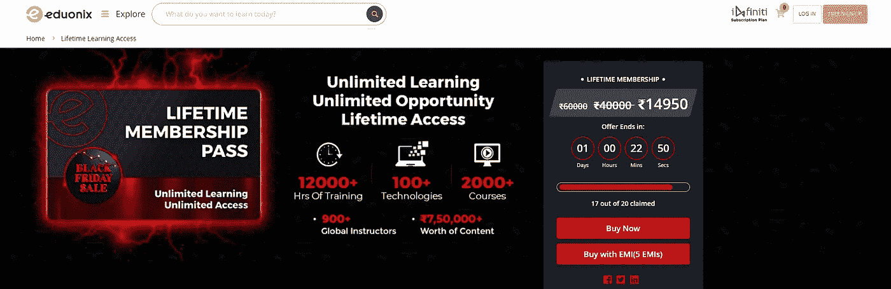

# 黑色星期五促销期间开发课程的惊人折扣

> 原文：<https://medium.com/quick-code/unbelievable-discounts-on-development-courses-during-the-black-friday-sale-930b8a117147?source=collection_archive---------7----------------------->

问候学习者！黑色星期五销售开始了，顶级平台正在为他们最好的课程提供巨大的折扣。在我之前的文章中，我为开发者 **s** 分享了[**10 个最佳 Udemy 课程，来投资这个黑色星期五销售。如果你还没看完，我建议你在销售结束前看看那篇文章。现在，让我们转到其他供应商，他们也在这个黑色星期五销售中提供折扣。我把所有的信息都收集在一个地方，让你们可以轻松地利用这次销售。**](/quick-code/udemy-black-friday-sale-10-must-invest-courses-58095d031906)

## [Udemy](https://www.udemy.com/)

Udemy 是全球最受欢迎的在线学习目的地。这个网站是学习和分享知识的好地方。在全球范围内，Udemy 已经成为最大的电子学习社区之一。迄今为止，已有超过 3 亿名学生使用过它，它以 65 种语言提供了超过 213，000 门课程。

以下是一些你绝对应该投资的热门 Udemy 课程:

*   [**100 天代码:2023 年完整 Python Pro boot camp**](https://click.linksynergy.com/deeplink?id=0F1O0otUXQc&mid=47901&u1=csMedium&murl=https%3A%2F%2Fwww.udemy.com%2Fcourse%2F100-days-of-code%2F%23instructor-1)
*   [**终极 AWS 认证解决方案架构师助理 SAA-C03**](https://click.linksynergy.com/deeplink?id=0F1O0otUXQc&mid=47901&u1=csMedium&murl=https%3A%2F%2Fwww.udemy.com%2Fcourse%2Faws-certified-solutions-architect-associate-saa-c03%2F)
*   [**完整的 2023 年网络开发训练营**](https://click.linksynergy.com/deeplink?id=0F1O0otUXQc&mid=47901&u1=csMedium&murl=https%3A%2F%2Fwww.udemy.com%2Fcourse%2Fthe-complete-web-development-bootcamp%2F)
*   [**完整的 JavaScript 课程 2023:从零到专家**](https://click.linksynergy.com/deeplink?id=0F1O0otUXQc&mid=47901&u1=csMedium&murl=https%3A%2F%2Fwww.udemy.com%2Fcourse%2Fthe-complete-javascript-course%2F)
*   [**React —完整指南(包括钩子、React 路由器、Redux)**](https://click.linksynergy.com/deeplink?id=0F1O0otUXQc&mid=47901&u1=csMedium&murl=https%3A%2F%2Fwww.udemy.com%2Fcourse%2Freact-the-complete-guide-incl-redux%2F)
*   [**Go:完全开发者指南(Golang)**](https://click.linksynergy.com/deeplink?id=0F1O0otUXQc&mid=47901&u1=csMedium&murl=https%3A%2F%2Fwww.udemy.com%2Fcourse%2Fgo-the-complete-developers-guide%2F)

你可以查看我上面提供的最好的 Udemy 课程，了解更多关于这些课程的信息。

## Coursera

Coursera 这个月有一个很棒的推广活动！从 11 月 21 日到 28 日，Coursera Plus 每年有 100 美元的折扣。以下是更多细节:

*   Coursera Plus 年费优惠 100 美元
*   日期:2022 年 11 月 21 日至 28 日
*   Coursera Plus 的用户将能够利用这一优惠。
*   促销网址是获得这一限时优惠的唯一途径。

这里是 [Coursera Plus 年度](https://www.coursera.org/courseraplus/special/coursera-annual-cyber-2022)的链接。使用 Coursera Plus，您可以访问我们的大部分目录，包括 Google 和 Meta Professional Certificates。作为向学习者提供的一些很好的 Coursera Plus 课程选择，这里有一些受欢迎的初级证书，为学习者从事热门职业做准备:

*   [谷歌数据分析专业证书](https://coursera.pxf.io/c/1137078/1213622/14726?u=https%3A%2F%2Fwww.coursera.org%2Fprofessional-certificates%2Fgoogle-data-analytics&subId1=csMedium)
*   [谷歌 UX 设计专业证书](https://coursera.pxf.io/c/1137078/1213622/14726?u=https%3A%2F%2Fwww.coursera.org%2Fprofessional-certificates%2Fgoogle-ux-design&subId1=csMedium)
*   [谷歌 IT 支持专业证书](https://coursera.pxf.io/c/1137078/1213622/14726?u=https%3A%2F%2Fwww.coursera.org%2Fprofessional-certificates%2Fgoogle-it-support&subId1=csMedium)
*   [谷歌项目管理:专业证书](https://coursera.pxf.io/c/1137078/1213622/14726?u=https%3A%2F%2Fwww.coursera.org%2Fprofessional-certificates%2Fgoogle-project-management&subId1=csMedium)
*   [谷歌数字营销&电子商务专业证书](https://coursera.pxf.io/c/1137078/1213622/14726?u=https%3A%2F%2Fwww.coursera.org%2Fprofessional-certificates%2Fgoogle-digital-marketing-ecommerce&subId1=csMedium)
*   [元前端开发者职业证书](https://coursera.pxf.io/c/1137078/1213622/14726?u=https%3A%2F%2Fwww.coursera.org%2Fprofessional-certificates%2Fmeta-front-end-developer%3F&subId1=csMedium)
*   [Meta 后端开发者专业证书](https://coursera.pxf.io/c/1137078/1213622/14726?u=https%3A%2F%2Fwww.coursera.org%2Fprofessional-certificates%2Fmeta-back-end-developer%3F&subId1=csMedium)
*   [元数据库工程师职业证书](https://coursera.pxf.io/c/1137078/1213622/14726?u=https%3A%2F%2Fwww.coursera.org%2Fprofessional-certificates%2Fmeta-database-engineer%3F&subId1=csMedium)
*   [Meta Android 开发者专业证书](https://coursera.pxf.io/c/1137078/1213622/14726?u=https%3A%2F%2Fwww.coursera.org%2Fprofessional-certificates%2Fmeta-android-developer%3F&subId1=csMedium)
*   [Meta iOS 开发者专业证书](https://coursera.pxf.io/c/1137078/1213622/14726?u=https%3A%2F%2Fwww.coursera.org%2Fprofessional-certificates%2Fmeta-ios-developer%3F&subId1=csMedium)
*   [元社交媒体营销专业证书](https://coursera.pxf.io/c/1137078/1213622/14726?u=https%3A%2F%2Fwww.coursera.org%2Fprofessional-certificates%2Ffacebook-social-media-marketing&subId1=csMedium)
*   [元营销分析专业证书](https://coursera.pxf.io/c/1137078/1213622/14726?u=https%3A%2F%2Fwww.coursera.org%2Fprofessional-certificates%2Ffacebook-marketing-analytics%3F&subId1=csMedium)

Coursera Plus

## [教育性](https://www.educative.io/)

Educative，160 万开发者信赖的学习平台，帮你学习需求中的技能。它目前提供 10%的年终折扣，一年只有一次。有了这个折扣，你可以在每年每月 **₹1200** 的 [**教育高级会员**](https://www.educative.io/unlimited) 计划中获得 10%的折扣。(原价 **₹1944**

Educative Premium Membership

**你会从这个计划中得到什么:**

*   90 个实践项目
*   个性化路径
*   12 个月的访问
*   竣工证书
*   每周都有新课程
*   尽早接触新课程

此外，你也可以选择两年会员计划。你会得到 20%的折扣，每月花费 30 ₹866 31(原价 32 ₹1602 33)。这似乎是省钱的更好选择，但要听从你的直觉。

**你会从这个计划中得到什么:**

*   90 个实践项目
*   个性化路径
*   24 个月的访问
*   竣工证书
*   每周都有新课程
*   尽早接触新课程

这里有一些针对开发者的教育课程:

*   [**AWS 的好零件:划破杂乱**](https://www.educative.io/courses/good-parts-of-aws?affiliate_id=5088579051061248)
*   [**工程师&经理**](https://www.educative.io/courses/grokking-modern-system-design-interview-for-engineers-managers?affiliate_id=5088579051061248) 现代系统设计访谈
*   [**成为一名有效的软件工程经理**](https://www.educative.io/courses/become-an-effective-engineering-manager?affiliate_id=5088579051061248)
*   [**《c++一体化指南》20**](https://www.educative.io/courses/all-in-one-guide-cpp-20?affiliate_id=5088579051061248)
*   [**学习打字稿:初学者完全教程**](https://www.educative.io/courses/learn-typescript-complete-course?affiliate_id=5088579051061248)

## [Eduonix](https://www.eduonix.com/)

Eduonix Black Friday Sale

首先，我们有 Eduonix。Eduonix 是全球首屈一指的培训和技能发展组织，其成立宗旨是为每个人带来世界一流的培训内容、教学方法和最佳实践。该网站提供易于理解的在线研讨会和课程。对于那些不上四年大学而想学习新技能的人来说，这是完美的。因此，这里有一些你可以在 Eduonix 上投资的顶级课程:

*   [**SASS —完整的 SASS 教程(CSS 预处理器)**](https://www.eduonix.com/sass-the-complete-sass-course-css-preprocessor/UHJvZHVjdC0zMjMyMDA=)
*   [**NodeJs 从零开始**](https://www.eduonix.com/nodejs-from-ground-up-for-beginners/UHJvZHVjdC0zMjMyMDA=)
*   [**云计算和 AWS 初学者指南**](https://www.eduonix.com/cloud-computing-and-aws-for-beginners-guidebook/UHJvZHVjdC0zMjMyMDA=)
*   [**Python +数据科学:实用指南**](https://www.eduonix.com/python-data-science-practical-guide/UHJvZHVjdC0zMjMyMDA=)
*   [**机器学习与 TensorFlow 实用指南**](https://www.eduonix.com/machine-learning-with-tensorflow-the-practical-guide/UHJvZHVjdC0zMjMyMDA=)
*   [**实用深度学习用 Keras 和 Python**](https://www.eduonix.com/practical-deep-learning-with-keras-and-python/UHJvZHVjdC0zMjMyMDA=)
*   [**Java 设计模式—完整的大师级**](https://www.eduonix.com/java-design-patterns-the-complete-masterclass/UHJvZHVjdC0zMjMyMDA=)

不仅如此，Edonix 还在这次销售中以巨大的折扣提供其终身会员资格。Eduonix 的终身访问计划提供对所有课程、电子学位、路径和捆绑交易的无限制访问。在众多好处中，您将获得 2000 多门针对现实世界技能发展的综合课程，终身访问电子学位、课程、交易和途径，12000 多个小时的技能提升内容，100 多种工具和技术，等等。

你可以在₹14,950 获得 [**Eduonix 终身会员**](https://www.eduonix.com/lifetime-learning-access?coupon_code=EBFLIFEINBF)(182.76 美元)。原价是₹40,000(489 美元)。20 个中有 17 个声称这笔交易。如果你对这笔交易感兴趣，我建议你赶快行动。

Eduonix Lifetime Membership

课程包括:

*   **网页开发** — 400 多门课程
*   **人工智能和机器学习** — 150 多门课程
*   **道德黑客和网络安全** — 65 门以上课程
*   **云计算和 DevOps** — 110 多门课程
*   **数字营销** — 60 多门课程
*   **游戏开发** — 75 门以上课程
*   **个人发展** — 190 多门课程
*   **编程语言** — 100 多门课程
*   **设计** — 150+课程
*   **生活方式、爱好& DIY** — 70+课程
*   **移动开发、商务、办公效率、学术&其他** — 500 多门课程

## [复数视线](https://www.pluralsight.com/)

Pluralsight Black Friday Sale

Pluralsight 是一家教育公司，为软件开发人员、IT 管理员和创意专业人员提供在线视频课程。它消除了阻碍你实现目标的挑战和障碍，无论你的目标是学习 Python 来推进你的职业生涯还是加速入职。

以下是一些面向开发者的趋势性 Pluralsight 课程:

*   [**Kubernetes for Developers:核心概念**](https://pluralsight.pxf.io/c/1137078/424552/7490?u=https%3A%2F%2Fwww.pluralsight.com%2Fcourses%2Fkubernetes-developers-core-concepts&subId1=csMedium)
*   [**Linux:管理网络服务(LPIC-2)**](https://pluralsight.pxf.io/c/1137078/424552/7490?u=https%3A%2F%2Fwww.pluralsight.com%2Fcourses%2Flinux-managing-web-services-lpic-2&subId1=csMedium)
*   [**设计和实现 AWS 网络**](https://pluralsight.pxf.io/c/1137078/424552/7490?u=https%3A%2F%2Fwww.pluralsight.com%2Fcourses%2Fdesigning-implementing-aws-networks&subId1=csMedium)
*   [**码头工人深潜**](https://pluralsight.pxf.io/c/1137078/424552/7490?u=https%3A%2F%2Fwww.pluralsight.com%2Fcourses%2Fdocker-deep-dive-update&subId1=csMedium)
*   [**烧瓶:入门**](https://pluralsight.pxf.io/c/1137078/424552/7490?u=https%3A%2F%2Fwww.pluralsight.com%2Fcourses%2Fflask-getting-started&subId1=csMedium)

在这个黑色星期五的促销活动中， **Pluralsight 会员资格**可享受高达 **50%** 的优惠。会员有两种级别:**标准**和**高级**。在标准会员中，你可以访问每年在 **₹6,128** 进行的课程库、路径和技能评估。(原价 **₹12,299** )

Pluralsight Membership

您将在**标准**版本中获得什么:

*   核心课程库
*   学习路径
*   频道
*   课程讨论
*   练习文件
*   移动和电视应用
*   离线查看
*   会议
*   指导
*   徽章
*   技能智商
*   角色智商
*   课程学习检查

选择**高级会员**的会员可以访问整个课程、考试、项目和实践活动库。高级会员每年从 **₹9,179** 开始。(原价 **₹18,399** )

Pluralsight Membership Features

您将在**高级**版中获得什么:

*   扩展课程库
*   学习路径
*   频道
*   课程讨论
*   练习文件
*   移动和电视应用
*   离线查看
*   会议
*   指导
*   徽章
*   技能智商
*   角色智商
*   课程学习检查
*   认证实践考试
*   互动课程
*   项目

感谢阅读这篇文章！请在下面评论你对这篇文章的看法。快乐学习！