# 使用 MVPs Maarten & Willem 拆开数据中心的包装

> 原文：<https://medium.com/mendix/unboxing-the-datahub-with-mvps-maarten-willem-9428b1381513?source=collection_archive---------0----------------------->

一如既往，Mendix 旨在解决与软件开发相关的所有问题。如果你了解 Mendix 的最新技术和功能，就不可能错过他们在 Mendix World 2019 上已经宣布的最新消息:[数据中心](https://www.mendix.com/data-hub/)。

“对于开发者来说，集成仍然是混乱和耗时的，”Mendix 首席技术官 Johan den Haan 说。“查找、访问、连接和处理数据通常会占用应用程序开发时间的 30%到 40%，即使对于低代码开发人员也是如此。数据中心消除了这种摩擦。”

作为开发人员，我们注意到，在过去的几年里，我们正在与其他应用程序和服务建立更多的集成，而且这种增长似乎不会停止。数据满天飞，需要标准化和可管理。Mendix MVP 的 Maarten Bongers 和 Willem van Zantvoort 有机会近距离观察数据中心的现状。

# 什么是数据中枢？

Mendix 指出:“数据中心是世界上第一个低代码集成平台”。这意味着您可以设置一个数据中枢实例并维护它，而无需编写任何代码！

Data Hub 是 Mendix 平台的一部分，可以被视为一个在线场所，作为开发人员，您可以将您的数据提供给其他应用程序，并查看哪些数据可用。您还可以添加来自 Mendix 生态系统外部的集成，这是一个真正增加该产品优势的功能。它概述了哪些应用程序正在使用哪些集成。这极大地有利于你的景观的可治理性。本质上，数据中枢顾名思义；它是所有数据交汇融合的枢纽。

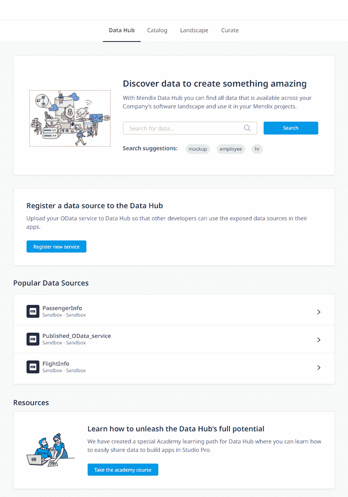

与其他集成平台的最大区别在于，除了代码低之外，Data Hub 还与 Mendix 工作室紧密集成。这意味着开发人员很容易构建与可用数据源之一的集成。特别是，因为这些将成为可用的“外部实体”，我们将讨论一点。

# 数据中枢是如何工作的？

1.  将实体公开为 OData

数据中心使用 [OData](https://www.odata.org/getting-started/understand-odata-in-6-steps/) 作为底层技术在应用程序之间传输数据。首先，您可以使用 OData 公开 Mendix Studio (Pro)中的实体，或者将外部 OData feed 加载到数据中心。

2.使用该中心搜索、维护和管理您的资产

数据中心位于 https://hub.mendixcloud.com/[。您可以搜索特定的数据，也可以转到目录以获得所有可用服务及其数据的完整概述。该目录用于搜索连接到数据中心的所有资产，并允许您维护和记录注册的资产。](https://hub.mendixcloud.com/)

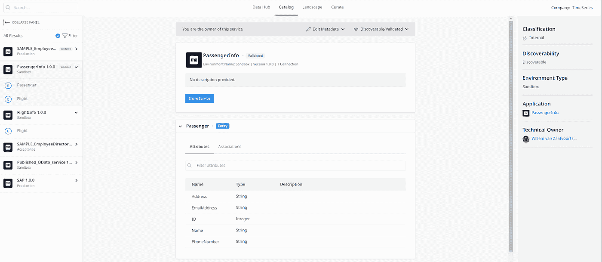

3.作为外部实体消费和使用

当数据在数据中心可用时，您可以在 Mendix Studio 或 Studio Pro 的项目中直接使用这些数据。数据作为外部实体变得可用，并且可以在常规检索活动中和页面上使用。

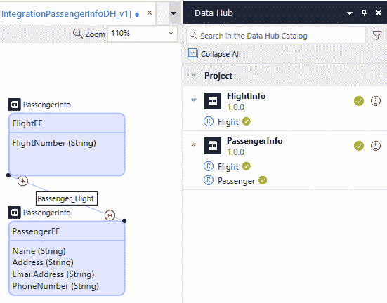

4.你的风景会自动更新以增加洞察力

横向视图允许您选择服务，并创建使用此特定服务的所有应用程序的良好概览。在我们的例子中，我们的场景非常空旷，但如果有更多的集成、应用和服务，你可以想象这种视图的好处。

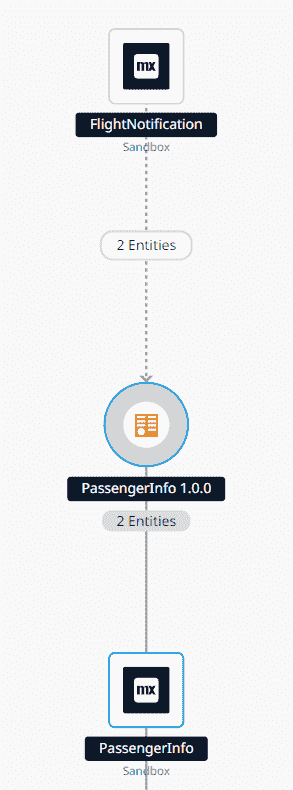

# 实践中的数据中心

为了能够解释 Data Hub 在实践中是如何工作的，我们需要获得一些实践经验。因此，我们提出了以下挑战:我们将构建三个应用程序，你可以将它们视为微服务。

*   乘客 app:包含乘客数据，
*   飞行数据 app:包含飞行数据，
*   航班通知应用程序:第三个应用程序会通过向用户发送通知，告诉他们航班状态已更新，将他们聚集在一起(并在黑暗中绑定他们)。

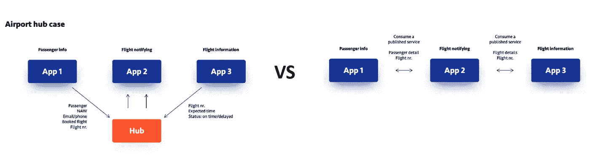

在拥有数据中心之前，我们将在乘客和航班数据应用程序中使用[发布的 REST](https://www.youtube.com/watch?v=Ff_P84NOcZk&t=674s) 服务，并在航班通知应用程序中使用它们。有了数据中心，发布的 REST 服务和消费的 GET 服务可以被数据中心取代。下面，我们讨论这两种方法，这样我们就可以指出主要的区别。

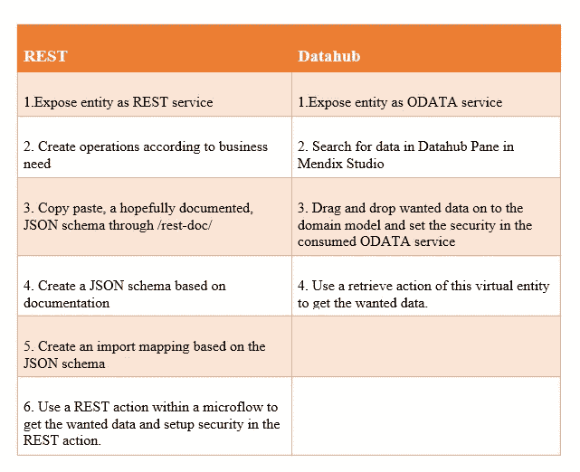

免责声明:由于当前形式的数据中心的局限性，我们需要在这种情况下使用轮询机制。最好使用推送机制来获得航班变化的实时通知。

**发布数据—标准方法**

发布一个 REST 服务看起来像这样:您定义一个资源，它可以有针对不同用例的多个操作，您向其他应用程序公开这些操作以使用数据。

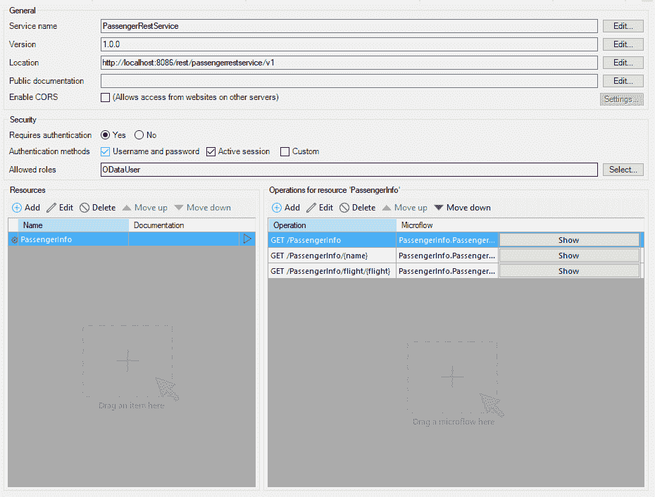

**发布数据—使用 Mendix 数据中心**

当使用 Data Hub 时，您并不发布 REST 服务，而是将您的数据公开为 OData 资源。这意味着您不必为每个用例构建单独的操作，因为您将在后面看到，我们可以在检索操作中编写 XPath 查询来实现类似的功能。

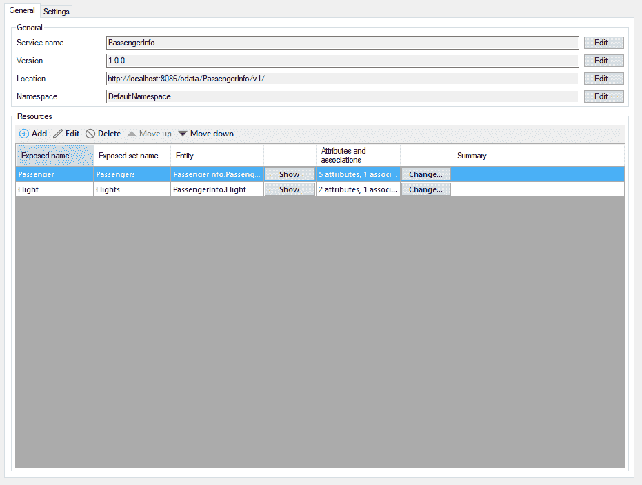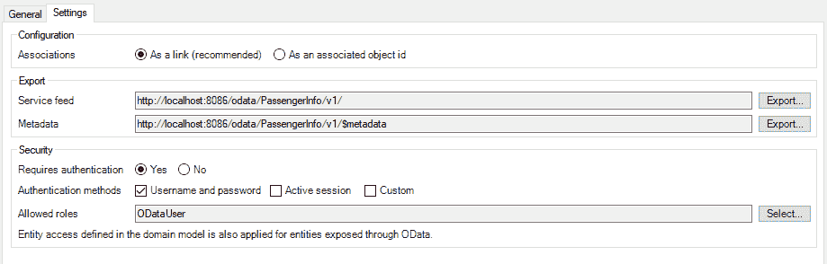

通过发布这个 OData 资源，它在数据中心自动变得可用。这两种方法中的设置几乎相同。

**消费数据**

使用 REST 消费数据需要您手动定义消息定义或 JSON 片段，并根据您需要的数据创建一个导入映射。这可能是一项耗时且容易出错的活动，尤其是在维护多应用环境时。然而，创建您自己的导入映射并围绕它构建功能是高度可定制的。

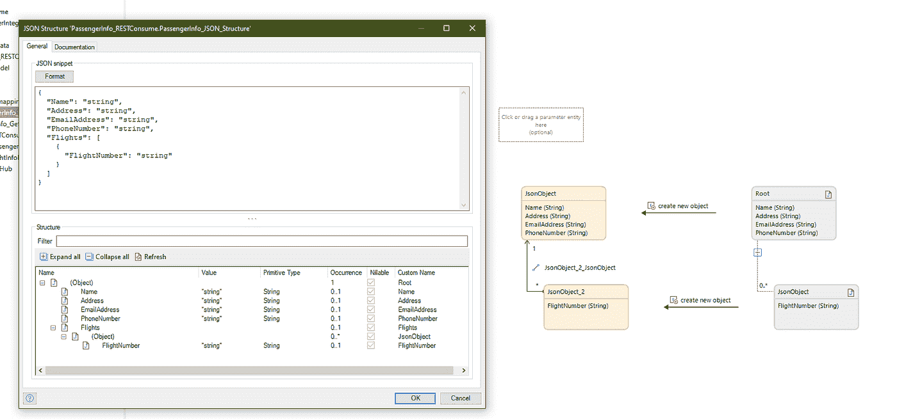

这就是实现之间的巨大差异。使用 Data Hub，您不必查找 JSON 代码片段(并希望它是正确的)，只需查看 Studio Pro 中 Data Hub 窗格中的可用服务，并将实体拖到域模型上。这些不是普通的实体，而是所谓的‘外部实体’。根据 Mendix 域模型，它们是另一端数据的精确表示。

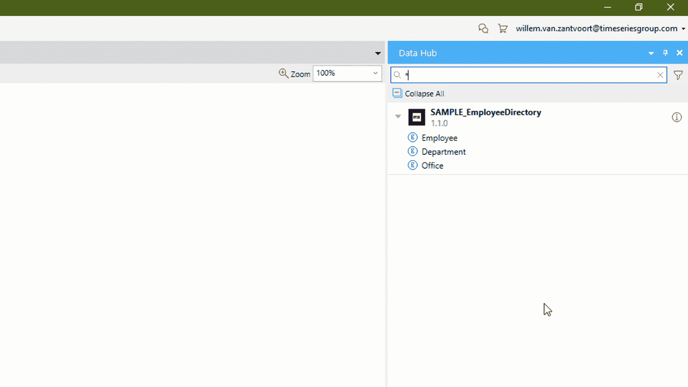

自动创建一个消费的 OData 服务，剩下要做的就是添加认证信息。

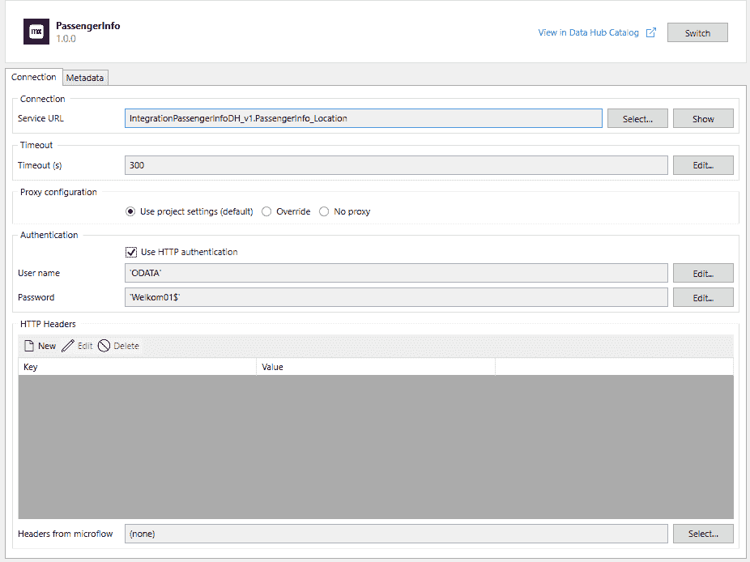

在一两分钟内，您可以使用新创建的外部实体定义一个检索活动，如下面示例中的“Flight”实体。当应用程序运行时，必要时将使用 Odata 协议检索数据。这对于开发人员来说非常容易做到，并且消除了您在正常 REST 中必须完成的所有消耗性服务步骤。但是要小心，不要忘记在检索中添加错误处理。本质上，它仍然是一个 API 调用，可能会出错！

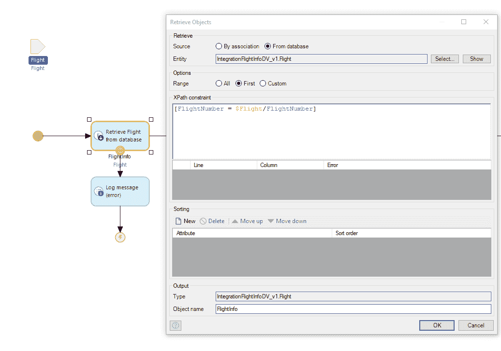

**结束语**

从我们构建的测试用例中可以看出，使用 Data Hub 使集成变得更加容易。对于不想迷失在技术集成细节中或花费大量时间搜索正确数据的普通开发人员来说更是如此。

目前，数据中心只提供“获取”功能。这意味着您可以发布数据，以便其他应用程序可以检索这些数据。当前的“获取”功能仅涵盖了您在更大的应用环境中需要的部分场景。我们缺少从您的应用程序向其他应用程序“发布”或“放置”数据的功能。

目前，推送和更新数据仍然需要使用 REST 动作或其他集成方式来完成。请注意:这些类型的集成在目录中是不可见的，因此会将您的文档放在多个地方。我们毫不怀疑这是 Mendix 数据中心的路线图。

*来自出版商-*

*如果你喜欢这篇文章，你可以在我们的* [*媒体页面*](https://medium.com/mendix) *或我们自己的* [*社区博客网站*](https://developers.mendix.com/community-blog/) *找到更多类似的文章。*

*对于希望入门的创客，您可以注册一个* [*免费账户*](https://developers.mendix.com/meetups/#meetupsNearYou) *，并通过我们的* [*学院*](https://academy.mendix.com/link/home) *获得即时学习。*

*有兴趣加入我们的社区吗？你可以加入我们的* [*slack 社区频道*](https://join.slack.com/t/mendixcommunity/shared_invite/zt-hwhwkcxu-~59ywyjqHlUHXmrw5heqpQ) *或者想更多参与的人，看看加入我们的* [*见面会*](https://developers.mendix.com/meetups/#meetupsNearYou) *。*