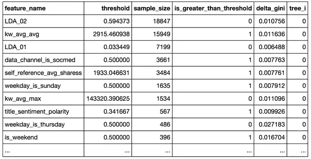
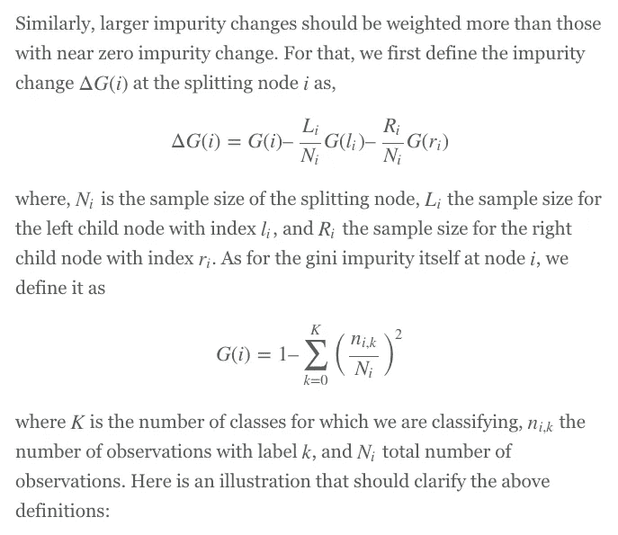
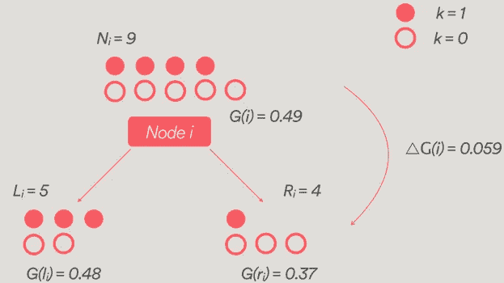
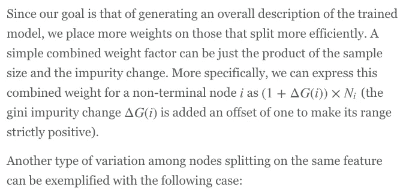
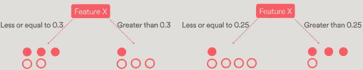
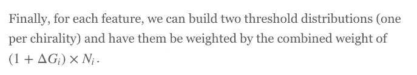
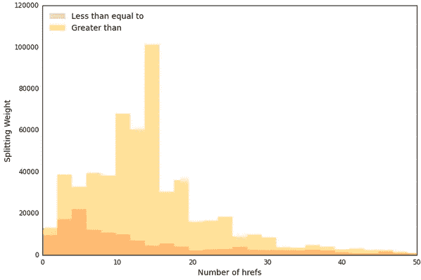
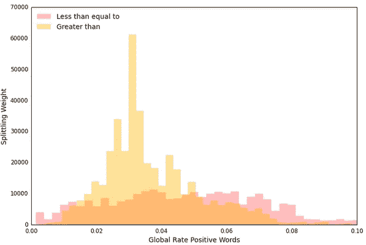
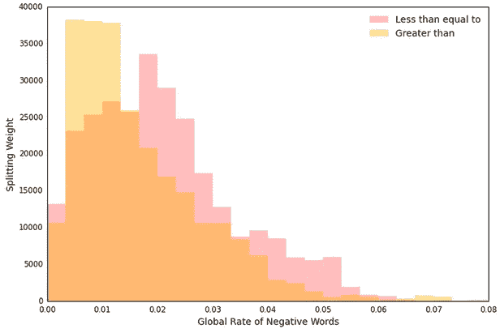

# 拆箱随机森林分类器:阈值分布

> 原文：<https://medium.com/airbnb-engineering/unboxing-the-random-forest-classifier-the-threshold-distributions-22ea2bb58ea6?source=collection_archive---------2----------------------->

作者:郑世豪

在 Airbnb 的信任和安全团队中，我们在许多风险缓解模型中使用随机森林分类器。尽管我们在这方面取得了成功，但是树的集合以及在每个节点上随机选择的特征使得简洁地描述特征是如何被分割的变得困难。在这篇文章中，我们提出了一种通过生成加权阈值分布来聚合和汇总这些分割值的方法。

## 动机

尽管随机森林分类器具有多功能性和开箱即用的性能，但它通常被称为黑盒模型。很容易理解为什么有些人会倾向于这样想。首先，每个节点处的最优决策分裂仅从特征集的随机子集中抽取。更令人费解的是，该模型使用训练集的引导样本生成了一个系综树。所有这些仅仅意味着一个特征可能在同一棵树的不同节点上分裂，并且可能具有不同的分裂值，并且这可能在多个树中重复。

尽管所有这些随机性都被抛到了脑后，但确定性依然存在。在训练了一个随机森林之后，我们确切地知道了森林的每一个细节。对于每个节点，我们知道用什么特征来分割，用什么阈值，用什么效率。所有的细节都在那里，挑战是知道如何将它们拼凑在一起，以建立一个准确和翔实的所谓黑匣子的描述。

根据特征描述训练的随机森林的一种常见方法是根据它们的分裂效率，按照它们的重要性对它们进行排序。尽管这种方法设法量化了每个特征的杂质减少的贡献，但是它没有阐明模型如何根据它们做出决定。在这篇文章中，我们提出了一种简洁地描述森林内部决策的方法，即逐节点挖掘整个森林，并给出每个特征的阈值的加权分布(通过分割效率和样本大小)。

## 方法学

为了说明这种方法，我们求助于来自 [UCI 机器学习库](http://archive.ics.uci.edu/ml/datasets/Online+News+Popularity)的公开可用的在线新闻流行度数据集。该数据集包含 39797 条对 [Mashable](http://mashable.com/) 文章的观察，每条文章有 58 个特征。该数据集的正标签被定义为特定文章的份额数是否大于或等于 1，400。这些特征都是数字的，范围从简单的统计，如内容中的字数，到更复杂的统计，如与特定 LDA 衍生主题的接近程度。

在训练随机森林之后，我们遍历整个森林，并从每个非终端(或非叶)节点提取以下信息:

1.  功能名称
2.  分割阈值-节点分割的值
3.  样本大小-训练时通过节点的观察数量
4.  大于阈值。—大多数正面观察的方向
5.  基尼系数变化——分割后杂质的减少
6.  树索引—树的标识符

可以收集到如下表格中:

像上面这样的公共表很可能在不同的树中多次包含相同的特性，甚至在同一个树中。在这一点上，收集特定特性的所有阈值并将它们堆积在一个直方图中可能很有诱惑力。然而，这是不公平的，因为从少数观察中找到最佳特征阈值元组的节点不应该具有与从数千个观察中找到的节点相同的权重。因此，对于分裂节点[latex]i[/latex]，我们将样本大小[latex]N_i[/latex]定义为在随机森林的训练阶段到达分裂节点 I 的观察值的数量。

其中实心圆是正标记的观察值，而空心圆是负标记的观察值。在本例中，尽管两个节点在同一要素上分割，但它们这样做的原因却大相径庭。在左边的分裂节点中，大部分正观察结果在小于或等于分支上结束，而在右边的分裂节点中，大部分正观察结果在大于分支上结束。换句话说，左分裂节点认为正标记的观察值更可能具有较小的特征 X 值，而右分裂节点认为正标记的观察值更可能具有较大的特征 X 值。这种差异使用 is_greater_than_threshold(或手性)标志来计算，其中 1 为真(或大于)，0 为假(或小于或等于)。

# 例子

在训练分类器模型之后，我们遍历整个森林并收集上一节中指定的所有信息。这些信息使我们能够描述哪些阈值控制了分割，比如 num_hrefs(文章中的链接数):

在上图中，我们看到有两种分布。橙色对应于手性大于的节点，红色对应于手性小于等于的节点。num_hrefs 的这些加权分布表明，每当使用特征 num_hrefs 来决定一篇文章是否是受欢迎的文章(+1，400 次分享)时，主要描述是**大于** ~15 个链接，这由 15 附近的大于分布的峰值箱来说明。这种方法的另一个有趣的说明是关于 global_rate_positive_words 和 global_rate_negative_words，它们分别被定义为文章内容中正面和负面单词的比例。前一种描述如下:

其中，就模型而言，流行文章倾向于由较大的 global_rate_positive_words 支配，其中截止值由 0.03 支配。然而，一个更有趣的分布是，对于 global_rate_negative_words:

其中分布表明每个内容大小使用大于约 0.01 个词的负面词增加了健康的流行度，而过多的负面词，比如说大于约 0.02，将使模型预测较低的流行度。这是从大约 0.01 处的大于分布峰值而大约 0.02 处的小于等于分布峰值推断出来的。

## 下一步是什么

在 TnS，我们渴望让我们的模型更加透明。这篇文章只涉及一种非常特殊的方法来检查一个训练过的模型的内部工作。其他可能的方法可以通过询问以下问题:

*   模型将哪些观察结果视为聚类？
*   在随机森林中，要素是如何交互的？

## 在 [airbnb.io](http://airbnb.io) 查看我们所有的开源项目，并在 Twitter 上关注我们:[@ Airbnb eng](https://twitter.com/AirbnbEng)+[@ Airbnb data](https://twitter.com/AirbnbData)

*原载于 2015 年 10 月 1 日 nerds.airbnb.com**的* [*。*](http://nerds.airbnb.com/large-scale-payments-systems-ruby-rails/)