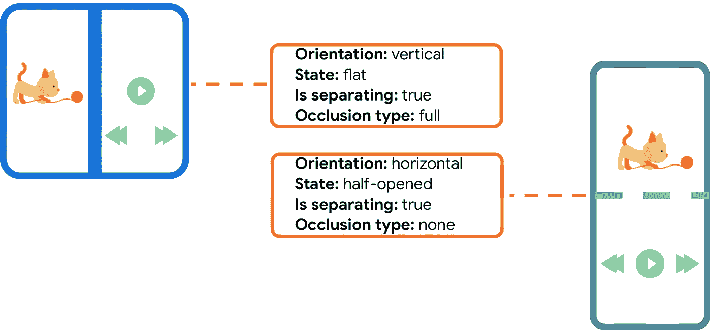

# 解开稳定的窗口管理器

> 原文：<https://medium.com/androiddevelopers/unbundling-the-stable-windowmanager-a5471ff2907?source=collection_archive---------5----------------------->

Illustration by Ocupop

Jetpack WindowManager 1.0.0 稳定！

为了支持开发人员为可折叠设备构建应用程序，我们在 2019 年 2 月推出了我们的第一个 alpha 版本 [Jetpack WindowManager](https://developer.android.com/jetpack/androidx/releases/window) 。从那时起，这个库已经发展到包括`[WindowMetrics](https://developer.android.com/reference/androidx/window/layout/WindowMetrics)`信息和对[活动嵌入](https://developer.android.com/guide/topics/large-screens/activity-embedding)的实验支持。

这只是开始！我们对这个图书馆有很好的计划，作为在所有类型的大屏幕设备上获得惊人体验的基础。

# 用于可折叠设备的稳定支撑

为了支持可折叠设备，Jetpack WindowManager 提供了`[DisplayFeature](https://developer.android.com/reference/androidx/window/layout/DisplayFeature)`接口及其`[FoldingFeature](https://developer.android.com/reference/androidx/window/layout/FoldingFeature)`实现，该实现提供了诸如铰链的`[orientation](https://developer.android.com/reference/androidx/window/layout/FoldingFeature#orientation())`和`[state](https://developer.android.com/reference/androidx/window/layout/FoldingFeature#state())`之类的信息:

Sample state for `FoldingFeature` instances

应用程序可以通过`[WindowInfoLayout](https://developer.android.com/reference/androidx/window/layout/WindowLayoutInfo)`对象注册接收更新的状态信息。这可以通过不同的方式收集，具体取决于应用的架构:

*   科特林协同流程
*   复试
*   RxJava 可观察或可流动

# 图书馆文物

基础库是用 Kotlin 构建的，并使用与当前活动相关联的`[WindowInfoTracker](https://developer.android.com/reference/kotlin/androidx/window/layout/WindowInfoTracker.Companion#getOrCreate(android.content.Context))`为 Kotlin 的协程流提供现成的支持:

Sample collection of WindowInfoLayout events

关于如何为 Jetpack WindowManager 设置正确的依赖关系的分步指南，您可以查看带有 Jetpack window managercodelab 的[支持可折叠和双屏设备。](https://developer.android.com/codelabs/android-window-manager-dual-screen-foldables?hl=en#3)

另外，如果您需要从基于 Java 的项目中使用库，可以使用`[WindowInfoTrackerCallbackAdapter](https://developer.android.com/reference/androidx/window/java/layout/WindowInfoTrackerCallbackAdapter)`。在这种情况下，`WindowInfoLayout`事件是通过回调接收的:

Setup WindowLayoutInfo collection through callbacks — onCreate

然后我们可以使用生命周期回调`onStart`和`onStop`来注册我们的`WindowLayoutInfo`监听器:

Setup WindowLayoutInfo collection through callbacks — onStart and onStop

回调的一个示例实现可以是实现`Consumer<WindowLayoutInfo>`接口的内部类:

Setup WindowLayoutInfo collection through callbacks

文章[让你的应用知道文件夹](https://developer.android.com/guide/topics/large-screens/make-apps-fold-aware)介绍了如何使用这些 API。一旦您添加了对可折叠设备的支持，您就可以使用文章[在可折叠设备上测试您的应用](https://developer.android.com/guide/topics/large-screens/test-apps-on-foldables)中描述的`androidx.window.testing`工件来测试您的 UI。

# 支持响应性用户界面

由于 Android 上的屏幕尺寸经常变化，开始设计完全响应和自适应的用户界面很重要。WindowManager 库中包含的另一个特性是检索当前和最大窗口度量信息的能力。这类似于 API 级别 30 中包含的框架`[WindowMetrics](https://developer.android.com/reference/android/view/WindowMetrics)` API 提供的信息，但是它向下向后兼容到 API 级别 14。

Jetpack WindowManager 包含了用于检索这些信息的`[WindowMetricsCalculator](https://developer.android.com/reference/androidx/window/layout/WindowMetricsCalculator)`类:

WindowMetricsCalculator — current and maximum

> **注意:**如果您过去使用过这个库(直到 beta02)，您可能已经使用过`WindowMetrics`流来收集窗口大小变化事件。我们已经删除了这个 API，因为我们遇到了一些可靠性问题。我们将在未来重新审视这一决定。

如果您的应用程序需要监控窗口大小的所有变化，最好的方法是使用一个`View.onConfigurationChanged`监听器。我们不能使用`Activity.onConfigurationChanged`，因为有些情况下，当配置改变时，它不会被调用。

您还可以在容器中添加一个实用视图，并在您的`Activity.onCreate`方法中附加这个监听器:

WindowMetrics — View.onConfigurationChanged workaround

> **注意:**即使您的活动不处理配置更改，如果您对正确的窗口尺寸感兴趣，我们建议您注册一个`View.onConfigurationChanged`监听器，因为在某些情况下，窗口大小可能会在您的活动不重新启动的情况下发生变化。

# Jetpack WindowManager 是响应式用户界面的基础

Jetpack WindowManager 可以直接集成到您的应用程序中，但它也是更高级组件和库的构建块。

在 Jetpack 中，我们已经有了三个包含 WindowManager 的库，随着今天第一个稳定版本的发布，我们将为所有这些库发布稳定版本:

*   [滑动面板布局 1.2.0](https://d.android.com/jetpack/androidx/releases/slidingpanelayout#1.2.0)
*   [导航 2.4.0](https://developer.android.com/jetpack/androidx/releases/navigation#2.4.0)
*   [首选项 1.2.0](https://d.android.com/jetpack/androidx/releases/preference#1.2.0)

作为补充，`SlidingPaneLayout`组件支持在较大的设备和可折叠设备上并排显示两个窗格，同时自动适应在较小的设备(如手机)上一次只显示一个窗格。

SlidingPaneLayout sample

# 支持基于活动的应用程序

去年，我们从开发人员那里收集了许多关于将现有应用程序应用于大屏幕设备所面临的挑战的反馈，其中最大的担忧来自于开发代码库的开发人员仍然严重依赖于多种活动。在这种情况下，采用一个处理片段的解决方案(比如`SlidingPaneLayout`)或者迁移到 Compose，可能需要大量的工作。

为此，我们研究了在屏幕上并排显示两个活动的可能性。这项研究最终在 Android 12 的 12L 功能下降中提供了一个新功能，通过新的 Jetpack WindowManager 实验 API 暴露出来，允许开发人员在屏幕上并排显示两个活动。

这种情况下的主要需求是一个新的 XML 配置，在最简单的情况下，如果窗口足够大，它会指定一个主要活动和一个辅助活动放在屏幕上:

Split configuration

600dp 的最小宽度是 [Material Design](https://m3.material.io/foundations/adaptive-design/large-screens/overview) 的推荐值，以确保在通用设备尺寸上有足够的空间用于两种活动。

另一个必需的步骤是初始化 Jetpack WindowManager 的`[SplitController](https://developer.android.com/reference/androidx/window/embedding/SplitController)`。

为此，我们可以使用 [Jetpack Startup](https://developer.android.com/jetpack/androidx/releases/startup) 在应用程序的其他组件加载和活动开始之前执行初始化。

要启用初始化，请执行以下操作:

1.  添加库依赖项

Activity embedding — dependencies

2.通知库我们在`AndroidManifest.xml`中的初始化器

Activity embedding — Initialization provider

3.实现 SplitController 初始化器

Activity embedding — SplitController initialization

您可以查看[活动嵌入](https://developer.android.com/guide/topics/large-screens/activity-embedding)指南，了解所有可用的特性。

活动嵌入是 Android 12L (API level 32)的一项功能，但它将在一些早期平台版本的设备上可用。要在运行时检查特性的可用性，使用`[SplitController.isSplitSupported()](https://developer.android.com/reference/androidx/window/embedding/SplitController#isSplitSupported())`方法:

Check for activity embedding availability

# 查看它的运行情况:代码示例

GitHub 上最新的[示例](https://github.com/android/user-interface-samples/tree/main/WindowManager)展示了如何使用 Jetpack WindowManager 库来:

*   检索显示姿势信息
*   从`WindowLayoutInfo`流程中收集信息
*   通过`WindowInfoTrackerCallbackAdapter`注册回拨
*   尝试活动嵌入 API

该示例还包括一些可以在任何设备或模拟器上运行的测试。

# 在你的应用中采用 WindowManager

Jetpack WindowManager 现在是稳定的，我们有一个很好的路线图来构建下一步，包括根据您的反馈改进活动嵌入 API，添加窗口大小类 API 来标准化响应 ui 断点，等等。

我们也很高兴看到 Android 社区采用 Jetpack WindowManager 作为其他库的基础，如微软的 [WindowState](https://devblogs.microsoft.com/surface-duo/jetpack-compose-windowstate-preview/) 或 Stream 的 [Butterfly](https://github.com/getStream/butterfly) 。

但是现在轮到你来构建惊人的折叠感知、响应的 Android 应用程序了！

访问[面向大屏幕开发的响应式布局](https://developer.android.com/large-screens)，了解更多关于优化可折叠和其他大屏幕设备的信息。