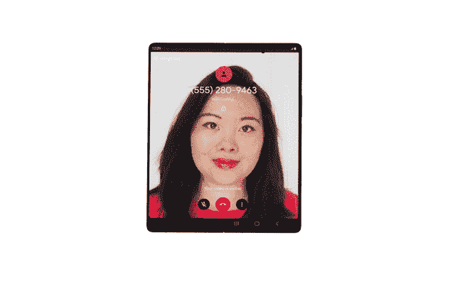

# 解开窗口管理器

> 原文：<https://medium.com/androiddevelopers/unbundling-the-windowmanager-fa060adb3ce9?source=collection_archive---------0----------------------->

Illustration by Ocupop

*优化可折叠设备和大屏幕设备的应用*

> 你可以在后续文章中阅读关于 stable 1.0 Jetpack WindowManager 库的内容: [**解开 stable WindowManager**](/androiddevelopers/unbundling-the-stable-windowmanager-a5471ff2907) 。

Android 中的屏幕尺寸正在快速变化，随着平板电脑和可折叠设备的日益普及，了解应用程序的窗口大小和状态对于开发响应迅速的 UI 至关重要。 [Jetpack WindowManager](https://developer.android.com/jetpack/androidx/releases/window) ，现在处于测试阶段，是一个库和 API，提供类似于 Android 框架`[WindowManager](https://developer.android.com/reference/android/view/WindowManager)`的功能，包括支持响应 ui、检测屏幕变化的回调适配器和窗口测试 API。但是 Jetpack WindowManager 也支持新类型的设备，比如 foldables 和窗口环境，比如 Chrome OS。

新的 WindowManager APIs 包括以下内容:

*   `[WindowLayoutInfo](https://developer.android.com/reference/androidx/window/layout/WindowLayoutInfo)`:包含窗口的显示特征，如窗口是否包含折叠或铰链
*   `[FoldingFeature](https://developer.android.com/reference/androidx/window/layout/FoldingFeature)`:使您能够监控可折叠设备的折叠状态，以确定设备姿态
*   `[WindowMetrics](https://developer.android.com/reference/androidx/window/layout/WindowMetrics)`:提供当前窗口指标或整体显示指标

Jetpack WindowManager 从 Android 中分离出来，允许在 API 上进行更快的迭代，以快速支持快速发展的设备市场，并使应用程序开发人员能够采用库的更新，而不必等待最新的 Android 版本。

现在该库处于测试阶段，我们鼓励所有开发者采用 Jetpack WindowManager 及其设备无关的 API，测试 API，并引入`WindowMetrics`以允许您轻松响应窗口大小的变化。升级到测试版意味着您可以对您正在采用的 API 充满信心，让您能够专注于在这些设备上构建激动人心的体验。Jetpack WindowManager 支持低至 API 14 的功能检测。

# 图书馆

Jetpack WindowManager 是一个现代的、Kotlin 优先的库，它支持新的设备外形，并提供“类似 AppCompat”的功能来构建具有响应性 UI 的应用程序。

# 折叠状态

这个库提供的最明显的特性是对可折叠设备的支持。当设备的折叠状态发生变化时，应用程序可以接收事件，允许更新 UI 以支持新的用户交互。

*Google Duo on the Samsung Galaxy Z Fold2*

看看[这个 Google Duo 案例研究](https://developer.android.com/stories/apps/google-duo?hl=en)，展示了如何增加对可折叠设备的支持。

有两种可能的折叠状态，`[FLAT](https://developer.android.com/reference/androidx/window/layout/FoldingFeature.State.Companion#FLAT())`和`[HALF_OPENED](https://developer.android.com/reference/androidx/window/layout/FoldingFeature.State.Companion#HALF_OPENED())`。对于`FLAT`,你可以认为表面是完全打开的，尽管在某些情况下它可能会被铰链分开。对于`HALF_OPENED`，窗口至少有两个逻辑区域。下面，我们用图片展示了每种状态的可能性:

Fold state: FLAT and HALF-OPENED

当应用程序处于活动状态时，通过从 Kotlin 流中收集事件，应用程序可以接收有关折叠状态变化的信息。

要开始和停止事件收集，我们可以使用生命周期范围，如`[repeatOnLifeCycle](/androiddevelopers/repeatonlifecycle-api-design-story-8670d1a7d333)` [API 设计故事](/androiddevelopers/repeatonlifecycle-api-design-story-8670d1a7d333)博客文章和以下代码示例中所述:

然后，应用程序可以使用接收到的`[WindowLayoutInfo](https://developer.android.com/reference/androidx/window/layout/WindowLayoutInfo)`对象中的可用信息来更新其布局，同时应用程序对用户可见。

`[FoldingFeature](https://developer.android.com/reference/androidx/window/layout/FoldingFeature)`包括像铰链`[orientation](https://developer.android.com/reference/androidx/window/layout/FoldingFeature#orientation())`和折叠功能是否创建两个逻辑屏幕区域(`[isSeparating](https://developer.android.com/reference/androidx/window/layout/FoldingFeature#isSeparating())`属性)这样的信息。我们可以使用这些值来检查设备是否处于桌面模式(半开，铰链水平):

Device in TableTop mode

或者在书本模式下(半开，铰链垂直):

Device in Book mode

你可以在[可折叠设备的桌面模式](/androiddevelopers/tabletop-mode-on-foldable-devices-d091b3c500b1)文章中看到一个如何为媒体播放器应用程序做这件事的例子。

> **注意:**在 main/UI 线程上收集这些事件很重要，这样可以避免 UI 和这些事件处理之间的同步问题。

# 支持响应性用户界面

由于 Android 的屏幕尺寸经常变化，开始设计完全自适应和响应的用户界面是很重要的。WindowManager 库中包含的另一个特性是检索当前和最大窗口度量信息的能力。这类似于 API 30 中包含的[框架](https://developer.android.com/reference/android/view/WindowMetrics) `[WindowMetrics](https://developer.android.com/reference/android/view/WindowMetrics)` [API 提供的信息，但它向下兼容 API 14。](https://developer.android.com/reference/android/view/WindowMetrics)

Jetpack WindowManager 提供了两种检索`[WindowMetrics](https://developer.android.com/reference/androidx/window/layout/WindowMetrics)`信息的方式，一种是流事件流，另一种是通过`[WindowMetricsCalculator](https://developer.android.com/reference/androidx/window/layout/WindowMetricsCalculator)`类同步进行。

在异步 API 难以处理的视图中编写代码时使用`WindowMetricsCalculator`(比如`[onMeasure](https://developer.android.com/reference/android/view/View#onMeasure(int,%20int))`):

另一个用例可以是在测试中(参见下面的测试)。

对于应用程序 UI 的高级处理，使用`[WindowInfoRepository#currentWindowMetrics](https://developer.android.com/reference/androidx/window/layout/WindowInfoRepository#currentWindowMetrics())`在窗口大小发生变化时得到库的通知，而不管这种变化是否触发了配置变化。

以下是如何根据可用区域的大小来切换布局的示例:

# 回拨适配器

要在 Java 编程语言中使用这个库或使用回调接口，请在您的应用程序中包含`[androidx.window:window-java](https://developer.android.com/jetpack/androidx/releases/window#declaring_dependencies)`依赖项。该构件提供了`[WindowInfoRepositoryCallbackAdapter](https://developer.android.com/reference/androidx/window/java/layout/WindowInfoRepositoryCallbackAdapter)`，您可以使用它来注册(和取消注册)一个回调，以接收关于设备状态和窗口度量信息的更新。

# 测试

我们从开发人员那里听说，更健壮的测试 API 对于保持长期支持至关重要。让我们来谈谈如何在普通设备上测试可折叠姿势。

到目前为止，我们已经看到，当设备姿态发生变化时，Jetpack WindowManager 库会通知您的应用程序，以便您可以修改应用程序的布局。

该库在`[androidx.window:window-testing](https://developer.android.com/jetpack/androidx/releases/window#declaring_dependencies)`、`[WindowLayoutInfoPublisherRule](https://developer.android.com/reference/androidx/window/testing/layout/WindowLayoutInfoPublisherRule)`中提供了，这使您能够在测试文件夹功能的支持下发布`WindowInfoLayout`:

我们可以用它来创建一个假的`[FoldingFeature](https://developer.android.com/reference/androidx/window/testing/layout/DisplayFeatureTesting)`用于我们的测试:

然后使用`WindowLayoutInfoPublisherRule`来发布它:

最后一步是使用可用的 [Espresso matchers](https://d.android.com/training/testing/espresso/cheat-sheet) ，检查我们正在测试的活动布局是否如预期的那样运行。

下面是一个测试发布 FoldingFeature 的例子，在屏幕中央有一个`HALF_OPENED`垂直铰链:

# 查看它的运行情况:代码示例

GitHub 上最新的[示例](https://github.com/android/user-interface-samples/tree/main/WindowManager)展示了如何使用 Jetpack WindowManager 库来检索显示姿态信息，从`WindowLayoutInfo`流收集信息或通过`WindowInfoRepositoryCallbackAdapter`注册回调。

该示例还包括一些可以在任何设备或模拟器上运行的测试。

# 在你的应用中采用 WindowManager

可折叠和双屏设备不再是实验性或未来性的——大显示区域和额外的姿势已经证明了用户价值，现在有更多的设备可供用户使用。可折叠和双屏设备代表了智能手机的自然发展。对于 Android 开发者来说，它们提供了进入一个正在增长的高端市场的机会，这也要归功于设备制造商重新燃起的兴趣。

我们去年推出了 Jetpack WindowManager alpha01。从那时起，这个库已经有了稳定的发展，并针对早期的反馈做了一些很大的改进。该库现在已经接受了 Android 的 Kotlin-first 哲学，从回调驱动模型过渡到协程和流程。WindowManager 现在处于测试阶段，API 是稳定的，我们强烈建议采用。

更新还不止于此。我们计划向该库添加更多功能，并在一个针对系统 UI 的非捆绑 AppCompat 中对其进行改进，使开发人员能够在所有 Android 设备上轻松实现现代、响应迅速的 UI。

[保持反馈畅通](https://issuetracker.google.com/issues/new?component=840395&template=1412556)！

如果您想查看更多关于优化可折叠设备和其他大屏幕设备的资源，请访问[本页](https://developer.android.com/large-screens)。