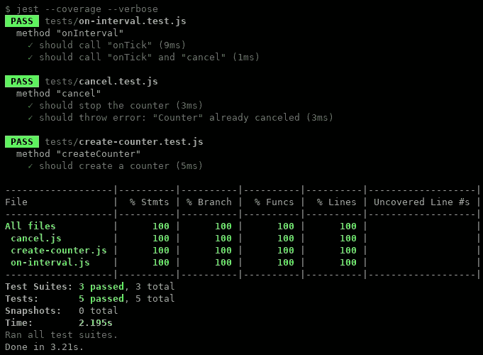

# 在 JavaScript 中打开闭包并引入依赖注入

> 原文：<https://medium.com/quick-code/unclosuring-closures-and-introducing-dependency-injection-in-javascript-3b6673d21862?source=collection_archive---------3----------------------->


在本文中，我们将考虑如何使用依赖注入编程模式，以函数风格编写清晰且易于测试的代码。作为奖励，我们还实现了 100%的单元测试覆盖率。

# 术语

这篇文章的作者将准确地记住以下术语的这种解释，理解这不是最终的真理，其他解释也是可能的。

- **依赖注入**
这是一种编程模式，假设函数和对象工厂的外部依赖来自外部，以这些函数的参数的形式。依赖注入是使用来自全局上下文的依赖的替代方法。

- **纯函数**
这是一个结果只取决于其自变量的函数。此外，该功能不应有副作用。
马上我要说一句，我们所考虑的副作用的功能是没有的，但是它们仍然可以有通过依赖注入来到我们身边的功能。所以文章中函数的纯粹性是有条件的。

- **单元测试**
对函数的测试，检查该函数内的所有分支是否完全按照代码作者的意图工作。在这种情况下，不调用任何其他函数，而是使用模拟调用。

# 实践

让我们看一个活生生的例子——计数器工厂。计数器随着每一次滴答而递增，并且可以通过`cancel`函数调用来停止。当滴答发生时，调用`onTick`回调。

```
const createCounter = ({ ticks, onTick }) => {
  const state = {
    currentTick: 1,
    timer: null,
    canceled: false
  } const cancel = () => {
    if (state.canceled) {
      throw new Error(‘“Counter” already canceled’)
    }
    clearInterval(state.timer)
  } const onInterval = () => {
    onTick(state.currentTick++)
    if (state.currentTick > ticks) {
      cancel()
    }
  } state.timer = setInterval(onInterval, 200) const instance = {
    cancel
  } return instance
}export default createCounter
```

我们看到人类可读、可理解的代码。但是有一个问题——你不能对它编写普通的单元测试。让我们看看是什么阻止了你？

1)内部函数`cancel`和`onInterval`不能从要独立测试的单元测试中访问

2)函数`onInterval`不能独立于“取消”进行测试，因为第一个函数直接引用第二个函数

3)函数`setInterval`和`clearInterval`中使用了外部相关性

4)由于直接引用的存在，函数`createCounter`不能独立测试

让我们通过从闭包中提取`cancel`和`onInterval`函数来解决第一个和第二个问题，并通过引入额外的对象`pool`来分解直接引用。

```
// index.js
export const cancel = pool => {
  if (pool.state.canceled) {
    throw new Error(‘“Counter” already canceled’)
  }
  clearInterval(pool.state.timer)
}export const onInterval = pool => {
  pool.config.onTick(pool.state.currentTick++)
  if (pool.state.currentTick > pool.config.ticks) {
    pool.cancel()
  }
}const createCounter = config => {
  const pool = {
    config,
    state: {
      currentTick: 1,
      timer: null,
      canceled: false
    }
  } pool.cancel = cancel.bind(null, pool)
  pool.onInterval = onInterval.bind(null, pool) pool.state.timer = setInterval(pool.onInterval, 200) const instance = {
    cancel: pool.cancel
  } return instance
}export default createCounter
```

让我们解决第三个问题。通过使用依赖注入模式，外部依赖`setInterval`和`clearInterval`也可以在对象`pool`中移动。

```
// index.js
export const cancel = pool => {
  const { clearInterval } = pool
  if (pool.state.canceled) {
    throw new Error(‘“Counter” already canceled’)
  }
  clearInterval(pool.state.timer)
}export const onInterval = pool => {
  pool.config.onTick(pool.state.currentTick++)
  if (pool.state.currentTick > pool.config.ticks) {
    pool.cancel()
  }
}const createCounter = (dependencies, config) => {
  const pool = {
    ...dependencies,
    config,
    state: {
      currentTick: 1,
      timer: null,
      canceled: false
    }
  }
  pool.cancel = cancel.bind(null, pool)
  pool.onInterval = onInterval.bind(null, pool) const { setInterval } = pool pool.state.timer = setInterval(pool.onInterval, 200) const instance = {
    cancel: pool.cancel
  } return instance
}export default createCounter.bind(null, {
  setInterval,
  clearInterval
})
```

现在，几乎一切都好了，但是还有第四个问题。在最后一步中，我们将对我们的每个函数应用依赖注入，并通过“pool”对象打破它们之间的其余引用。同时，我们将一个大文件分割成许多文件，这样以后编写单元测试就更容易了。

```
// index.js
import { createCounter } from ‘./create-counter’
import { cancel } from ‘./cancel’
import { onInterval } from ‘./on-interval’export default createCounter.bind(null, {
  cancel,
  onInterval,
  setInterval,
  clearInterval
}) // create-counter.js
export const createCounter = (dependencies, config) => {
  const pool = {
    ...dependencies,
    config,
    state: {
      currentTick: 1,
      timer: null,
      canceled: false
    }
  } pool.cancel = dependencies.cancel.bind(null, pool)
  pool.onInterval = dependencies.onInterval.bind(null, pool) const { setInterval } = pool pool.state.timer = setInterval(pool.onInterval, 200) const instance = {
    cancel: pool.cancel
  } return instance
} // on-interval.js
export const onInterval = pool => {
  pool.config.onTick(pool.state.currentTick++)
  if (pool.state.currentTick > pool.config.ticks) {
    pool.cancel()
  }
} // cancel.js
export const cancel = pool => {
  const { clearInterval } = pool if (pool.state.canceled) {
    throw new Error(‘“Counter” already canceled’)
  }
  clearInterval(pool.state.timer)
}
```

# 结论

结论是什么？一堆文件，每个文件包含一个清理函数。代码的简单性和清晰性略有下降，但是这被单元测试中 100%的覆盖率所抵消。



我还想指出的是，我们不需要用“require”做任何操作，也不需要模仿 Node.js 文件系统来编写单元测试。

# 单元测试

```
// cancel.test.js
import { cancel } from ‘../src/cancel’describe(‘method “cancel”’, () => {
  test(‘should stop the counter’, () => {
    const state = {
      canceled: false,
      timer: 42
    }
    const clearInterval = jest.fn()
    const pool = {
      state,
      clearInterval
    } cancel(pool) expect(clearInterval).toHaveBeenCalledWith(pool.state.timer)
  }) test(‘should throw error: “Counter” already canceled’, () => {
    const state = {
      canceled: true,
      timer: 42
    }
    const clearInterval = jest.fn()
    const pool = {
      state,
      clearInterval
    } expect(() => cancel(pool)).toThrow(‘“Counter” already canceled’) expect(clearInterval).not.toHaveBeenCalled()
  })
}) // create-counter.test.js
import { createCounter } from ‘../src/create-counter’describe(‘method “createCounter”’, () => {
  test(‘should create a counter’, () => {
    const boundCancel = jest.fn()
    const boundOnInterval = jest.fn()
    const timer = 42
    const cancel = {
      bind: jest.fn().mockReturnValue(boundCancel)
    }
    const onInterval = {
      bind: jest.fn().mockReturnValue(boundOnInterval)
    }
    const setInterval = jest.fn().mockReturnValue(timer) const dependencies = {
      cancel,
      onInterval,
      setInterval
    }
    const config = { ticks: 42 } const counter = createCounter(dependencies, config) expect(cancel.bind).toHaveBeenCalled()
    expect(onInterval.bind).toHaveBeenCalled()
    expect(setInterval).toHaveBeenCalledWith(
      boundOnInterval,
      200
    )
    expect(counter).toHaveProperty(‘cancel’)
  })
}) // on-interval.test.js
import { onInterval } from ‘../src/on-interval’describe(‘method “onInterval”’, () => {
  test(‘should call “onTick”’, () => {
    const onTick = jest.fn()
    const cancel = jest.fn()
    const state = {
      currentTick: 1
    }
    const config = {
      ticks: 5,
      onTick
    }
    const pool = {
      onTick,
      cancel,
      state,
      config
    } onInterval(pool) expect(onTick).toHaveBeenCalledWith(1)
    expect(pool.state.currentTick).toEqual(2)
    expect(cancel).not.toHaveBeenCalled()
  })  test(‘should call “onTick” and “cancel”’, () => {
    const onTick = jest.fn()
    const cancel = jest.fn()
    const state = {
      currentTick: 5
    }
    const config = {
      ticks: 5,
      onTick
    }
    const pool = {
      onTick,
      cancel,
      state,
      config
    } onInterval(pool) expect(onTick).toHaveBeenCalledWith(5)
    expect(pool.state.currentTick).toEqual(6)
    expect(cancel).toHaveBeenCalledWith()
  })
})
```

> **只有将所有功能开放到底，我们才能获得自由。**