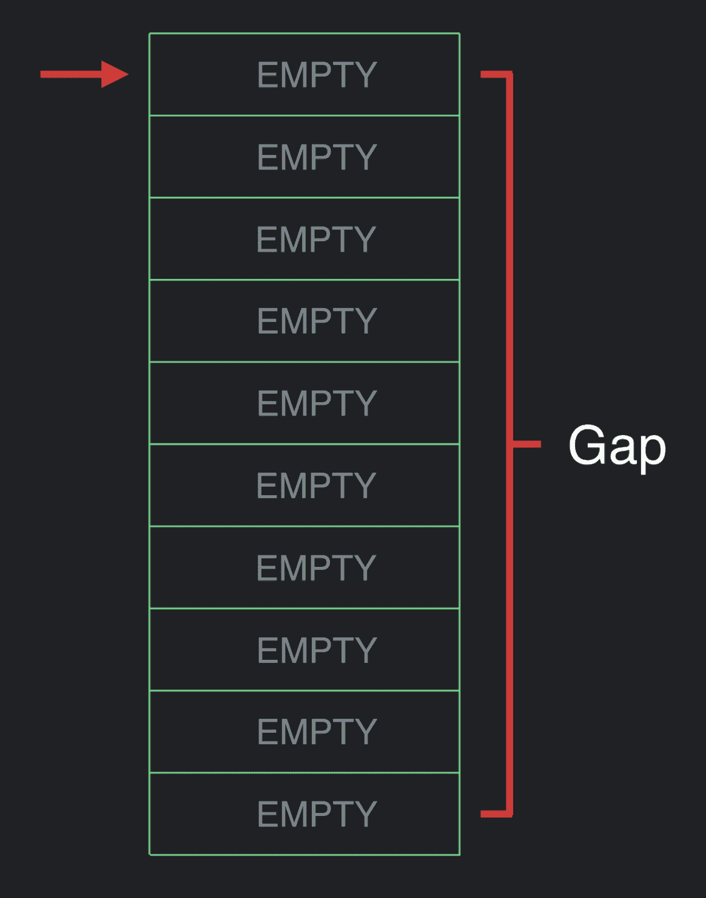
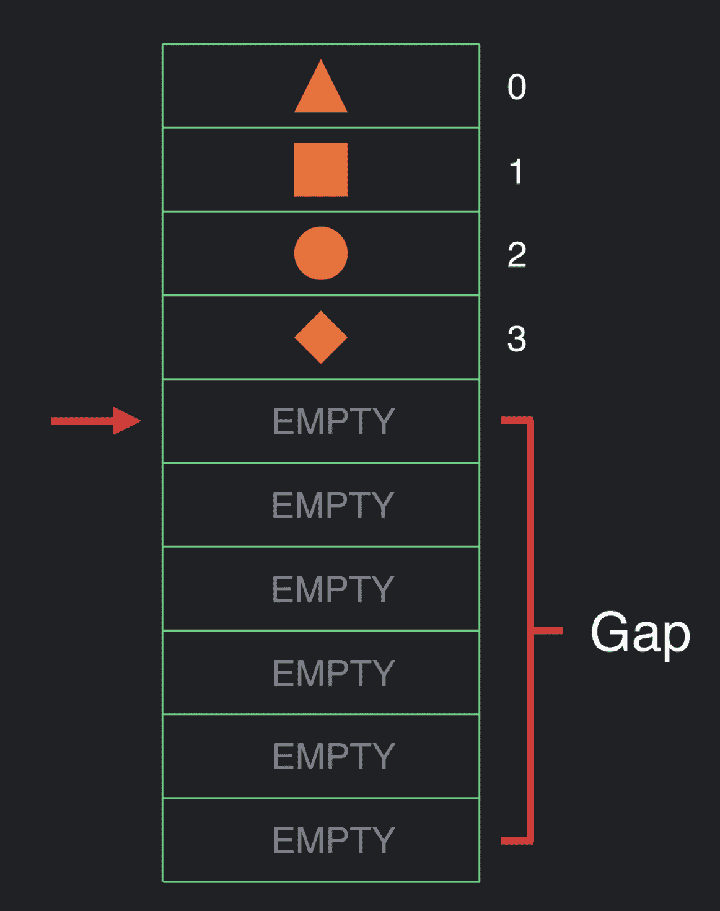

# 在 Jetpack Compose 的引擎盖下—第 2 部分，共 2 部分

> 原文：<https://medium.com/androiddevelopers/under-the-hood-of-jetpack-compose-part-2-of-2-37b2c20c6cdd?source=collection_archive---------1----------------------->

## 在作曲的引擎盖下

这是两篇关于撰写的文章中的第二篇。在第一篇文章中，我解释了 Compose 的好处，Compose 解决的挑战，我们一些设计决策背后的原因，以及这些如何帮助应用程序开发人员。此外，我还讨论了 Compose 的心理模型，您应该如何考虑您在 Compose 中编写的代码，以及您应该如何设计您的 API。

现在我要看看 Compose 是如何工作的。但是在我开始之前，我想强调理解 Compose 是如何实现的*并不是使用 Compose* 所必需的。接下来纯粹是为了满足你的求知欲。

# **@ Composable 是什么意思？**

如果您看过 Compose，您可能会在许多代码示例中看到@Composable 注释。需要注意的重要一点是，Compose 是*而不是*注释处理器。Compose 在 Kotlin 的类型检查和代码生成阶段借助 Kotlin 编译器插件工作:使用 compose 不需要注释处理器。

这个注释更像是一个语言关键字。一个很好的类比是 Kotlin 的 suspend 关键字。

Kotlin 的 suspend 关键字作用于函数类型:你可以有一个 suspend、lambda 或 type 的函数声明。Compose 以同样的方式工作:它可以改变函数类型。

这里重要的一点是，当您用@Composable 注释一个函数类型时，您正在改变它的类型:没有注释的同一个函数类型与被注释的类型不兼容。此外，挂起函数需要调用上下文，这意味着您只能在另一个挂起函数内部调用挂起函数。

Composable 的工作方式也是一样的。这是因为有一个调用上下文对象，我们需要通过所有的调用线程。

# 执行模型

那么，我们正在传递的调用上下文是什么，为什么我们需要这么做？

我们称这个物体为“作曲家”。Composer 的实现包含一个与[间隙缓冲区](https://en.wikipedia.org/wiki/Gap_buffer)密切相关的数据结构。这种数据结构通常在文本编辑器中使用。

间隔缓冲区表示具有当前索引或光标的集合。它是在内存中用平面数组实现的。该平面数组大于它所代表的数据集合，未使用的空间称为间隙。

现在，一个正在执行的可组合层次结构可以调用这个数据结构并向其中插入内容。

让我们想象一下，我们已经完成了层次结构的执行。在某些时候，我们会重新创作一些东西。因此，我们将光标重置到数组的顶部，然后再次执行。当我们执行时，我们可以查看数据，什么也不做或更新值。

我们可能认为 UI 的结构已经发生了变化，想要进行插入。此时，我们将间隙移动到当前位置。

现在，我们可以做插页了。

关于这个数据结构，需要理解的重要一点是，除了移动间隙之外，所有的操作——获取、移动、插入和删除——都是常数时间操作。移动间隙是 O(n)。我们选择这种数据结构的原因是因为我们打赌，一般来说，ui 不会很大地改变结构。当我们有动态用户界面时，它们在*值*方面会发生变化，但在结构上不会经常变化。当它们确实改变它们的结构时，它们通常会大块地改变，所以进行这种 O(n) gap 移动是一种合理的权衡。

让我们看一个计数器的例子。

这是我们要写的代码，但是让我们看看编译器是做什么的。

当编译器看到可组合注释时，它会插入额外的参数并调用函数体。

首先，编译器向 composer.start 方法添加一个调用，并向其传递一个编译时生成的密钥整数。

编译器还将 composer 对象传递给函数体中的所有可组合调用。

当该编写器执行时，它执行以下操作:

*   Composer.start 被调用并存储一个组对象
*   记住插入一个组对象
*   存储 mutableStateOf 返回的值，即状态实例。
*   按钮存储一个组，后跟它的每个参数。

最后我们到达 composer.end

该数据结构现在保存了合成中的所有对象，即按执行顺序排列的整个树，有效地实现了树的深度优先遍历。

现在，所有这些组对象都占据了很大的空间，那么它们有什么用呢？这些组对象用于管理动态 UI 中可能发生的移动和插入。编译器知道改变 UI 结构的代码是什么样子，所以它可以有条件地插入那些组。大多数时候，编译器不需要它们，所以它不会在槽表中插入那么多组。为了说明这一点，请看下面的条件逻辑。

在这个 composable 中，getData 函数返回一些结果，并在一种情况下呈现可组合的加载，在另一种情况下呈现头和主体。编译器为 if 语句的每个分支插入单独的键。

假设这段代码第一次执行时，结果为空。这将在间隙数组中插入一个组，加载屏幕运行。

函数第二次运行时，让我们假设 result 不再为 null，这样 if 语句的第二个分支就会执行。这就是有趣的地方。

对 composer.start 的调用有一个键为 456 的组。编译器看到 123 的槽表中的组不匹配，所以现在它知道 UI 在结构上发生了变化。

然后，编译器将该间隙移动到当前光标位置，并在原来的 UI 上扩展该间隙，有效地消除了它。

此时，代码正常执行，新的 UI——标题和主体——被插入。

在这种情况下，if 语句的开销是槽表中的一个槽条目。通过插入这个组，我们在 UI 中有了任意的控制流，使编译器能够管理它，并在执行 UI 时调用这个类似缓存的数据结构。

这个概念就是我们所说的位置记忆化，这是一个从零开始构建的概念。

# **位置记忆**

通常，我们有全局记忆，这意味着编译器根据函数的输入缓存函数的结果。为了说明位置记忆的一个例子，以这个执行计算的可组合函数为例。

该函数接受一个字符串项列表和一个查询，然后对该列表执行过滤计算。我们可以将这种计算包装在对 memory 的调用中:memory 是知道如何调用槽表的东西。remember 查看项目并将列表和查询存储在 slot 表中。然后运行过滤器计算，并在传回结果之前记住存储结果。

该函数第二次执行时，remember 会查看传入的新值，并将它们与旧值进行比较。如果两者都没有改变，则跳过过滤操作，返回先前的结果。这就是位置记忆。

有趣的是，这个操作非常便宜:编译器只需存储一次以前的调用。这种计算可以发生在你的整个 UI 中，因为你是按位置存储的，所以它只存储那个位置的数据。

这是记忆函数的特征，它可以接受任意数量的输入，然后是一个计算函数。

但是这里有一个有趣的退化情况，当输入为零时。我们能做的事情之一就是故意误用这个 API。我们可以记忆一个故意不纯的计算，比如 Math.random。

如果你在全球记忆化的情况下这样做，那就没有意义了。但是，随着位置记忆化，它最终呈现出一种新的语义。每次我们在可组合的层次结构中使用 App 时，都会返回一个新的 Math.random 值。然而，每次 composable 重新组合，它将是相同的*math . random 返回值。这产生了持续，而持续产生了*状态*。*

# **存储参数**

为了说明如何存储可组合函数的参数，让我们以一个 Google Composable 为例，它接受一个数字，调用一个可组合地址，并呈现一个地址。

Compose 将可组合函数的参数存储在插槽表中。如果是这种情况，看看上面的例子，我们会看到一些冗余:在地址调用中添加的“Mountain View”和“CA”会再次存储在底层的文本调用中，因此这些字符串会被存储两次..

我们可以通过在编译器级别向可组合函数添加静态参数来消除这种冗余。

在这种情况下，静态参数是一个位字段，指示运行时是否知道参数没有改变。如果已知一个参数不会改变，那么就没有必要存储它。因此，在这个 Google 示例中，编译器传递了一个位字段，表示没有任何参数会改变。

然后，在 Address 中，编译器可以做同样的事情，并将其传递到文本中。

这种按位逻辑很难读懂，也很混乱，但是我们不需要理解这一点:编译器擅长这个，人类不擅长。

在谷歌的例子中，我们看到有冗余信息，但这里也有常数。事实证明，我们也不需要存储它们。因此，整个层次结构由 number 参数决定，这是编译器需要存储的唯一的*值。*

正因为如此，我们可以更进一步，生成理解这个数字是唯一要改变的东西的代码。这段代码可以这样工作，如果一个数字没有改变，函数的主体将被完全跳过，我们可以指示编写器将它的当前索引移动到函数执行时的位置。

作曲者知道将执行快进多远，以便在需要的地方继续执行。

# **重组**

为了解释重组是如何工作的，让我们回到反例。

编译器为此计数器创建的生成代码有 composer.start 和 compose.end。每当计数器执行时，运行时都知道当它调用 count.value 时，它正在读取 appmodel 实例的属性。在运行时，无论何时调用 compose.end，我们都可以选择返回值。

然后，我们可以用 lambda 对该值调用 updateScope 方法，告诉运行时如果需要，如何重新启动这个可组合组件。这相当于 LiveData 以其他方式接收的 lambda。问号在这里的原因——它可以为空的原因——是因为，如果我们在计数器执行期间不读取任何模型对象，就没有理由教运行时如何更新它，因为我们知道它永远不会更新。

# **关闭思路**

重要的是要记住，这些细节中的大部分只是实现细节。可组合函数具有与标准 Kotlin 函数不同的行为和功能，有时理解它们是如何实现的会很有帮助，但是虽然行为和功能不会改变，但实现可能会改变。

同样，compose 编译器能够生成在某些情况下更有效的代码。随着时间的推移，我们希望这些优化得到改善。