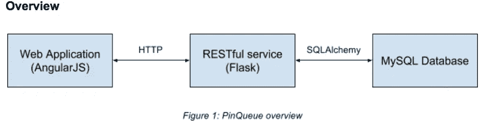
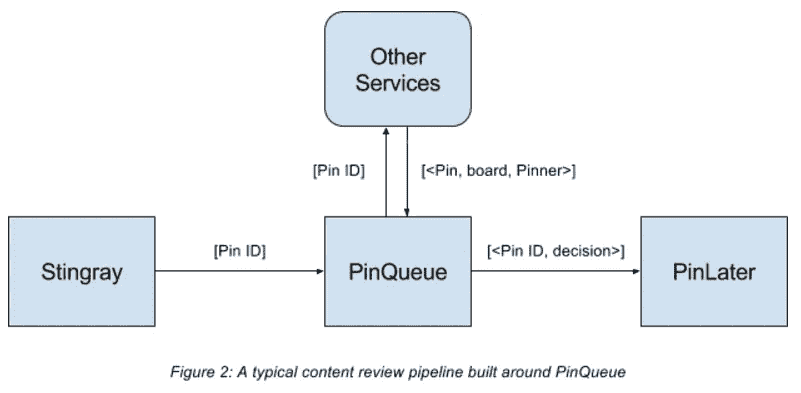
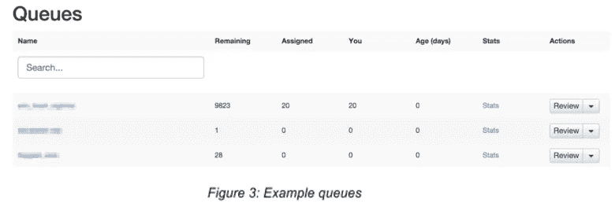
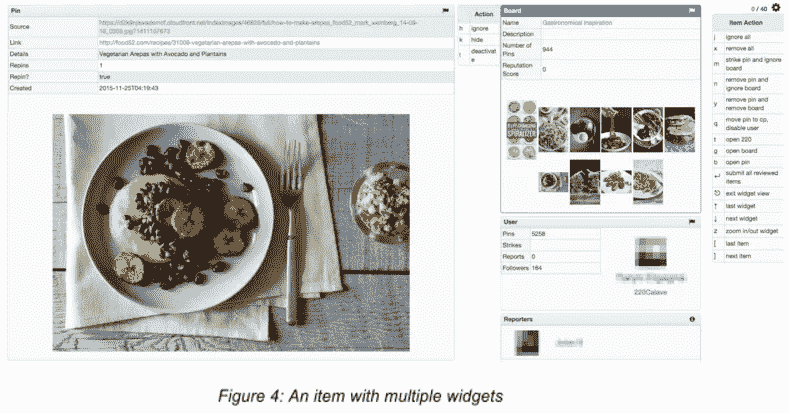

# 幕后:PinQueue，一个通用的内容审查系统

> 原文：<https://medium.com/pinterest-engineering/under-the-hood-pinqueue-a-generic-content-review-system-f2711de1331e?source=collection_archive---------2----------------------->

姚远| Pinterest 基础设施工程师

人们使用 Pinterest 来发现、保存和做激励他们的事情。每天，我们将数百万人与数十亿个 pin 连接起来，向 Pinners 提供最高质量的内容是我们的使命。我们使用[机器学习](https://engineering.pinterest.com/blog/future-machine-learning-pinterest)来过滤违反我们政策的内容，从推广的 pin 到垃圾邮件，但仍然需要人工审核，因为算法无法涵盖我们所有复杂且不断发展的内容政策。人工检查始终是机器学习管道的宝贵补充。为了方便人工审核过程，我们构建了 PinQueue，这是一个通用的内容审查系统。

Pinterest 的许多团队都使用 PinQueue，包括:

*   安全团队审查可能违反我们的[内容政策](https://help.pinterest.com/en/articles/content-policies)和[可接受使用政策](https://about.pinterest.com/en/acceptable-use-policy)的内容，并采取适当的措施。
*   垃圾邮件团队，评估和验证[垃圾邮件对抗规则](https://engineering.pinterest.com/blog/fighting-spam-pinterest)。
*   市场质量团队，审查[促销销](https://business.pinterest.com/en/promoted-pins)和[可购买销](https://business.pinterest.com/en/buyable-pins)，确保每一个销都符合我们的[广告标准](https://about.pinterest.com/en/advertising-standards)和[商务政策](https://about.pinterest.com/en/commerce-policies)。

迄今为止，PinQueue 已经帮助我们处理了 600 多个队列中的 300 多万个项目。

## 在后台

PinQueue 由一个作为前端的 web 应用组成，这是一个在 Flask 中实现的 RESTful web 服务，由一个 MySQL 数据库支持。

该服务为 web 应用程序提供了一个 HTTP 接口和一组 RESTful APIs，以及用于通信的其他外部系统。它使用 [SQLAlchemy](http://www.sqlalchemy.org/) ORM 与数据库交互。

## 更大的画面

PinQueue 被设计成一个通用平台，支持任何类型内容的审查。工程师和分析师可以轻松地在 PinQueue 上设置工作流，并使用不同的上游和下游系统。它的服务 API 和前端模板是高度可插拔和可扩展的。

在 Pinterest，围绕 PinQueue 构建的典型内容审查管道由作为数据源的 [Stingray](https://engineering.pinterest.com/blog/fighting-spam-pinterest) 和作为作业执行系统的 [PinLater](https://engineering.pinterest.com/blog/open-sourcing-pinlater-asynchronous-job-execution-system) 组成。

Stingray 是一个分布式流处理器和规则引擎。我们可以定义 Stingray 规则来响应 Pinterest 上发生的所有类型的事件(例如，一个广告商想要推广一个 Pin)。一旦这些规则被触发，它们将从事件中提取信息(即 Pin ID 或促销规格 ID ),并通过 PinQueue API 将它们发送到 PinQueue 数据库。

例如，当我们的分析师来到 PinQueue 查看促销的 Pin 时，PinQueue 将联系 Pinterest 上的相应服务以检索相关信息(即关于 Pin、公告板和 Pinner 或广告商的信息)。然后，分析师将通过 PinQueue UI 对其进行审查并做出决策。

一旦做出决定，PinQueue 将把决定(标签)发送到 PinLater(一个异步作业执行系统)执行(即不批准一个促销的 Pin，因为它不符合我们的广告标准)。

## 近距离观察

我们在 PinQueue 中有各种数据模型，用于安全、垃圾邮件、货币化等类别。每个类别代表一种内容类型，并包含一个队列集合。

*   **队列:**每个队列都是由于相同原因需要评审的项目的集合。

*   **Item:** 每个项目代表一个我们需要审查的事件(例如，一个 Pin 被报告为不适当的内容，或者一个广告商想要推广一个 Pin)，并且包含需要审查和采取行动的关于该事件的所有信息。
*   **小部件:**一个项目是小部件的集合。小部件是一条可以交互的信息。使用之前 Pin 被报告为不当内容的示例，我们将创建一个项目来表示该事件。此项目将包含一个 Pin 小部件(报告的 Pin)、一个 board 小部件(保存此 Pin 的 board)、一个用户小部件(保存 Pin 的 Pinner)和一个 reporter 小部件(报告此 Pin 的 Pinner)。

*   每种类型的小部件都定义了自己的模板(即它包含的信息以及如何显示它)和它支持的操作。例如，电路板小部件包括电路板名称和描述、保存到电路板的管脚数量、电路板的信誉分数以及电路板上 10 个管脚的样本。它的操作包括“忽略”(无操作)、“隐藏”(从公共提要中隐藏该板)和“停用”(停用该板)。
*   除了单个小部件上的单个操作之外，项目级操作也通过预定义的小部件级操作的组合来支持(例如，“全部停用”作为项目级操作会将“停用”操作应用于该项目内的每个小部件)。
*   **Reviewer:** 我们还有一个针对 PinQueue 授权用户的 Reviewer 实体。我们有一个评论者-类别映射，其中我们控制每个评论者可以访问哪些类别。我们还有一个审阅者-项目映射，其中每个项目只能分配给一个审阅者，以便多个审阅者可以在同一队列中同时工作，而不会发生冲突或重复工作。

## 高级功能

PinQueue 有一些高级功能:

*   **缓存:**我们缓存静态小部件的数据，而不是在审查时通过服务调用来检索。
*   **过滤:**我们定义过滤器来过滤掉不需要审查的项目(例如，已报告的 Pin 已被删除或包含已推广 Pin 的活动不再有效)。
*   **质量控制:**为了确保评论的准确性和一致性，我们可以抽取一些项目，由多个评论者同时进行评论。如果他们的决策发生冲突，这些项目将被发送到一个单独的队列进行讨论或主管审查。
*   **指标和监控:**我们收集指标来监控审核流程，如内容量、响应时间或决策分布。

我们相信像 PinQueue 这样的通用内容审查系统对许多公司都是有用的，我们计划在不久的将来开源 PinQueue。敬请期待！

*鸣谢:PinQueue 由埃里克·康纳、乔纳森·霍洛维茨和姚远创建。这个团队，以及来自整个公司的人，用他们的技术洞察力和宝贵的反馈帮助这个项目成为现实。*