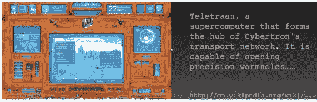
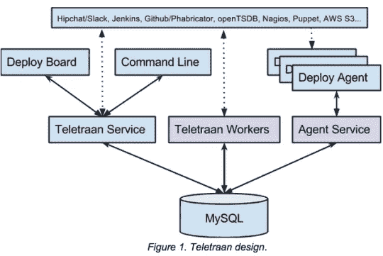
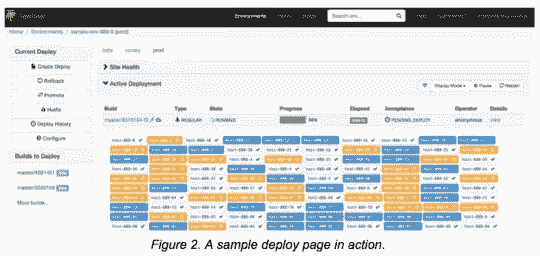

# 引擎盖下:Teletraan 部署系统

> 原文：<https://medium.com/pinterest-engineering/under-the-hood-teletraan-deploy-system-1e5caa774a63?source=collection_archive---------0----------------------->

基础设施 Pinterest 工程主管宋宝刚

在开发人员最担心的事情中，部署是最重要的。部署通常是新的代码变更第一次在生产环境中运行。一个可靠和简单的部署工具是任何开发人员的武器库的重要组成部分。

部署系统应该支持以下功能:

*   回滚。这是任何部署工具最重要的特性。拥有一台时间机器回到某个以前的状态是无价的。
*   修补程序。有时回滚要么不切实际，要么很难，因此修补程序比常规修补程序更容易执行，部署更快，优先级更高。
*   滚动部署。部署不应该中断服务，但如果绝对必要，影响必须最小。如果一定数量的服务器升级失败或者违反了服务 SLA，那么停止部署是非常重要的。
*   准备和测试。直接部署到生产环境比部署到试运行环境或 canary 来验证工作是否正常有更高的风险。由于创建一个登台环境并将其与他们的测试相集成的开销，工程师经常不遵循这个最佳实践。一个好部署系统可以最小化这种开销。
*   能见度。确保很容易找到可以部署的代码更改，以及运行新版本和旧版本的主机数量。同样重要的是，要容易地跟踪何时由谁引入了哪个代码变更，以及部署期间的关键指标和警报状态。
*   可用性。简单的用户界面是上述功能的关键。

## 介绍 Teletraan

Teletraan 是我们的内部部署系统，用于支持上述所有功能(以著名的《变形金刚》电视剧中的一个角色命名)。它是由云工程团队的一小组开发工具工程师构建的，旨在提高网站和基础设施的可靠性、速度、效率和安全性。

## 设计概述

Teletraan 遵循传统的客户端-服务器模型，使用 MySQL 作为后端数据存储。

部署代理是在所有主机上运行的守护程序，定期与代理服务交互以获取最新的指令。在部署期间，代理下载并提取服务构建 tar 以及特定的部署脚本，并执行它们。这些部署脚本包括下载前/后脚本、重启前/后脚本和重启脚本本身，负责停止和启动服务。

Teletraan 工作人员在后台执行作业，例如根据部署进度转换部署状态，以及根据时间表执行自动部署。

Teletraan 服务为部署板和任何 RESTful 调用提供 API 支持。它负责大多数与部署相关的操作，包括部署和回滚。它还创建和维护服务部署配置、回答部署和代理状态查询、实施权限控制等。

## 高级功能

除了上面列出的核心功能，Teletraan 还支持几个高级功能:

*   暂停并继续。当开发人员希望在将代码完全部署到集群之前仔细检查某些东西时，这很方便。
*   资格。配置完成后，成功的部署将触发验收测试来验证它。接受的部署可用于将来的升级或自动部署到下一阶段
*   自动部署。每当有新的构建可用时，或者基于类似 cron 作业的计划设置，自动将构建从一个阶段提升到另一个阶段。出现故障时，系统可以自动暂停、回滚或覆盖自动部署。

Teletraan 帮助我们更快地行动，更轻松地发布代码。我们希望与世界分享这些部署工具，并计划在今年晚些时候开源 Teletraan。关注博客的更新。

宋宝刚是内部开发工具团队的工程主管，该团队隶属于 Pinterest 的云工程团队。

*鸣谢:Teletraan 是由内部开发工具团队的 Jinru He、Nick DeChant 和 Baogang Song 构建的。*

*获取 Pinterest 工程新闻和更新，关注我们的工程*[*Pinterest*](https://www.pinterest.com/malorie/pinterest-engineering-news/)*，* [*脸书*](https://www.facebook.com/pinterestengineering) *和* [*推特*](https://twitter.com/PinterestEng) *。有兴趣加入团队吗？查看我们的* [*招聘网站*](https://about.pinterest.com/en/careers/engineering-product) *。*