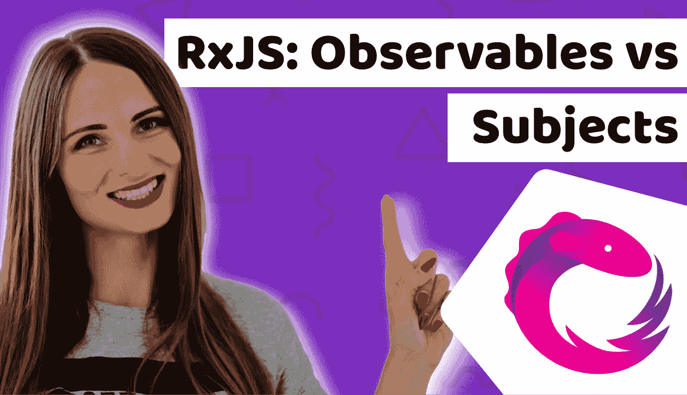

# 理解 RxJS 可观察对象和主题是如何工作的，它们之间有什么区别

> 原文：<https://medium.com/duomly-blockchain-online-courses/understand-how-rxjs-observables-and-subjects-work-and-whats-the-difference-between-them-13d9b047dd94?source=collection_archive---------0----------------------->

RxJS: Observables vs Subjects

本文最初发表于[https://www.blog.duomly.com//rxjs-observables-vs-subjects](https://www.blog.duomly.com//rxjs-observables-vs-subjects)/

# RxJS 可观察对象与主题简介

当使用 Angular 作为项目的主要框架时，RxJS 是最有用和最受欢迎的库之一。RxJS…