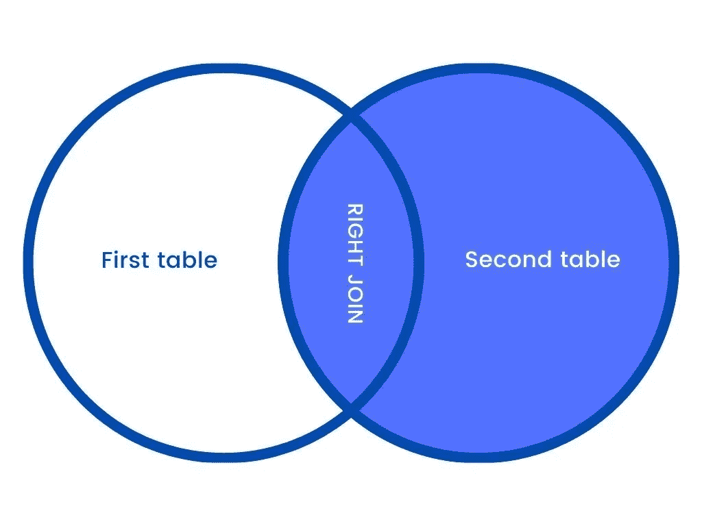

# 用这个简单的教程和例子来理解 SQL 连接

> 原文：<https://medium.com/duomly-blockchain-online-courses/understand-sql-join-with-this-simple-tutorial-and-dont-fail-as-i-did-2dedadd1a2ae?source=collection_archive---------3----------------------->


[Duomly programming online courses](https://www.duomly.com)

**简介**

我记得当我需要一点关于 SQL 的更深入的知识时，我已经有了，不幸的是，那个时候没有。

那是几年前，我想得到一个很酷的角色，有很好的公司和很酷的薪水，那是一个简单的前端工程师角色，但要有 SQL 的知识。

我有一些 SQL 知识，至少足以在简单的层面上使用它，比如做简单的查询。

这次技术招聘人员问我关于 SQL 连接的问题，更准确地说，是关于内部连接、完全连接、左连接和右连接之间的区别。我不知道这一点，这个简单的问题让我在薪资谈判中陷入了更糟糕的境地。

我决定尽我所能去了解它，今天我会给你一些基础知识来帮助你拥有一个比我更好的职位。

如果你喜欢视频，这里有 youtube 的版本。

**什么是 SQL Join**

SQL Join 是一种结构化查询语言方法，用于连接两个不同 SQL 表中的元素(数据)。

例如，假设您在网上销售鞋子，并希望展示所有适合客户脚的产品。

您的在线商店中有两个表，第一个是“Users”表，包含“id”、“name”、“email”和“size”列。

我们可以通过在 SQL 编辑器中键入以下内容来创建它:

```
CREATE TABLE Users (userId int,name varchar(255),email varchar(255),footSize int);
```

接下来，让我们向表中添加一些值:

```
INSERT INTO UsersVALUES(1, ‘Radek’, ‘radek@radek.com’, 12),(2, ‘Mark’, ‘mark@mark.com’, 9),(3, ‘Bruce’, ‘bruce@test.com’, 13);
```

结果:


SQL JOIN | USERS TABLE

第二个是名为“鞋子”的表，包含“产品 Id”、“型号”、“品牌”和“尺码”列。

我们将通过在 SQL 编辑器中键入该代码来创建它:

```
CREATE TABLE Shoes (shoeId int,model varchar(255),brand varchar(255),shoeSize int);
```

接下来，让我们添加一些产品:

```
INSERT INTO ShoesVALUES(1, ‘Shoe model 1’, ‘Shoe brand’, 12),(2, ‘Shoe model 2’, ‘Shoe brand’, 9),(3, ‘Shoe model 3’, ‘Shoe brand’, 12),(4, ‘Shoe model 4’, ‘Shoe brand’, 8);
```


SQL JOIN | SHOES TABLE

现在，我们希望看到适合用户脚的鞋子。

为此，我们可以使用 join 方法，例如:

```
SELECT shoeId, model, brand, shoeSize FROM Users userJOIN Shoes shoe ON user.footSize=shoe.shoeSize
```

其中用户名=‖Radek '

结果:


SQL JOIN EXAMPLE

**SQL 连接语法**

基本上，SQL 连接语法如下所示:

```
SELECT columnsFROM firstTable JOIN secondTableON columnFromFirstTable = columnFromSecondTableWHERE condition
```

当然，在每种情况下都会有所不同，但是主模板看起来与此相似，您可以基于此模板构建自己的查询。

**SQL 连接类型**

我们有四种主要的 SQL 连接方法。

**内部连接**

第一个是内部连接方法，它将从第一个和第二个表中挑选符合条件的行。


SQL JOIN | INNER JOIN

**左连接**

第二个是 LEFT JOIN 方法，它将从第一个表中选取所有行，并从第二个表中选取符合条件的行。


SQL JOIN | LEFT JOIN

**右连接**

第三个是 RIGHT JOIN 方法，它将从第二个表中选取所有行，并从第一个表中选取符合条件的行。



SQL JOIN | RIGHT JOIN

**完全加入**

最后一个是完全连接方法，它将从第二个表和第一个表中选取所有的行，不管是否符合条件。


SQL JOIN | FULL JOIN

**内部连接示例**

在这种情况下，我们只想展示适合我们的用户“Radek”的鞋子。

```
SELECT shoeId, model, brand, shoeSize FROM Users userINNER JOIN Shoes shoe ON user.footSize=shoe.shoeSizewhere user.name = ‘Radek’
```

结果:


SQL JOIN | INNER JOIN EXAMPLE

正如我们所看到的，DB 只返回鞋号等于用户的 footSize 字段的项目。

**左连接示例**

我们可以连接两个表，显示所有用户，而不传递条件，是否有适合他的鞋。

```
SELECT userId, shoeId, model, brand, shoeSize FROM Users userLEFT JOIN Shoes shoe ON user.footSize=shoe.shoeSize
```

结果:


SQL JOIN | LEFT JOIN EXAMPLE

在这种情况下，DB 向我们返回所有用户的值，但是在不是这一个客户的产品的行中，鞋的值为 null。

**右连接示例**

现在，我们可以显示所有的鞋子，如果没有任何用户可以穿我们的鞋子，那么“userId”部分将为空。

```
SELECT userId, shoeId, model, brand, shoeSize FROM usersRIGHT JOIN shoes ON users.footSize=shoes.shoeSize
```

结果:


SQL JOIN | RIGHT JOIN EXAMPLE

在这里，我们可以注意到 DB 返回了所有包含鞋子的行，但是用户中的空列不是鞋子的正确客户。

**完全加入示例**

这里我们将连接两个表，并显示所有记录，不传递任何条件。

```
SELECT userId, shoeId, model, brand, shoeSize FROM usersFULL JOIN shoes ON users.footSize=shoes.shoeSize
```

结果:


SQL JOIN | FULL JOIN EXAMPLE

在这里我们可以看到我们拥有一切，不管鞋子有没有潜在的拥有者或者使用者有没有购买鞋子的可能性。

**结论**

我已经向您解释了一些关于 SQL Join 方法的次要基础知识，可以帮助您使用 SQL。

现在，您已经了解了 SQL Join 的工作原理、SQL Join 类型之间的区别以及何时应用每种类型。

我希望你在需要的时候能够认识到它们，这将帮助你从中获得一些好处。


[Programming online courses](https://www.duomly.com)

感谢阅读，

Duomly 的 Radek 在线编程课程