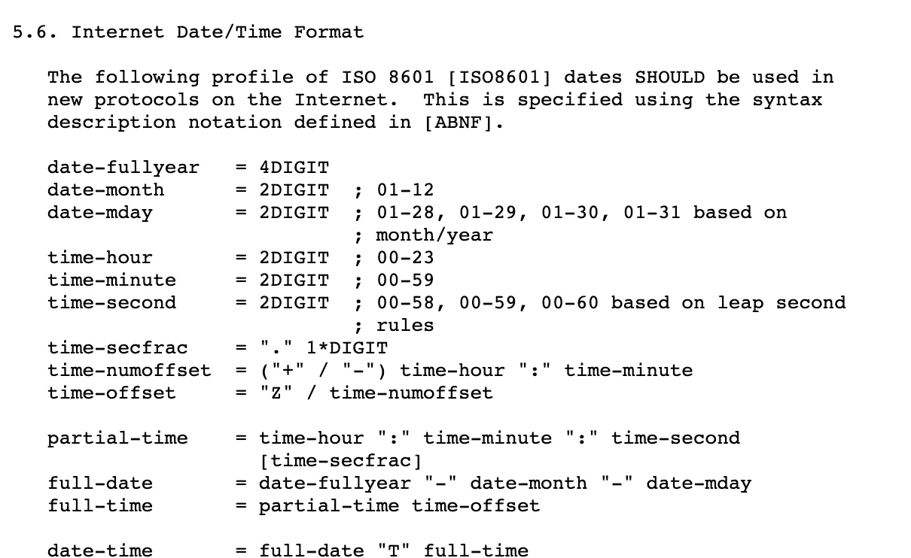

# 对软件工程中日期时间和时区格式 RFC 3339 的理解

> 原文：<https://medium.easyread.co/understanding-about-rfc-3339-for-datetime-formatting-in-software-engineering-940aa5d5f68a?source=collection_archive---------0----------------------->

## 不是每个工程师都知道的小而简单的事情，却是每个工程师都应该明白的非常重要的事情。


Photo by [Aron Visuals](https://unsplash.com/@aronvisuals?utm_source=medium&utm_medium=referral) on [Unsplash](https://unsplash.com?utm_source=medium&utm_medium=referral)

几天前，在构建 [Mabar](https://mabar.id) 时，我们就日期时间格式展开了一场大辩论。有一个问题是我们的时区不一致。所以，后来经过长时间的争论和讨论，我们达成了一项协议，使用我们的时区标准。

我们最终决定使用 RFC 3339 作为日期时间格式的标准。也就是说，后端和前端都将使用这种格式来交流日期时间格式。此外，我们同意使用 UTC+0 作为默认时区，即使在创建事件和从服务器接收事件细节时也是如此。并让前端和后端根据他们的时区进行转换。

***那么 RFC 3339 是什么呢？***

## RFC 3339 简介

RFC 代表征求意见。RFC 是来自互联网工程任务组( [IETF](https://www.ietf.org/) )的正式文档，是委员会起草和相关方随后审查的结果

这个委员会已经发布了这么多 RFC 文档。并成为各行各业的标准。他们的文档之一是 RFC 3339，这是一个用于日期时间格式化的文档。*RFC 3339 的链接可以在这里访问:*[*https://www.ietf.org/rfc/rfc3339.txt*](https://www.ietf.org/rfc/rfc3339.txt)

一般来说，如果你看 RFC 文档，它主要讨论的是日期时间格式，总结一下，你会看到建议的日期时间格式是如何像下面的例子。

```
2019-10-12T07:20:50.52Z
```

是的，就这样。

但是有一个问题。对于日期时间格式，ISO 已经标准化了。这是日期时间的 ISO 8601 标准。对于已经熟悉 ISO 8601 的人来说，RFC 3339 非常相似。有什么不同？

所以，如果你再看一遍 RFC 文档。RFC 3339 使用/遵循互联网日期时间的 ISO 8601 配置文件。在第 5.6 章中明确说明



RFC 3339 Chapter 5.6

所以实际上，约会 ISO 8601 并没有很大的区别。使这两者不同的唯一一点是日期和时间之间的“T”语法。ISO 8601 使用“T”字符来分隔日期和时间。在 RFC 3339 中，您可以仅使用空格来替换“T”字符。

例如:

```
# This is acceptable in ISO 8601 and RFC 3339 ***(with T)***
2019-10-12**T**07:20:50.52Z# This is only accepted in RFC 3339 ***(without T)***
2019-10-12 07:20:50.52Z
```

只是它。所以总的来说，它还是和 ISO 8601 一样。

## 了解时区

当我向我的好朋友询问 RFC 3339 的时候，我有点震惊，没有人了解这个。即使对 ISO 8601 来说，也只有少数人知道这件事的细节。

尤其是读取时区格式。从我朋友的 1-10 分中，我只能说只有 1 分理解时区格式。

```
2019-10-12T07:20:50.52Z
```

看看上面的例子。当我问别人时，他们会说现在是雅加达时间，因为我们住在雅加达。所以他会以为是雅加达时间。但这是错误的。因为如果我们把那个时间转换成雅加达时间应该是:`2019–10–12 14:20:50.52`。

怎么可能呢？我怎么能说那个例子中的雅加达时间是应该是`2019–10–12 14:20:50.52`？

在 RFC 3339 中，我们也可以从格式中知道时区。它显示在“**Z”**语法中。“Z”表示 UTC+0。“Z”代表祖鲁语时区，等同于 GMT 或 UTC([https://stackoverflow.com/a/9706777/4075313](https://stackoverflow.com/a/9706777/4075313))。所以如果我们把 Z 放在日期时间上，这意味着它的时区是 UTC+0。

更详细示例:

```
2019-10-12T07:20:50.52**Z**      **(UTC+0)**
2019-10-12T07:20:50.52**+00:00** **(UTC+0)**
2019-10-12T14:20:50.52**+07:00** **(UTC+7)**
2019-10-12T03:20:50.52**-04:00** **(UTC-4)**
```

看这加粗的文字。它将解释时区是如何以日期时间格式书写的。

## 为什么重要？

这对于处理来自多个时区的请求非常重要。如果你的应用程序只接受与你的时区相同的请求(目前)，那么工程师可能不会很好地处理这个问题。

对于工程师来说，为什么像 Golang 这样的一些编程语言已经能处理这个问题就真的很重要呢？这是因为有时工程师不太理解，可能会带来新的问题。

我给你讲个故事吧。

所以，我会举一个例子来说明为什么这真的很重要。我和我的朋友最近就遇到了这种情况。我们有一个关于未决交易的问题，需要查看并核实。

在我们的应用中，我们使用 UTC+0，他(我的朋友)知道这一点。因此，要修复挂起的事务，我只需要获得事务发生时的详细信息，并检查在挂起的事务周围是否有另一个事务挂起，并在那时重新验证所有挂起的事务。

当我询问数据库中行的事务时间(创建时间)时，问题就来了。他用我们的时区(UTC+7)自动添加小时，但不改变时区格式。这给我带来了额外的时间来核实当时所有的交易。因为我查询了错误的日期时间范围。

举个例子，

```
#This is our datetime stored in DB
2019-10-12T**07**:20:50.52**Z**
```

然后我让他通过聊天说出交易时间。他给了我这个。

```
# He add the hour with +7 but not change the timezone
2019-10-12T**14**:20:50.52**Z**
```

那么这里出了什么问题呢？看“小时”值。他加了 7 发给我。但是时区仍然是“Z”(UTC+0)。因为我知道要读 RFC 3339，所以我在想这是 UTC+0，因为他写的是“Z”。

有了这个日期和时间，我就可以对数据库进行一些查询了。但是，我得到的并不完全是我想要的。当我试图通过 ID 查询时，它显示的与他给我的不同。恐怕有一个对 DB 的更新查询，导致它与他给我的不同。

而且给我带来了困惑。为了验证这一点，我再次问他，这是否是 UTC+0 值，他说，他已经在小时上加了+7。我觉得像啊…🤯

然后，我对他说，当添加小时时，请同时更改时区。所以它不会给阅读日期时间的人带来困惑。

因此，如果我们将前面的示例更改为时区为 UTC+7，应该是这样的

```
#This is our datetime stored in DB
2019-10-12T**07**:20:50.52**Z**#This is how it should be converted to UTC+7
2019-10-12T**14**:20:50.52**+07:00**
```

## **外卖**

对于工程师来说，理解格式以避免数据不一致是非常重要的。幸运的是，从我上面的经验来看，我仍然在阅读给定的日期时间。如果有一个应用程序将读取日期时间，那么会有这么多不一致的数据，因为我们手动添加了错误的时区。

所以这里有一些要点:

*   “Z”:代表零时区(UTC+0)。或者等于 RFC 3339 中的+00:00。
*   RFC 3339 遵循 ISO 8601 日期时间格式。唯一的区别是 RFC 允许我们用“空格”代替“T”。

## 参考资料:

*   https://www.ietf.org/rfc/rfc3339.txt
*   [1]:[https://what is . tech target . com/definition/Request-for-Comments-RFC](https://whatis.techtarget.com/definition/Request-for-Comments-RFC)