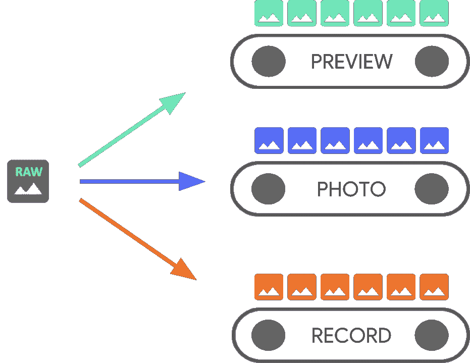
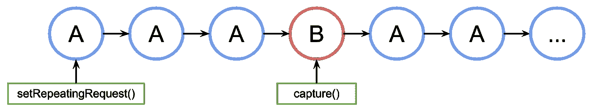

# 了解 Android 摄像头捕捉会话和请求

> 原文：<https://medium.com/androiddevelopers/understanding-android-camera-capture-sessions-and-requests-4e54d9150295?source=collection_archive---------0----------------------->

继[之前关于摄像头枚举的博文](/androiddevelopers/camera-enumeration-on-android-9a053b910cb5)之后，让我们来看看 Android 摄像头框架的两个主要组件:[捕捉会话](https://developer.android.com/reference/android/hardware/camera2/CameraCaptureSession)和[捕捉请求](https://developer.android.com/reference/android/hardware/camera2/CaptureRequest)。

# 一个摄像设备，多个流

一个 Android 设备可以有多个摄像头。每个摄像机都是一个 [CameraDevice](https://developer.android.com/reference/android/hardware/camera2/CameraDevice) ，一个 CameraDevice 可以同时输出多个流。我们为什么要这么做？嗯，一个流可能针对特定的用例进行了优化，例如显示取景器，而其他流可能用于拍照或录制视频。我们可以将这些流视为并行管道，一次一帧地处理来自摄像机的原始帧:

Illustration from [Building a Universal Camera App](https://www.youtube.com/watch?v=d1gLZCSLmaA) (Google I/O ‘18)

并行处理意味着可能存在性能限制，这取决于 CPU、GPU 或其他设备的可用处理能力。如果管道跟不上传入的帧，它就开始丢弃它们。

请注意，每个管道都有自己的输出格式。传入的原始数据被与每个管道相关联的隐式逻辑自动转换成适当的输出格式。稍后会详细介绍。

[CameraDevice](https://developer.android.com/reference/android/hardware/camera2/CameraDevice) 可用于创建特定于该 CameraDevice 的 CameraCaptureSession。CameraDevice 必须通过 CameraCaptureSession 接收每个输出原始帧的帧配置。一个配置输入，一个原始帧输出。该配置指定相机属性，如自动对焦、光圈、效果和曝光。由于硬件限制，在任何给定时间，在相机传感器中只有单个配置可以是活动的；这被称为*活动配置*。

一个 [CameraCaptureSession](https://developer.android.com/reference/android/hardware/camera2/CameraCaptureSession) 描述了 CameraDevice 可用的所有可能的管道。一旦创建了会话，就不能添加或删除管道。CameraCaptureSession 维护一个 CaptureRequests 队列，该队列将成为活动配置。

一个 [CaptureRequest](https://developer.android.com/reference/android/hardware/camera2/CaptureRequest) 将一个配置添加到队列中，并选择一个或多个(或所有)可用的管道来接收来自摄像机设备的帧。在一个捕获会话的生命周期中，您可以发送许多捕获请求。每个请求可以改变将接收原始图像的输出管道的活动配置和集合。

# 创建 CameraCaptureSession

要创建一个摄像机会话，我们需要为它提供一个或多个可以写入输出帧的缓冲区。每个缓冲区代表一个管道。这必须在您开始使用摄像机之前完成，以便框架可以配置设备的内部管道并分配内存缓冲区，以便将帧发送到所需的输出目标。

下面是我们如何用两个输出缓冲区准备一个相机会话，一个属于 SurfaceView，另一个属于 ImageReader:

请注意，此时我们还没有定义摄像机的活动配置。一旦配置了会话，我们就可以创建和发送捕获请求来完成这项工作。

还记得我们在上面说过，每个管道都知道如何将写入其缓冲区的输入转换为适当的格式吗？该变换由每个目标的类型决定，它必须是一个[表面](https://developer.android.com/reference/android/view/Surface)。Android 框架知道如何将活动配置中的原始图像转换成适合每个目标的格式。转换由特定表面的像素格式和大小控制。框架试图尽最大努力，但是一个 Surface 可能有一个不起作用的配置，在这种情况下可能会发生一些不好的事情:会话不能被创建，当您分派一个请求时会得到一个运行时错误，或者性能可能会下降。该框架为设备、表面和请求参数的特定组合提供了保证。我们将在以后的帖子中讨论所有这些内容。(与此同时，如果你好奇，请阅读 [createCaptureSession](https://developer.android.com/reference/android/hardware/camera2/CameraDevice#createCaptureSession(android.hardware.camera2.params.SessionConfiguration)) 的文档。)

# 一次性捕获请求

用于每一帧的配置被编码在一个[捕获请求](https://developer.android.com/reference/android/hardware/camera2/CaptureRequest)中，该请求被发送到摄像机。为了创建一个捕获请求，我们可以使用一个预定义的[模板](https://developer.android.com/reference/android/hardware/camera2/CameraDevice.html#constants_1)(或者我们可以使用 TEMPLATE_MANUAL 进行完全控制)。一旦我们选择了模板，我们需要提供一个或多个目标输出缓冲区用于请求。我们只能使用已经在我们打算使用的捕获会话中定义的缓冲区。

捕捉请求使用[构建器模式](https://developer.android.com/reference/android/hardware/camera2/CaptureRequest.Builder)，并给开发者机会设置[许多不同的选项](https://developer.android.com/reference/android/hardware/camera2/CaptureRequest#fields_1)，包括[自动曝光](https://developer.android.com/reference/android/hardware/camera2/CaptureRequest#CONTROL_AE_MODE)、[自动对焦](https://developer.android.com/reference/android/hardware/camera2/CaptureRequest#CONTROL_AF_MODE)和[镜头光圈](https://developer.android.com/reference/android/hardware/camera2/CaptureRequest#LENS_APERTURE)。在设置字段之前，通过调用[camera characteristics . getavailablecapturerequestkeys()](https://developer.android.com/reference/android/hardware/camera2/CameraCharacteristics.html#getAvailableCaptureRequestKeys())确保特定选项对设备可用，并通过检查适当的相机特性(例如[可用的自动曝光模式](https://developer.android.com/reference/android/hardware/camera2/CameraCharacteristics#CONTROL_AE_AVAILABLE_MODES))确保所需的值受支持。

要使用为视频预览设计的模板为我们的 SurfaceView 创建一个简单的捕获请求，无需任何修改，请使用 [CameraDevice。模板 _ 预览](https://developer.android.com/reference/android/hardware/camera2/CameraDevice.html#TEMPLATE_PREVIEW):

有了捕获请求，我们终于可以[将](https://developer.android.com/reference/android/hardware/camera2/CameraCaptureSession.html#capture(android.hardware.camera2.CaptureRequest,%20android.hardware.camera2.CameraCaptureSession.CaptureCallback,%20android.os.Handler))它发送到相机会话:

当一个输出帧被放入目标缓冲器时，一个[捕获回调](https://developer.android.com/reference/android/hardware/camera2/CameraCaptureSession.CaptureCallback)被触发。在许多情况下，一旦它包含的帧被处理，额外的回调也可能被触发，例如 [ImageReader。OnImageAvailableListener](https://developer.android.com/reference/android/media/ImageReader.OnImageAvailableListener) 。此时，我们可以从目标缓冲区中检索图像数据。

# 重复捕获请求

单镜头相机请求很容易做到，但对于显示实时预览来说，它们不是很有用。在这种情况下，我们希望接收连续的帧流，而不仅仅是单个帧。幸运的是，有一种方法可以将[重复请求](https://developer.android.com/reference/android/hardware/camera2/CameraCaptureSession.html#setRepeatingRequest(android.hardware.camera2.CaptureRequest,%20android.hardware.camera2.CameraCaptureSession.CaptureCallback,%20android.os.Handler))设置到会话:

重复的捕获请求将使相机设备使用所提供的 capture request 中的设置以可能的最大速率连续捕获图像。

# 交叉捕获请求

为了使事情变得更复杂，更接近真实世界的场景…如果我们想在重复的捕获请求处于活动状态时发送第二个捕获请求，该怎么办？这就是一个应用程序需要做的，以显示取景器，并让用户捕捉照片。在这种情况下，我们不需要停止正在进行的重复请求，我们可以简单地发出一个非重复的捕获请求——只需记住，在首次创建会话时，任何正在使用的输出目标缓冲区都需要配置为摄像机会话的一部分。值得注意的是，重复请求的优先级比单次请求或突发请求低，这使我们可以这样做:

然而，这种方法有一个很大的问题:我们不知道单个请求何时会发生。在下图中，如果 A 是重复捕获请求，B 是一次性捕获请求，则会话将这样处理请求队列:

Illustration of a request queue for the ongoing camera session

在请求 B 生效之前，A 发出的最后一个重复请求与下一次 A 再次被使用之间的延迟没有保证，因此我们可能会遇到一些被跳过的帧。我们可以做一些事情来缓解这个问题:

1.  将来自请求 A 的输出目标也添加到请求 B。这样，当 B 的帧准备好时，它将被复制到 A 的输出目标中。这是必不可少的，例如，当做[视频快照](https://developer.android.com/reference/android/hardware/camera2/CameraDevice#TEMPLATE_VIDEO_SNAPSHOT)以保持稳定的帧速率。在上面的代码中，我们只需在构建请求之前添加`singleRequest.addTarget(previewSurface)`。
2.  使用为这种特殊场景设计的模板组合，例如[零快门延迟](https://developer.android.com/reference/android/hardware/camera2/CameraDevice#TEMPLATE_ZERO_SHUTTER_LAG)(通常缩写为 ZSL)。
3.  如果单个捕获请求的配置与重复请求相同，则根本不需要多个请求。将单个重复请求设置为输出到重复请求的目标和单个请求的目标。即使它们必须具有相同的捕获请求设置，它们仍然可以具有不同的大小和格式。

# 吸取的教训

在创建使用 Android camera API 的应用程序时，理解相机会话和捕获请求非常重要。在这篇博文中，我们介绍了:

1.  摄像会话如何工作
2.  捕获请求的工作方式，包括一次性和重复的捕获请求
3.  如何将捕获请求添加到队列中，以及在不中断正在进行的流的情况下调度它们的不同技术

在未来的帖子中，我们将学习如何处理作为一个会话的一部分的多个目标的请求的复杂性，以及如何配置相机管道以充分利用设备的能力。