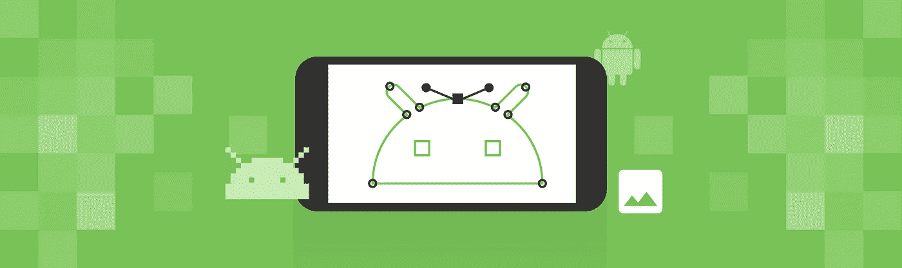
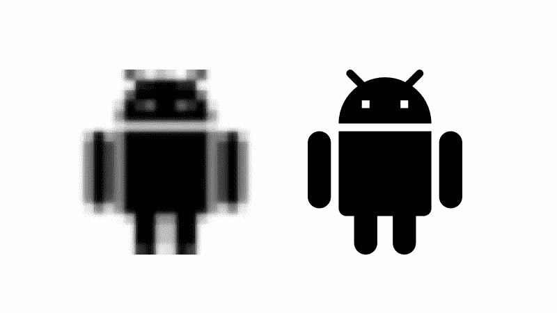
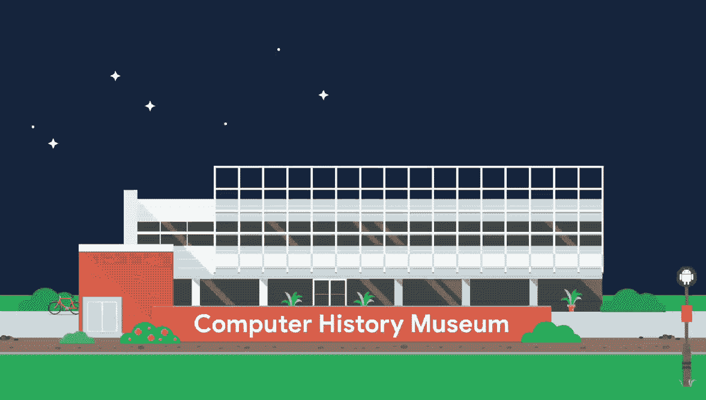
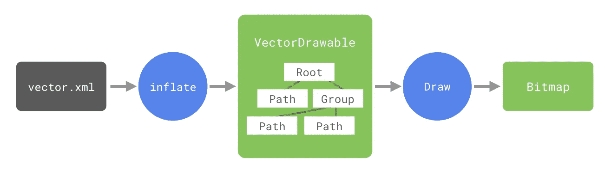
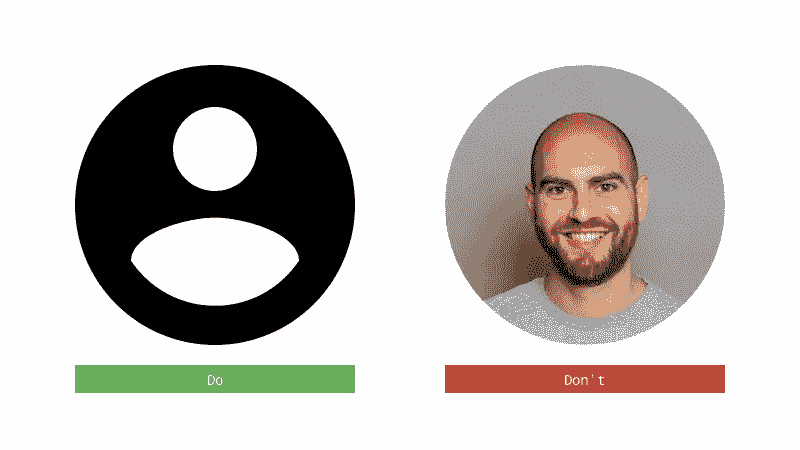
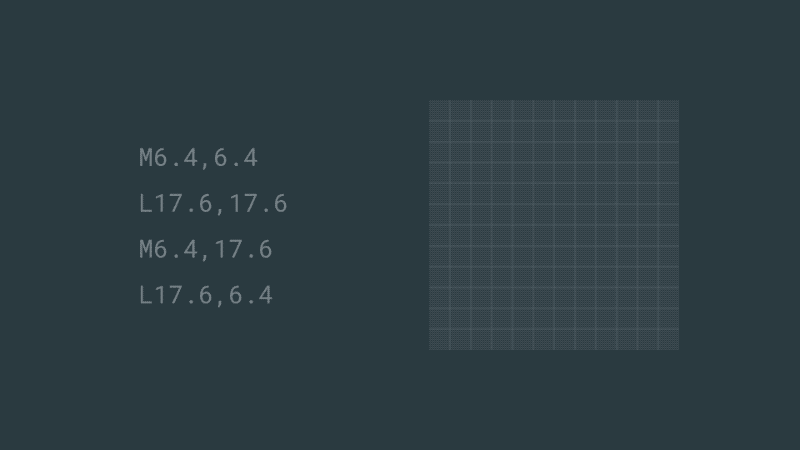
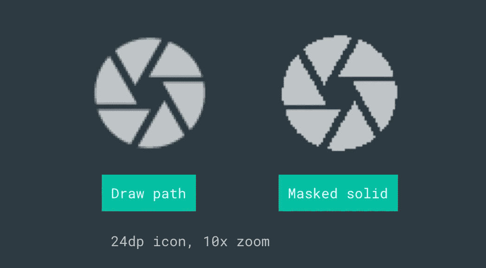
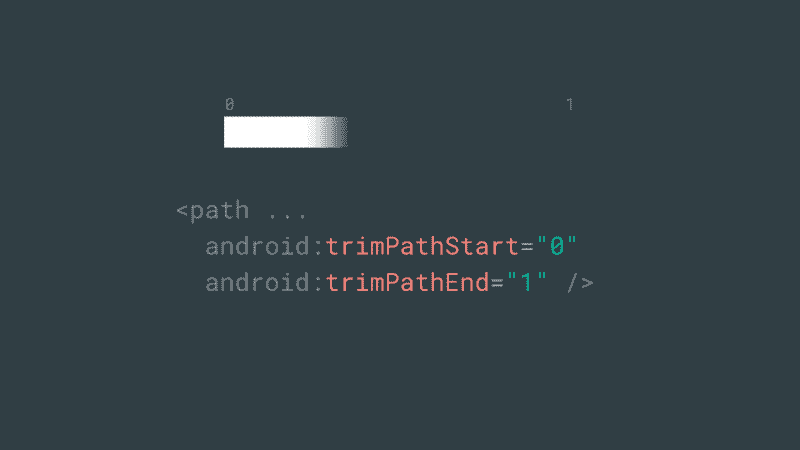

# 理解 Android 的矢量图像格式:VectorDrawable

> 原文：<https://medium.com/androiddevelopers/understanding-androids-vector-image-format-vectordrawable-ab09e41d5c68?source=collection_archive---------0----------------------->

Illustration by [Virginia Poltrack](https://twitter.com/VPoltrack)

Android 设备有各种尺寸、形状和屏幕密度。这就是为什么我非常喜欢使用独立于分辨率的矢量资源。但是它们到底是什么呢？它们的好处是什么？有哪些成本？我应该什么时候使用它们？*你是如何创造和使用它们的？在这一系列的帖子中，我想探讨这些问题，并解释为什么我认为你的应用程序中的绝大多数资产应该是向量，以及如何充分利用它们。*

# 光栅与矢量

大多数图像格式(png、jpeg、bmp、gif、webp 等)都是光栅格式，这意味着它们将图像描述为固定的像素网格。因此，它们是以特定的分辨率定义的，并且*不理解*任何关于它们内容的东西，只是每个像素的颜色。然而，矢量图形*将图像描述为在抽象画布大小上定义的一系列形状。*

# 为什么是 vector？

矢量资产有 3 个主要优势，它们是:

*   锋利的
*   小的
*   动态的

## **锋利**

矢量图像大小调整优雅；因为它们描述了抽象画布大小的图像，所以您可以放大或缩小画布，然后以该大小重新绘制图像。但是，当您调整栅格资源大小时，它们可能会恶化。缩小栅格资产往往是可以的(因为您丢弃了信息)，但放大它们会导致模糊或条带等假象，因为它们必须对缺失的像素进行插值。

Artifacts from (extreme) scaling up a raster image (left) vs a vector image (right)

这就是为什么在 Android 上，我们需要为不同密度的屏幕提供每个栅格资源的多个版本:

*   res/drawable-mdpi/foo.png
*   res/drawable-hdpi/foo.png
*   res/drawable-xhdpi/foo.png
*   …

Android 选择最接近的**较大的**密度，并按比例缩小(如果需要)。随着设备屏幕密度越来越高的趋势，应用程序制造商必须不断创造、包括和发布相同资产的更大版本。请注意，许多现代设备并不基于精确的密度桶(例如，Pixel 3 XL 为 552dpi，介于 xxhdpi & xxxhdpi 之间)，因此资产通常会被缩放。

因为矢量资源可以很好地调整大小，所以您可以包含单个资源，因为它可以在任何和所有屏幕密度下工作。

## **小**

矢量资源通常比栅格资源更紧凑，因为您只需要包含一个版本，而且它们的压缩效果很好。

例如[这里有一个来自](https://github.com/google/iosched/commit/78c5d25dfbb4bf8193c46c3fb8b73c9871c44ad6)[谷歌输入输出应用](https://play.google.com/store/apps/details?id=com.google.samples.apps.iosched)的变化，我们将一些图标从光栅 png 转换为矢量，节省了 482KB。虽然这听起来没什么，但这只是一个小图标；较大的图像(如插图)会有较大的节省。

此[插图](https://github.com/google/iosched/blob/71f0c4cc20c5d75bc7b211e99fcf5205330109a0/android/src/main/res/drawable-nodpi/attending_in_person.png)例如来自上一年 I/O 应用程序的启动流程，例如:

Illustrations can be good candidates for vectors

我们不能用一个`VectorDrawable`来代替它，因为渐变在那个时候并没有得到广泛的支持(剧透:现在是了！)所以我们不得不推出光栅版本😔。如果我们能够使用一个向量，这将是一个更好的*结果的 30%大小:*

*   光栅:下载大小= 53.9KB(原始文件大小= 54.8KB)
*   Vector:下载大小= 3.7KB(原始文件大小= 15.8KB)

> 请注意，虽然 [Android 应用捆绑包的](https://developer.android.com/platform/technology/app-bundle/)密度配置分割通过仅向设备提供所需的密度资产带来了类似的好处，但`VectorDrawable`通常仍会更小，并且还消除了不断创建更大栅格资产的需要。

## **动态**

由于矢量图像描述了它们的内容，而不是将它们“扁平化”成像素，它们为有趣的新可能性打开了大门，如动画、交互性或动态主题化。在以后的文章中会有更多的介绍。

Vectors maintain the image structure so individual elements can be themed or animated

# 权衡取舍

向量确实有一些需要考虑的缺点:

## **解码**

如前所述，矢量资产描述了它们的内容，因此在使用之前需要对它们进行膨胀和绘制。

The steps involved in decoding a vector before rendering

这有两个步骤:

1.  **通货膨胀**。你的向量文件必须被读取并解析成一个`[VectorDrawable](https://developer.android.com/reference/android/graphics/drawable/VectorDrawable)` 模型，它模拟了你声明的[路径](https://android.googlesource.com/platform/frameworks/support/+/androidx-master-dev/graphics/drawable/static/src/main/java/androidx/vectordrawable/graphics/drawable/VectorDrawableCompat.java#1809)、[组](https://android.googlesource.com/platform/frameworks/support/+/androidx-master-dev/graphics/drawable/static/src/main/java/androidx/vectordrawable/graphics/drawable/VectorDrawableCompat.java#1440)等。
2.  **图纸**。然后，必须通过执行`Canvas`绘图命令来绘制这些模型对象。

这两个步骤都与向量的复杂度和你执行的操作类型成比例。如果你使用非常复杂的形状，将它解析成一个`[Path](https://developer.android.com/reference/android/graphics/Path)`将花费更长的时间。类似地，更多的绘图操作将花费更长的时间来执行(并且一些操作更昂贵，例如剪辑操作)。我们将在本系列关于分析这些成本的后续文章中再次讨论这个问题。

对于静态向量，绘制阶段只需要执行一次，然后就可以缓存到一个`Bitmap`中。动画向量不能进行这种优化，因为它们的属性必然会改变，需要重新绘制。

相比之下，像 png 这样的光栅资产只需要解码文件的内容，这已经随着时间的推移得到了高度优化。

这是光栅与矢量的本质权衡。向量提供了上述好处，但代价是渲染成本更高。在 Android 的早期，设备功能较弱，屏幕密度差别不大。如今，Android 设备功能更加强大，屏幕密度也多种多样。这就是为什么我认为是时候让所有应用程序转向矢量资产了。

## **适宜性**

由于格式的本质，向量在描述一些资产方面非常出色，比如简单的图标等。他们很不擅长对照片类型的图像进行编码，很难用一系列形状来描述它们的内容，使用光栅格式(比如 webp)可能会更有效。这当然是一个范围，取决于你的资产的复杂程度。

## 转换

没有设计工具(据我所知)直接创建`VectorDrawable` s，这意味着有一个从其他格式转换的步骤。这可能会使设计人员和开发人员之间的工作流程变得复杂。我们将在以后的文章中深入探讨这个话题。

# 为什么不是 SVG？

如果您曾经使用过矢量图像格式，您可能会遇到 SVG 格式(可缩放矢量图形)，这是 web 上的行业标准。它具有成熟的工具，但是它也是一个庞大的标准。它包括许多复杂的功能，如执行任意 javascript，模糊和过滤效果或嵌入其他图像，甚至动画 gif。Android 在受限的移动设备上运行，因此支持 SVG 规范的整体性并不是一个现实的目标。

然而，SVG 包含了一个[路径规范](https://www.w3.org/TR/SVG/paths.html)，它定义了如何描述和绘制形状。有了这个 API，你可以表达大多数矢量图形。这本质上是 Android 支持的:SVG 的路径规范(加上一些补充)。

此外，通过定义自己的格式，`VectorDrawable`可以与 Android 平台特性集成。例如，使用 Android 资源系统引用`@colors`、`@dimens`或`@strings`，使用标准`Animator`处理主题属性或`AnimatedVectorDrawable`

# `VectorDrawable`的能力

如上所述，`VectorDrawable`支持 [SVGs 路径规范](https://www.w3.org/TR/SVG/paths.html)，允许您指定一个或多个要绘制的形状。它以 XML 文档的形式创作，如下所示:

请注意，您需要指定资产的固有大小，这是如果您在`wrap_content` `ImageView`中设置它的大小。第二个`viewport`尺寸定义了虚拟画布，或定义所有后续绘图命令的坐标空间。内在尺寸和视口尺寸可以不同(但是应该是相同的比例)，如果你真的想的话，你可以在 1*1 的画布上定义你的向量。

`<vector>`元素包含一个或多个`<path>`元素。它们可以被命名(供以后参考，如动画)，但关键是必须指定一个描述形状的`pathData`元素。这个看起来神秘的字符串可以被认为是在虚拟画布上控制笔的一系列命令:

Visualizing path operations

上述命令移动虚拟笔，然后画一条线到另一个点，提起并移动笔，然后画另一条线。仅用 4 个最常用的命令，我们就可以描述几乎任何形状(有更多的命令参见[规范](https://www.w3.org/TR/SVG/paths.html#PathData)):

*   `M`移到
*   `L`行到
*   `C`(三次贝塞尔)曲线
*   `Z`关闭(直线到第一点)

*(大写命令使用绝对坐标&小写使用相对坐标)*

您可能想知道您是否需要关心这种程度的细节——您不就是从 SVG 文件中获得这些细节的吗？虽然你不需要能够阅读路径并理解它将画出什么，但对`VectorDrawable`正在做什么有一个基本的了解对于理解我们稍后将会看到的一些高级特性是非常有帮助和必要的。

路径本身不会绘制任何东西，它们需要被描边和/或填充。

本系列的第 2 部分将更详细地介绍填充/描边路径的不同方式。

您还可以定义路径组。这允许您定义将应用于组内所有路径的变换。

请注意，您不能旋转/缩放/平移单个路径。如果你想要这种行为，你需要把他们放在一个组里。这些变换对于静态图像没有什么意义，因为静态图像可以直接将它们“烘焙”到它们的路径中——但是对于动画来说，它们非常有用。

还可以定义`clip-path` s，即屏蔽同组中其他路径*可以画到的区域。它们的定义方式与`path` s 完全相同。*

值得注意的一个限制是剪辑路径不是抗锯齿的。

Demonstrating non-anti-aliased clip path

这个例子(为了显示效果，我已经把它放大了)展示了两种绘制相机快门图标的方法。第一个绘制路径，第二个绘制实心正方形，遮罩为百叶窗形状。蒙版可以帮助创建有趣的效果(尤其是当动画时)，但它相对昂贵，所以如果你可以通过以不同的方式绘制形状来避免它，那么就这样做。

路径可以被修剪；那只是画出整个路径的一个子集。您可以修剪填充路径，但结果可能会令人惊讶！更常见的是修剪描边路径。

Trimming paths

您可以从路径的起点或终点进行修剪，或者对任何修剪应用偏移。它们被定义为路径[0，1]的一部分。了解设置不同的修剪值如何改变所绘制的线条部分。另请注意，偏移可以使微调值“环绕”。同样，这个属性对于静态图像没有多大意义，但是对于动画来说却很方便。

根`vector`元素支持一个`alpha`属性[0，1]。组没有 alpha 属性，但是单个路径支持`fillAlpha` / `strokeAlpha`。

# 宣布独立

所以希望这篇文章能让你了解什么是矢量资产，它们的好处和利弊。Android 的矢量格式是有能力的，并且有广泛的支持。考虑到市场上设备的多样性，使用矢量资产应该是您的默认选择，只有在特殊情况下才求助于栅格。在接下来的帖子中加入我们，了解更多信息:

 [## 绘制路径:渲染 Android VectorDrawables

### 在上一篇文章中，我们研究了 Android 的 VectorDrawable 格式，探讨了它的优点和功能。

medium.com](/androiddevelopers/draw-a-path-rendering-android-vectordrawables-89a33b5e5ebf)  [## 在 Android 应用中使用矢量资源

### 在之前的帖子中，我们已经了解了 Android 的 VectorDrawable 图像格式及其功能:

medium.com](/androiddevelopers/using-vector-assets-in-android-apps-4318fd662eb9) 

*即将推出:为 Android 创建矢量资产
即将推出:剖析 Android* `*VectorDrawable*` *s*