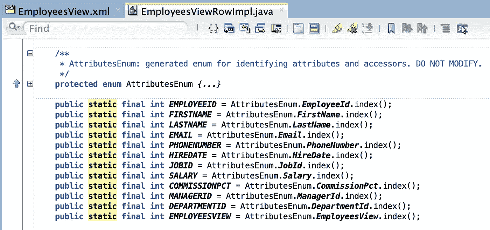
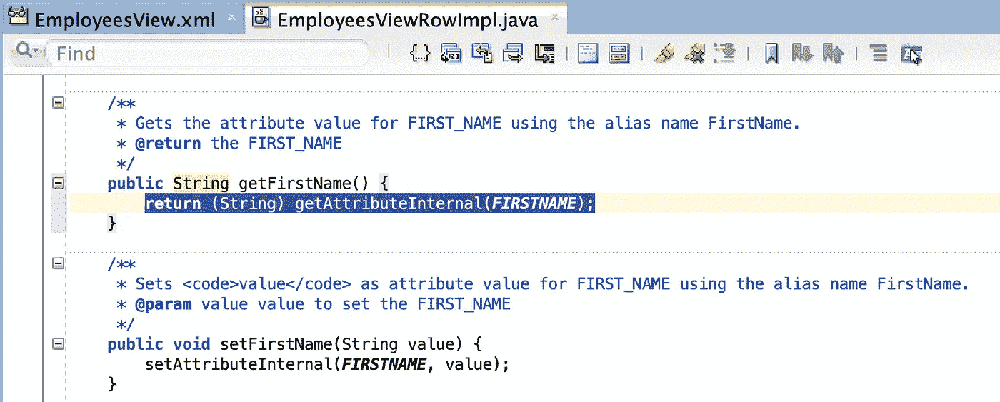
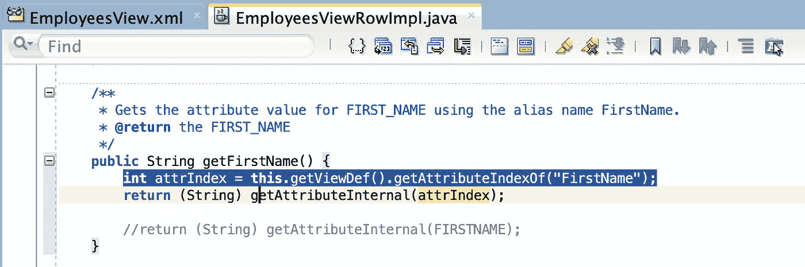
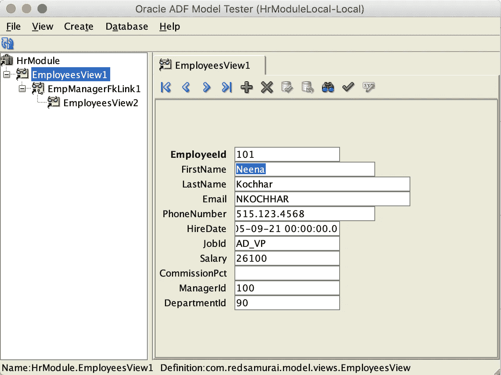

# 了解 ADF BC 行类中的属性枚举

> 原文：<https://medium.com/oracledevs/understanding-attributes-enum-in-adf-bc-row-class-d842435e6d95?source=collection_archive---------0----------------------->

你有没有想过为什么属性枚举是由 JDeveloper 在实体或视图行类中生成的？Attributes Enum 保存属性名的集合，并且有一组带有属性索引的静态变量。这些索引用于在 getter/setter 中定位属性。属性枚举是 JDeveloper 在设计时生成 Java 代码所需的结构。只有在 getter/setter 中使用静态变量索引时，才需要运行时属性枚举。视图行类中的属性枚举和静态索引列表:

在 getter/setter 中使用静态索引来访问属性:

属性枚举模仿 VO/EO 中的属性顺序。你可以把它想象成属性元数据。不一定要使用属性枚举中的索引。在某些用例中，您可以直接从 VO/EO Def 获取属性索引，并使用它来访问属性:

使用重写的 getter 正确提取名字:

从 [GitHub](https://github.com/abaranovskis-redsamurai/ADFAttributEnumApp) 下载示例代码

*原载于 2018 年 12 月 23 日*[*【andrejusb.blogspot.com*](https://andrejusb.blogspot.com/2018/12/understanding-attributes-enum-in-adf-bc.html)*。*