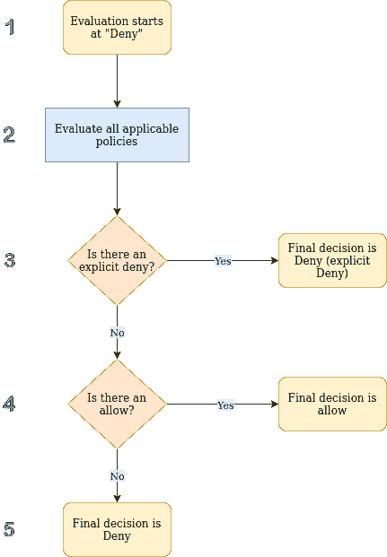

# 从零开始了解 AWS IAM 策略和最佳实践

> 原文：<https://medium.com/globant/understanding-aws-iam-policies-best-practices-from-zero-b51ff57dcbc8?source=collection_archive---------0----------------------->

# **简介**

我使用 AWS 已经很长时间了，其中最关键的，有时也是最难理解的方面是 IAM 策略的正确管理。

我知道许多公司有许多限制来强制创建适当的 IAM 策略，但情况并非总是如此。

此外，我不会说谎，我对 IAM 策略的创建轻描淡写了很多次，原因有很多，环境并不重要，这只是一个概念验证，我会立即删除资源，AWS 是完全安全的，还有很多原因，你可以说出他们的名字。然而，当你养成了轻写 IAM 策略的习惯，你就习惯了(一个巨大的错误)。

为什么会这样呢？我说的是我自己，但我以前也见过很多人这样做，所以我可能不是唯一一个利用这种不良做法的人。

通常，编写 IAM 策略的原因之一是因为您没有足够的时间(谁有足够的时间？)而且你并不完全了解它们是如何工作的。我将尝试简单而深入地解释 IAM 策略是如何工作的，这样下次编写策略时，就可以避免使用通配符。

本文将回顾以下部分:

IAM 策略的基础

政策评价

最小特权原则

结论

# **IAM 政策基础**

让我们从基础开始，IAM 策略允许对访问特定 AWS 资源所需的权限进行粒度级访问定义。策略附加到 IAM 身份(用户、用户组或角色)或 AWS 资源。当 IAM 主体(用户或角色)发出请求时，AWS 会评估这些策略。

IAM 策略被定义为 JSON 文档，由一些元素组成，这里我们只详细讨论其中的 4 个:**语句**、**效果**、**动作**和**资源**，其中前 3 个是语句元素的一部分。这是 IAM 策略的典型示例:

```
{ “Statement”: { “Effect”: “Allow”, “Action”: “ec2:DescribeInstances”, “Resource”: “*” }}
```

**声明**:这是 IAM 政策的主要元素，也是必需的。Statement 元素可以包含多个单独的语句，其中单独的语句包含在{}块中。

**效果**:指定该语句是被允许还是被明确拒绝。只有两个可能的值:允许或拒绝。

**动作**:定义允许或拒绝的动作列表。每个 AWS 服务都有自己的一组操作，例如:

*ec2:描述实例*

*rds:created instance*

s3:列表对象

*sqs:SendMessage*

**资源**:定义语句覆盖的对象。它被定义为可以唯一标识 AWS 资源的亚马逊资源名(ARN)。

# **政策评估**

现在已经定义了 IAM 策略的基本结构，我们可以更进一步，讨论如何评估 IAM 策略。



1.  评估总是以隐式拒绝开始，这是因为 AWS 中的所有内容在默认情况下都会被拒绝。
2.  评估效果元素。
3.  如果 Effect 的值是 Deny，则评估将是拒绝请求。
4.  如果 Effect 的值为 Allow，则评估将允许该请求。
5.  如果没有找到 Allow，评估将是拒绝请求。

正如你所注意到的，评估过程非常简单，一点也不复杂。当您需要为涉及多个操作的操作创建策略时，事情就变得复杂了(并且您没有指定哪些操作是那些操作)。

**最小特权原则**

在 AWS 上定义策略是基于最小特权的原则，这意味着您给予身份完成其职责所需的最少的访问和责任。一个好的做法是始终从最小的权限集开始，并在必要时授予额外的权限。

一个常见的例子是为 RDS 数据库创建备份和管理快照。这个操作实际上涉及到许多您需要授权来执行整个操作的操作。
如果您很匆忙，您可能会尝试创建一个带有通配符的策略，允许 RDS 中的所有操作，如下所示:

```
{ “Statement”: { “Effect”: “Allow”, “Action”: “rds:*”, “Resource”: “*” }}
```

该策略将授予主体对 RDS 上所有操作的访问权限，但是所有操作都包括危险的操作，如删除所有数据库，所以这确实不是一个好的做法。

这个用例的理想策略将列出每个需要的操作，然后将资源部分的范围缩小到那些需要的 arn。

```
{ “Statement”: [ { “Effect”: “Allow”, “Action”: [ “rds:AddTagsToResource”, “rds:DeleteDBSnapshot” ], “Resource”: “arn:aws:rds:us-east-1::snapshot:db-snapshot” }, { “Effect”: “Allow”, “Action”: [ “rds:ListTagsForResource”, “rds:CreateDBSnapshot” ], “Resource”: “arn:aws:rds:us-east-1:*” }, { “Effect”: “Allow”, “Action”: [ “rds:DescribeDBSnapshots” ], “Resource”: “*” } ]}
```

这演示了如何缩小策略的操作和资源部分；但是，您可能会注意到在策略的末尾有一个通配符，我们一直在讨论使用通配符作为一种通用的良好做法？

通常不建议使用通配符，但有时需要使用通配符，因此，如果您的某个策略(例如，上面的策略)需要使用通配符，也不必惊慌，因为您可能有多个快照，并且不可能在一个列表中逐个引用它们。

**结论**

最后，创建 IAM 策略至关重要，但并不困难或不可能。以下列表总结了创建 IAM 策略时的最佳实践:

*   授予最小特权。仅授予执行任务所需的权限。
*   验证策略。可以使用 IAM Access Analyzer 之类的工具，当语句被认为权限过大时，它会生成安全警告。
*   基于访问活动生成策略。IAM Access Analyzer 可以检查 AWS CloudTrail 日志，并使用实体已使用的权限生成策略模板。
*   使用 AWS CloudTrail 查看事件。您可以使用 AWS CloudTrail 来跟踪 identity 使用的权限，并在需要时删除不必要的权限。