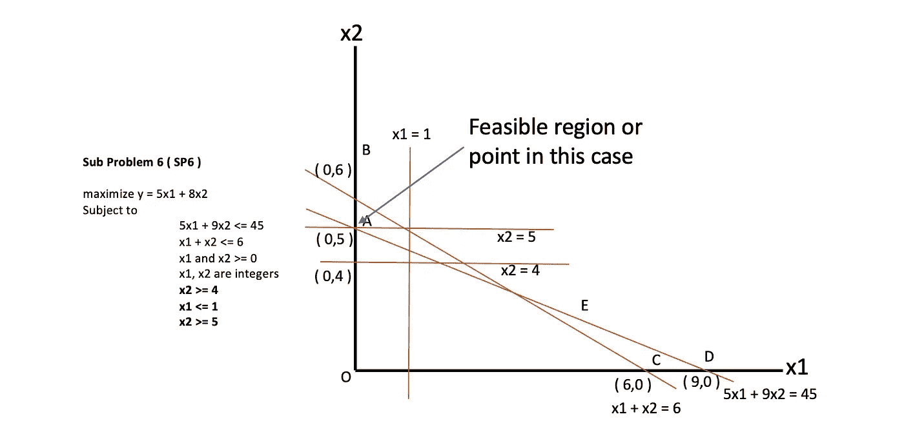

# 理解最优化问题中的分支和界限

> 原文：<https://medium.com/walmartglobaltech/understanding-branch-and-bound-in-optimization-problems-d8117da0e2c5?source=collection_archive---------0----------------------->

[Photo Credit](https://pixabay.com/photos/tree-nature-wood-kahl-log-tribe-3097419/)

# **1。简介**

在谈论分支和界限之前，让我给你一些基于最优化问题的背景。大多数企业试图用最少的投入获得最大的产出(例如通过投入最少的资本获得最大的利润)。不仅是企业，我们作为个人也试图优化我们的个人目标。以减肥为例。由于我们繁忙的日程安排，我们没有太多的时间每天跑长距离。我们可以通过避免电梯和走楼梯来增加每分钟运动消耗的卡路里。我们也可以用均衡的饮食来补充。沃尔玛也有各种各样的业务问题，需要类似的优化，从为客户设定商品的最低价格而不损失目标利润，优化库存中的商品可用性，为技术人员计算出在商店中开放门票的最佳路线，以及为开展活动和改造商店而选择商店。这些问题的基本公式保持不变，即在遵循其他约束的同时最大化/最小化你的目标。处理这些问题的数学分支叫做线性规划。**线性规划(**也称线性优化 **)** 是一种数学建模技术，用于实现最佳结果(如最大利润或最低成本)，其要求由线性表达式或关系表示。

在这篇博客中，我将带您了解一个基本整数线性规划问题示例的分支定界方法的工作原理，并将其扩展到许多使用 PULP python 库的企业所面临的常见人员配备问题。快乐阅读！

# 2.什么是分支定界？

让我们举一个基本优化问题的例子

这里 x1 和 x2 是未知数。目标是最大化 y，y 是 x1 和 x2 的函数。用图解法解决这个问题会给我们一个可行的区域，如下所示。

考虑直线 5x1 + 9x2 = 45，x1 + x2 = 6。因为两个约束都小于等于条件，所以朝着原点用绿色标记的区域是可行区域。

求解方程

5x1 + 9x2 = 45

并且 x1 + x2 = 6

给

对于交点 E，x1 = 2.25，x2 = 3.75

现在我们有 5 个点，它们的值分别为 y ( 5x1 + 8x2)

O ( x1 = 0，x2 = 0)，y = 5*0 + 3*0 = 0

A ( x1 = 0，x2 = 5)，y = 5*0 + 3*5 = 15

B ( x1 = 0，x2 = 6)，y = 5*0 + 3*6 = 18

C ( x1 = 6，x2 = 0)，y = 5*6 + 3*0 = 30

D ( x1 = 9，x2 = 0)，y = 5*9 + 3*0 = 45

E ( x1 = 2.25，x2 = 3.75)，y = 5*2.25 + 3*3.75 = 41.25

D ( y= 45)是最大值。然而，它不在可行区域中，下一个最大值是 E，这给出了 y 的值，即 41.25。

这意味着 **x1 = 2.25** 和 **x2 = 3.75** 是其中的最佳方案。

您可以看到这两个值都是非整数。*考虑一下技术人员的工作时间或者是否选择商店都是不连续的业务问题。在这些解决方案必须采用离散值的场景中，我们需要为问题添加另一个约束。*

*x1 和 x2 为整数。*

上述方法不能保证整数解。现在*分支和绑定*就来玩了！

如果其中只有一个是整数，那么我们将开始对非整数值进行分支，以获得下一个最佳整数。在这种情况下，它们都不是整数。根据算法，我们将不得不开始分支更大的数，即 x2 = 3.75。考虑 x2 值的两个方面。

x2 ≤ 3 且 x2 ≥ 4

这将给出两个子问题 SP1 ( x2 ≤ 3)和 SP2 ( x2≥4)。

SP1 可以如下图所示

求解 SP1 得到 x1 = 3 和 x2 = 3，相应的 y ( 5x1 + 8x2)将是 39

SP2 可以如下图所示

求解 SP2 得到 x1 = 1.8 和 x2 = 4，相应的 y ( 5x1 + 8x2)将是 41

左分支的两个根都是整数，所以我们将对其进行限制。右分支将进一步分支，因为其中一个根 x1 仍然不是整数。考虑 x1 值的两边。

x1≤1 且 x1 ≥ 2

这将给出两个子问题 SP3 ( x1 ≤ 1)和 SP4 ( x1≥2)。

求解 SP3 得到 x1 = 1 和 x2 = 4.44，相应的 y ( 5x1 + 8x2)将是 40.5。

x2 不是整数，所以这个会进一步分支。这将给出两个子问题 SP5 ( x2 ≤ 4)和 SP6 ( x2≥5)。

求解 SP4 得到 x1 = 2 和 x2 = 4，相应的 y ( 5x1 + 8x2)将是 42。然而，图中没有可行区域。该子问题被丢弃，并且不会被考虑用于最终解决方案。

下一步是以类似的模式求解 SP5 和 SP6。

对 SP5 来说，可行域是 x2 = 4 的直线，解是 x1 =1

x 2 =4。y 的相应值是 37

对于 SP6，可行域是直线 x2 = 5，解是 x1 =0，并且

x 2 = 5，表示 y 的最大值，即 40。

不，我们将比较所有叶节点(即 SP1、SP5 和 SP6)的目标函数值与可行解。

由于 SP6 给出了 y = 40，这是所有叶节点中的最大值，

*x1 = 0，x2 = 5 为最优解！！*

# **示例 1:使用 PULP 在 python 中实现的玩具问题示例**

PuLP 是一个用 Python 写的线性编程建模器。它是一个开源包，允许用 Python 编程语言描述数学程序。它是一个高级建模库，利用 Python 语言的强大功能，允许用户使用 Python 语言的自然表达式创建程序，尽可能避免使用特殊的语法和关键字。这种语法很容易编写，对于许多常见的业务问题都可以解释。它还使得使用 PULP 将业务问题转化为目标函数和约束变得非常容易。

让我们首先尝试解决第 2 节中使用的一个玩具示例。

我在这里不打算详细介绍纸浆库。详细教程你参考这个[链接](https://coin-or.github.io/pulp/)。

1.  安装完纸浆库后，开始导入。

*从纸浆进口**

2.根据问题定义，创建一个问题变量，将其声明为最大化问题。

*#创建‘概率’变量*

*prob = LpProblem("测试问题"，LpMaximize)*

3.将两个问题变量 x1 和 x2 声明为整数。下限为零，上限为“无”。

*#变量 x1 和 x2 的下限为零，并声明为整数*

*x1=LpVariable("var1 "，0，None，LpInteger)x2=LpVariable("var2 "，0，None，LpInteger)*

4.定义目标函数

*#目标函数先加到“prob”上
prob += 5*x1 + 8*x2，“最大输出”*

5.添加两个约束

*#两个约束相加
prob += 5*x1 + 9*x2 < = 45，" constraint 1 "
prob+= x1+x2<= 6，" constraint2"*

6.运行求解函数。这一步运行本博客第 2 节中讨论的分支定界算法步骤

*#问题数据写入. lp 文件
prob . writelp(" test _ model . LP ")*

*#使用纸浆选择的求解器解决问题
prob.solve()*

7.检查解决方案的状态。如果这返回最优，这意味着在一个叶节点中至少有 1 个可行解

*#在屏幕上打印解决方案的状态
print ("Status:"，LpStatus[prob.status])*

8.打印问题的根源/解决方案

*#在 prob . variables():
print(v . name，" = "，v.varValue)* 中，打印每个变量及其解析的最佳值

你会发现你得到了相同的解，即 x1 = 0，x2 = 5。这与我们在第 2 节中通过手动计算得到的结果相符！

你可以在下面看到完整的代码-

# 示例 2:商店改造中的人员配备问题

改造是任何设施部门的主要职责之一。在这个练习中，需要将大量资源部署到需要改造的商店。

假设计划对仓库进行重大改造。作为第一阶段的一部分，有许多管道和电气任务，许多票证处于开放状态。以下是一些重要的注意事项:

运营经理希望在 80 天内关闭尽可能多的票证。

技术人员的工作时间是从上午 10 点到下午 4 点，即每天 6 小时。关闭一张水管维修单需要 2 个小时，而关闭一张电气维修单需要 3 个小时。

在某个时间点，只有一名技术人员(一名管道工或一名电工)可以在商店工作，这样就不会影响日常运营和改造单的性质。

商场运营经理希望在这 80 天内至少关闭 5 张电气和 2 张管道罚单。

关闭的电气和管道工作票的数量之差不应超过 10。

每个技术人员工作的小时数应该是整数，因为系统只能捕获离散小时值的持续时间(分钟级别的详细信息是不可能的)。

让我们试着一步一步地理解解决方案的方法和在 PULP 中的实现。

1.  安装完纸浆库后，开始导入。

*从纸浆导入**

2.根据问题定义，创建一个问题变量，将其声明为最大化问题。我们希望最大限度地增加关闭的门票数量。

*#创建‘prob _ tech _ staffing’变量
prob _ tech _ staffing = LP problem(" technician staffing "，LpMaximize)*

3.将两个变量*电工工作小时数 hrsE 和水管工工作小时数 hrsP 声明为整数，如问题陈述中所述。*

*#电工工作小时数 hrsE 和水管工工作小时数 hrsP 这两个变量的下限为零，并声明为整数。*

*hrs_P=LpVariable("水管工必须在店里工作的小时数"，1，无，LP integer)
hrs _ E = LP variable("电工必须在店里工作的小时数"，1，无，LpInteger)*

4.接下来必须声明问题的目标。目标是在 80 天的指定时间内关闭最大数量的票证。

电工工作的总时间-> hrsE

管道工工作的总时间-> hrsP

电气票总数= hrsE/3

管道工程票总数= hrsP/2

门票总数= hrsE/3 + hrsP/2

*让我们称我们的目标函数为*

*count _ tickets =*hrsE/3+hrsP/2

最大化 *count_tickets 是目标。*

*#目标函数被添加到“prob_tech_staffing”的第一个
prob _ tech _ staffing+=(hrsE/3)+(hrsP/2)“基于电工和管道工工作的最大小时数的最大票数”*

5.现在让我们添加约束

a)至少关闭 5 张电工票

电气票总数=电工工作的总小时数除以 2(关闭一张电气票所需的小时数)，即 hrsE/2 ≥ 5

这可以表示为 hrsE >= 5 * 3

*prob _ tech _ staffing+= hrsE>= 5 * 3，“至少关闭 5 张电工票”*

b)至少关闭两张管道票

类似于先前的约束

*prob _ tech _ staffing+= hrsP>= 2 * 2，“至少要关闭两张管道票”*

c)最多 480 小时(6 小时* 80 天)

*prob _ tech _ staffing+= hrsE+hrsP<= 480，“最大可用 480 小时(6 小时* 80 天)”*

d)电气和管道计数之间的差异不应超过 10

因为关闭一张水管维修单需要 2 个小时，而关闭一张电子维修单需要 3 个小时。

# hrsE/3—hrsP/2<=10

After doing cross multiplication we get

#2*hrsE — 3*hrsP <= 60

*prob _ tech _ staffing+= 2 * hrsE—3 * hrsP<= 60，"电气和管道数量之间的差异不应超过 10"*

类似地，增加了一个约束

# hrs _ P/2—hrs _ E/3<= 10

#3*hrs_P — 2*hrs_E <= 60

*prob _ tech _ staffing+= 3 * hrs _ P—2 * hrs _ E<= 60，“管道和电气计数之间的差异不应超过 10”*

6.让我们现在就跑吧。

*#问题数据被写入 an。lp 文件
prob _ tech _ staffing . writelp(" tech _ staffing _ model . LP ")*

*#使用纸浆选择的求解器解决问题
prob _ tech _ staffing . solve()*

*#将解决方案的状态打印到屏幕上
print ("Status:"，LP Status[prob _ tech _ staffing . Status])*

*#在 prob _ tech _ staffing . variables():
print(v . name，" = "，v.varValue)* 中，每个变量都打印有其解析的最佳值

运行该命令将得到以下输出:

解决了这个问题

电工必须工作的小时数:276

水管工必须工作的小时数:204

可以完成的票证总数= hrsE/3 + hrsP/2

也就是说，鉴于电工和技术人员将分别在商场工作 276 小时和 204 小时，80 天内可以完成 100 张罚单。

由于变量 hrsE 和 hrsP 是整数，分支定界是优化算法的主干。关于算法如何工作的更多细节将在后面的章节中讨论。

这意味着在这 80 天内最多可以关闭 276/3 = 92 张电气票和 204/2 = 102 张管道票！您可以验证该解决方案的所有声明的约束。

请看下面的完整代码-

这个问题公式可以扩展到更复杂的场景，如带薪休假、临时会议、弹性工作时间、多个商店场景的商店之间的旅行时间、一次需要多个技术人员的票证、紧急票证的处理、不同票证所需时间的变化以及处理多个其他行业，如景观美化、墙壁粉刷、安全设备的安装、垃圾清理等。

# **5。结论**

我希望我能够解释分支定界的本质，它是解决整数线性规划问题的核心算法之一，也被许多流行的软件包使用，如 PULP、CVXPY 等。您还看到了如何使用 python 中的 PULP 库解决一个玩具问题和一个更现实的业务问题。这些公式是处理更复杂的现实世界问题的良好起点。

开始思考商业问题，比如

->针对多个并行任务的实时劳动力调度，或者

->为货架上易腐产品生命周期的每个阶段设定最优价格，或者

->如何在不影响品种、过敏或选择的情况下规划均衡的饮食

->如何优化罐头食品的成分以获得最佳营养！

# 6.参考

 [## 数学规划系统的分支定界方法

### 分支和边界算法已被纳入许多数学规划系统，使他们能够解决…

www.sciencedirect.com](https://www.sciencedirect.com/science/article/abs/pii/S0167506008703510)  [## 0-1 混合整数规划问题的分枝定界算法

### 魏茨曼 ML，戴维斯 RE，肯德里克达。零一混合整数规划问题的分枝定界算法…

scholar.harvard.edu](https://scholar.harvard.edu/weitzman/publications/branch-and-bound-algorithm-zero-one-mixed-integer-programming-problems)  [## 旅行推销员问题-维基百科

### 旅行推销员问题(也称为旅行推销员问题或 TSP)提出了以下问题…

en.wikipedia.org](https://en.wikipedia.org/wiki/Travelling_salesman_problem)  [## 使用 Cvxpy 的 Python 中的基本分支定界求解器

### 分支定界是一种有用的问题解决技术。这个想法是，如果你有一个最小化的问题，你想…

www.philipzucker.com](https://www.philipzucker.com/a-basic-branch-and-bound-solver-in-python-using-cvxpy/) 

[https://www . coin-or . org/PuLP/main/optimization _ concepts . html](https://www.coin-or.org/PuLP/main/optimisation_concepts.html)

 [## 分支定界算法

### 分支定界是一种算法设计范式，通常用于解决组合优化问题

www.geeksforgeeks.org](https://www.geeksforgeeks.org/branch-and-bound-algorithm/)  [## 一个混合问题-纸浆 v1.4.6 文档

### 如上图所示，威士卡猫粮由本叔叔制造。本叔叔想把他们的猫粮产品生产成…

www.coin-or.org](https://www.coin-or.org/PuLP/CaseStudies/a_blending_problem.html#problem-description)  [## 在线优化

### 计算优化及应用

www.optimization-online.org](http://www.optimization-online.org/links.html)