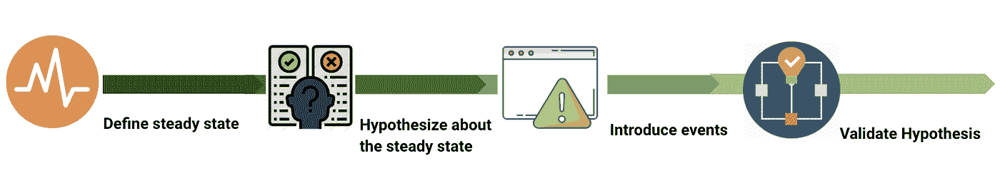
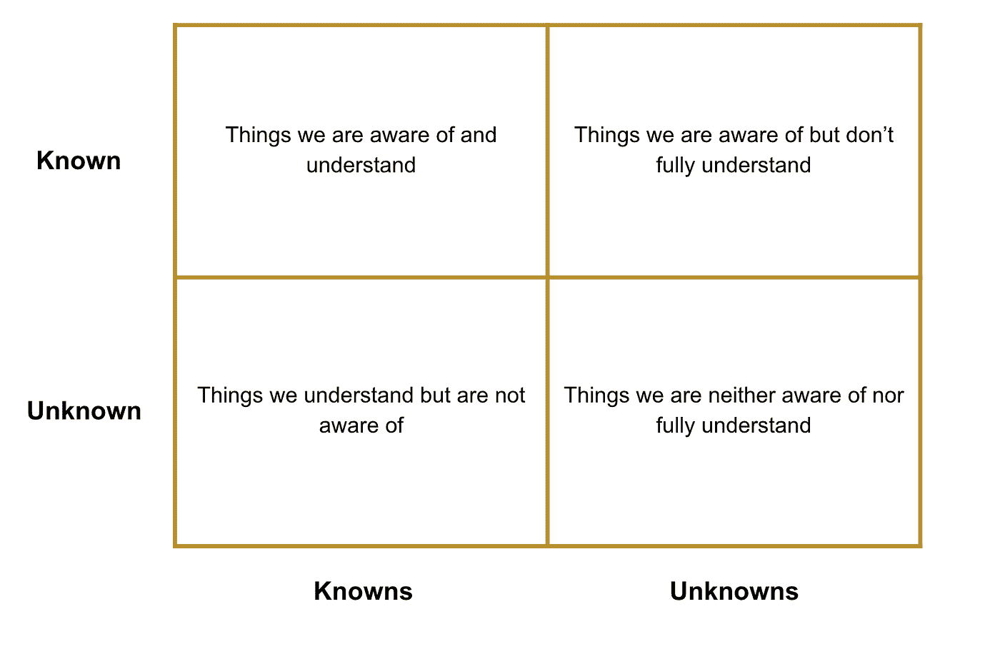
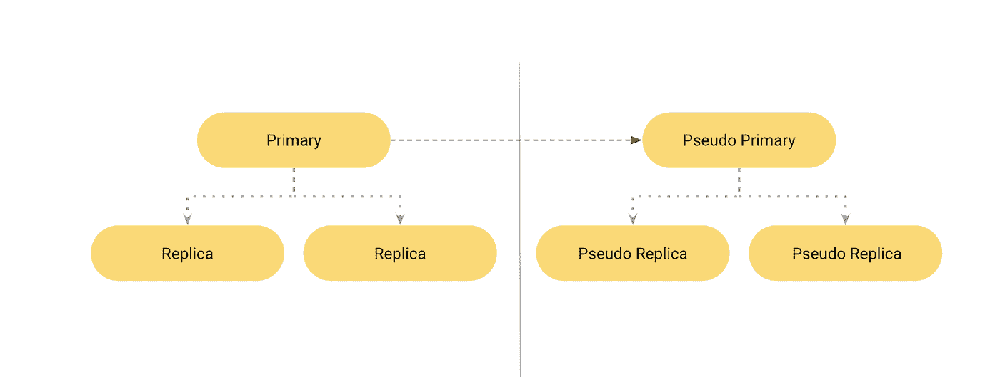

# 理解混沌工程

> 原文：<https://medium.com/globant/understanding-chaos-engineering-ab8c2fecda7d?source=collection_archive---------1----------------------->

作者:[Anagha Pawar](https://medium.com/u/1b2f43a52d63?source=post_page-----ab8c2fecda7d--------------------------------)&[Piyush Johar](https://medium.com/u/1ada7bf6ed6a?source=post_page-----ab8c2fecda7d--------------------------------)

## **简介**

在过去的几年里，我们已经看到了系统构建方式的重大变化。企业继续接受大规模分布式云架构和微服务，因为它们在可伸缩性和易于集成方面具有优势。然而，这也使得系统变得复杂和难以预测。传统的测试方法无助于验证和预测这些系统的行为。正是在这里，混沌工程可以帮助引入所需的信心，并证明系统具有弹性和容错能力。

## **混沌工程**

混沌工程可以被定义为一种系统化的方法，用它来试验系统承受湍流条件的能力。不是随机的工程实验，也不是无监督的实验。重点是以深思熟虑的方式将各种灾难场景引入基础设施，并测试和记录系统在这些诱发条件下的响应能力。

## **原理**

混沌工程就是主动进行实验，以揭示分布式系统的弱点。这是建立对系统信心的一种方式，揭示弱点和可能的缓解措施。因此，有必要描述这种可以被称为混沌实验的实验进行的方式。

以下步骤定义了混沌实验的典型流程:

1.  **定义稳定状态** 稳定状态可以定义为系统的一些可测量的输出，表示正常行为，比如错误率、吞吐量、系统延迟等。
2.  **关于稳定状态的假设**
    假设这种稳定状态将在对照组和实验组中持续
3.  **介绍真实世界事件** 通过介绍真实世界事件，如服务器崩溃、网络故障、停电、硬盘故障等，让实验组参与实验。
4.  **验证稳态并确认假设**
    通过对比对照组和实验组的稳态来检验假设。方差越小，我们对系统越有信心。

## **混沌工程在行动**:

混沌实验的设计应该考虑系统的所有服务，而不仅仅是测试系统中的单个组件。跟踪和监控各种度量可以提供对系统稳定状态的可见性，并有助于对实验做出正确的结论。这些指标可以是 CPU 使用率、内存、磁盘使用率、响应时间等。

一般来说，当设计混沌实验时，可以采用下面的过程。

1.  **挑选一个假设:**
    系统可接受的行为应视为稳态。目标是开发一个基线模型，该模型基于各种度量来描述系统的稳定状态。稳定状态可以通过定期测试应用程序和收集描述系统最健康状态的指标来确定。一旦我们有了稳定状态的行为和度量，我们就可以推导出实验的假设/输出。
2.  **选择实验的爆炸半径** :
    在计划实验的时候，我们需要仔细考虑我们需要走多远才能了解关于这个系统的一些有用的东西。我们应该把实验可能影响的区域定义为爆炸半径。如果在生产中运行，应该确定实验的范围，以最大限度地减少对真实客户的影响。尽管在更接近生产的地方运行测试会产生更好的结果，但是不包含爆炸半径会导致重大问题。一个推荐的方法是最初在分级环境中开始实验，尽可能进行最小的测试，直到获得信心并准备好模拟更大的事件。
3.  **选择正确的指标:**
    从一组可用的指标中，选择可用于评估实验结果的正确指标非常重要。频繁地评估这些将确保准确地捕捉系统正在进行的行为，并有助于识别潜在的陷阱，并在对系统有较大影响时帮助中止实验。
4.  **涉及所需团队:**
    通知并让各个模块团队了解将要进行的实验非常重要，以便他们做好应对准备。这在采用混沌工程的初始阶段是必需的。一旦团队习惯了这些类型的实验，他们就会获得信心，并开始整合正确的措施和修正。如果实验在生产中运行，应该通知相关的涉众，并且应该计划在决定的停机时间内执行实验。
5.  **运行实验:** 在这里，我们开始执行实验，并观察异常行为的指标。我们应该准备好中止和回滚计划，以防我们在关键指标读数中看到巨大的差异，并注意到实验对系统造成了太多的损害或影响。实验应该尽可能模拟真实世界的事件。围绕内存过载、网络延迟和故障、CPU 消耗和耗尽、死锁和依赖性故障、服务之间的通信故障以及不要忘记功能缺陷来试验和修复事件，可以增加对系统可靠性的信心。
6.  **分析结果:** 这里的重点是在实验完成后分析指标和结果，并验证假设是否正确或系统的稳态行为是否有变化。结果与所需的团队共享，以便他们可以修复它们。实验越难偏离系统行为，对系统可靠性的信任就越高。
7.  **增加爆炸半径:** 随着我们较小输入和范围的实验开始成功，我们可以开始增加范围。这也有助于我们确定系统的突破点。

## **实验的少量样本输入**

实验可能因系统的架构而异，并且可能很多。然而，在部署在云上的分布式系统和微服务架构中，以下是最常见的实验:

*   使得实例从定义的区域随机不可用/不可达。
*   模拟整个地区或区域的故障。
*   消耗和耗尽实例上的 CPU 和内存资源。
*   创建死锁，使得正在使用的资源不被释放。
*   在服务之间注入预定时间段的等待时间。
*   随机注入基于函数的混乱导致函数抛出异常。
*   向目标程序添加指令，并允许在某些指令之前进行故障注入。

## **最佳实践**

考虑到混沌工程中所涉及的实验的性质，以及它们对系统的影响，参考和使用以前进行的实验的经验作为指导和参考点是没有坏处的。它不仅有助于减轻已知的风险，还能指导坚持最佳实践。几个要点包括:

*   **最小化爆炸半径:** 从小实验开始，了解未知。从单个实例、容器或微服务开始，以减少潜在的副作用。一旦我们获得了信心，我们就可以扩大实验规模。
*   **从试运行环境开始:** 为了安全起见并在测试中获得最初的信心，从试运行环境开始将是理想的。一旦在此环境中的测试成功，就可以进入生产环境。
*   **对实验进行优先级排序:** 生产中运行的混乱实验会对核心业务功能产生影响。因此，优先考虑可以安全执行而不会造成业务影响的实验会有所帮助。

这里的方法也是对系统的所有服务进行分类。在“关键”或“非关键”桶下。这可以由诸如服务接收的流量百分比、服务的输出等因素来确定。

首先从非关键服务开始实验，以验证这些服务的不可用性是否得到妥善处理，以及核心业务功能是否不受影响。如果对非关键服务的攻击导致系统停机，那么这些服务需要转移到关键服务类别下。

进行实验时，应采用以下顺序:

例如:假设我们有容器化的环境，在现有容器由于服务器崩溃或其他问题而消失的情况下，它有助于快速创建和部署新容器。

所以把这个映射到上面的顺序，

**已知已知**:我们知道并理解的事情
这里我们知道，当一个节点或副本容器关闭时，它将从节点集群中消失。将创建新的副本并重新添加到群集。

**已知-未知**:我们知道但不完全了解的事情
这就是我们知道上述内容的地方，但我们不知道从摧毁一个克隆体到创造一个新的克隆体所需要的时间。

**未知-已知**:我们了解但不知道的事情
在这种情况下，我们不知道在特定日期或特定环境下创建新副本的平均时间，但我们知道有多少副本，以及有多少副本将被创建来替换它们。

**未知-未知**:我们既不知道也不完全了解的事情
例如，我们不知道当整个系统关闭时会发生什么，也不知道虚拟区域故障转移是否有效，因为我们没有以前的试验或比较基准。

*   **准备好终止和恢复:** 确保我们已经做了足够的工作来立即停止/终止任何实验，并在实验导致严重中断的情况下将系统恢复到正常状态。进一步确保仔细跟踪实例，并进行分析以避免再次发生。
*   **估算成本和投资回报** :
    停机对业务的影响因业务性质而异。中断对收入的影响可以通过事故、中断的数量、严重程度以及与客户的合同义务来计算。因此，将这些与运行混沌实验的成本进行比较，将有助于得出正确的结论。
*   **尽可能使用工具:** 使用市场上的多种工具，了解他们的产品。比较它们提供的功能、它们帮助覆盖的场景，以及不使用它们而执行时所需的时间和精力。选择工具来执行深思熟虑的、有计划的和受控的实验，并帮助测量对被测系统有用的特定指标。

## **混沌工程的挑战**

实施混沌实验并不容易，而且确实有其自身的挑战。其中包括:

*   实施实验的努力。构建一个足够系统的方法来涵盖“足够多”的场景可能是一个重大挑战。
*   这些混沌实验本身带来的风险，如果没有经过适当的思考。这些可能导致系统的完全中断，甚至在它们被中止之前。很多时候伤害是如此严重，无法挽回。因此，需要制定一个全面的计划和缓解流程。
*   分析混沌实验的结果可能是一个乏味的过程，需要付出努力。尽管实验有时可以很好地识别弱点，但有时实施修复可能会破坏整个实现。

## **混沌工程的好处**

实施混沌工程的根本好处是他们能够在弱点作为事件出现在生产环境中之前识别出它们。其他优势包括:

*   有助于防止收入和维护成本的巨大损失。停机通常会给公司造成数百万美元的收入损失，具体取决于系统的使用情况和停机的持续时间。不要忘记公司的声誉可能会在这个周期中受损。
*   增强实施灾难恢复方法的信心。大多数团队对全面灾难恢复没有足够的信心，因为他们只在极端灾难情况下执行这些任务。如果整个团队都采用了混沌工程的原则，灾难恢复实践可以更加简化，并且可以更加自信地执行。
*   发现的问题可以帮助工程师更好地理解他们开发的系统。工程师还可以了解系统的哪些部分是最关键的，哪些是不太关键的。

## **工具**

随着混沌工程的不断发展，市场上的各种工具也在不断发展。每一种都有自己的一套功能、易用性、系统/平台支持和可扩展性。以下是一些可用于进行混沌实验的工具:

*   **混沌猴** 它是最早的开源混沌工程工具之一。它主要帮助终止虚拟机实例。作为 Simian Army 项目的一部分，这些工具中的许多已经退役或集成到其他工具中，如 Swabbie、Spinnaker。https://netflix.github.io/chaosmonkey/

*   Gremlin
    Gremlin 提供了一个失败即服务工具，使混沌工程更容易部署。它包括负责任地破坏基础设施的各种安全措施。
    https://www.gremlin.com/
*   **ChaosBlade** 该工具支持广泛的平台，包括 Kubernetes、云平台和裸机。它提供了数十种攻击，包括数据包丢失、进程终止和资源消耗。它还支持 Java、C++和 Node.js 应用程序的应用程序级故障注入，提供任意代码注入、延迟代码执行和修改内存值。
    [https://github.com/chaosblade-io/chaosblade](https://github.com/chaosblade-io/chaosblade)
*   **ChaoSlingr** 这是一个安全混沌工程工具，主要关注 AWS 基础设施上的实验，以突出系统安全弱点。[https://github.com/Optum/ChaoSlingr](https://github.com/Optum/ChaoSlingr)T21
*   **Chaos Mesh** 这是一个 Kubernetes-native 工具，提供 17 种独特的攻击，包括资源消耗、网络延迟、数据包丢失、带宽限制、磁盘 I/O 延迟、系统时间操纵，甚至内核崩溃。Chaos Mesh 是少数几个包含全功能 web 用户界面(UI)的开源工具之一，称为 Chaos Dashboard。
    [https://github.com/chaos-mesh/chaos-mesh](https://github.com/chaos-mesh/chaos-mesh)
*   这也是一个 Kubernetes-native 工具。它提供了大量用于测试容器、pod 和节点的实验，以及特定的平台和工具。
    [https://litmuschaos.io/](https://litmuschaos.io/)
*   这是一个在 Kubernetes 集群上运行实验的 CLI 工具。https://github.com/powerfulseal/powerfulseal

*   这是一个网络故障注入工具，允许用户创建诸如延迟、连接丢失、带宽限制和数据包操作等条件。顾名思义，它充当两个服务之间的代理，可以直接将故障引入流量。
    https://github.com/Shopify/toxiproxy
*   **Pumba** 它是 Docker 容器的混沌测试命令行工具。Pumba 通过使容器化的应用程序崩溃、模拟网络故障和对容器资源(cpu、内存、文件系统、io 等)进行压力测试来扰乱容器
    [https://github.com/alexei-led/pumba](https://github.com/alexei-led/pumba)

## **结论**

作为弹性策略的一部分，混沌工程展示了最不可思议的实践过程。这些混沌实验带来的机会和范围是无限的。有了正确的策略，涉众不仅会对他们的系统有必要的信心，而且还会帮助他们考虑到所有可能的陷阱来设计和构建系统，否则这些陷阱会被忽略掉。

**参考文献:** [https://www.gremlin.com/](https://www.gremlin.com/)
[https://principlesofchaos.org/](https://principlesofchaos.org/)