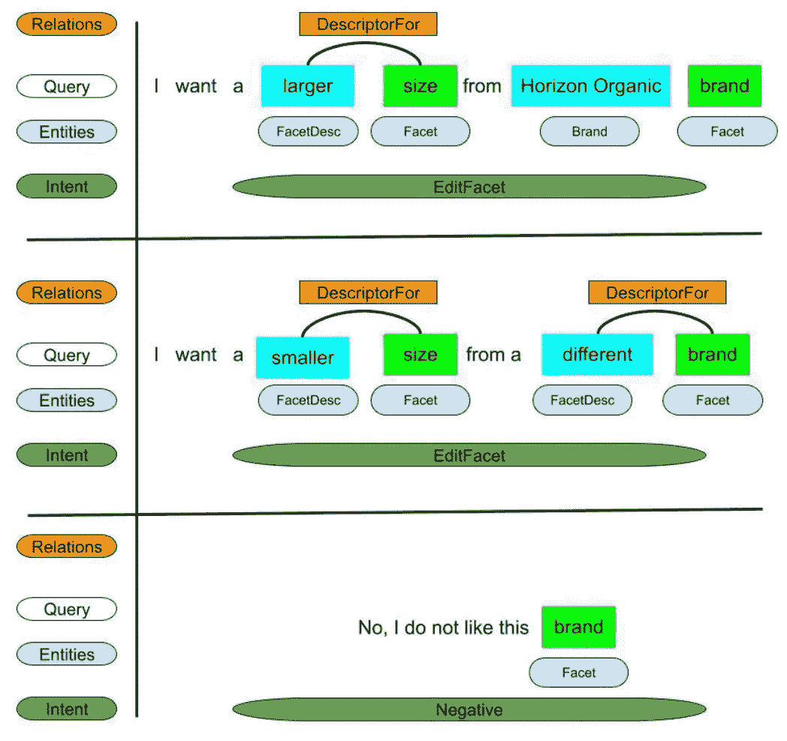
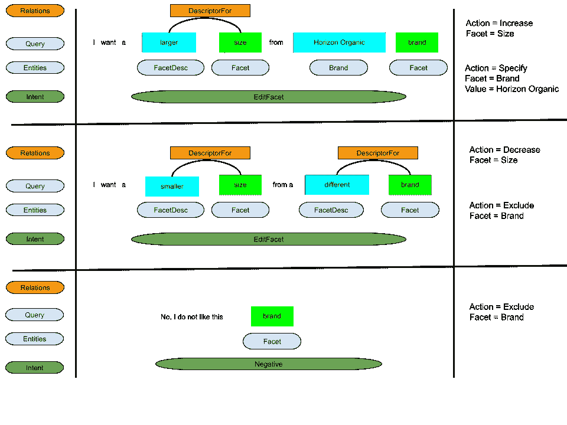
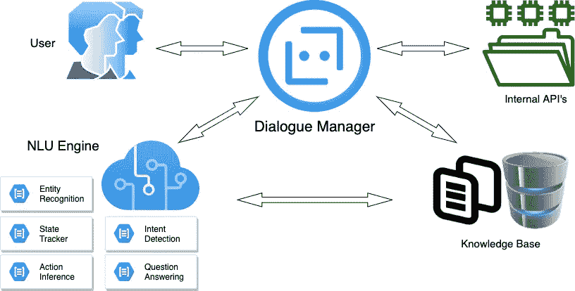
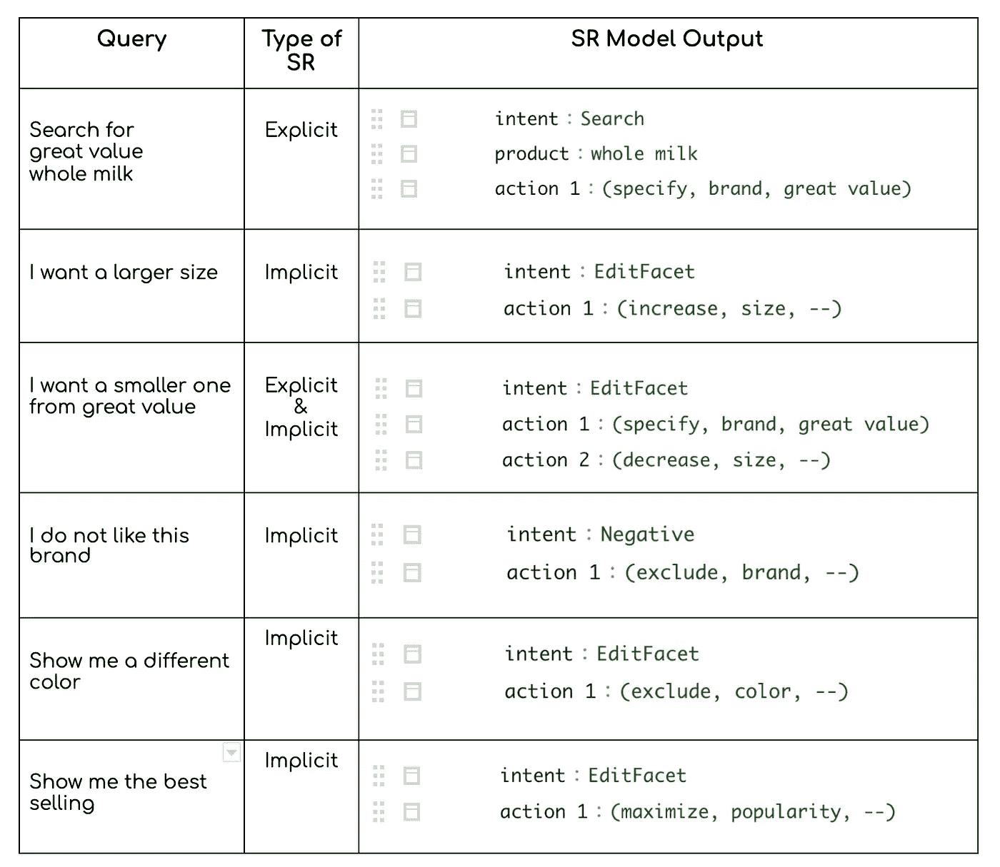
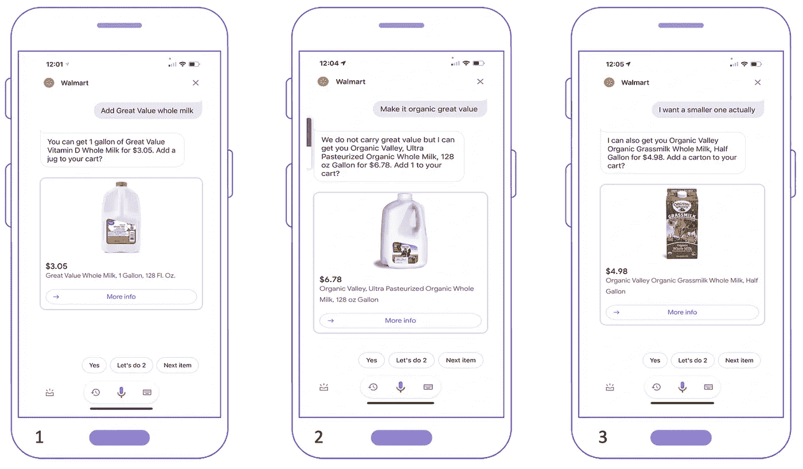

# 了解沃尔玛购物助手中的对话式搜索优化查询

> 原文：<https://medium.com/walmartglobaltech/understanding-conversational-search-refinement-queries-in-walmart-shopping-assistant-fc04e4f97532?source=collection_archive---------5----------------------->

智能对话助手在我们的日常生活中扮演着重要的角色。2019 年，在沃尔玛实验室，我们建立了自己的人工智能购物助手，旨在帮助客户在端到端平台上购买日常杂货。更多信息，请看我们之前的[帖子](https://medium.com/walmartglobaltech/tagged/voice-assistant)。大多数聊天机器人系统擅长单轮或开域对话。然而，特定领域的多回合对话系统具有更广泛的挑战。这些类型的聊天机器人被称为多回合面向任务的对话系统[ [4](https://www.aclweb.org/anthology/2020.acl-main.54/) ， [8](https://www.aaai.org/ocs/index.php/AAAI/AAAI17/paper/viewFile/14261/13975) ]。

零售领域非常适合面向任务的聊天机器人和助手，有关零售聊天机器人的一些示例，请参见[此处](https://research.aimultiple.com/chatbot-in-retail/)。在零售业中，有许多术语很少出现在公共语料库中，或者即使出现，它们也有不同的含义。例如，对于查询**“***购买 chips ahoy* ”，助理需要理解“chips ahoy”是一个饼干品牌。这使得对这些领域使用现成的预训练 NLP 模型而不在特定领域的语料库上重新训练或微调它们变得具有挑战性。

我们的购物助手非常注重搜索；这意味着用户通常通过开始搜索查询并花费接下来的几轮过滤结果来调用我们的助手来购买或重新订购产品。因此，我们继续这篇文章，概述在网络或应用程序中的产品搜索与在对话助手中的产品搜索之间的显著差异。

# 对话助手中的产品搜索

在传统的基于 web/app 的搜索系统中，用户会在多个页面上看到几个项目。它们还配备了多个复选框过滤功能和/或滑动按钮，帮助它们与项目进行交互，并排除一些结果。在对话助手或聊天机器人上，用户不能滚动浏览一大串产品搜索结果。因此，获得前几个相关的搜索结果(Precision @ k 或 P @ k)是必要的，尤其是顶部结果(P @ 1)。

在会话系统中，大部分信息隐藏在口头格式中，例如文本、语音，或者甚至与其他格式如图像等相结合。因此，系统需要利用用户的口头反馈，而不是依赖复选框或设置范围按钮。例如，在传统系统中，用户可以很容易地从页面左侧的品牌列表中排除某个品牌，或者通过取消选中该品牌。但是，在会话系统中，用户必须说/键入类似“*从不同的品牌*购买”的话语才能得到类似的结果。

为了设置产品价格，作为一个顶部交互属性，我们在应用程序或网络搜索引擎上看到设置范围按钮，可以为用户实现这一目的。但是在对话系统中，用户必须说类似于“*我想要少于 20 美元的东西”。此外，在第一个场景中，只要您单击 set-range 按钮，系统就会意识到您正在过滤的内容(这里是价格)。但在第二种情况下(即对话式系统)，系统完全有责任弄清楚“价格”是用户试图设定的产品的方面(方面)，而不用直接说出来。换句话说，系统也应该推断用户正在修改的方面。例如，对于查询“我想要一个更大的”，推断的方面是大小。*

在传统系统中，用户键入或说出他们喜欢的确切属性，而在对话系统中，用户有时倾向于首先纠正助手，然后提及他们喜欢的属性。例如，考虑这个查询:"*而不是* ***半加仑*** *，在一个* ***1 加仑*** *罐中得到它，请*"其中用户仍然在谈论以前的产品。换句话说，传统的零售搜索系统不是*上下文*。他们不记得用户搜索的最后一个产品，但是在对话系统中，在精炼搜索结果的同时通过多阶段对话来维护上下文是期望的，并且是基本的和具有挑战性的任务。如果用户通过搜索“尿布”开始对话，然后在接下来的几轮中通过更新商品的不同属性(如品牌和尺寸)来细化结果，那么每次都应该更新上下文，而不伤害用户的偏好。这种对对话系统的挑战在自然语言处理(NLP)领域创造了一个丰富的研究领域，称为“[对话状态跟踪](https://paperswithcode.com/task/dialogue-state-tracking)”([1](https://ojs.aaai.org/index.php/AAAI/article/view/6250)、 [3](https://arxiv.org/abs/2004.05827) 、 [6](https://ojs.aaai.org//index.php/AAAI/article/view/6856) 、 [7](https://www.aclweb.org/anthology/D18-1299/) 、 [8](https://www.aaai.org/ocs/index.php/AAAI/AAAI17/paper/download/14261/13975) )。

现在，在存在上述差异和挑战的情况下，问题是“我们如何使我们的系统能够为我们的客户提供无缝的购物体验？”。由于许多查询都是关于搜索产品的，我们构建无缝购物体验的目标源于在对话平台上提供一个强大而人性化的搜索过滤系统。这就是我们所说的对话式搜索优化系统，这将是下一节的主题。

## 什么是对话式搜索细化？

在这篇文章中，我们想介绍我们理解和处理搜索优化查询的方法。这些是我们的用户用来修改先前搜索结果的口头查询。我们试着用两个例子来说明产品搜索的一些问题:

**例 1(成功)**。

> **用户>** 搜索 4 码帮宝适纸尿裤。
> **助理>** 我可以给你帮宝适婴儿干燥特别保护尿布，4 号，92 码，计 26.70 美元。向您的购物车添加一个箱子？
> **用户>** 我想要小一点的。我还可以给你买帮宝适襁褓尿布，柔软吸水，4 码，66 Ct，24.94 美元。将 1 添加到您的购物车？
> **用户>** 完美，添加到我的购物车。

这个例子是一个成功的 SR 场景，因为在第二轮中，系统保留了“帮宝适”品牌，同时提供了一个较小的项目，并且用户也同意了它。

**例 2(故障)**。

> **用户** >我要有机全脂牛奶。
> **助手>** 你可以买到地平线有机全脂 DHA Omega-3 牛奶，半加仑 4.46 美元。将 1 添加到您的购物车？我想要一个不同品牌的大一点的罐子。我可以给你买有机谷超级巴氏杀菌有机全脂牛奶，128 盎司，6.97 美元。将 1 添加到您的购物车？
> **用户** >这次超值买。
> **助理>** 超值全脂牛奶怎么样，1 加仑，128 Fl。3.23 美元一盎司？
> **用户** >我要求有机！

这个 SR 场景并不完全成功。在第一次搜索查询后，对话进行得很好，直到助理的第二次响应结束，但在第三轮中，提供的产品不是有机的，用户对此进行了投诉。

现在，我们已经给出了不同 SR 场景的一些例子，我们开始用一些定义来呈现我们的方法。我们为搜索优化(SR)查询定义了以下类别。

## 定义

**显式细化:**过滤器属性被显式提及。例如，请参见以下(不相关的)查询:

*   我要 **2%脂肪** **超值**牛奶*；上一个查询是“搜奶”的时候*。
*   我要在**红色***【上一次查询:“搜索男士 t 恤”】。*
*   从**超值***【上一次查询:“加卫生纸”】购买。*

**隐式细分:**过滤器属性应该从先前建议的项目、用户的查询和上下文中推断出来:

*   你能把它做成大一号的吗？
*   我不喜欢这个牌子。
*   我想要不同的颜色。
*   给我看看最便宜的。
*   给我看看最早的送货时间

# **我们的方法**

关于会话式推荐系统已经有了大量的文献，参见[ [5](https://arxiv.org/abs/2004.00646) ]进行调查。在众多相关作品中，我们特别截取[ [2](https://www.amazon.science/publications/voiser-a-new-benchmark-for-voice-based-search-refinement) ]。我们在这篇论文发表前几个月就部署了我们的 SR 系统。在[ [2](https://www.amazon.science/publications/voiser-a-new-benchmark-for-voice-based-search-refinement) ]中，作者对品牌、颜色、折扣、材料、价格和评论评分进行了精确的价值搜索细化。此外，一些先前的工作是基于使用诸如“精确、排除、范围、更大、更小、其他”(例如[ [2](https://www.amazon.science/publications/voiser-a-new-benchmark-for-voice-based-search-refinement) )的预先设计的意图对细分查询进行分类。则利用预测的意图来确定过滤动作。

我们的方法基于仅使用一个意图用于精确、范围、更大、更小和排除(部分地，例如，“*不同品牌*”)，而另一个意图用于排除的其余部分(“我不想要这个品牌”)。我们提出我们的解决方案，首先理解用户的细化查询，然后将它们转换成面向目录的过滤器，类似于基于 web 的搜索引擎上流行的过滤器。我们通过采取以下步骤来实现这一目标。

**属性提取(步骤 1):** 我们首先了解产品，它的属性，用户试图修改的任何方面，以及用户想要修改它们的方式。我们通过利用基于 Transformer 的模型，使用 [BERT](https://github.com/google-research/bert) 架构(2 层)来执行使用 BILOU-tagging 系统的序列标记任务。例如，对于查询“我想要更大的尺寸”，方面将是“尺寸”，“更大”将是用户修改该方面的方式(即增加)。

**关系提取(步骤 2):** 现在，我们需要导出适当的动作(增加、减少、排除等。)对于刻面来说。我们首先使用一个新的名为' **FacetDesc '，**的实体标签来捕获方面描述符，更多例子见图 1。我们引入了一个关系抽取(RE)模块来消除实体之间的歧义，并将刻面描述符连接到相应的刻面。

在下面的图片中，我们描述了我们是如何提取面、面描述符以及其他实体的。弧线告诉我们什么方面的描述符代表什么方面。

**Figure 1**. How relations among entities help better understand the queries.

**动作推断(步骤 3):** 最后，我们利用得到的意图、实体、方面和关系来为对话管理器(DM)推断接下来的动作。在下图的最后一栏可以看到推断出的行动。每个动作都是三元组(动作类型、方面、值)，其中“值”仅适用于一些特定的动作(“指定”)。

**Figure 2**. Inferring actions from relations, intents, and entities

对于端到端的体验，我们在图 3 中描绘了对话助手如何处理输入查询的流程。我们还包括了知识库(KB)集成，用于未来的几个目的，如提供建议(对于像“ ***这样的查询，我想看到更多的选项*** ”)和问答用例。

**Figure 3**. The flow for our conversational shopping assistant.

现在，我们展示我们方法的新颖性:

*   我们设计的 ML 系统支持[ [2](https://www.amazon.science/publications/voiser-a-new-benchmark-for-voice-based-search-refinement) 中提到的许多属性以及尺寸。“尺寸”属性对于在整个包装内有几个单独项目的产品(水瓶、汽水、卫生纸等)来说是具有挑战性的。).
*   与之前的一些工作相比，我们使用了两个超级意图“EditFacet”和“Negative”。我们使用三元组**(意图、方面、动作)**的数组来确定下一个流，其中**动作**是从我们的**关系提取(RE)** 模块中导出的。我们还考虑分配细粒度的意图，如[[2](https://www.amazon.science/publications/voiser-a-new-benchmark-for-voice-based-search-refinement)]，以捕获过滤操作，但我们意识到这并不一般化，因为查询可以携带几个过滤意图:“T16 我想从大价值购买更大的一个”(使用[[2](https://www.amazon.science/publications/voiser-a-new-benchmark-for-voice-based-search-refinement)符号的确切意图和更大的意图)或“T20 不是 horizon organic，这次从大价值购买”(排除意图和确切意图)。这个环模块涵盖了许多这些边缘情况。
*   使用单一意图方法以及我们的嵌套实体集，我们可以完全支持比较和最高级的搜索优化查询:“*给我看最畅销的选项*或“*给我看较小的选项*”。

# 实验

我们在 2020 年末为我们的购物助手( [Siri 快捷方式](https://corporate.walmart.com/newsroom/2019/11/11/hey-siri-add-to-walmart-introducing-a-new-shortcut-for-online-grocery)、[谷歌助手](https://corporate.walmart.com/newsroom/2019/11/11/hey-siri-add-to-walmart-introducing-a-new-shortcut-for-online-grocery))推出了这种搜索细化(SR)模型。我们的 SR 模型支持许多产品属性，如品牌和尺寸。为了方便起见，我们提供了一个 SR 查询列表，其中包含模型的输出，并做了一些小的修改，删除了模型的 API 足迹的细节。

**Figure 4\.** SR Model outputs for a batch of queries

我们还在下面的图片 1-3 中展示了一个端到端购物体验的场景，其中用户正在细化购物“牛奶”的搜索结果。

**Figure 5\.** A real-world successful experience through our SR system

# 结论和未来工作

在这项工作中，我们使我们的系统能够处理隐式搜索精化查询，并且我们还增强了它以理解显式搜索精化查询。我们这样做是通过

*   引入新的实体来理解产品的各个方面以及用户想要编辑的方式。
*   添加关系提取(RE)模块，有助于使用意图、实体和关系作为输入来推断下一个动作。

自从我们将搜索优化模块部署到我们的生产环境中以来，由于我们的 P@1 的显著改进，用户参与度和满意度都有所提高。我们希望在下一阶段向我们的模型添加更多的语义，以捕获其他场景，比如携带来自同一实体类型的多个实体值的查询。

# 参考

[1]陈，陆，等.基于图注意神经网络的模式引导多领域对话状态跟踪."*AAAI 人工智能会议论文集*。第 34 卷。№05.2020.

[2]菲利斯、西蒙尼和卡斯特卢奇、朱塞佩和科林斯、马库斯和阿基奇泰因、尤金和洛克连科、奥列格，《VoiSeR:基于语音的搜索细化的新基准》，EACL 2021。

[3]高，舒扬等，“从机器阅读理解到对话状态跟踪:弥合鸿沟”arXiv 预印本 arXiv:2004.05827 (2020)。

[4] Ham，d .，Lee，J. G .，Jang，y .，& Kim，K. E. (2020 年 7 月)。使用 GPT-2 的面向目标的对话系统的端到端神经管道。在*计算语言学协会第 58 届年会的会议录*(第 583–592 页)。

[5] Jannach，Dietmar 等人，“会话式推荐系统综述”arXiv 预印本 arXiv:2004.00646 (2020)。

[6]庞、魏、。"用于问题生成的可视对话状态跟踪."*AAAI 人工智能会议记录*。第 34 卷。№07.2020.

[7]任，，等.“走向普遍对话的状态跟踪”*2018 自然语言处理经验方法会议论文集*。2018.

[8]严，赵，等.“构建面向任务的网上购物对话系统”*AAAI 人工智能会议论文集*。第 31 卷。№1.2017.