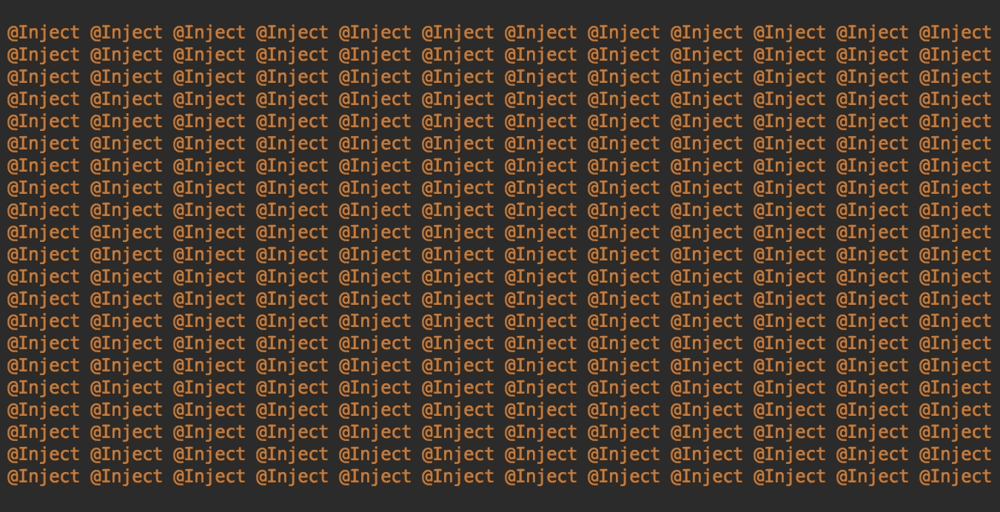

# 了解 Dagger 2 多绑定+视图模型

> 原文：<https://blog.kotlin-academy.com/understanding-dagger-2-multibindings-viewmodel-8418eb372848?source=collection_archive---------0----------------------->



## 还有:GithubViewModelFactory 用 Kotlin 解释并改写。

嗨，伙计们，
今天我们将解释如何在新的**架构组件** ' `ViewModel`类中使用精彩的 Dagger 2 **多绑定**。

我们中的许多人，在开始学习如何使用新的`ViewModel`类时，都看过 GitHub 上的[*GithubBrowserSample*](https://github.com/googlesamples/android-architecture-components/tree/master/GithubBrowserSample)示例(这是一个 GitHub-ception！).

也许，我们在那堆有用的代码中寻找的第一个类，就是所谓的`GithubViewModelFactory`类([这里有一个指向存储库中文件的链接](https://github.com/googlesamples/android-architecture-components/blob/e33782ba54ebe87f7e21e03542230695bc893818/GithubBrowserSample/app/src/main/java/com/android/example/github/viewmodel/GithubViewModelFactory.java))。
这个职业是一个完美的例子，当 [**匕首 2 多刺**](https://google.github.io/dagger/multibindings) 可以成为真正的救星。

在深入研究代码之前，我应该做一个小前提。
为了构建带有参数传递构造函数的定制`ViewModel`类(例如传递定制数据或`@Inject`注释构造函数)，我们必须提供一个扩展`ViewModelProvider.Factory`的类，将定制*视图模型*的实例返回到`create()`方法中。

所以，我们能注意到的第一件事是类的构造函数，它带着不太漂亮的`Map<Class<? extends ViewModel>, Provider<ViewModel>>`参数。这是什么怪物？

让我们更仔细地阅读这个庞大的参数类型:它是一个映射，有一个扩展了`ViewModel`的`Class`作为键，还有一个`ViewModel`的`Provider`(一个 Dagger 2 特定的类，让我们提供——并实例化——一个依赖注入类)作为值。

好吧，好吧，但是我能用这个物体做什么呢？
好了，我们刚刚说了我们的自定义`ViewModelProvider.Factory`的`create`方法期望 ViewModel 的一个实例作为返回值。该方法将从`Activity`或`Fragment`请求的视图模型的类型作为参数。将这种类型(我们的`Class`对象)与创建相同类型的视图模型的对象配对，我们当然可以实例化该类并将其返回给系统。

能给我们确定型`ViewModel`的那个“东西”是什么？答案就是匕首 2 注入我们的地图中的`Provider`值。

## 让我们来谈谈多重绑定


The big, big title on the [official Multibindings documentation](https://google.github.io/dagger/multibindings)

Dagger 2 可以将一个依赖项`Provider`关联到一个给定的键，并将其注入到一个 Map 中。

这是通过在一个方法上使用`@IntoMap`注释来实现的，该方法产生我们想要与给定键关联的值。
另一方面，键是使用一个自定义注释来指定的，该注释本身用`@MapKey`来注释。这里是用于创建一个 Map 的注释，它的键类型是一个`Class<? extends ViewModel>`对象。

```
@Retention(RetentionPolicy.*RUNTIME*)
@MapKey
@interface ViewModelKey {
    Class<? extends ViewModel> value();
}
```

我们的*值*参数类型将是我们的映射键的类型。

所以这个`Module`方法:

```
 @Binds
    @IntoMap
    @ViewModelKey(UserViewModel.class)
    abstract ViewModel bindUserViewModel(UserViewModel userViewModel);
```

大致说:“将这个对象注入一个使用`UserViewModel.class`作为键的`Map` ( `@IntoMap`注释)和一个将构建一个`UserViewModel`对象的`Provider`(`@Binds`注释的参数)作为值”。
这样，我们就可以向 Dagger 2 中注入一个托管对象，一个 map 类型的……猜到了:我们著名的`Map<Class<? extends ViewModel>, Provider<ViewModel>>`。

现在我们知道，我们可以使用`Class` 对象作为`ViewModelProvider.Factory.create()`方法中的参数来检索该视图模型的提供者。这正是谷歌人用那种方法做的。让我们一段一段地检查代码。

给定视图模型的可能提供者从地图中获得:

```
Provider<? extends ViewModel> creator = creators.get(modelClass);
```

如果我们的`Provider`的地图没有那个特定的键，我们将检查是否有一个我们必须实例化的`ViewModel`的子类:

```
if (creator == null) {
    for (Map.Entry<Class<? extends ViewModel>, Provider<ViewModel>> entry : creators.entrySet()) {
        if (modelClass.isAssignableFrom(entry.getKey())) {
                creator = entry.getValue();
                break;
        }
    }
}
```

如果之前从映射中获取有效提供者的所有尝试都失败，我们将抛出一个异常:

```
if (creator == null) {
    throw new IllegalArgumentException("unknown model class " + modelClass);
}
```

最后，如前所述，我们可以通过调用`Provider`对象上的`get()`方法，让*匕首*创建我们的`ViewModel`，并将其转换为我们的最终类型:

```
try {
    return (T) creator.get();
} catch (Exception e) {
    throw new RuntimeException(e);
}
```

我们已经用 Dagger 2 成功地注入了一个视图模型！

## 科特林翻译和…一点额外的！

如果你使用 Dagger 2 和 ViewModel，这个类和它的相关类是必不可少的，但是我个人喜欢 Kotlin，所以让我们把它转换成这种漂亮简洁的语言:

因此，如果你在你的 Android 应用程序中使用 Kotlin(如果没有，你真的应该🙄)您可以将此代码复制并粘贴到您的项目中，或者…

…或者您可以使用🔥🔥**新的和燃烧的**🔥🔥我创建的库！你可以在[这个 GitHub 链接](https://github.com/alexfacciorusso/DaggerViewModel)找到它，以及安装和使用它的说明(参见自述文件)。

感谢您阅读本文！如果你喜欢它，你可以让我知道按下***拍手*** 按钮(并向 GitHub repo 对我说“谢谢”)😌。评论里见！😁

了解卡帕头最新的重大新闻。学院，[订阅时事通讯](https://kotlin-academy.us17.list-manage.com/subscribe?u=5d3a48e1893758cb5be5c2919&id=d2ba84960a)，[观察 Twitter](https://twitter.com/ktdotacademy) 并在 medium 上关注我们。

[](http://eepurl.com/diMmGv)