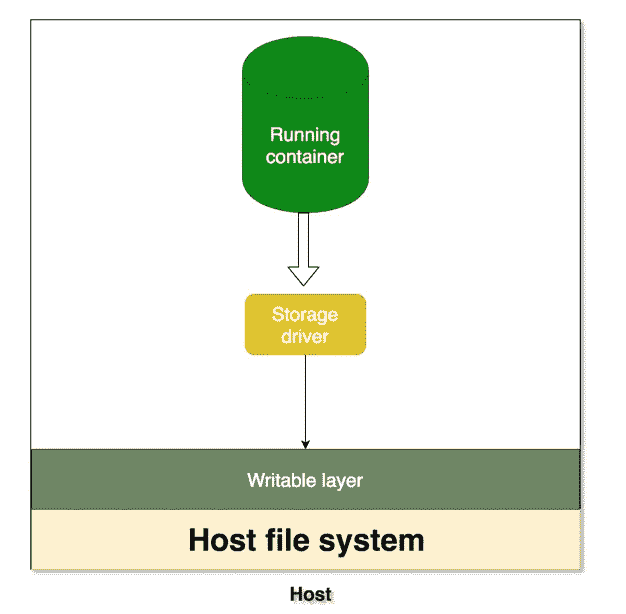

# 通过示例了解 Docker 卷

> 原文：<https://medium.com/bb-tutorials-and-thoughts/understanding-docker-volumes-with-an-example-d898cb5e40d7?source=collection_archive---------0----------------------->

在深入研究卷之前，让我们了解容器如何在主机文件系统中持久存储数据。

如果我们看上面的图，每当运行容器想要持久化数据时，它实际上通过存储驱动将数据放入可写层。嗯，我们有一些问题！！！

## 有什么问题