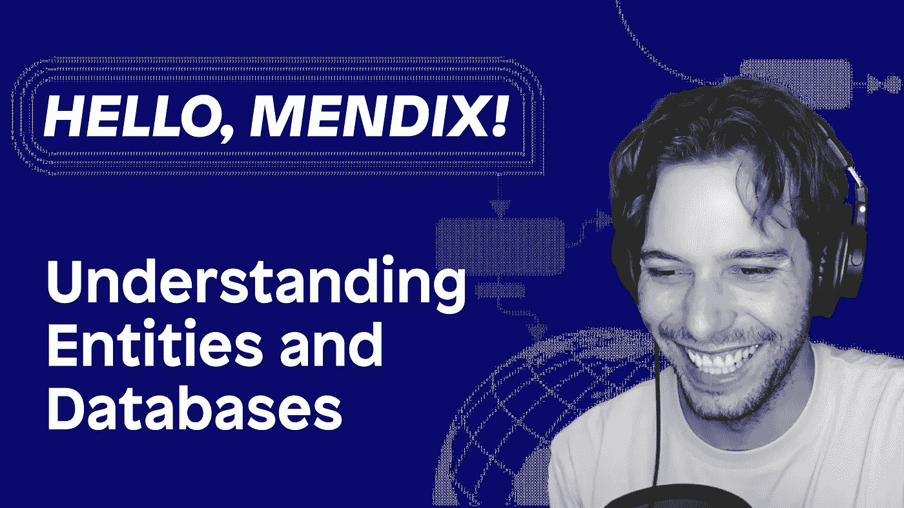

# 了解实体和数据库

> 原文：<https://medium.com/mendix/understanding-entities-and-databases-62d907c1cd36?source=collection_archive---------2----------------------->

Hello Mendix — Part 4: Understanding Entities and Databases

# 你好，门迪克斯——第四部分

# 这是 Hello Mendix 系列的继续——在这个系列中，我解释了 Mendix 开发的要点，并试图尽快填补您的知识空白。

# 在本系列的第 4 部分，我将讨论所有关于实体和领域模型的内容。我们走吧！

Hello Mendix — Part 4: Understanding Entities and Databases

## 什么是领域模型？

在 Mendix 中，我们在域模型中建模我们的数据库。这类似于 ERD 或实体关系图。除了在应用程序编译时，它还会创建一个基于该图的功能数据库。Mendix 有一个内置的数据库选项，但也支持 IBM DB2、Microsoft SQL Server、MySQL、Oracle 和 PostgreSQL。

Mendix 文档是这样描述领域模型的:

> **域模型**是以抽象的方式描述你的应用程序所使用的信息(或*数据*)的模型。它是应用程序架构的核心。每个[模块](https://docs.mendix.com/refguide/modules/)都有自己的领域模型，描述了该模块中使用的数据。应用程序中的所有模块都可以使用应用程序中所有领域模型的数据。"

如果这让你感到困惑，我将试着用我自己的话简单地解释它，一个领域模型是一个实体的集合，以及它们如何以一种可视化的方式相互关联。

在传统的 SQL 中，一个实体可以比作一个表。

实体具有属性(可以认为是字段),并且具有基本类型，如 string、int 和 date-time。实体可以以 1–1、1-*或*-*的方式相互关联。

如果您有兴趣了解更多关于 Mendix 如何保持底层数据库与您的模型同步的信息，请查看这个[视频](https://youtu.be/RfEwetNr0Qs)，其中我详细介绍了这是如何工作的。

Under the Hood of Studio Pro Part 2: What is being synchronized when you run your app?

## 理解概括

通过将实体创建为泛化，还可以使实体从父实体继承属性。泛化为子元素提供了父元素的所有属性，当在流程或页面中使用实体时，您可以将实体转换为它们的泛化。这与其他传统编码方法中使用的继承非常相似。

## 3 种不同类型的实体

在我看来，实体最酷的地方在于它们有三种不同的类型:**持久的**是蓝色的，**非持久的**是橙色的，远程实体是紫色的。

**持久实体**可以提交到数据库并从数据库中检索。**非持久实体**驻留在浏览器的内存中，当用户会话到期时被清除。这些只能通过关联来检索，而不能提交给数据库。这使得它们非常适合于集成，或者用于临时存储数据以便在计算中使用。实体可以采取的最后一种形式是**远程实体**。使用 Mendix DataHub 可以做到这一点，这是一个开放的元数据目录。这允许您使用 Odata 通信来回发送数据，在应用程序之间共享数据

您可以使用 DataHub 从一个应用程序中公开现有的表，并在您或您的公司创建的任何其他应用程序中使用该数据。

请记住，在处理实体时，安全性始终非常重要，因为这将控制对应用程序数据的访问。在域模型中，通过右键单击打开任何实体的属性，并转到 access 选项卡，以便配置谁可以创建、编辑和查看您的数据。

## 最后的想法

不要害怕尝试新事物和改变你的数据结构——有时简单的改变可以极大地提高性能。在此之前，请务必备份您的应用程序数据，以便您在应用程序崩溃时可以回滚！

要了解更多信息，请前往[academy.mendix.com](https://academy.mendix.com/link/home)，寻找领域模型和数据中心的学习途径。

## 阅读更多

 [## 领域模型

### 1 简介领域模型是一种模型，它描述了您的应用程序在应用程序中使用的信息(或数据)

docs.mendix.com](https://docs.mendix.com/refguide/domain-model/)  [## 实体

### 1 引言一个实体通常代表一类现实世界的对象，如客户、发票、CD 等。安…

docs.mendix.com](https://docs.mendix.com/refguide/entities/)  [## 联合

### 1 引言关联描述了实体之间的关系。在领域模型中，关联被表示为…

docs.mendix.com](https://docs.mendix.com/refguide/associations/)  [## 属性

### 1 简介属性是描述和/或识别实体的特征。这些属性中的每一个都是…

docs.mendix.com](https://docs.mendix.com/refguide/attributes/)  [## 下载备份

### 本页描述如何下载备份。

docs.mendix.com](https://docs.mendix.com/developerportal/operate/download-backup/)  [## 在本地还原备份

### 本页描述如何恢复备份。

docs.mendix.com](https://docs.mendix.com/developerportal/operate/restore-backup-locally/) 

*来自发布者-*

*如果你喜欢这篇文章，你可以在我们的* [*中页*](https://medium.com/mendix) *找到更多喜欢的。对于精彩的视频和直播会话，您可以前往*[*MxLive*](https://www.mendix.com/live/)*或我们的社区*[*Youtube PAG*](https://www.youtube.com/c/MendixCommunity/community)*e .*

*对于希望入门的创客，您可以注册一个* [*免费账户*](https://signup.mendix.com/link/signup/?source=direct) *，并通过我们的* [*学院*](https://academy.mendix.com/link/home) *获得即时学习。*

*有兴趣加入我们的社区吗？加入我们的* [*松弛社区频道*](https://join.slack.com/t/mendixcommunity/shared_invite/zt-hwhwkcxu-~59ywyjqHlUHXmrw5heqpQ) *。*