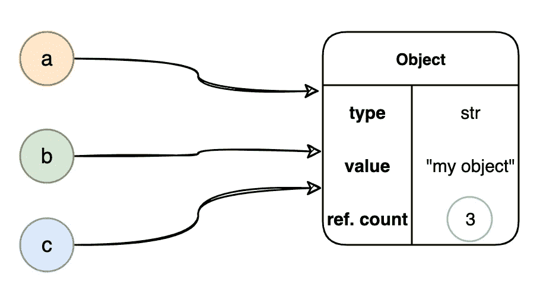
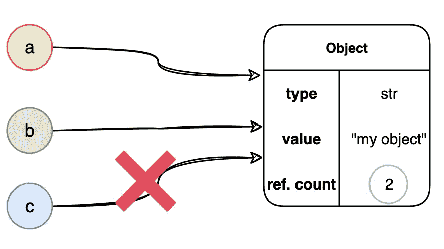
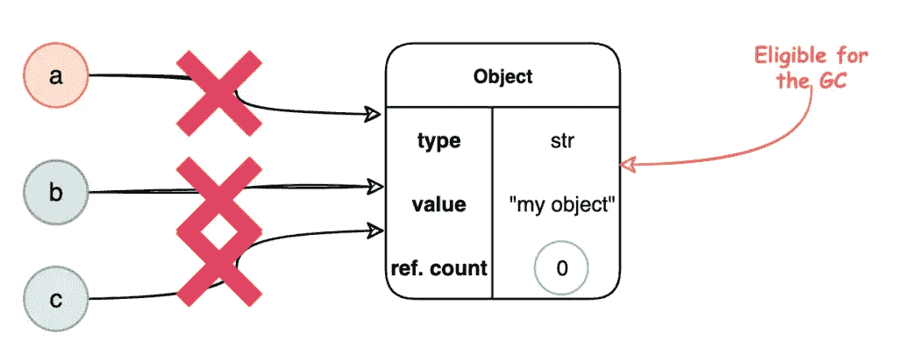
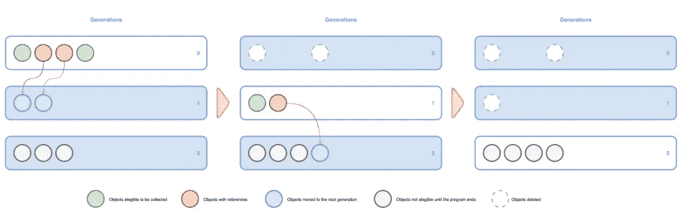

# 了解 Python 垃圾收集器的工作原理

> 原文：<https://medium.com/globant/understanding-how-the-python-garbage-collector-works-614f6b5723ba?source=collection_archive---------9----------------------->

正如大多数人可能知道的那样，Python 是一种具有不同实现的动态编程语言。CPython 实现使用引用计数和分代垃圾收集器的实现来管理内存。值得一提的是，Python 的其他实现，如 PyPy、IronPython……可以使用不同的策略。

你知道这些策略是用于内存分配的吗？你知道是否有可能禁用垃圾收集器吗？

从版本 2 开始，Python 开始使用两种不同的策略来进行内存分配引用计数和代垃圾收集。在此之前，唯一使用的策略是引用计数。

# 引用计数

在这种技术中，它保持对对象引用的计数。当创建一个新的引用时，计数器加 1，当删除一个引用时，计数器减 1。

当然，Python 中创建的每个对象都需要保持计数器持续更新。在引用计数器为 0 的情况下，该对象有资格被垃圾收集。

让我们创建对对象“my object”的三个引用，并检查该对象的引用计数。

```
**>>> import sys 
>>> a = "my object" 
>>> b = a 
>>> c = a 
>>> id(a)** 
4377801904
**>>> id(b)** 4377801904
**>>> id(c)** 4377801904
**>>> sys.getrefcount(a)** 4
```

**id(…)** 显示代表引用对象的唯一整数。而 **sys.getrefcount(a)** 返回对象的引用计数(“我的对象”)。返回的计数通常比我们预期的要高一，因为它包含了临时引用作为 getrefcount()的参数。

下面是上面代码的表示。



Three references are linked to the object

如果我们删除一个引用，计数器就减 1。

```
**>>> del(c) 
>>> sys.getrefcount(a)** 
3
```



One reference removed

如果我们移除所有引用，计数器将为 0，对象将有资格被垃圾收集器擦除。



No more references exist

奇怪的是，公共值的引用数比我预期的要多。这是因为其他人在解释器启动时引用了它们。例如，我创建了一个对 **1** 的引用，发现这个对象有几百个引用。我的建议是创建一个特殊的数字或字符串，这将帮助您理解 **getrefcount(…)** 方法的用法。

```
**>>> h = 1 
>>> sys.getrefcount(h)** 601
**>>> h = 3.14151692 
>>> sys.getrefcount(h)** 2
```

此外，如果您创建两个具有相同值的对象，它们不会获得相同的 ID，因为它们不是同一个对象。您可以检查它们的唯一 id 和对象的引用计数。

```
**>>> a = 1234 
>>> b = 1234 
>>> id(a)** 4484904240
**>>> id(b)** 4484904080
**>>> sys.getrefcount(b)** 2
**>>> sys.getrefcount(a)** 2
```

使用引用计数的一个好处是，一旦对象没有引用，就可以从内存中删除它。

它也有一些缺点。这可能非常低效，尤其是在简单的多线程实现中。并且它不能处理具有循环引用的对象。对于这些情况，Python 应用了第二种算法，称为分代垃圾收集。

# 分代垃圾收集

该算法基于时间分配将对象分成不同的代。它可以对每一代人采用不同的政策。

Python 在应用程序启动时创建了三代。新对象进入第一代，如果它们在回忆中幸存，算法将它们移到第二代。同样的事情也会发生在这一代，这些物品被收集或转移到第三代。在这一代中，对象将一直存在，直到程序结束。

每一代都有一个阈值，当对象列表超过阈值时，Python 运行垃圾收集过程。



Generational Garbage Collection in three steps

这种技术的一个缺点是通常无法删除长期存在的垃圾，尽管它们对最新的对象处理得很好。

## Python 中有没有可能禁用垃圾收集器？

可以禁用第二种算法，即分代式垃圾收集器，但不能禁用引用计数算法。

下面是 gc 模块中的一些方法，可以帮助你。

```
**>>> import gc 
>>> gc.isenabled()** True
**>>> gc.disable() 
>>> gc.isenabled()** False
```

禁用 Python 分代式垃圾收集器不会减少应用程序中的内存使用，因为 Python 通常不会将内存释放回底层操作系统。

如果你想深入禁用垃圾收集器，我建议你看一下 [Instagram 工程团队](https://instagram-engineering.com/dismissing-python-garbage-collection-at-instagram-4dca40b29172)的帖子，他们正在用垃圾收集器做一些实验，并发现了一些第三方库的 **disable()** 方法的一些副作用。

# 结论

Python 使用两种策略进行内存管理，引用计数和针对循环依赖的分代垃圾收集器。第二个是可选的垃圾收集器，可以禁用。可以查看对象的引用计数，更改代的阈值，以及其他一些事情。我推荐你看一下 [gc 模块](https://docs.python.org/3/library/gc.html)、 [sys 模块](https://docs.python.org/3/library/sys.html)，或者垃圾收集器[设计文档](https://devguide.python.org/garbage_collector/)。

*原载于 2022 年 2 月 25 日 https://jenaiz.com*[](https://jenaiz.com/2022/02/understanding-how-the-python-garbage-collector-works/)**。**