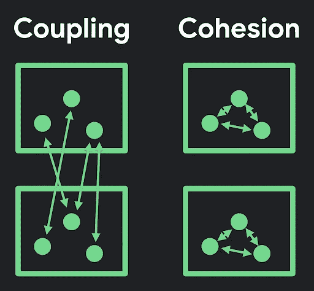
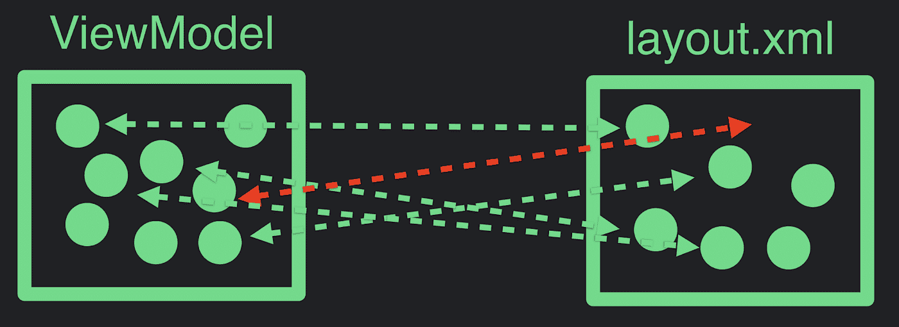
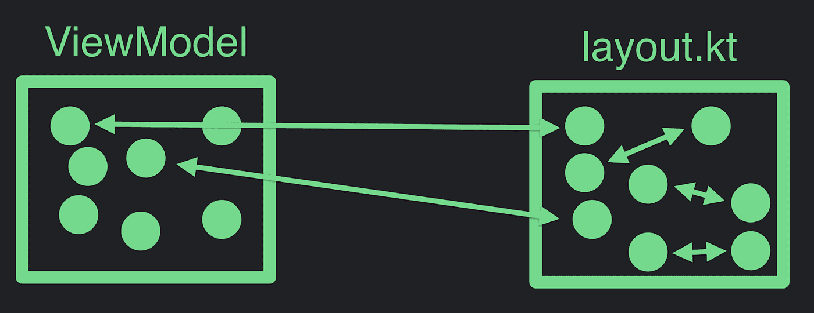

# 了解 Jetpack 撰写—第 1 部分，共 2 部分

> 原文：<https://medium.com/androiddevelopers/understanding-jetpack-compose-part-1-of-2-ca316fe39050?source=collection_archive---------0----------------------->

## 使用 Compose 构建更好的 UI

对 UI 开发的期望越来越高。今天，如果没有包括动画和运动在内的经过打磨的用户界面，我们就无法构建一个 app 并满足用户的需求。这些需求在当前 UI 工具包创建时并不存在。为了解决快速高效地创建完美 UI 的技术挑战，我们引入了 Jetpack Compose，这是一个现代化的 UI 工具包，可以帮助应用程序开发人员在这个新领域取得成功。

在接下来的两篇文章中，我们将解释 Compose 的好处，并看看它是如何工作的。首先，在这篇文章中，我讨论了 Compose 解决的挑战，我们一些设计决策背后的原因，以及这些如何帮助应用程序开发人员。此外，我将讨论 Compose 的心理模型，您应该如何考虑您在 Compose 中编写的代码，以及您应该如何塑造您的 API。

# 【Compose 解决了哪些挑战？

关注点分离是一个众所周知的软件设计原则。这是我们作为应用程序开发人员学到的基本知识之一。尽管众所周知，但通常很难掌握这一原则在实践中是否得到遵守。从“耦合”和“内聚”的角度来考虑这个原则可能会有所帮助。

当我们写代码时，我们创建由多个单元组成的模块。*耦合*是不同模块中单元之间的依赖关系，反映了一个模块的部分影响其他模块的部分的方式。*内聚*是一个模块中单元之间的关系，它表明模块中单元的分组有多好。

在编写可维护的软件时，我们的目标是*最小化耦合*和*最大化内聚*。

当我们拥有高度耦合的模块时，在一个地方对代码进行更改意味着必须对其他模块进行许多其他更改。更糟糕的是，耦合经常是隐式的，这样，由于看起来完全不相关的变化，意外的事情就发生了。

关注点分离是指将尽可能多的相关代码组合在一起，以便我们的代码可以随着应用程序的增长而轻松维护和扩展。

让我们在今天的 Android 开发环境中更实际地看待这个问题，并以视图模型和 XML 布局为例。

视图模型为布局提供数据。事实证明，这里隐藏了很多依赖关系:视图模型和布局之间存在很多耦合。您可以看到这个清单的一个更熟悉的方式是通过 API，它需要一些关于 XML 布局本身的形状和内容的知识，比如`findViewByID`。

使用这些 API 需要了解如何定义 XML 布局，并在两者之间建立耦合。随着我们的应用程序不断增长，我们必须确保这些依赖关系不会过时。

大多数现代应用程序动态显示用户界面，并在执行过程中不断发展。因此，我们不仅需要静态地验证布局 XML 是否满足这些依赖关系，还需要验证它们在程序的生命周期中是否也能满足。如果一个元素在运行时离开了视图层次结构，其中一些依赖关系可能会被破坏，并可能导致类似`NulReferenceExceptions`的问题。

通常，视图模型是用诸如 Kotlin 之类的编程语言定义的，而布局是用 XML 定义的。由于这种语言上的差异，尽管视图模型和布局 XML 有时可能密切相关，但还是有一条强制的分界线。换句话说，它们耦合得非常紧密。

这就引出了一个问题:如果我们开始用同一种语言定义 UI 的布局和结构，会怎么样？如果我们选择科特林呢？

因为我们将使用同一种语言工作，一些以前隐含的依赖关系可能开始变得更加明显。我们也可以重构代码，把事情移到减少耦合和增加内聚力的地方。

现在，你可能认为这是在暗示你把逻辑和 UI 混合在一起。现实情况是，无论应用程序的结构如何，都有与 UI 相关的逻辑。框架本身无法改变这一点。

但是框架所能做的是为你提供工具来使分离更容易:这个工具就是可组合函数。函数是您可能已经使用了很长时间来分隔代码中其他地方的关注点的东西。您已经获得了进行这种类型的重构和编写可靠、可维护、干净的代码的技能——这些技能同样适用于可组合的函数。

# **可组合函数的剖析**

这是一个可组合函数的例子。

在这种情况下，它从 appData 类接收数据作为参数。理想情况下，这些数据是不可变的数据，可组合函数不会改变这些数据:可组合函数应该是这些数据的转换函数。因此，我们可以使用任何 Kotlin 代码来获取数据，并使用它来描述我们的层次结构，例如`Header()`和`Body()`调用。

这意味着我们调用其他可组合的函数，这些调用代表我们层次结构中的 UI。我们能够使用 Kotlin 动态处理事情的所有语言原语。我们可以在控制流中包含 if 语句和 for 循环来处理更复杂的 UI 逻辑。

可组合函数经常使用 Kotlin 的尾随 lambda 语法，所以`Body()`是一个可组合函数，它有一个可组合 lambda 作为参数。这意味着一个层次或结构，所以`Body()`在这里包装了一组项目。

# **声明式 UI**

声明性是一个时髦的词，但是一个重要的词。当我们谈论声明式编程时，我们是在谈论与*命令式*编程相反的编程。让我们看一个例子。

考虑一个带有未读邮件图标的电子邮件应用程序。如果没有消息，应用程序会呈现一个空白信封。如果有一些消息，我们在信封里渲染一些纸，如果有 100 条消息，我们渲染图标就好像它着火了一样..

对于命令式接口，我们可能需要编写一个更新计数函数，如下所示:

在这段代码中，我们接收新的计数，并且必须弄清楚如何更新当前 UI 来反映该状态。这里有很多极限情况，这个逻辑并不简单，尽管它是一个相对简单的例子。

或者，在声明性接口中编写这个逻辑可能会产生类似下面这样的结果。

这里我们说:

*   如果数量超过 99，就开火。
*   如果计数超过 0，请出示纸张，
*   如果计数超过 0，渲染计数徽章。

这就是声明式 API 的含义。我们编写的代码描述了我们想要的 UI，但没有描述如何转换到那个状态。这里的关键是，当编写这样的声明性代码时，您不再需要担心您的 UI 以前的状态是什么，您只需要指定您的*当前的*状态应该是什么。框架控制着如何从一种状态进入另一种状态，所以我们不再需要考虑它。

# **构成 vs 继承**

在软件开发中，组合是多个简单代码单元如何组合在一起形成一个更复杂的代码单元。在面向对象的编程模型中，最常见的组合形式之一是基于类的继承。在 Jetpack Compose 的世界中，因为我们只使用函数而不是类，所以合成的方法非常不同，但比继承有很多优点。让我们看一个例子。

假设我们有一个视图，我们想添加一个输入。在继承模型中，我们的代码可能如下所示:

视图是基类。`ValidatedInput`使用输入的子类。为了验证日期，DateInput 使用了一个子类`ValidatedInput`。但是接下来有一个挑战:我们想要创建一个日期范围输入，这意味着根据两个日期进行验证——开始和结束日期。你可以子类化`DateInput`，但是需要做两次，你不能这样做。这是继承的一个限制:我们必须有一个可以继承的单亲。

在作曲中，这不是一个挑战。假设我们从基本输入可组合开始:

当我们创建我们的`ValidatedInput`时，我们只是在函数体中调用`Input`。然后我们可以用一些东西来装饰它，以进行验证。

那么对于数据输入，我们可以直接调用`ValidatedInput`。

现在，当我们遇到日期范围输入时，我们不再有挑战:它只是两个调用而不是一个。

在 compose 的合成模型中，没有我们合成到的单个父元素，这解决了我们在继承模型中遇到的挑战。

另一种类型的构图问题是抽象一种类型的装饰。为了说明这一点，请考虑下面的继承示例:

`FancyBox` 是修饰其他视图的视图，在本例中是`Story`和`EditForm`。我们想编码一个`FancyStory`和一个`FancyEditForm`，但是如何编码呢？我们是继承了`FancyBox`还是继承了 Story？这还不清楚，因为，同样，我们需要一个继承链的父母。

相比之下，Compose 处理得非常好。

我们有一个可组合的 lambda 作为孩子，使我们能够定义包装另一个东西的东西。所以现在，当我们想要创建`FancyStory`时，我们在`FancyBox`的子元素内部调用`Story`，也可以用`FancyEditForm`做同样的事情。这是 Compose 的合成模型。

# **封装**

Compose 做得好的另一件事是封装。这是您在创建可组合函数的公共 API 时应该考虑的问题:可组合函数的公共 API 是它接收的一组参数，因此它不能控制这些参数。另一方面，可组合组件可以管理和创建状态，然后将该状态以及它接收到的任何数据作为参数传递给其他可组合组件。

现在，因为它正在管理那个状态，所以如果你想改变状态，你可以让你的子组件使用回调来发出改变的信号。

# **重组**

这是我们的说法，任何可组合的函数都可以在任何时候被重新调用。如果您有一个非常大的可组合层次结构，当层次结构的一部分发生变化时，您不希望重新计算整个层次结构。所以可组合的函数是可重启的，你可以用它来做一些强大的事情。

例如，这里有一个绑定函数，这是你今天在 Android 开发中会看到的。

我们有一个想要订阅视图的`LiveData`。为此，我们调用带有生命周期所有者的 observe 方法，然后传入一个 lambda。每次`LiveData`更新时，lambda 都会被调用，当这种情况发生时，我们希望更新视图。

使用 Compose，我们可以颠倒这种关系。

有一个类似的 Messages Composable，它接收`LiveData`和对 Compose 的`observeAsState`方法的调用。`observeAsState`方法将把`LiveData<T>`映射到`State<T>`。这意味着你可以在函数体中使用这个值。State 实例订阅了`LiveData`实例，这意味着只要`LiveData`更新，它就会更新。这也意味着无论在哪里读取`State`实例，读取它的周围可组合函数将自动订阅这些更改。最终结果是不再需要指定一个`LifecycleOwner`或一个更新回调，因为可组合对象可以隐式地充当两者。

# **最终想法**

Compose 提供了一种定义 UI 的现代方法，使您能够有效地分离关注点。因为可组合函数与普通的 kotlin 函数非常相似，所以您用来编写和重构它们的工具将非常适合您的 Android 开发技能。

在下一篇文章中，我将把重点转移到 Compose 及其编译器的一些实现细节上。有关 Compose 的其他资源，请点击此处了解更多[。](https://developer.android.com/jetpack/compose)